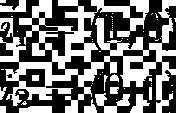

# 使用 Python 线性代数计算矩阵的逆矩阵

> 原文：<https://levelup.gitconnected.com/calculate-inverse-of-a-matrix-using-python-linear-algebra-603a5ed65fe>

## 在本文中，我们将讨论计算矩阵逆矩阵的步骤和直觉，并展示使用 Python 的例子。


**目录**

*   介绍
*   矩阵的逆矩阵解释
*   定义的矩阵的逆矩阵
*   矩阵的逆矩阵何时存在？
*   2x2 矩阵的逆矩阵
*   较大矩阵的逆
*   Python 中矩阵的逆矩阵
*   结论

# 介绍

矩阵的逆是[线性代数](https://pyshark.com/category/linear-algebra/)中的一个重要概念。它经常出现在许多方程中，最简单的应用是通过矩阵求逆来帮助求解线性方程组。

我们已经知道[一个矩阵代表什么](https://pyshark.com/matrix-multiplication-explained-using-python/#what-does-a-matrix-represent)，那么现在我们可以看看它的逆是什么以及如何计算它。

为了继续学习本教程，我们需要以下 Python 库:numpy。

如果您没有安装它们，请打开“命令提示符”(在 Windows 上)并使用以下代码安装它们:

```
pip install numpy
```

# 逆矩阵解释

我们已经知道[什么是矩阵](https://pyshark.com/matrix-multiplication-explained-using-python/#what-does-a-matrix-represent)，并且了解它在线性代数中的使用情况。那么什么是逆矩阵呢？

# 定义的矩阵的逆矩阵

让我们退一步想想数字。你可以选择任何数字，例如 5。我们能找到 5 的倒数吗？是啊！它只是它的倒数，也就是 1/5，我们也记为:5^{-1}.

它有什么独特之处？如果你用一个数乘以它的倒数，你的等式将等于 1:


作者图片

矩阵以类似的方式工作。假设我们有一些 2×2 矩阵:


作者图片

以及一个 2×2 单位矩阵 **I** :

$ $ I = \ begin { b matrix } 1 & 0 \ \ 0 & 1 \ end { b matrix } $ $

我们会认为存在一个逆矩阵 **A^{-1}** ，使得:


作者图片

或者在我们的例子中:


作者图片

# 矩阵的逆矩阵何时存在？

但事实证明，逆矩阵未必一直存在！矩阵 **A** 的逆矩阵存在当且仅当满足以下两个条件:

1.  矩阵 **A** 是一个正方形矩阵(2×2、3×3 等等),其中行数等于列数
2.  矩阵 **A** 的行列式不等于零: **det(A)** ≠ 0

# 2×2 矩阵的逆

在我们的示例中，我们正在处理一个 2×2 矩阵，其行列式等于:


作者图片

那么我们实际上如何得到逆矩阵 **A^{-1}** ？

在 2×2 矩阵的情况下，非常简单:


作者图片

在我们的例子中:


作者图片

现在我们找到了矩阵**的逆 A** ！

我们如何检查它是否有效？

回忆:


作者图片

我们可以使用[矩阵乘法](https://pyshark.com/matrix-multiplication-explained-using-python/)来检查我们的结果:


作者图片

我们已经正确计算了一个 2×2 矩阵的逆矩阵 **A** ！

我们也可以用图形来思考。

让我们在笛卡尔空间中表示矩阵 **A** ，其中矩阵的列成为向量:


作者图片


作者图片

并且还表示笛卡尔空间中的单位矩阵，它们仅仅是基向量:



作者图片


作者图片

按照这个逻辑，逆矩阵也将由一些向量来表示，它们是这样的，如果我们将矩阵 **A** (向量{a_1}，向量{a_2})乘以其逆矩阵 **A^{-1}** 的向量(姑且称之为向量{inv_1}，向量{inv_2})，结果应该是表示单位矩阵 **I** 的基向量(向量{i_1}，向量{i_2})

由于我们已经计算了逆矩阵 **A^{-1}** ，得到的向量是:


作者图片


作者图片

# 较大矩阵的逆

现在，像 3×3 或 5×5 这样的大矩阵求逆也一样简单？不完全是。随着矩阵规模的增加，步骤数量的复杂性也在增加！

你可以在网上找到一些使用高斯消去法计算 3×3 和 5×5 等较大矩阵的逆矩阵的例子。

一般来说，对于较大尺寸的矩阵，我们更喜欢使用 Python 这样的技术，以便快速有效地获得结果。

# Python 中矩阵的逆矩阵

为了在 Python 中计算逆矩阵，我们将使用 numpy 库。第一步是导入它:

Numpy 有很多有用的函数，对于这个操作，我们将使用 [linalg.inv()](https://numpy.org/doc/stable/reference/generated/numpy.linalg.inv.html) 函数，它在 Python 中计算矩阵的逆矩阵。

回想一下，在 Python 中，矩阵被构造为数组。下一步是定义输入矩阵。我们将使用与上一节中的[示例](https://pyshark.com/calculate-inverse-of-a-matrix-using-python/#inverse-of-a-2x2-matrix)相同的 2×2 矩阵:

现在我们有了所需的矩阵，我们可以很容易地计算它的逆矩阵:

您应该得到:

```
[[ 5\. -7.]
 [-2\.  3.]]
```

这与我们手动计算的[示例](https://pyshark.com/calculate-inverse-of-a-matrix-using-python/#inverse-of-a-2x2-matrix)中的输出完全相同。

我们也可以通过使用 Python 中的[矩阵乘法来检查它是否正确:](https://pyshark.com/matrix-multiplication-explained-using-python/)

您应该得到:

```
[[ 1.00000000e+00 -1.77635684e-15]
 [ 0.00000000e+00  1.00000000e+00]]
```

其中右上方的值几乎为零(numpy 问题)，但它是一个单位矩阵，就像:


作者图片

# 结论

在本文中，我们使用线性代数方法讨论了矩阵求逆背后的直觉，并使用 Python 展示了一个完整的示例。

如果你有任何问题或对一些编辑有建议，请随时在下面留下评论，并查看更多我的[线性代数](https://pyshark.com/category/linear-algebra/)文章。

*原载于 2022 年 1 月 12 日 https://pyshark.com**[*。*](https://pyshark.com/calculate-inverse-of-a-matrix-using-python/)*