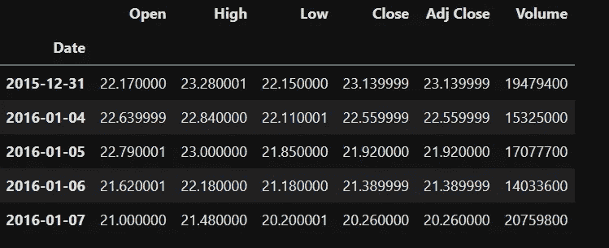

# 用夏普比率评估你的股票风险

> 原文：<https://levelup.gitconnected.com/calculate-the-sharpe-ratio-with-the-powerful-combo-of-functions-and-pipe-93ba34a95729>

## 我们将使用函数和管道方法来计算特定用例的这个流行指标。

由 [Pedro Netto](https://unsplash.com/@pedronettto?utm_source=unsplash&utm_medium=referral&utm_content=creditCopyText) 在 [Unsplash](https://unsplash.com/s/photos/pipes?utm_source=unsplash&utm_medium=referral&utm_content=creditCopyText) 上拍摄的照片

> 在有计划的风险和鲁莽的决策之间，是利润和损失的分界线。
> 
> 获得普利策奖的记者查尔斯·杜希格

问问你的家人和朋友对股市交易的看法。这将引发一场关于风险承受能力的有趣讨论。你可能会对他们的回答感到惊讶。

您应该看到 3 种配置文件类型:

*   那些**规避风险的人**看重确定性，而不是更大回报的可能性。
*   那些**风险中性的**对风险毫不在意。
*   那些接受高度风险和不确定性来换取潜在显著回报的人:**寻风险**。

这就是夏普比率的有趣之处。

> 它在考虑风险的同时评估投资的表现。

它是如何工作的？

## 目录

1.  [夏普比率定义](https://medium.com/p/93ba34a95729#ca82)
2.  [使用组合函数和管道计算夏普比率](https://medium.com/p/93ba34a95729#37c8)
3.  [与竞争对手比较夏普比率](https://medium.com/p/93ba34a95729#0034)
4.  [警告！夏普比率有其局限性](https://medium.com/p/93ba34a95729#6fd2)
5.  [结论](https://medium.com/p/93ba34a95729#63aa)

## 1.夏普比率定义

投资者有两个相互竞争的目标。他们总是努力使投资回报最大化。但是他们也寻求最小化风险

夏普比率计算投资者的风险调整回报，并为他们提供一个分数。

公式如下:

***夏普比率= (Rp — Rf) /标准差***

*   **Rp** :根据资产或投资组合的历史数据计算的预期收益或实际收益。
*   **Rf:** 无风险利率:暗指无风险投资的回报，如美国国债。
*   **标准差:**是风险指标。价格越低，投资的波动性越小。

**如何解读:**如果比值大于 1，则认为该股票或投资组合是好的投资。越高越好。

## 2.使用组合函数和管道来计算夏普比率

为了用 yfinance 检索股票数据，我们需要使用该公司的股票行情自动收录器。我们也选择周期。下面是我们要检索的内容:

Twitter 股票数据

> **免责声明**:这篇博文仅为教育目的而写。没有任何股票的投资建议或推广。

为了得到预期收益(Rp)，我们需要**(CAGR)**。它是一项投资在特定时期内的年增长率。

**CAGR = (EV/BV)^(1/n)-1**

EV =投资的期末价值

BV =投资的起始价值

n =投资周期数

我们将通过使用*管道*方法链接在一起的不同函数来计算它。

作为最佳实践，按照 khu yen Tran [Python 干净代码:让你的 Python 函数更可读的 6 个最佳实践| khu yen Tran |迈向数据科学](https://medium.com/u/84a02493194a#:~:text=Since%20each%20function%20does%20one,your%20code%20for%20other%20tasks.)

[夏普比率定义(investopedia.com)](https://www.investopedia.com/terms/s/sharperatio.asp)

 [## 通过我的推荐链接加入 Medium-Khuong LAN Cao Thai

### 阅读 Khuong lán Cao Thai(以及媒体上成千上万的其他作家)的每一个故事。您的会员费直接…

medium.com](https://medium.com/@Eyquem/membership) 

# 分级编码

感谢您成为我们社区的一员！在你离开之前:

*   👏为故事鼓掌，跟着作者走👉
*   📰查看[升级编码出版物](https://levelup.gitconnected.com/?utm_source=pub&utm_medium=post)中的更多内容
*   🔔关注我们:[Twitter](https://twitter.com/gitconnected)|[LinkedIn](https://www.linkedin.com/company/gitconnected)|[时事通讯](https://newsletter.levelup.dev)

🚀👉 [**加入升级人才集体，找到一份神奇的工作**](https://jobs.levelup.dev/talent/welcome?referral=true)