# 使用 SQL 和 Newton-Raphson 方法计算时间加权利息

> 原文：<https://levelup.gitconnected.com/calculating-time-weighted-interest-with-sql-and-the-newton-rhapson-method-fe5ed044cf14>

本教程将使用 SQLite 和 Python。你只需要运行本地安装的 Python3。最后，您应该能够运行 Python 脚本，并在命令行中获得正确的输出。

我想拼凑一个简短的教程，展示一点高等数学如何真正有助于数据分析。如果你没有完全理解实现背后的数学原理，那也没关系。见鬼，我也不是专家。

很多年前，我的父亲给我看了这个，我想写一下，因为我觉得这很酷，而且这是父亲节。

我们希望计算潜在的数百万个银行账户和每个账户中的数百笔交易，给定一年期间每个账户余额的所有活动，回报率(利息)是多少。

回报率的简单实现只需要:

`((year_end_balance — beginning_balance) / year_end_balance) * 100`

这是全年的增长率，但这是有限的。它没有考虑影响全年收支平衡的流入和流出。计算这个公式的简单(嗯，不那么简单)方法很麻烦，以至于 investopedia 关于这个问题的文章建议你只使用在线计算器来计算，而不是尝试手工计算。

幸运的是，有一个聪明的方法我们可以使用 [Netwon Raphson 方法](http://www.sosmath.com/calculus/diff/der07/der07.html)来实现二次收敛。

首先，让我们创建一个 Python 文件来进行分析。

从 CLI 运行:

`touch interest_calc.py`并在您首选的 IDE 中打开文件。

那么我们的第一步就是添加夹具数据生成功能。在本教程中，这些代码片段的 github 直接链接是定期提供的，如果你想在我们学习的过程中复制和粘贴代码。

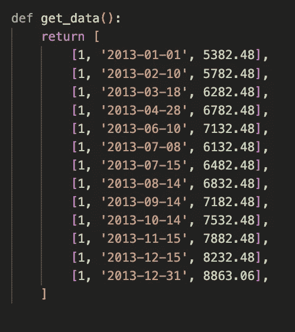

[直接 github 链接](https://github.com/bfemiano/newton-rahpson-interest-analytic/blob/main/interest_calc.py#L22)为`get_data`。

为了本教程的清晰起见，只有一个唯一的帐户 id = `1`,但是我们构建的代码可以处理任意数量的帐户 id。然后，我们将特定日期的余额值相加。我把数据按日期排序，只是为了更容易阅读，但我们很快就会发现这并不重要。

现在让我们启动我们的`calc_time_weighted_interest`函数来创建数据库并插入数据，以便我们可以对其进行查询:

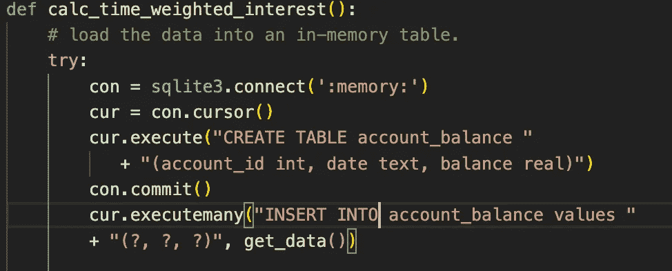

首先，我们建立一个到内存中瞬态数据库的连接。这意味着数据将在我们的 Python 脚本执行后消失。然后，我们创建一个表`account_balance`，其中包含字段`account_id`、`date`和`balance`的列。最后，让我们将假数据插入表中。这只是函数的前半部分。

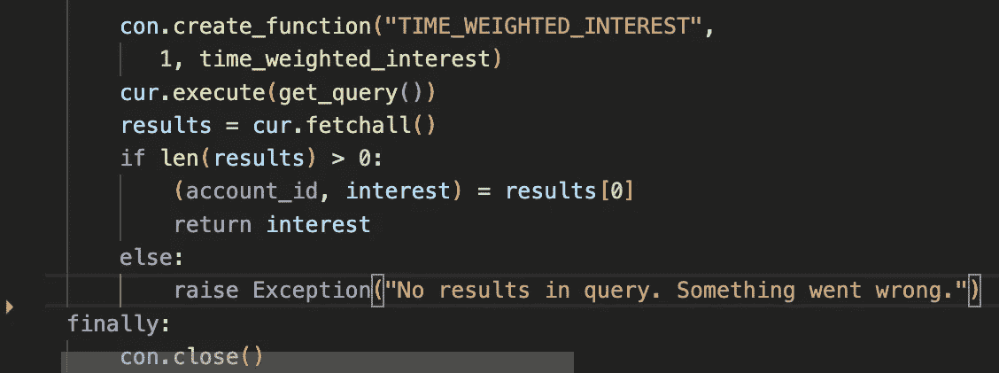

现在我们设置一个名为 TIME_WEIGHTED_INTEREST 的自定义函数，并给它一个指向在别处定义的`time_weighted_interest`函数的指针。我们一会儿就会谈到这一点。

在下一行，我们使用从`get_query()`返回的内容用光标执行一个查询，这是我们开始写出 SQL 的地方。我们下一步会谈到这个。

游标 fetchall()将返回所有结果。如果结果长度为零，则引发一个错误。每个结果都应该被分解成两个变量`account_id`和`interest`。我们在 fixture 数据中只有一个帐户 id，所以只返回第一个利息结果。最后，让我们关闭连接。

[为`calc_time_weighted_interest`直接 github 链接](https://github.com/bfemiano/newton-rahpson-interest-analytic/blob/main/interest_calc.py#L163)。

现在我们准备开始编写查询。

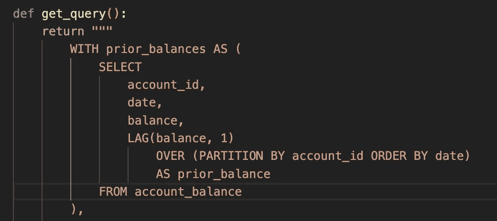

开始功能`get_query`，让我们开始我们的 CTE 链。

首先，我们要将之前的余额添加到每个记录中。我们可以用一个窗口函数来实现。通过`account_id`对数据进行分区，并在每个分区中按照`date`的排序顺序查看行。我们可以使用`LAG(balance,1)`将窗口中的先前余额添加到每一行。

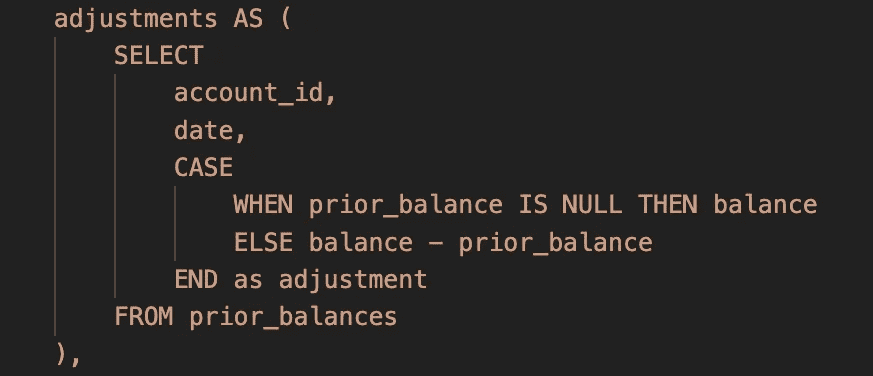

在下一个 CTE 中，我们将使用`prior_balance`将每个`balance`转换为来自先前记录的调整增量。在年初第一笔余额的情况下，之前的余额将为空，所以我们只需设置`adjustment = balance`。否则我们设置`adjustment` = `balance — prior_balance`。

所以如果我们从举例开始

```
date       balance  prior_balance
2013-01-01   500      NULL
2013-04-11   550      500
```

不，我们以

```
date         adjustment
2013-01-01     500
2013-04-11     50
```

现在让我们做另一个转换:

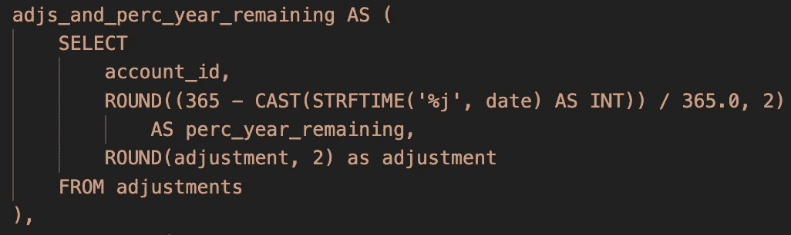

在下一个 CTE 中，我们将日期转换为一年剩余时间的百分比。这成为 0.0 和 1.0 之间的值。其中 0.0 = 12 月 31 日，1.0 = 1 月 1 日。

为此，我们将一年中的某一天作为一个整数，从 365 中减去它，然后将结果除以 365。四舍五入到最接近的两位小数。

例如，2013 年 4 月 11 日是一年中的第 100 天。

所以`(365-100)/365` = 0.73

我们认为这是一年中剩余的百分比，给定一年中的某一天。

为了简单起见，让我们将`adjustment`四舍五入到最接近的两位小数。

现在按照我们的例子，这个 CTE 的输出将是:

```
adjustment    perc_year_remaining    
500.00              1.00                       
50.00               0.73
```

现在让我们做另一个转换:

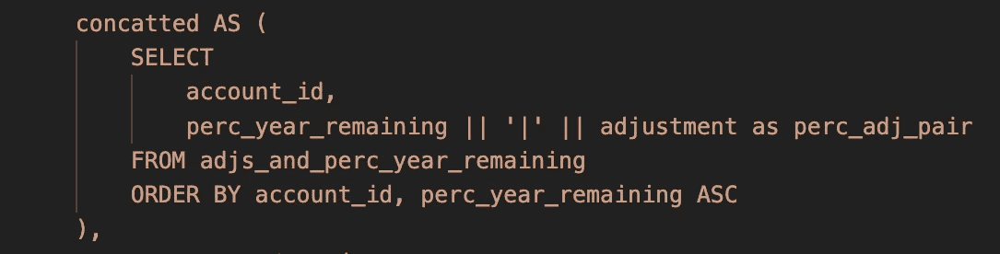

在这个 CTE 中，让我们按`account id`排序，在每个`account_id`中，按`perc_year_remaining`升序排序(按年份的逆时间顺序)。例如，对于每个帐户 id，今年的最后一次调整将首先出现，然后是第二次到最后一次，依此类推。

作为这个转换的一部分，我们通过管道`|`将`perc_year_remaining`和`adjustment`连接起来。

`||`是用于字符串连接的 SQLite 语法。

因此，按照我们的例子，我们的行变成:

```
perc_adj_pair    
0.73|50.00
1.00|500.00
```

逆时间排序的输出顺序对于下一个 CTE 步骤非常重要。

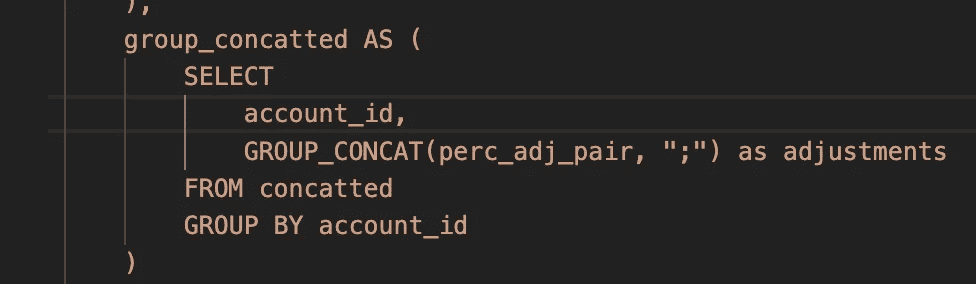

现在我们按`account_id`分组，并将每个管道分隔的`(adjustment, perc_year_remaining)`对连接成一个帐户 id 字符串。每对都被`;`分开。我们必须使用字符串将数据编码为列表，因为不幸的是 SQLite 没有列表/数组复杂值类型。

结果是每`account_id`一行，所有的调整对以时间顺序相反的顺序连接在一起。

所以现在我们有了 account_id = 1

```
adjustments
0.73|50;1.00|500
```

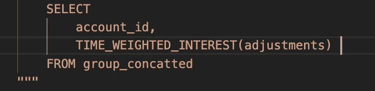

现在我们终于可以调用我们的自定义函数来计算一年中所有账户 id 的时间加权利息了。

[直接 github 链接](https://github.com/bfemiano/newton-rahpson-interest-analytic/blob/main/interest_calc.py#L114)用于`get_query`

在运行 SQL 之前，我们必须实现`time_weighted_interest_function`

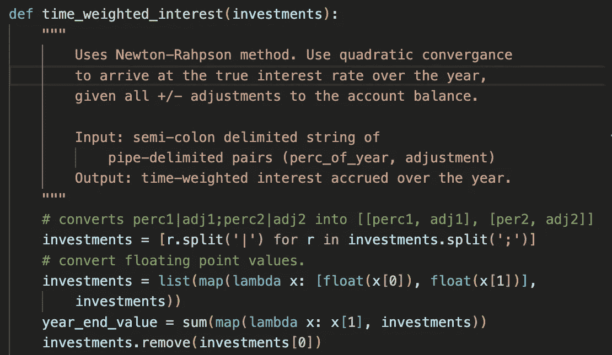

在我们的函数中，我们必须首先将字符串解包回到一个`(perc_year_remaining, adjustment)`对列表中。然后我们将两者转换回浮点值。我们可以把`investments`变量看作是`(perc_year_remaining, adjustment)`对的列表。

接下来我们要计算账户在年底的余额。我们可以通过对所有调整求和来做到这一点。由于我们在年初将余额作为一项调整包括在内，因此这是可行的。我们还删除了最终调整，因为它不需要收敛于真实的时间加权利率。

但是我们的功能还没有完成。接下来是有趣的部分。收敛函数。

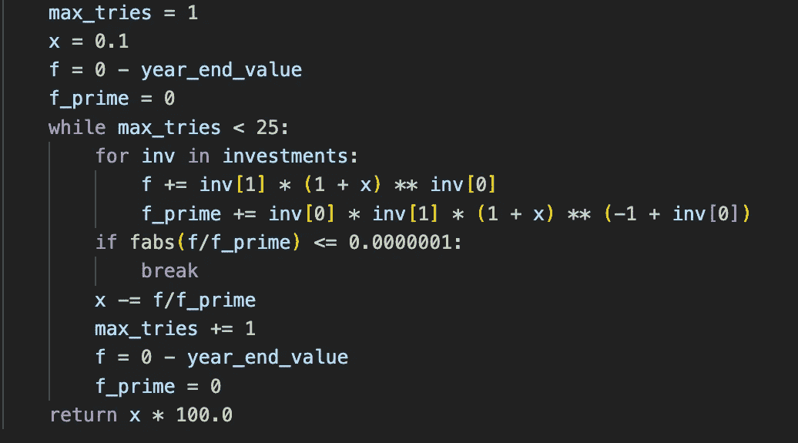

我们对投资最多运行 25 次收敛函数，看看我们是否收敛到低于`time_weighted_interest`的< 【 . If so we can break out of the retry loop and return the 【 as the interest rate. This is where we need the investments to be in reverse chronological order.

[Direct github link](https://github.com/bfemiano/newton-rahpson-interest-analytic/blob/main/interest_calc.py#L80) 的误差

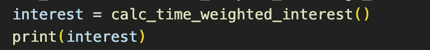

接下来让我们调用我们的基本函数`calc_time_weighted_interest`来启动并打印结果。

同样在脚本的顶部，我们应该添加一些导入。

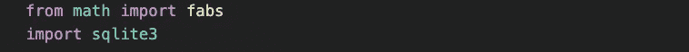

我们现在准备从 CLI 运行 Python 脚本。

`python calc_interest.py`

我们应该大致看到:`9.4%`作为我们 fixture 测试数据中单一账户的时间加权利率。

# 分级编码

感谢您成为我们社区的一员！更多内容见[升级编码出版物](https://levelup.gitconnected.com/)。
跟随:[推特](https://twitter.com/gitconnected)，[领英](https://www.linkedin.com/company/gitconnected)，[通迅](https://newsletter.levelup.dev/)
**升一级正在改造理工大招聘➡️** [**加入我们的人才集体**](https://jobs.levelup.dev/talent/welcome?referral=true)