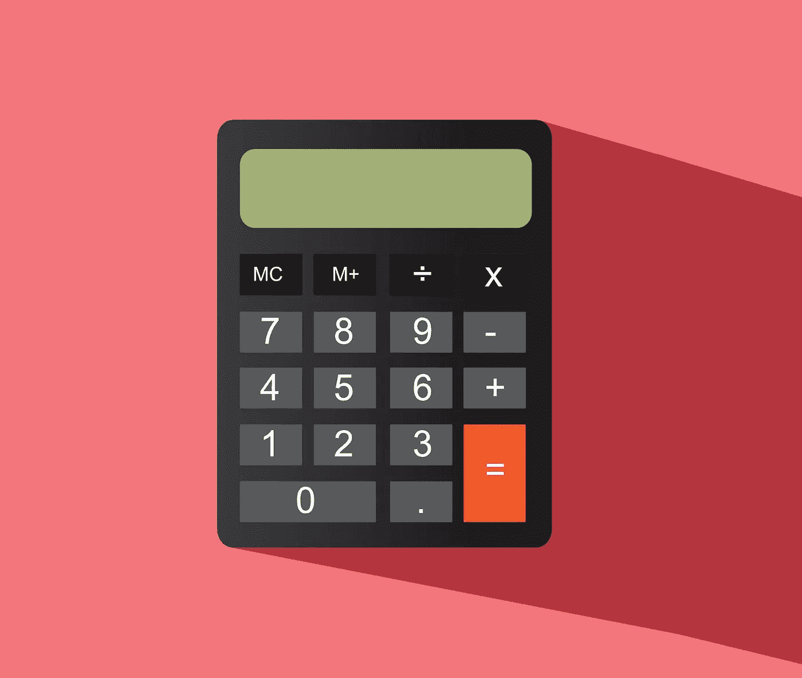

# 带有 GUI 的 Python 计算器

> 原文：<https://levelup.gitconnected.com/calculator-python-with-gui-f26fca223c6e>



不要被代码吓倒，大部分代码都是我在使用终端将我的 UI 文件从 QtDesigner 转换成 python 代码时生成的(并滚动查看描述)。

```
valids = {'x': '[\'x\', \'+\', \'÷\', \'^\']', '+': '[\'x\', \'+\', \'÷\', \'^\']',
          '/': '[\'x\', \'+\', \'÷\', \'^\']',
          '^': '[\'x\', \'+\', \'÷\', \'^\']', '-': '[\'x\',\'÷\', \'^\']',
          '(': '[\'x\', \'+\', \'÷\', \'^\',\'(\']'}from PyQt5 import QtCore, QtGui, QtWidgets
from PyQt5.QtWidgets import QMainWindow

class Ui_MainWindow(QMainWindow):
    def setupUi(self, MainWindow):
        MainWindow.setObjectName("MainWindow")
        MainWindow.resize(300, 450)
        palette = QtGui.QPalette()
        brush = QtGui.QBrush(QtGui.QColor(165, 163, 158))
        brush.setStyle(QtCore.Qt.SolidPattern)

        palette.setBrush(QtGui.QPalette.Active, QtGui.QPalette.WindowText, brush)
        brush = QtGui.QBrush(QtGui.QColor(255, 255, 255))
        brush.setStyle(QtCore.Qt.SolidPattern)

        palette.setBrush(QtGui.QPalette.Active, QtGui.QPalette.Base, brush)
        brush = QtGui.QBrush(QtGui.QColor(146, 146, 152))
        brush.setStyle(QtCore.Qt.SolidPattern)

        palette.setBrush(QtGui.QPalette.Active, QtGui.QPalette.Window, brush)
        brush = QtGui.QBrush(QtGui.QColor(165, 163, 158))
        brush.setStyle(QtCore.Qt.SolidPattern)

        palette.setBrush(QtGui.QPalette.Inactive, QtGui.QPalette.WindowText, brush)
        brush = QtGui.QBrush(QtGui.QColor(255, 255, 255))
        brush.setStyle(QtCore.Qt.SolidPattern)

        palette.setBrush(QtGui.QPalette.Inactive, QtGui.QPalette.Base, brush)
        brush = QtGui.QBrush(QtGui.QColor(146, 146, 152))
        brush.setStyle(QtCore.Qt.SolidPattern)

        palette.setBrush(QtGui.QPalette.Inactive, QtGui.QPalette.Window, brush)
        brush = QtGui.QBrush(QtGui.QColor(120, 120, 120))
        brush.setStyle(QtCore.Qt.SolidPattern)

        palette.setBrush(QtGui.QPalette.Disabled, QtGui.QPalette.WindowText, brush)
        brush = QtGui.QBrush(QtGui.QColor(146, 146, 152))
        brush.setStyle(QtCore.Qt.SolidPattern)

        palette.setBrush(QtGui.QPalette.Disabled, QtGui.QPalette.Base, brush)
        brush = QtGui.QBrush(QtGui.QColor(146, 146, 152))
        brush.setStyle(QtCore.Qt.SolidPattern)

        palette.setBrush(QtGui.QPalette.Disabled, QtGui.QPalette.Window, brush)
        MainWindow.setPalette(palette)
        MainWindow.setAutoFillBackground(False)

        self.centralwidget = QtWidgets.QWidget(MainWindow)
        self.centralwidget.setObjectName("centralwidget")
        self.CalcScreen = QtWidgets.QLabel(self.centralwidget)
        self.CalcScreen.setGeometry(QtCore.QRect(10, 15, 280, 91))
        palette = QtGui.QPalette()
        brush = QtGui.QBrush(QtGui.QColor(0, 0, 0))
        brush.setStyle(QtCore.Qt.SolidPattern)
        palette.setBrush(QtGui.QPalette.Active, QtGui.QPalette.WindowText, brush)
        brush = QtGui.QBrush(QtGui.QColor(211, 211, 240))
        brush.setStyle(QtCore.Qt.SolidPattern)
        palette.setBrush(QtGui.QPalette.Active, QtGui.QPalette.Button, brush)
        brush = QtGui.QBrush(QtGui.QColor(255, 255, 255))
        brush.setStyle(QtCore.Qt.SolidPattern)
        palette.setBrush(QtGui.QPalette.Active, QtGui.QPalette.Light, brush)
        brush = QtGui.QBrush(QtGui.QColor(233, 233, 247))
        brush.setStyle(QtCore.Qt.SolidPattern)
        palette.setBrush(QtGui.QPalette.Active, QtGui.QPalette.Midlight, brush)
        brush = QtGui.QBrush(QtGui.QColor(105, 105, 120))
        brush.setStyle(QtCore.Qt.SolidPattern)
        palette.setBrush(QtGui.QPalette.Active, QtGui.QPalette.Dark, brush)
        brush = QtGui.QBrush(QtGui.QColor(141, 141, 160))
        brush.setStyle(QtCore.Qt.SolidPattern)
        palette.setBrush(QtGui.QPalette.Active, QtGui.QPalette.Mid, brush)
        brush = QtGui.QBrush(QtGui.QColor(0, 0, 0))
        brush.setStyle(QtCore.Qt.SolidPattern)
        palette.setBrush(QtGui.QPalette.Active, QtGui.QPalette.Text, brush)
        brush = QtGui.QBrush(QtGui.QColor(255, 255, 255))
        brush.setStyle(QtCore.Qt.SolidPattern)
        palette.setBrush(QtGui.QPalette.Active, QtGui.QPalette.BrightText, brush)
        brush = QtGui.QBrush(QtGui.QColor(0, 0, 0))
        brush.setStyle(QtCore.Qt.SolidPattern)
        palette.setBrush(QtGui.QPalette.Active, QtGui.QPalette.ButtonText, brush)
        brush = QtGui.QBrush(QtGui.QColor(255, 255, 255))
        brush.setStyle(QtCore.Qt.SolidPattern)
        palette.setBrush(QtGui.QPalette.Active, QtGui.QPalette.Base, brush)
        brush = QtGui.QBrush(QtGui.QColor(211, 211, 240))
        brush.setStyle(QtCore.Qt.SolidPattern)
        palette.setBrush(QtGui.QPalette.Active, QtGui.QPalette.Window, brush)
        brush = QtGui.QBrush(QtGui.QColor(0, 0, 0))
        brush.setStyle(QtCore.Qt.SolidPattern)
        palette.setBrush(QtGui.QPalette.Active, QtGui.QPalette.Shadow, brush)
        brush = QtGui.QBrush(QtGui.QColor(233, 233, 247))
        brush.setStyle(QtCore.Qt.SolidPattern)
        palette.setBrush(QtGui.QPalette.Active, QtGui.QPalette.AlternateBase, brush)
        brush = QtGui.QBrush(QtGui.QColor(255, 255, 220))
        brush.setStyle(QtCore.Qt.SolidPattern)
        palette.setBrush(QtGui.QPalette.Active, QtGui.QPalette.ToolTipBase, brush)
        brush = QtGui.QBrush(QtGui.QColor(0, 0, 0))
        brush.setStyle(QtCore.Qt.SolidPattern)
        palette.setBrush(QtGui.QPalette.Active, QtGui.QPalette.ToolTipText, brush)
        brush = QtGui.QBrush(QtGui.QColor(0, 0, 0))
        brush.setStyle(QtCore.Qt.SolidPattern)
        palette.setBrush(QtGui.QPalette.Inactive, QtGui.QPalette.WindowText, brush)
        brush = QtGui.QBrush(QtGui.QColor(211, 211, 240))
        brush.setStyle(QtCore.Qt.SolidPattern)
        palette.setBrush(QtGui.QPalette.Inactive, QtGui.QPalette.Button, brush)
        brush = QtGui.QBrush(QtGui.QColor(255, 255, 255))
        brush.setStyle(QtCore.Qt.SolidPattern)
        palette.setBrush(QtGui.QPalette.Inactive, QtGui.QPalette.Light, brush)
        brush = QtGui.QBrush(QtGui.QColor(233, 233, 247))
        brush.setStyle(QtCore.Qt.SolidPattern)
        palette.setBrush(QtGui.QPalette.Inactive, QtGui.QPalette.Midlight, brush)
        brush = QtGui.QBrush(QtGui.QColor(105, 105, 120))
        brush.setStyle(QtCore.Qt.SolidPattern)
        palette.setBrush(QtGui.QPalette.Inactive, QtGui.QPalette.Dark, brush)
        brush = QtGui.QBrush(QtGui.QColor(141, 141, 160))
        brush.setStyle(QtCore.Qt.SolidPattern)
        palette.setBrush(QtGui.QPalette.Inactive, QtGui.QPalette.Mid, brush)
        brush = QtGui.QBrush(QtGui.QColor(0, 0, 0))
        brush.setStyle(QtCore.Qt.SolidPattern)
        palette.setBrush(QtGui.QPalette.Inactive, QtGui.QPalette.Text, brush)
        brush = QtGui.QBrush(QtGui.QColor(255, 255, 255))
        brush.setStyle(QtCore.Qt.SolidPattern)
        palette.setBrush(QtGui.QPalette.Inactive, QtGui.QPalette.BrightText, brush)
        brush = QtGui.QBrush(QtGui.QColor(0, 0, 0))
        brush.setStyle(QtCore.Qt.SolidPattern)
        palette.setBrush(QtGui.QPalette.Inactive, QtGui.QPalette.ButtonText, brush)
        brush = QtGui.QBrush(QtGui.QColor(255, 255, 255))
        brush.setStyle(QtCore.Qt.SolidPattern)
        palette.setBrush(QtGui.QPalette.Inactive, QtGui.QPalette.Base, brush)
        brush = QtGui.QBrush(QtGui.QColor(211, 211, 240))
        brush.setStyle(QtCore.Qt.SolidPattern)
        palette.setBrush(QtGui.QPalette.Inactive, QtGui.QPalette.Window, brush)
        brush = QtGui.QBrush(QtGui.QColor(0, 0, 0))
        brush.setStyle(QtCore.Qt.SolidPattern)
        palette.setBrush(QtGui.QPalette.Inactive, QtGui.QPalette.Shadow, brush)
        brush = QtGui.QBrush(QtGui.QColor(233, 233, 247))
        brush.setStyle(QtCore.Qt.SolidPattern)
        palette.setBrush(QtGui.QPalette.Inactive, QtGui.QPalette.AlternateBase, brush)
        brush = QtGui.QBrush(QtGui.QColor(255, 255, 220))
        brush.setStyle(QtCore.Qt.SolidPattern)
        palette.setBrush(QtGui.QPalette.Inactive, QtGui.QPalette.ToolTipBase, brush)
        brush = QtGui.QBrush(QtGui.QColor(0, 0, 0))
        brush.setStyle(QtCore.Qt.SolidPattern)
        palette.setBrush(QtGui.QPalette.Inactive, QtGui.QPalette.ToolTipText, brush)
        brush = QtGui.QBrush(QtGui.QColor(105, 105, 120))
        brush.setStyle(QtCore.Qt.SolidPattern)
        palette.setBrush(QtGui.QPalette.Disabled, QtGui.QPalette.WindowText, brush)
        brush = QtGui.QBrush(QtGui.QColor(211, 211, 240))
        brush.setStyle(QtCore.Qt.SolidPattern)
        palette.setBrush(QtGui.QPalette.Disabled, QtGui.QPalette.Button, brush)
        brush = QtGui.QBrush(QtGui.QColor(255, 255, 255))
        brush.setStyle(QtCore.Qt.SolidPattern)
        palette.setBrush(QtGui.QPalette.Disabled, QtGui.QPalette.Light, brush)
        brush = QtGui.QBrush(QtGui.QColor(233, 233, 247))
        brush.setStyle(QtCore.Qt.SolidPattern)
        palette.setBrush(QtGui.QPalette.Disabled, QtGui.QPalette.Midlight, brush)
        brush = QtGui.QBrush(QtGui.QColor(105, 105, 120))
        brush.setStyle(QtCore.Qt.SolidPattern)
        palette.setBrush(QtGui.QPalette.Disabled, QtGui.QPalette.Dark, brush)
        brush = QtGui.QBrush(QtGui.QColor(141, 141, 160))
        brush.setStyle(QtCore.Qt.SolidPattern)
        palette.setBrush(QtGui.QPalette.Disabled, QtGui.QPalette.Mid, brush)
        brush = QtGui.QBrush(QtGui.QColor(105, 105, 120))
        brush.setStyle(QtCore.Qt.SolidPattern)
        palette.setBrush(QtGui.QPalette.Disabled, QtGui.QPalette.Text, brush)
        brush = QtGui.QBrush(QtGui.QColor(255, 255, 255))
        brush.setStyle(QtCore.Qt.SolidPattern)
        palette.setBrush(QtGui.QPalette.Disabled, QtGui.QPalette.BrightText, brush)
        brush = QtGui.QBrush(QtGui.QColor(105, 105, 120))
        brush.setStyle(QtCore.Qt.SolidPattern)
        palette.setBrush(QtGui.QPalette.Disabled, QtGui.QPalette.ButtonText, brush)
        brush = QtGui.QBrush(QtGui.QColor(211, 211, 240))
        brush.setStyle(QtCore.Qt.SolidPattern)
        palette.setBrush(QtGui.QPalette.Disabled, QtGui.QPalette.Base, brush)
        brush = QtGui.QBrush(QtGui.QColor(211, 211, 240))
        brush.setStyle(QtCore.Qt.SolidPattern)
        palette.setBrush(QtGui.QPalette.Disabled, QtGui.QPalette.Window, brush)
        brush = QtGui.QBrush(QtGui.QColor(0, 0, 0))
        brush.setStyle(QtCore.Qt.SolidPattern)
        palette.setBrush(QtGui.QPalette.Disabled, QtGui.QPalette.Shadow, brush)
        brush = QtGui.QBrush(QtGui.QColor(211, 211, 240))
        brush.setStyle(QtCore.Qt.SolidPattern)
        palette.setBrush(QtGui.QPalette.Disabled, QtGui.QPalette.AlternateBase, brush)
        brush = QtGui.QBrush(QtGui.QColor(255, 255, 220))
        brush.setStyle(QtCore.Qt.SolidPattern)
        palette.setBrush(QtGui.QPalette.Disabled, QtGui.QPalette.ToolTipBase, brush)
        brush = QtGui.QBrush(QtGui.QColor(0, 0, 0))
        brush.setStyle(QtCore.Qt.SolidPattern)
        palette.setBrush(QtGui.QPalette.Disabled, QtGui.QPalette.ToolTipText, brush)
        self.CalcScreen.setPalette(palette)
        font = QtGui.QFont()
        font.setPointSize(15)
        font.setBold(False)
        font.setItalic(False)
        font.setWeight(50)
        font.setStrikeOut(False)
        font.setKerning(True)
        self.CalcScreen.setFont(font)
        self.CalcScreen.setAutoFillBackground(True)
        self.CalcScreen.setFrameShape(QtWidgets.QFrame.WinPanel)
        self.CalcScreen.setFrameShadow(QtWidgets.QFrame.Plain)
        self.CalcScreen.setLineWidth(1)
        self.CalcScreen.setMidLineWidth(0)
        self.CalcScreen.setText("")
        self.CalcScreen.setObjectName("CalcScreen")

        self.Calc1 = QtWidgets.QPushButton(self.centralwidget)
        self.Calc1.setGeometry(QtCore.QRect(10, 120, 50, 40))
        self.Calc1.setAutoRepeat(False)
        self.Calc1.setObjectName("Calc1")

        self.Calc2 = QtWidgets.QPushButton(self.centralwidget)
        self.Calc2.setGeometry(QtCore.QRect(70, 120, 50, 40))
        self.Calc2.setAutoRepeat(False)
        self.Calc2.setObjectName("Calc2")

        self.Calc3 = QtWidgets.QPushButton(self.centralwidget)
        self.Calc3.setGeometry(QtCore.QRect(130, 120, 50, 40))
        self.Calc3.setAutoRepeat(False)
        self.Calc3.setObjectName("Calc3")

        self.Calc4 = QtWidgets.QPushButton(self.centralwidget)
        self.Calc4.setGeometry(QtCore.QRect(10, 170, 50, 40))
        self.Calc4.setAutoRepeat(False)
        self.Calc4.setObjectName("Calc4")

        self.Calc5 = QtWidgets.QPushButton(self.centralwidget)
        self.Calc5.setGeometry(QtCore.QRect(70, 170, 50, 40))
        self.Calc5.setAutoRepeat(False)
        self.Calc5.setObjectName("Calc5")

        self.Calc6 = QtWidgets.QPushButton(self.centralwidget)
        self.Calc6.setGeometry(QtCore.QRect(130, 170, 50, 40))
        self.Calc6.setAutoRepeat(False)
        self.Calc6.setObjectName("Calc6")

        self.Calc7 = QtWidgets.QPushButton(self.centralwidget)
        self.Calc7.setGeometry(QtCore.QRect(10, 220, 50, 40))
        self.Calc7.setAutoRepeat(False)
        self.Calc7.setObjectName("Calc7")

        self.Calc8 = QtWidgets.QPushButton(self.centralwidget)
        self.Calc8.setGeometry(QtCore.QRect(70, 220, 50, 40))
        self.Calc8.setAutoRepeat(False)
        self.Calc8.setObjectName("Calc8")

        self.Calc9 = QtWidgets.QPushButton(self.centralwidget)
        self.Calc9.setGeometry(QtCore.QRect(130, 220, 50, 40))
        self.Calc9.setAutoRepeat(False)
        self.Calc9.setObjectName("Calc9")

        self.Calc0 = QtWidgets.QPushButton(self.centralwidget)
        self.Calc0.setGeometry(QtCore.QRect(70, 270, 50, 40))
        self.Calc0.setAutoRepeat(False)
        self.Calc0.setObjectName("Calc0")

        self.Enter = QtWidgets.QPushButton(self.centralwidget)
        self.Enter.setGeometry(QtCore.QRect(240, 120, 50, 40))
        self.Enter.setAutoRepeat(False)
        self.Enter.setObjectName("Enter")

        self.WDivide = QtWidgets.QPushButton(self.centralwidget)
        self.WDivide.setGeometry(QtCore.QRect(240, 160, 50, 40))
        self.WDivide.setAutoRepeat(False)
        self.WDivide.setObjectName("WDivide")

        self.WMinus = QtWidgets.QPushButton(self.centralwidget)
        self.WMinus.setGeometry(QtCore.QRect(240, 200, 50, 40))
        self.WMinus.setAutoRepeat(False)
        self.WMinus.setObjectName("WMinus")

        self.WCBracket = QtWidgets.QPushButton(self.centralwidget)
        self.WCBracket.setGeometry(QtCore.QRect(240, 240, 50, 40))
        self.WCBracket.setAutoRepeat(False)
        self.WCBracket.setObjectName("WCBracket")

        self.Backspace = QtWidgets.QPushButton(self.centralwidget)
        self.Backspace.setGeometry(QtCore.QRect(190, 120, 50, 40))
        font = QtGui.QFont()
        font.setPointSize(6)
        self.Backspace.setFont(font)
        self.Backspace.setAutoRepeat(False)
        self.Backspace.setObjectName("Backspace")

        self.WMultiply = QtWidgets.QPushButton(self.centralwidget)
        self.WMultiply.setGeometry(QtCore.QRect(190, 160, 50, 40))
        self.WMultiply.setAutoRepeat(False)
        self.WMultiply.setObjectName("WMultiply")

        self.WPlus = QtWidgets.QPushButton(self.centralwidget)
        self.WPlus.setGeometry(QtCore.QRect(190, 200, 50, 40))
        self.WPlus.setAutoRepeat(False)
        self.WPlus.setObjectName("WPlus")

        self.WOBracket = QtWidgets.QPushButton(self.centralwidget)
        self.WOBracket.setGeometry(QtCore.QRect(190, 240, 50, 40))
        self.WOBracket.setAutoRepeat(False)
        self.WOBracket.setObjectName("WOBracket")

        self.CalcDecimal = QtWidgets.QPushButton(self.centralwidget)
        self.CalcDecimal.setGeometry(QtCore.QRect(130, 270, 50, 40))
        self.CalcDecimal.setAutoRepeat(False)
        self.CalcDecimal.setObjectName("CalcDecimal")

        self.WExponent = QtWidgets.QPushButton(self.centralwidget)
        self.WExponent.setGeometry(QtCore.QRect(210, 280, 50, 40))
        self.WExponent.setAutoRepeat(False)
        self.WExponent.setObjectName("WExponent")

        MainWindow.setCentralWidget(self.centralwidget)
        self.statusbar = QtWidgets.QStatusBar(MainWindow)
        self.statusbar.setObjectName("statusbar")
        MainWindow.setStatusBar(self.statusbar)

        self.message = ''

        self.retranslateUi(MainWindow)
        QtCore.QMetaObject.connectSlotsByName(MainWindow)

    def retranslateUi(self, MainWindow):
        _translate = QtCore.QCoreApplication.translate
        MainWindow.setWindowTitle(_translate("MainWindow", "Calculator"))
        self.CalcScreen.setStatusTip(_translate("MainWindow", "Calculator Screen"))
        self.CalcScreen.setWhatsThis(_translate("MainWindow", "Screen"))

        self.Calc1.setStatusTip(_translate("MainWindow", "Number 1"))
        self.Calc1.setText(_translate("MainWindow", "1"))
        self.Calc1.setShortcut(_translate("MainWindow", "1"))
        self.Calc1.clicked.connect(self.clicked)

        self.Calc2.setStatusTip(_translate("MainWindow", "Number 2"))
        self.Calc2.setText(_translate("MainWindow", "2"))
        self.Calc2.setShortcut(_translate("MainWindow", "2"))
        self.Calc2.clicked.connect(self.clicked)

        self.Calc3.setStatusTip(_translate("MainWindow", "Number 3"))
        self.Calc3.setText(_translate("MainWindow", "3"))
        self.Calc3.setShortcut(_translate("MainWindow", "3"))
        self.Calc3.clicked.connect(self.clicked)

        self.Calc4.setStatusTip(_translate("MainWindow", "Number 4"))
        self.Calc4.setText(_translate("MainWindow", "4"))
        self.Calc4.setShortcut(_translate("MainWindow", "4"))
        self.Calc4.clicked.connect(self.clicked)

        self.Calc5.setStatusTip(_translate("MainWindow", "Number 5"))
        self.Calc5.setText(_translate("MainWindow", "5"))
        self.Calc5.setShortcut(_translate("MainWindow", "5"))
        self.Calc5.clicked.connect(self.clicked)

        self.Calc6.setStatusTip(_translate("MainWindow", "Number 6"))
        self.Calc6.setText(_translate("MainWindow", "6"))
        self.Calc6.setShortcut(_translate("MainWindow", "6"))
        self.Calc6.clicked.connect(self.clicked)

        self.Calc7.setStatusTip(_translate("MainWindow", "Number 7"))
        self.Calc7.setText(_translate("MainWindow", "7"))
        self.Calc7.setShortcut(_translate("MainWindow", "7"))
        self.Calc7.clicked.connect(self.clicked)

        self.Calc8.setStatusTip(_translate("MainWindow", "Number 8"))
        self.Calc8.setText(_translate("MainWindow", "8"))
        self.Calc8.setShortcut(_translate("MainWindow", "8"))
        self.Calc8.clicked.connect(self.clicked)

        self.Calc9.setStatusTip(_translate("MainWindow", "Number 9"))
        self.Calc9.setText(_translate("MainWindow", "9"))
        self.Calc9.setShortcut(_translate("MainWindow", "9"))
        self.Calc9.clicked.connect(self.clicked)

        self.Calc0.setStatusTip(_translate("MainWindow", "Number 0"))
        self.Calc0.setText(_translate("MainWindow", "0"))
        self.Calc0.setShortcut(_translate("MainWindow", "0"))
        self.Calc0.clicked.connect(self.clicked)

        self.Enter.setStatusTip(_translate("MainWindow", "Enter"))
        self.Enter.setText(_translate("MainWindow", "Enter"))
        self.Enter.clicked.connect(self.Calculate)

        self.Enter.setShortcut(_translate("MainWindow", "Return"))

        self.WDivide.setStatusTip(_translate("MainWindow", "Divide"))
        self.WDivide.setText(_translate("MainWindow", "÷"))
        self.WDivide.clicked.connect(self.clicked)

        self.WDivide.setShortcut(_translate("MainWindow", "/"))
        self.WMinus.setStatusTip(_translate("MainWindow", "Minus"))

        self.WMinus.setText(_translate("MainWindow", "-"))
        self.WMinus.setShortcut(_translate("MainWindow", "-"))
        self.WMinus.clicked.connect(self.clicked)

        self.WCBracket.setStatusTip(_translate("MainWindow", "Closing Bracket"))
        self.WCBracket.setText(_translate("MainWindow", ")"))
        self.WCBracket.setShortcut(_translate("MainWindow", ")"))
        self.WCBracket.clicked.connect(self.clicked)

        self.Backspace.setStatusTip(_translate("MainWindow", "Backspace"))
        self.Backspace.setText(_translate("MainWindow", "Backspace"))
        self.Backspace.setShortcut(_translate("MainWindow", "Backspace"))
        self.Backspace.clicked.connect(self.delete)

        self.WMultiply.setStatusTip(_translate("MainWindow", "Multiply"))
        self.WMultiply.setText(_translate("MainWindow", "x"))
        self.WMultiply.setShortcut(_translate("MainWindow", "X"))
        self.WMultiply.clicked.connect(self.clicked)

        self.WPlus.setStatusTip(_translate("MainWindow", "Plus"))
        self.WPlus.setText(_translate("MainWindow", "+"))
        self.WPlus.setShortcut(_translate("MainWindow", "+"))
        self.WPlus.clicked.connect(self.clicked)

        self.WOBracket.setStatusTip(_translate("MainWindow", "Open Bracket"))
        self.WOBracket.setText(_translate("MainWindow", "("))
        self.WOBracket.setShortcut(_translate("MainWindow", "("))
        self.WOBracket.clicked.connect(self.clicked)

        self.CalcDecimal.setStatusTip(_translate("MainWindow", "Decimal"))
        self.CalcDecimal.setText(_translate("MainWindow", "."))
        self.CalcDecimal.setShortcut(_translate("MainWindow", "."))
        self.CalcDecimal.clicked.connect(self.clicked)

        self.WExponent.setStatusTip(_translate("MainWindow", "Exponent"))
        self.WExponent.setText(_translate("MainWindow", "^"))
        self.WExponent.setShortcut(_translate("MainWindow", "^"))
        self.WExponent.clicked.connect(self.clicked)

    def clicked(self):
        sender = self.sender()
        self.message += sender.text()
        self.CalcScreen.setText(self.message)

    def delete(self):
        self.message=self.message[:-1]
        self.CalcScreen.setText(self.message)

    def Calculate(self):
        state = True
        calculation = self.message
        for i, v in enumerate(calculation):  # iterates through the calc string
            if v in ['x', '+', '-', '÷', '^', '(']:  # doing a sign check
                if i + 1 == len(calculation):   # validating that the sign use is legal
                    state = False
                if calculation[i + 1] in valids:
                    state = False
                if calculation[-1] in ['x', '+', '-', '÷', '^','(']:
                        state = False
                if calculation.count('(') != calculation.count(')'):
                    state = False

        if state:
            self.maths()
        else:
            self.CalcScreen.setText("Invalid Input")
            self.message = ''

    def maths(self):
        calculation = '('+ str(self.message)+')'
        for i in range(len(calculation)):
            if (calculation[i]=='(' and calculation[i-1] not in ['x', '+', '-', '÷', '^', '(']) and (i != 0):
                calculation = calculation[:i]+'x'+calculation[i:]
                print(calculation)
        calculation = calculation.replace('x', '*')
        calculation = calculation.replace('÷', '/')
        calculation = calculation.replace('^', '**')

        ans = eval(calculation)
        print(ans)
        self.CalcScreen.setText(str(ans))

        self.message = ''

if __name__ == "__main__":
    import sys
    app = QtWidgets.QApplication(sys.argv)
    MainWindow = QtWidgets.QMainWindow()
    ui = Ui_MainWindow()
    ui.setupUi(MainWindow)
    MainWindow.show()
    sys.exit(app.exec_())
```

一位用户的计算顾问建议我用 GUI 制作一个计算器，这是我的尝试。请注意，这段代码的大部分是由 Qt Designer 创建的(这是 PyQt 附带的一个 UI 设计应用程序，所以我不知道这些代码部分具体做什么)。

设计这个计算器的主要挑战是将所有这些按钮连接到显示计算器显示的主标签上，实际上是求解答案，因为输入将是一个字符串。真正的方法是创建一个抽象语法树，这本身就意味着你需要进入递归；python 有一个 eval()函数，这意味着你可以运行一个计算，所以我利用了它。

由于代码相当广泛，我不会像往常一样一行一行地看，但我会谈谈代码的主要部分。

我跟随的 PyQt 教程是 PyQt 上的 Tech by Time 5 集播放列表。虽然它没有深入到发送者和如何做程序的计算器部分，但它解释了标签和按钮的许多基础知识，以及如何将它们连接到函数。

**注意:如果你自己尝试这样做，PyQt 还没有得到最好的调试，这意味着如果程序在你的 PyQt 窗口运行时由于错误而崩溃，你得到的唯一信息是“错误代码:……”，为了尝试定位你的错误，我建议在你的代码中偶尔放置打印语句，这样当它运行时，你可以检查终端以查看它在哪个打印语句处结束，这意味着错误必须在打印语句之间。**

```
valids = {'x': '[\'x\', \'+\', \'÷\', \'^\']', '+': '[\'x\', \'+\', \'÷\', \'^\']',
          '/': '[\'x\', \'+\', \'÷\', \'^\']',
          '^': '[\'x\', \'+\', \'÷\', \'^\']', '-': '[\'x\',\'÷\', \'^\']',
          '(': '[\'x\', \'+\', \'÷\', \'^\',\'(\']'}
```

这个 valids 字典非常重要，因为验证你的输入是这个程序的一个非常重要的部分，我已经设置了这个字典，所以每个值都不能跟在它的键后面。

接下来的 300 多行代码都是 Qt Designer 自动生成的代码。如果你下载了 QtDesigner，它会让你画出你的标签和按钮，并设置它们的变量名，快捷方式，位置，它们实际上说什么等等。所以如果你运行我的代码，你看到的覆盖图是我在 QtDesigner 上创建的。

# 将用户界面转换为 Python:

这实际上比你想象的要简单得多。转到 UI 文件的目录(所以无论您在文件中保存了它)，然后通过文件管理器加载命令提示符，以确保它在正确的目录中。然后，您将编写以下命令:

py UIC 5-x(UI 文件的名称)。ui-o(python 文件的名称)。巴拉圭

例如:

**>>$**pyu ic5-x calcoverlay . ui-o calculator . py

在终端执行之后，您应该会在与转换后的代码所在的 UI 文件相同的目录中找到一个新的 python 文件。

**如果你想用 Tim 的视觉效果更好地解释，就去 9:00**

# 点击事件:

```
def clicked(self):
        sender = self.sender()
        self.message += sender.text()
        self.CalcScreen.setText(self.message)
```

这个函数允许我们对被点击的按钮做出反应。许多人可能会遇到一个问题，因为他们试图将一个参数传递给被单击的函数，然而，PyQt 显然不喜欢这样。这个问题花了我一天时间才解决，直到我读到一页关于 sender()方法的内容。问题是所有可点击的按钮必须使用相同的功能，所以代码必须有一种方法来区分哪个按钮被点击了，这就是解决方案。

self.sender()将返回被单击的按钮的文本值。这意味着我们可以将它添加到消息(计算器屏幕上的内容)中，然后使用 setText 函数显示它们。请注意，当使用 setText 时，您必须连接到 string，而程序不会为您这样做，因此当稍后执行 eval()时，您必须再次转换回 string。

```
self.WOBracket.clicked.connect(self.clicked)
```

对于每个按钮，我们现在添加这段代码，它基本上是说当有一个点击事件时(当按钮被点击时)运行被点击的函数。我很确定你不会用括号()写 self.clicked，因为编译器可能会把它误认为实际运行了函数，所以我们不使用括号。

```
def delete(self):
        self.message=self.message[:-1]
        self.CalcScreen.setText(self.message)
```

删除功能也有类似的目的，但现在我们需要它以防用户出错。这段代码非常简单明了，我们索引出消息的最后一个值，然后显示结果。

```
def Calculate(self):
        state = True
        calculation = self.message
        for i, v in enumerate(calculation):  # iterates through the calc string
            if v in ['x', '+', '-', '÷', '^', '(']:  # doing a sign check
                if i + 1 == len(calculation):   # validating that the sign use is legal
                    state = False
                if calculation[i + 1] in valids:
                    state = False
                if calculation[-1] in ['x', '+', '-', '÷', '^','(']:
                        state = False
                if calculation.count('(') != calculation.count(')'):
                    state = False

        if state:
            self.maths()
        else:
            self.CalcScreen.setText("Invalid Input")
            self.message = ''
```

我为这种格式道歉，因为 medium 的线长与 pythons 不同，所以这些看起来很奇怪。这个 calculate 函数在用户单击 enter 时运行，这是代码的验证部分。这负责确保输入在数学术语上是“合法的”。我们首先将状态设置为 True，这就是我如何跟踪数学是否有效。真=数学是正确的，假=有些东西行不通。我继续通过一组测试来运行它，你们可以看到，如果它们没有通过测试，它们的状态将被重置回 false。在测试结束时，如果 state 仍然为真，我运行数学函数来进行实际计算。否则，我会显示无效的无效输入并清除消息，如果你愿意，你可以在这里输入时间，在“无效输入”处暂停程序一秒钟，然后将文本重置回消息，而不是重置它，但这只是偏好。

```
def maths(self):
        calculation = '('+ str(self.message)+')'
        for i in range(len(calculation)):
            if (calculation[i]=='(' and calculation[i-1] not in ['x', '+', '-', '÷', '^', '(']) and (i != 0):
                calculation = calculation[:i]+'x'+calculation[i:]
                print(calculation)
        calculation = calculation.replace('x', '*')
        calculation = calculation.replace('÷', '/')
        calculation = calculation.replace('^', '**')

        ans = eval(calculation)
        print(ans)
        self.CalcScreen.setText(str(ans))

        self.message = ''
```

最后的计算得出了答案。首先，我意识到 eval()对带括号的计算有奇怪的反应。如果你运行 3(3+6 ),它会崩溃，因为它没有直观地意识到在(之前会有乘法，因此我们需要将它添加到计算本身。这就是我为函数的前 4 行所做的。之后，我需要将输入中所有用户友好的字符转换成计算机能够理解的字符。这意味着我们需要把“x”换成“*”，把“'^'”换成“**”，等等。

完成后，我们可以评估答案，然后将计算显示设置为该答案，这样就完成了。

挑战:使用 import math，在 GUI 上添加一个 pi 按钮，让用户在计算中使用 pi。这应该遵循我在这里解释的完全相同的逻辑。