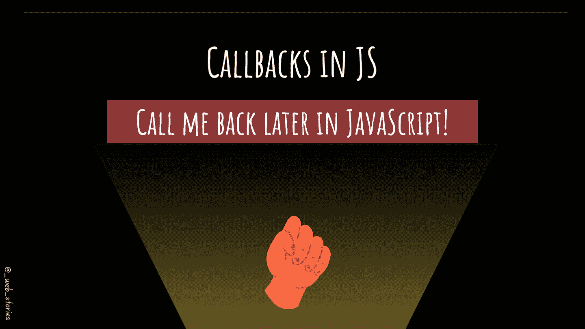

# 稍后用 JavaScript 给我回电！

> 原文：<https://levelup.gitconnected.com/call-me-back-later-in-javascript-9cdb74aafca3>

## 理解 JS 中的回调

作者:FAM

## 你好👋

回拨关键字是你在日常任务中会听到和谈到的东西。你需要理解回调，因为你会在任何地方听到和使用它们，在每个应用和项目中。

这篇文章，以及接下来的 2 篇文章，是 [**2022 网络计划**](https://javascript.plainenglish.io/my-web-articles-roadmap-for-2022-20387cab9b07) 中 JS 章节所有文章中必不可少的一篇。

所以，我们去拿吧！

# 复试

> 我过会儿给你回电话

回调是作为参数**传递给另一个函数**的函数或代码，以便稍后**执行**。

# 为什么我们需要复试？

在现实生活的用例中，我们需要在完成一个动作后做一些动作。例如，你需要洗个澡🚿健身后💪。这里的**顺序很重要**。在一个 app 中，你需要**显示一个加载器(动作 1)** ，当数据准备好了，**移除加载器并显示数据(动作 2)** 。

## -回拨方法

回调函数可以解决这个问题，具体方法如下:

在示例中，我们有:

*   将回调(函数)作为参数的 `**loadProducts**()`函数。
*   此功能不会立即执行。
*   然后我们使用`**setTimeout**()`函数来模拟从服务器获取数据的时间。
*   获取数据后(setTimeout 模拟 1 秒后)，运行`**isLoading**(false)`停止加载器。

如果您想了解更多关于`***setTimout()***`的信息:

 [## JavaScript 中的计时事件

### JavaScript 中的超时和间隔

famzil.medium.com](https://famzil.medium.com/timing-events-in-javascript-d44c24ed8641) 

## ——开发者困惑的地方！

当您第一次开始学习回调时，您可能会问，当我们可以简单地首先调用`**startLoader**()`，然后调用`**loadProducts**()`，最后调用`**stopLoader**()`时，为什么我们还需要这个机制。

要理解为什么必须了解事件循环:

 [## JavaScript 中什么是事件循环？

### JavaScript 多线程背后的秘密。

javascript.plainenglish.io](https://javascript.plainenglish.io/what-is-event-loop-in-javascript-917ca464808e) 

事件循环使得代码异步。使代码异步将使你的应用程序具有交互性，同时做多件事情。否则，对于每个动作，整个应用程序都会冻结，直到该动作完成，这对用户体验来说非常可怕。

## -好吧，回到我的装载机的例子

*   启动加载器将立即工作。没有什么需要处理的，所以加载程序会很快显示出来。
*   加载数据需要时间。由于您向后端发出请求，后端将启动数据库查询，获得响应并将其发送给您(这次我们使用`**setTimeout**()`函数进行了模拟)。
*   当你调用`**loadProducts**()`时，动作被触发(是异步的)，app 不会就此停止。它将继续发起其他行动。所以下一段代码将会执行`**stopLoader**()`。加载器已移除，但数据加载尚未完成。这就有问题了！

回调函数可以解决这个问题。通过回调，您可以获取数据，并且只有在**该动作完成**(从后端接收的数据)之后，您才能停止加载程序。

# 回调的局限性

在现实生活中，您可能需要按顺序启动操作。为此使用回调是不恰当的，因为它会工作，但随着应用程序的增长和复杂性的增加，伸缩不是回调所能实现的。这个问题被称为**末日金字塔**或**回调地狱。**

这就是承诺和异步/等待至关重要的地方！这将是 JS 章节的另一部分，您将在下一篇文章中学习。在那之前，请继续关注😉

# 💡外卖

*   回调是作为**参数**传递给另一个函数的函数，该函数将在**之后**执行。
*   将 ***回调*** (函数)作为参数的函数称为**高阶函数**。要了解更多信息:

 [## JavaScript 中的 HoF 是什么？

### 高阶函数有什么用？

levelup.gitconnected.com](/whats-hof-in-javascript-9fb68a9c3f6f) 

今天就到这里，看阿雅🙋

如果您有任何问题或反馈，请点击评论或通过 LinkedIn 联系我— **我洗耳恭听！**

[**想请我喝杯咖啡吗？☕️**](https://www.buymeacoffee.com/fatimaamzil)

> 让我们为 2022 年打造一个更好的‘我们’！

## 了解有关 2022 年网络快车计划的更多信息:

I- [通用网络知识](https://medium.com/geekculture/2022-web-program-chapter-n-1-is-done-499fb0707220?source=your_stories_page----------------------------------------)

[II-网页框架:HTML](https://famzil.medium.com/your-html-essentials-69d9b2349355?source=your_stories_page----------------------------------------)

[III-网页样式:CSS](https://medium.com/geekculture/recap-of-the-css-chapter-ae388d51e564?source=your_stories_page----------------------------------------)

## IV- Web 交互:JavaScript

*   [异步代码](https://javascript.plainenglish.io/can-the-web-live-without-asynchronous-code-7f61fe2e862e?source=your_stories_page----------------------------------------)
*   [这个](https://medium.com/geekculture/this-for-developers-5dc91d499677?source=your_stories_page----------------------------------------)
*   [变量](https://medium.com/codex/js-variables-what-you-need-to-know-fb8994ed9d0d?source=your_stories_page-------------------------------------)
*   [范围&吊装](https://javascript.plainenglish.io/js-mechanism-you-should-know-12431e094103?source=your_stories_page-------------------------------------)
*   [操作员](https://javascript.plainenglish.io/js-operators-3511c8545719?source=your_stories_page-------------------------------------)
*   [关闭](https://famzil.medium.com/js-closures-99666fe36a6a?source=your_stories_page-------------------------------------)
*   [高阶函数](https://famzil.medium.com/whats-hof-in-javascript-9fb68a9c3f6f?source=your_stories_page-------------------------------------)
*   [对象&方法](https://famzil.medium.com/objects-in-javascript-64fa3e82765f?source=your_stories_page-------------------------------------)
*   [数组，设置&贴图](https://javascript.plainenglish.io/data-structures-in-js-9a13f7aa82b3?source=your_stories_page-------------------------------------)
*   [功能&箭头功能](https://famzil.medium.com/arrow-functions-in-js-235b5ade3958?source=your_stories_page-------------------------------------)
*   [超时&间隔](https://famzil.medium.com/timing-events-in-javascript-d44c24ed8641?source=your_stories_page-------------------------------------)
*   [破坏&蔓延](https://famzil.medium.com/destructuring-spread-syntax-in-js-d9260a725c99)

> **回调**

*   承诺
*   异步，等待
*   模块
*   班级
*   ES6+语法

 [## 2022 网络计划启动！

### 改变来自心态和习惯

medium.com](https://medium.com/geekculture/2022-web-program-is-launched-f38a3280af1a) 

与想成为 web 开发人员的人分享该程序！这将有助于保持进步，并在旅途中互相帮助。

> 如果你喜欢我的文章， [**订阅**](https://famzil.medium.com/subscribe) 获取我的最新。如果你自己喜欢体验媒介，可以考虑通过[**注册会员**](https://famzil.medium.com/membership) 来支持我和其他成千上万的作家。它只需要每月 5 美元，它支持我们，作家，你也有机会用你的作品赚钱。当然，你可以随时取消会员资格。通过注册[这个链接](https://famzil.medium.com/membership)，你将直接用你的一部分费用来支持我，不会花你更多的钱。如果你这样做了，万分感谢！

让我们**联系上** [**中**](https://medium.com/@famzil/)**[**Linkedin**](https://www.linkedin.com/in/fatima-amzil-9031ba95/)**[**脸书**](https://www.facebook.com/The-Front-End-World)**[**insta gram**](https://www.instagram.com/the_frontend_world/)**[**YouTube**](https://www.youtube.com/channel/UCaxr-f9r6P1u7Y7SKFHi12g)**或**********

**** [## 通过我的推荐链接——FAM 加入 Medium

### 作为一个媒体会员，你的会员费的一部分会给你阅读的作家，你可以完全接触到每一个故事…

famzil.medium.com](https://famzil.medium.com/membership)****