# 从 Java 调用区块链智能合约

> 原文：<https://levelup.gitconnected.com/calling-blockchain-smart-contracts-from-java-58916cdb030f>

## 了解使用库与区块链交互有多简单


## 介绍

这篇文章是一个非常实用的循序渐进的教程，它的目标是向(特别是)Java 开发人员展示一种与区块链智能契约交互的非常简单的方法。

## 要求

我们将使用泰佐斯区块链。并且，为了使我们的 Java 代码与现有的、已部署的智能契约交互，我们将需要来自 [TezosRio](http://tezos.rio/) *的 [TezosJ 库](https://github.com/TezosRio/TezosJ_plainJava/blob/master/tezosj-sdk-plain-java-1.1.0.jar) *。*这个库有两个版本，一个是专门为 Android 应用程序开发编写的( [TezosJ_SDK](https://github.com/TezosRio/TezosJ_SDK) )，另一个是为用 Eclipse IDE 编写的通用 Java 应用程序编写的( [TezosJ_plainJava](https://github.com/TezosRio/TezosJ_plainJava) )，我们将在这里使用。没有必要下载整个库的源代码。只要 1.1.0 版的 [JAR 文件](https://github.com/TezosRio/TezosJ_plainJava/blob/master/tezosj-sdk-plain-java-1.1.0.jar)就够了。作为我们的开发 IDE， [Eclipse](https://www.eclipse.org/downloads/) 将是我们的选择。*

## 目标

我们要调用的契约是一个简单的客户基本注册，可以在 Tezos *testnet* 的以下地址找到它:

kt 18 PK 2 mgrntz qytafue 1 SWP 2 ubj 75 eyt 86t

你可以很容易地通过一个 Tezos 块浏览器，如 [Tezblock](https://babylonnet.tezblock.io/account/KT18pK2MGrnTZqyTafUe1sWp2ubJ75eYT86t) 来查看合同的细节。或者使用 [better-call.dev](https://better-call.dev/babylon/KT18pK2MGrnTZqyTafUe1sWp2ubJ75eYT86t/operations) 工具。然而，另一个选择是用智能浏览器检查合同。记住，思想，要指定一个 *testnet* 服务器，比如[https://te zos-dev . crypto nomic-infra . tech](https://tezos-dev.cryptonomic-infra.tech)。

我们的智能契约称为“Customers”，有四个入口点(或方法):addCustomer、removeCustomer、transfer 和 updateBalance。基本上就是插入，删除，转移资金，更新。没什么特别的。这是仅为教育目的而创建的。它的作用是在泰佐斯·区块链的存储器中维护一份“客户”名单。

## 电话

TezosJ 可能是当今调用 Tezos 智能合约的最简单的方法之一。基本上，我们的呼叫只需要一个命令就可以完成:

```
JSONObject jsonObject = wallet.callContractEntryPoint(wallet.getPublicKeyHash(), "KT18pK2MGrnTZqyTafUe1sWp2ubJ75eYT86t", amount, fee, "", "", "addCustomer", new String[]{"1000000", "123456789","Bob","98769985"});
```

上面的代码向数据库添加了一个新客户 Bob，他的 10ꜩ余额是 123456789，他的 ID 是 98769985，他的电话号码是 98769985。这是通过调用 *callContractEntryPoint* 方法完成的，该方法基本上需要与普通 Tezos *相同的参数。send()* 方法，但是有一些额外的内容:契约入口点名称，以及包含预期入口点参数的字符串数组(在进行调用之前应该知道)。

## 请一步一步来！

如果您还没有这样做，[下载](https://www.eclipse.org/downloads/)并安装 Eclipse。打开它。第一步是创建一个新项目，选择文件- >新建- >项目选项，像这样:

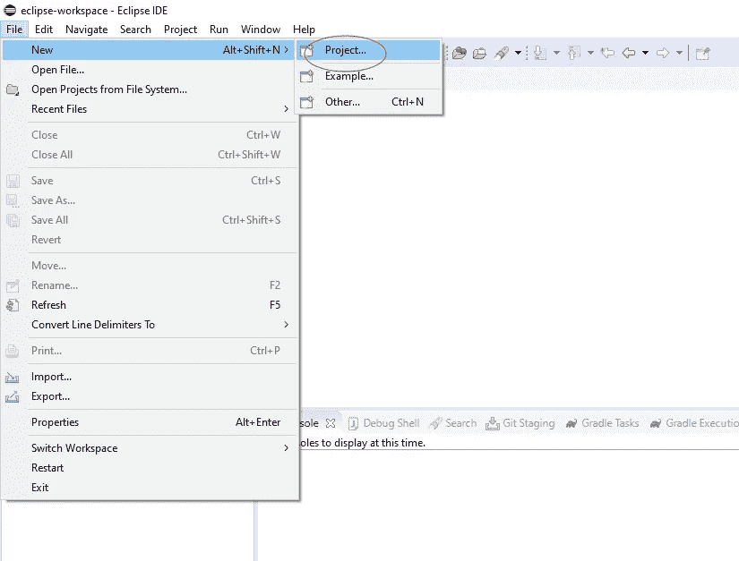

下一步是选择项目类型:选择 Gradle 项目:

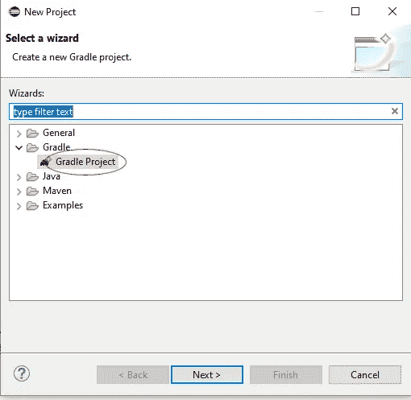

将新项目的名称设置为“callSmartContract ”,然后单击 finish 按钮。等待 Eclipse 构建项目文件结构。现在我们要创建一个主类，这样我们就可以运行和测试这个项目了。右键单击项目名称 callSmartContract 并选择 New->Class:

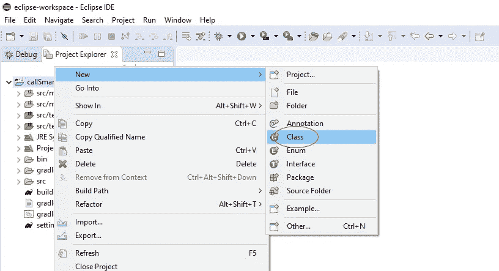

然后，指定“Main”作为新类的名称，并确保选中“public void static Main(String args[])”创建框。然后点击完成按钮:

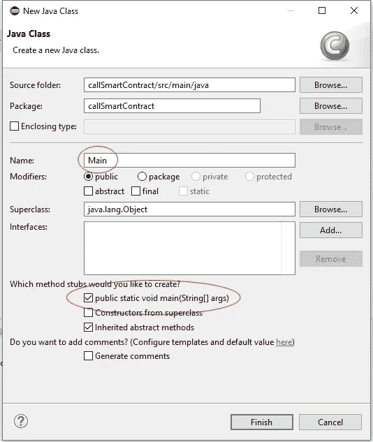

您会注意到 Main 类已经创建。右键单击主类并选择 Run as-> Java Application。这只是为了配置从现在起当我们单击播放按钮时项目如何运行:

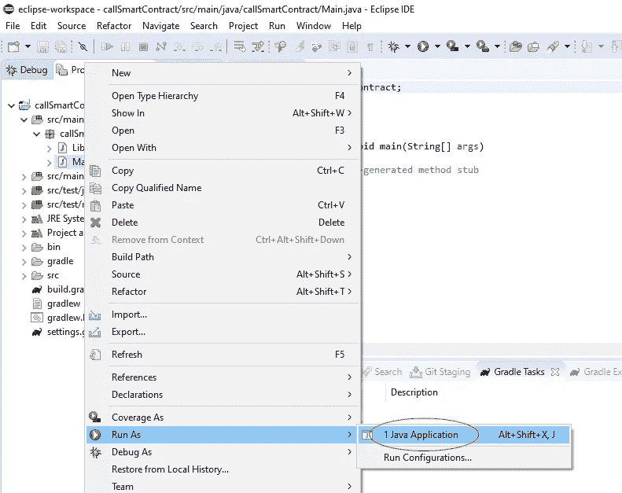

在控制台中，您将看到项目成功运行，但是，当然，还没有发生任何事情。因此，您将看到消息“终止”:

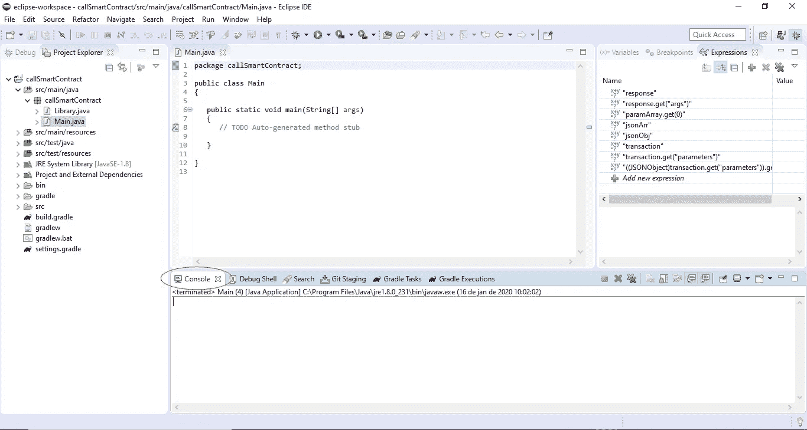

现在我们将添加 TezosJ 库 JAR 文件。转到 [Tezos。Rio github 存储库](https://github.com/TezosRio/TezosJ_plainJava)和下载文件[tezosj-SDK-plain-Java-1 . 1 . 0 . jar](https://github.com/TezosRio/TezosJ_plainJava/blob/master/tezosj-sdk-plain-java-1.1.0.jar)

在文件浏览器中，复制 tezosj-SDK-plain-Java-1 . 1 . 0 . jar 文件(CTRL+C)。

回到 Eclipse，点击项目名称，用 CTRL+V 粘贴。

该文件将显示为添加到项目结构中:

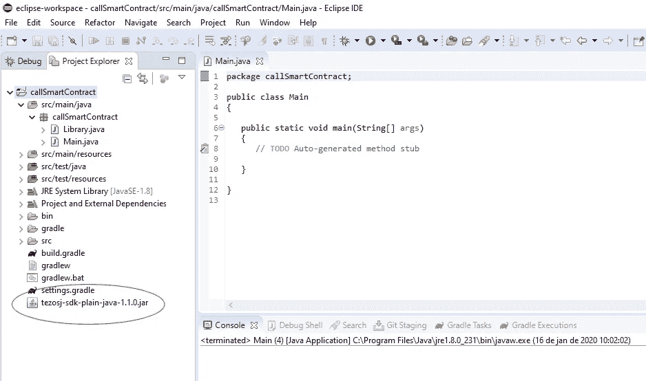

下一步是将 JAR 添加到项目的构建路径中。在项目浏览器中右键单击库文件，然后选择选项“构建路径”->“添加到构建路径”(或“构建路径”->“配置构建路径”):

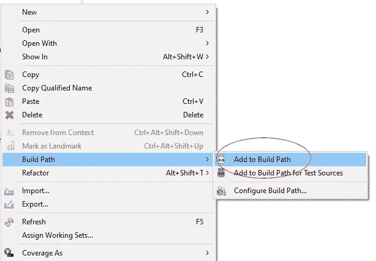

选择库文件，然后单击“应用并关闭”按钮:

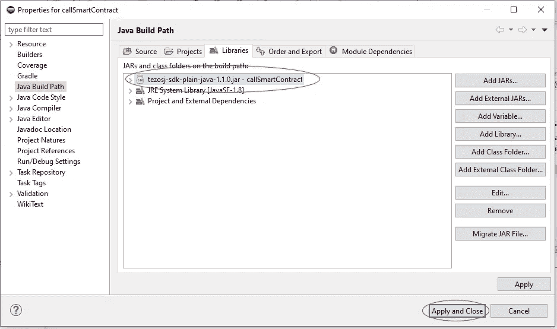

现在我们已经准备好了一切，让我们首先制作一个 Tezos 钱包:

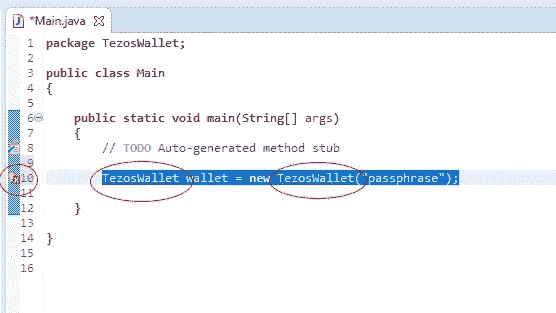

上面(左边)的红色“X”提醒我们需要导入这些类，以便我们的代码能够理解 TezosWallet 是什么:

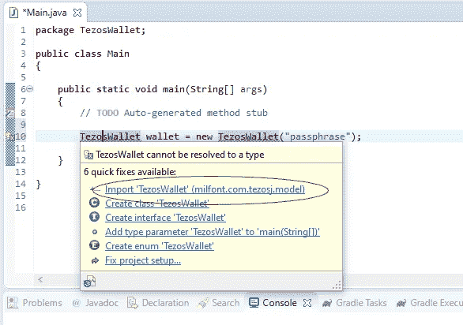

现在添加一些控制台输出来检查我们的钱包是否创建成功。我们将打印一些关于它的信息:钱包的公钥哈希(Tezos 地址)，它的助记词和当前余额。添加 System.out.println 命令后，运行该项目，您将得到类似这样的结果(检查控制台):

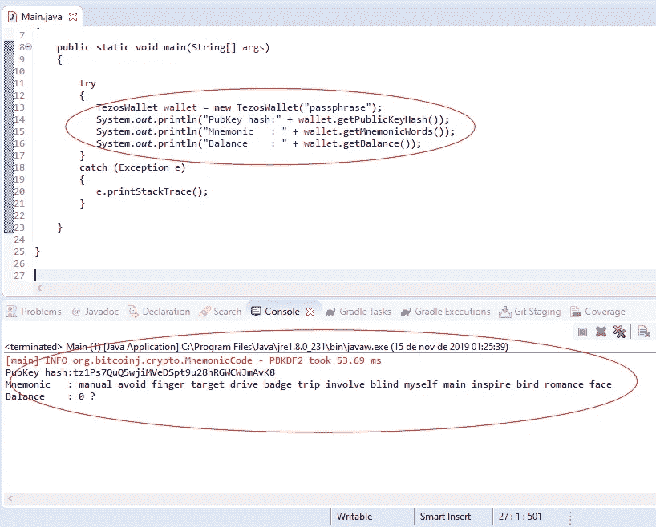

好吧！我们有实用的 Tezos 钱包。现在，我们能够致电客户 Tezos 智能合同。

## 关于合同的一点点

我们将要使用的*客户*智能合约是使用 [SmartPy.io](https://smartpy.io/) 在线 IDE 在 Tezos 区块链测试网上创建和部署的。检查下面的合同源代码:

```
# Imports the SmartPy library.
import smartpy as sp# Defines the Customer class and its constructor.
class Customer(sp.Contract):
    def __init__(self):
        self.init(customers = sp.map())

    # Defines the addCustomer entry point.
    [@sp](http://twitter.com/sp).entry_point
    def addCustomer(self, params):
        # Verifies if mandatory fields have values. 
        sp.verify(params.id != "")
        sp.verify(params.name != "")
        sp.verify(params.phoneNumber > 0) # Declare the parameter types.
        sp.set_type(params.id, sp.TString)
        sp.set_type(params.name, sp.TString)
        sp.set_type(params.phoneNumber, sp.TNat)
        sp.set_type(params.balance, sp.TMutez)

        # Defines a customer record, so we can add to a Map.
        customer = sp.record(name=params.name, phoneNumber=params.phoneNumber, balance=params.balance)

        # Adds the new customer record to a Map (that will reside in the contract's storage).
        self.data.customers[params.id] = customer # Defines the removeCustomer entry point.
    [@sp](http://twitter.com/sp).entry_point
    def removeCustomer(self, params):
        # Verifies if mandatory fields have values. 
        sp.verify(params.id != "") # Declare the parameter types.
        sp.set_type(params.id, sp.TString)
        # Remove the customer from the Map.
        del self.data.customers[params.id] # Defines the updateBalance entry point.
    [@sp](http://twitter.com/sp).entry_point
    def updateBalance(self, params):
        # Verifies if mandatory fields have values. 
        sp.verify(params.id != "") # Declare the parameter types.
        sp.set_type(params.id, sp.TString)
        sp.set_type(params.amount, sp.TMutez)
        # Updates the balance.
        self.data.customers[params.id].balance = params.amount

    # Defines the transfer entry point.
    [@sp](http://twitter.com/sp).entry_point
    def transfer(self, params):
        # Verifies if mandatory fields have values. 
        sp.verify(params.idFrom != "")
        sp.verify(params.idTo != "")
        sp.verify(params.amount > sp.mutez(0) )
        # Verifies if customer has enough funds to be transfered.
        sp.verify(params.amount <= self.data.customers[params.idFrom].balance ) # Declare the parameter types.
        sp.set_type(params.idFrom, sp.TString)
        sp.set_type(params.idTo, sp.TString)
        sp.set_type(params.amount, sp.TMutez)
        # Updates the balance.
        self.data.customers[params.idFrom].balance = self.data.customers[params.idFrom].balance - params.amount
        self.data.customers[params.idTo].balance = self.data.customers[params.idTo].balance + params.amount# Creates the test scenario, to simulate a contract call in SmartPy.io IDE.
    [@sp](http://twitter.com/sp).add_test(name = "Customers")
    def test():
        # Instantiate a contract inherited from the Customer Class.
        myCustomersContract = Customer()

        # Defines a test scenario.
        scenario = sp.test_scenario()

        # Adds the contract to the test scenario.
        scenario += myCustomersContract

        # Inserts the customers, calling the contract's addCustomer entry point.
        # This customers will reside in the contract's storage.
        scenario += myCustomersContract.addCustomer(id="123456",name="Daniel",phoneNumber=99984537,balance=sp.mutez(0))
        scenario += myCustomersContract.addCustomer(id="345678",name="Eleonor",phoneNumber=85375677,balance=sp.mutez(0))
        scenario += myCustomersContract.addCustomer(id="678905",name="Fabian",phoneNumber=78655567,balance=sp.mutez(0)) # Removes a customer through its id number.
        scenario += myCustomersContract.removeCustomer(id="678905")

        # Updates a customer's balance.
        scenario += myCustomersContract.updateBalance(id="123456",amount=sp.mutez(10000000)) # Transfers funds from a customer to another.
        scenario += myCustomersContract.transfer(idFrom="123456", idTo="345678", amount=sp.mutez(5000000))
```

这里显示的 SmartPy 契约的源代码仅用于说明目的，我们不需要再次编译和部署它。它已经存在于 Tezos 区块链测试网上，地址如下:

kt 18 PK 2 mgrntz qytafue 1 SWP 2 ubj 75 eyt 86t

## 开始！

现在我们有了从 Java 调用契约所需的所有东西。首先，我们将使用契约的“addCustomer”入口点添加一个新客户。让我们考虑客户的名字“Bob”，他的 id 是“98765”，电话号码是“99876787”。鲍勃将有一个 10ꜩ (10.000.000 穆特兹)的余额。所以我们的契约调用命令将是这样的:

```
JSONObject jsonObject = wallet.callContractEntryPoint(wallet.getPublicKeyHash(), "KT18pK2MGrnTZqyTafUe1sWp2ubJ75eYT86t", amount, fee, "", "", "addCustomer", new String[]{"1000000", "98765","Bob","99876787"});
```

首先，我们需要通知 TezosJ 我们将使用 Tezos testnet(合同实际发布的地方)。我们还需要设置交易金额和费用。这是通过下面的 Java 代码完成的:

```
 // Change wallet provider to use testnet.
 wallet.setProvider(“https://tezos-dev.cryptonomic-infra.tech"); 

 // Sets amount and fee for the transaction.
 BigDecimal amount = new BigDecimal(“0”);
 BigDecimal fee = new BigDecimal(“0.1”);

 // Calls the contract entry point.
 JSONObject jsonObject = wallet.callContractEntryPoint(wallet.getPublicKeyHash(), “KT18pK2MGrnTZqyTafUe1sWp2ubJ75eYT86t”, amount, fee, “”, “”, “addCustomer”, new String[]{“1000000”, “98765”,”Bob”,”99876787"}); // Prints the operation hash in the console.
 String opHash = (String) jsonObject.get("result");
 System.out.println("OpHash : " + opHash);
```

复制代码并粘贴到我们的主类中，这样它就像这样:

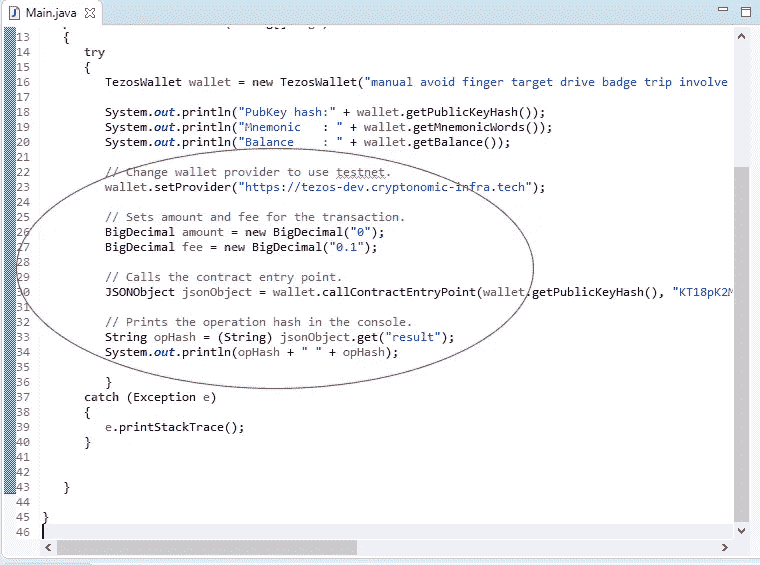

请注意，要让这个电话起作用，您首先需要提供资金并公开您的 Tezos 帐户。否则，您可能会得到如下错误:

```
There were errors: kind ‘branch’ id ‘proto.005-PsBabyM1.implicit.empty_implicit_contract’
```

跑项目！如果一切都设置好了，您将得到控制台中显示的操作散列结果:

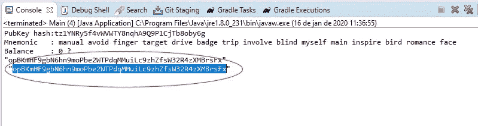

这表明我们已经成功地向 Tezos testnet 区块链发送了一个 callContract 事务(因为我们已经获得了一个操作散列)。现在，让我们检查交易是否被 Tezos 区块链接受。我们将使用 TezBlock explorer 来完成这项工作。在你首选的浏览器中打开 [https://tezblock.io](https://tezblock.io/) ，首先在屏幕的右上角，从“mainnet”改为“baly lonnet”(testnet 也是一样)。然后，将我们从 java 执行中获得的操作散列粘贴到搜索框中，并点击“enter”键:

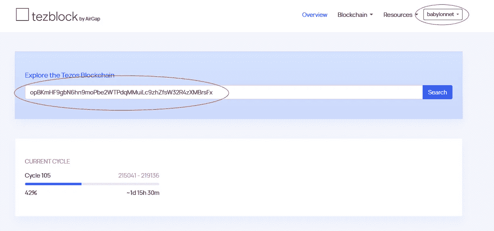

这将显示我们的合同调用的结果，以及操作的细节。通过点击“显示”，您将能够检查从我们的 Java 代码传递到 Tezos 区块链的参数:

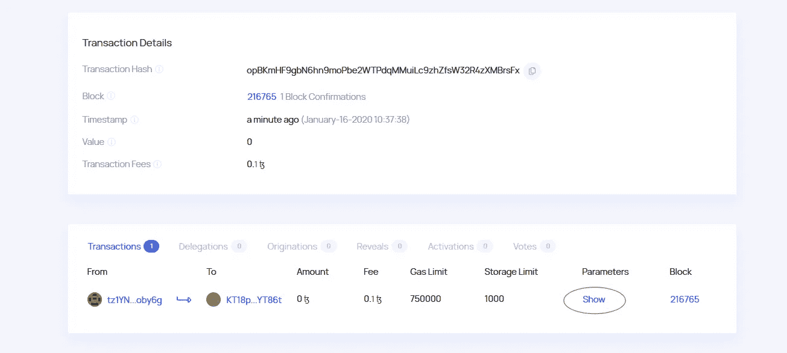

参数:

```
Left (Left (Left (Pair (Pair (Pair 1000000 "98765") "Bob") 99876787)))
```

这是我们从 Java 应用程序调用生成的 Micheline 格式的参数。Tezos 智能合约在部署时是用 Michelson 语言编写的，它们希望输入参数以这种格式发送。使用 TezosJ 库的一个好处是，它可以动态地生成 Micheline 格式的参数，您不必担心它是如何完成的。

## 大结局

到目前为止，我们可以确保契约被正确调用，参数被传递，操作被 Tezos 区块链接受。现在，我们要做的最后一件事是检查新客户 Bob 是否被插入到合同的存储中。为此，我们将使用 better-call.dev 工具。只要打开你的浏览器，指向 [https://better-call.dev](https://better-call.dev) 。在搜索字段中输入我们客户合同的地址(kt 18 PK 2 mgrntz qytafue 1 SWP 2 ubj 75 eyt 86t)，将网络更改为 babylonnet，然后按 Enter:

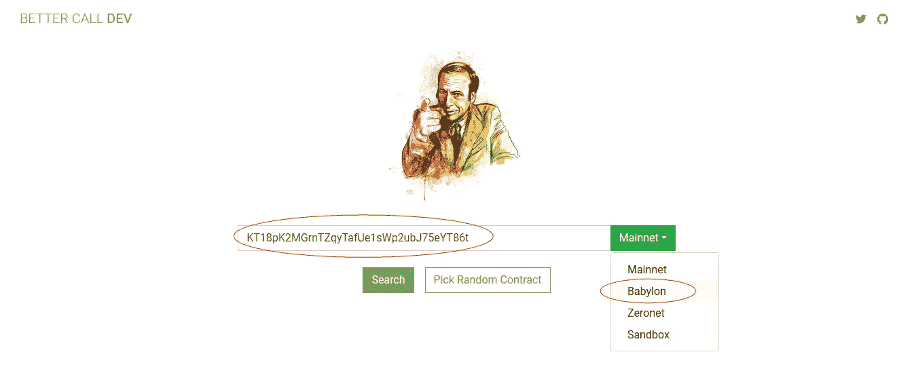

结果将是发送到协定地址的所有操作的列表，以及协定存储的当前状态。在这里，您将检查您从 Java 传递的参数，以及它们是否正确地保存在存储器中:

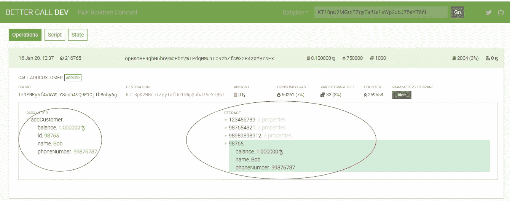

## 更进一步

你可以试试合同的其他入口点，比如 removeCustomer、transfer 和 updateBalance。记住总是检查每个入口点需要的参数数量。

当运行代码时，如果您得到一个 Java 错误，这意味着事务没有被发送。在这种情况下，您必须重新检查您的参数、订单、您的帐户余额、费用以及您正在哪个网络(mainnet 或 testnet)中工作。此外，检查您的 gasLimit 和 storageLimit 参数。

另一方面，如果您得到了一个操作散列，这意味着您的 Java 应用程序已经成功地将事务发送到了区块链。但是，你必须检查可能的区块链相关的错误。在这种情况下，当您使用 TezBlock explorer 检查时，它将显示带有鲑鱼色背景的错误，这意味着在区块链上下文中发生了错误(如传递的参数数量错误、参数 Micheline 格式错误，甚至是合同未接受的条件—例如:您调用了转账入口点，但“from”客户没有足够的资金来发送)。

## 结论

对于开发者来说，使用区块链智能合约从未如此简单。尤其是 Tezos，它提供了许多优秀的工具和大量的计算机语言库，方便了与大多数系统的集成。TezosJ 库通过提供易于使用的 callContractEntryPoint 方法进行创新，该方法可以动态创建 Micheline 格式的参数。它拥有 Java 开发人员在与区块链无缝交互的应用程序开发中茁壮成长所需的所有工具。

## 下载完整的代码

您可以[在这里](http://tezos.rio/download/callSmartContract_project.zip)下载本文中展示的完整 Eclipse 项目。