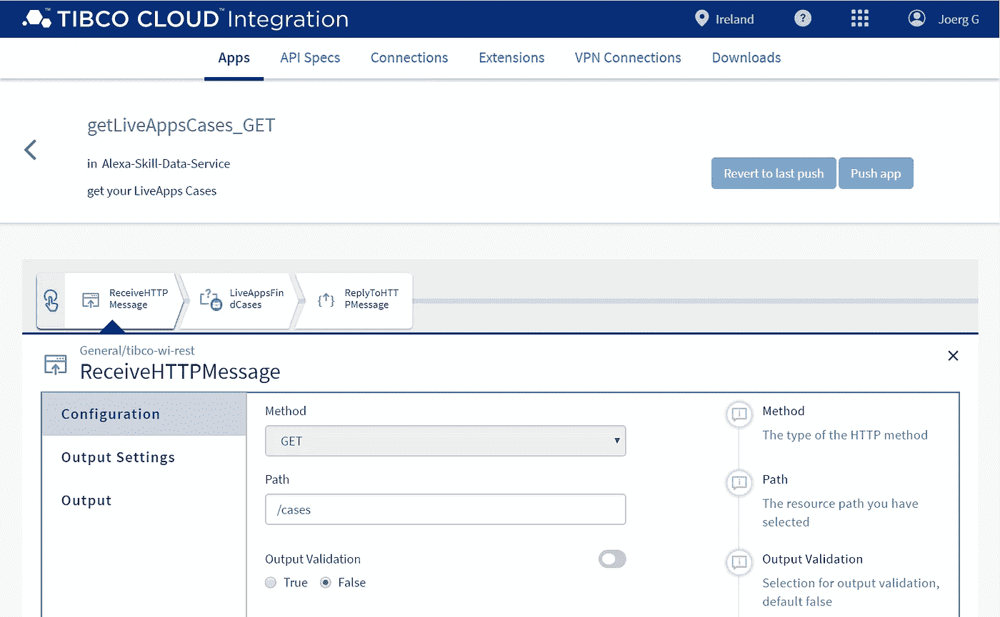

# 从 AWS Lambda 调用外部 REST 服务？(第一部分)

> 原文：<https://levelup.gitconnected.com/calling-external-rest-service-from-aws-lambda-1890a521a3f1>

## 小巧、简单，并且在包装方面没有任何开销。

这很简单，你只需要知道怎么做。下面的例子没有任何额外的 Lambda 打包的 JavaScript 资源，只使用了一个“index.js”。

**不需要 *request.js* 或者深入 *Node.js HTTP* 。**

> 诀窍是只使用已经可用的 AWS SDK JavaScript 核心！

AWS Lambda 的功能就像云中的一艘独立小船

# 内容

你将从这篇文章中学到什么

*   简单的 GET
*   使用 URL 参数获取
*   封装尺寸的优势
*   二手样品剩余服务
*   AWS SDK 文档
*   TIBCO 实验室
*   接下来是什么，…和[第二部](https://joerg-go.medium.com/calling-external-rest-service-from-aws-lambda-part-2-c83f87b1e88a)

# 简单的 GET

下面是一个定制的 AWS 服务描述符示例

下面是如何调用外部定制服务

> 简单，还是？

# 使用 URL 参数获取

这里是另一个带有 ID 参数的片段示例

# 封装尺寸的优势

任何 Lambda 函数都会变得非常小，结构化，并且可以快速部署。但这不是唯一的好处，您仍然可以使用所有在线 Lambda 编辑器和测试功能，当您部署一个巨大的 JavaScript 包时，这就变得不可能了。

相同实现的大小比较:

*   **Package 1**
    …使用‘request . js’和‘http-basic’等。
    大小:~ 1.5 兆字节
*   **包 2**
    …使用 AWS SDK 核心功能
    大小:~9 KB

# 二手样品剩余服务

所使用的 RESTfull 服务是通过使用 TIBCO 云集成(TCI) Flogo 图形化实现的，通过标准连接器连接到 TIBCO 云 LiveApps，以检索现有的案例实例并将其返回给 AWS Lambda。[注册 30 天免费试用 TIBCO 云集成](https://account.cloud.tibco.com/signup/tci)

TIBCO 云集成 Flogo 中的定制服务实现。

该服务可以是公共服务，也可以由像 TIBCO Mashery 这样的 API 网关管理。

# AWS SDK 文档

这里的功能没有很好的记录，但是源代码是公开的，所以你可以很快地看到 Amazon 是如何使用他们自己的功能的，并从中学习。

这里有一些不错的 GitHub 示例链接，你可以作为快速参考…

*   [AWS-SDK-js](https://github.com/aws/aws-sdk-js)/test/foo-service . fixture . js
*   AWS-SDK-js/test/fixture/protocol/input/rest-JSON . JSON
*   或者甚至…
*   AWS-SDK-js/[lib](https://github.com/aws/aws-sdk-js/tree/cc29728c1c4178969ebabe3bbe6b6f3159436394/lib)/service . js
*   AWS-SDK-js/[lib](https://github.com/aws/aws-sdk-js/tree/cc29728c1c4178969ebabe3bbe6b6f3159436394/lib)/request . js
*   AWS-SDK-js/[lib](https://github.com/aws/aws-sdk-js/tree/cc29728c1c4178969ebabe3bbe6b6f3159436394/lib)/[model](https://github.com/aws/aws-sdk-js/tree/cc29728c1c4178969ebabe3bbe6b6f3159436394/lib/model)/shape . js
*   aws-sdk-js/ [lib](https://github.com/aws/aws-sdk-js/tree/cc29728c1c4178969ebabe3bbe6b6f3159436394/lib) / [协议](https://github.com/aws/aws-sdk-js/tree/cc29728c1c4178969ebabe3bbe6b6f3159436394/lib/protocol) /rest_json.js

> 这里只使用了一些路径，因为版本可能会更新。

# TIBCO 实验室

本文是在 TIBCO LABS 的倡议下撰写的，完整的可重用源代码可以在公共的 [TIBCO LABS GitHub 资源库](https://github.com/TIBCOSoftware/TIBCO-LABS/tree/master/src/Calling%20external%20REST%20Service%20from%20AWS%20Lambda%20(Part%C2%A01))
下找到，包括 BSD 3 条款许可证。

# 下一步是什么

点击此处查看[后续文章第 2 部分！](https://joerg-go.medium.com/calling-external-rest-service-from-aws-lambda-part-2-c83f87b1e88a)

> 感谢阅读和掌声！