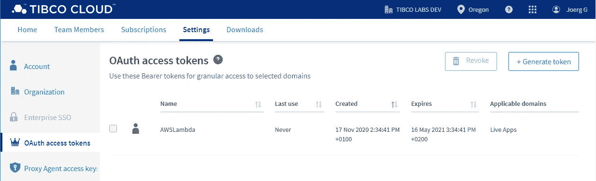

# 从 AWS Lambda 调用外部 REST 服务？(第二部分)

> 原文：<https://levelup.gitconnected.com/calling-external-rest-service-from-aws-lambda-part-2-c83f87b1e88a>

## 小巧、简单，并且在包装方面没有任何开销。

在第一部分之后的[，这里现在是第二部分的一部分。](/calling-external-rest-service-from-aws-lambda-1890a521a3f1)

> **还是不用 *request.js、* Axios** 、**或者深入 *Node.js HTTP。***


照片由[jrg Grote](https://unsplash.com/@jgrotego?utm_source=medium&utm_medium=referral)在 [Unsplash](https://unsplash.com?utm_source=medium&utm_medium=referral) 上拍摄

在这篇文章中，我想给一些更多的好处和提示的概述

*   OAuth 承载令牌的使用
*   REST 方法和 Uri
*   数据类型
*   URL 参数的用法
*   车身有效载荷
*   请求验证和使用“形状”
*   响应验证，以及如何避免问题
*   动态更改端点

# OAuth 承载令牌的使用

作为示例，我在这里使用 TIBCO 云服务在案例管理系统中创建新的 TIBCO Cloud Live Apps 案例实例。

如您所见，该服务需要使用不记名令牌来针对 TIBCO 云执行请求。

令牌可以在以下位置生成:



TIBCO 云—设置— OAuth 访问令牌生成

> **注意:** [注册 30 天 TIBCO 云集成免费试用](https://account.cloud.tibco.com/signup/tci)

在 AWS Lambda 中，可以使用纯 AWS SDK 核心功能调用 API，如下所示:

该示例流畅地展示了如何使用 OAuth、REST 类型、URI 定义、输入接口处理(包括验证),以及如何处理响应数据以返回新创建的 Case instance id“Case reference”

# REST 方法和 Uri

在示例中，您可以在 apiConfig 部分中找到这里指定的 REST 操作方法，后面直接跟有 URI

```
http: {
         method: 'POST',
         requestUri: '/process/v1/processes'
}
```

AWS SDK 支持所有类型的方法，例如获取、发布、修补、上传、删除等。

# 数据类型

要在操作定义中使用的受支持数据类型的列表

```
'string'
'integer'
'float'
'boolean'
'timestamp'
'structure'
'list'
'map'
'base64'
'binary'
```

# URI 参数的使用

URI 参数可以这样定义，在成员下，位置属性定义参数必须在 URI 中替换。

```
http: {
        method: 'GET',
        requestUri: '/item/{id}'
}
```

输入成员部分

```
members: {
       'Id': {
       // all kinds of validators are available
       type: 'string',
       // include it in the call URI
       location: 'uri',
       // this is the name of the placeholder in the URI
       locationName: 'Id'
}
```

# 车身有效载荷

要将 JSON 有效负载作为请求体发送，可以定义一个输入有效负载

```
payload: 'body',
```

然后，主体可以被定义为例如具有一些成员的结构

```
'body': {
         type: 'structure',
         required: [ 'id', 'fname', 'lname' ],
         members: {
                    'id': {
                       type: 'integer'
                    },
                    'fname': {},
                    'lname': {}
                  }
         }
```

# 请求验证和使用“形状”

在发送请求之前，所有请求都需要验证必填字段和数据类型。

如果你有一个重复出现的数据结构，形状的概念是非常有用的，你需要为请求定义复杂的结构。

```
apiConfig: {
        metadata: {
            protocol: 'rest-json' // API is JSON-based
        },
        operations: {
            complexPost: {
                http: {
                    method: 'POST',
                    requestUri: '/v1/complexPost'
                },
                input: {
                    "shape": "complexPostRequest"
                }
            }
        },
        'shapes': {
            'complexPostRequest': {
                type: 'structure',
                required: [ 'auth' ],
                payload: 'body',
                members: {
                   ...
```

形状可以作为输入的一部分在操作中使用，形状甚至可以在其他形状中使用。比如这里的“形状”:“收件人”

```
members: {
       'recipients': { 
             type: 'list', member: { 'shape': 'recipient'} 
    } 
   }
  }
 }
}, // <- back main shapes level
'recipient': {
     "type": "string"
}
```

# 响应验证，以及如何避免问题

甚至可以使用响应验证，但这意味着甚至需要为每个操作定义响应类型。

在某些情况下，您可能希望只获得来自 REST 服务的数据的子集，因此您可以通过使用。

```
const service = new AWS.Service({ // the API base URL
    endpoint: <url>, // don't parse all API responses
    convertResponseTypes: false,
```

注意:这也有助于避免版本问题，因为您可能只依赖底层服务的基本细节。

## 返回 none JSON 的 REST 服务

有些服务不返回有效的 JSON，比如只返回一个 id，但是 AWS-SDK 总是试图返回一个数据对象。

这是一个从响应体返回有效 JSON 的解决方法。

的”。on('success ')”变通方法并返回“httpResponse.body”就完美地完成了这个任务！

# 动态更改端点

有时需要调整端点 URL，因为需要选择不同的区域。在调用服务之前，只需动态地重新配置 AWS SDK 服务端点对象就可以做到这一点。

```
var region="eu.";service.endpoint.host=[region+](https://liveapps.cloud.tibco.com/)"example.com";
service.endpoint.hostname=[region+](https://liveapps.cloud.tibco.com/)"example.com";
service.endpoint.href="[https://"+region+"example.com/](https://liveapps.cloud.tibco.com/)";

service.getSomething({
...
```

# TIBCO 实验室

本文是在 TIBCO 实验室的倡议下撰写的，完整的可重用源代码可以在公共 [TIBCO 实验室 GitHub 资源库](https://github.com/TIBCOSoftware/TIBCO-LABS/tree/master/src/Calling%20external%20REST%20Service%20from%20AWS%20Lambda%20(Part%C2%A02))
下找到，包括 BSD 3 条款许可证。

# 下一步是什么

这只是一个后续，目前正在制作更多的内容
——敬请期待！

> *感谢阅读和掌声！*