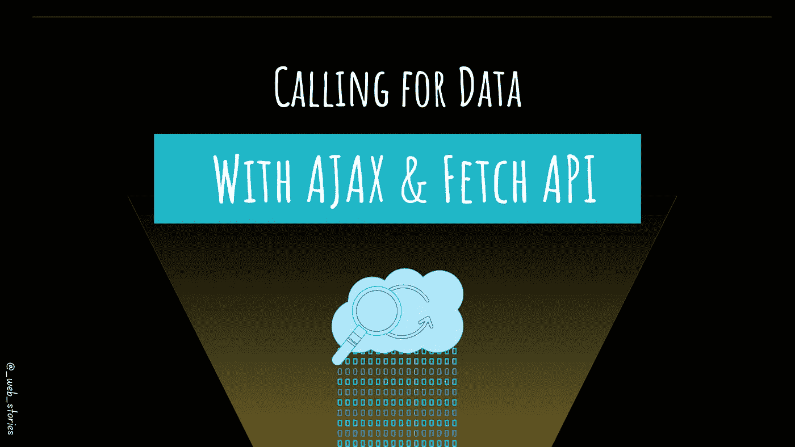

# 正在调用数据…

> 原文：<https://levelup.gitconnected.com/calling-for-data-d9523c7c62e2>

## Fetch 和 AJAX 是用来做什么的？

## 你好👋

网络带来的最好的东西是它的动态和显示数据的能力。像 AJAX 和 Fetch 这样的工具使得获取数据变得轻而易举。

我在以前的一篇文章中已经谈到了 AJAX，所以在本文中我就不再赘述它的细节了。

# AJAX(异步 JavaScript 和 XML)

AJAX 允许网页异步更新。当您只需要更新 web 页面的一部分而不需要刷新整个页面时，可以使用 AJAX。

## 以下是您需要了解的关于 AJAX 的内容:

## 要了解更多信息:

 [## 让我们来理解 AJAX

### 什么是 AJAX，为什么使用它？

javascript.plainenglish.io](https://javascript.plainenglish.io/understanding-ajax-fc9144ef959a) 

# 现在让我们获取 API

`***fetch***` 是一个 JS web API。这是您的工具，通过 HTTP(S)请求调用服务器并从中获取数据。不像 AJAX，不需要`***XMLHttpRequest***`与`***fetch***` API。

`***fetch***` 常用于检索数据。你肯定会在代码中看到它，或者在你的代码中使用它。

## →它是如何工作的？

使用服务器数据 URL 或数据文件路径调用 API，获取结果或错误，并处理响应。

你还记得我们关于[承诺](/how-javascript-promises-you-e0039fe341ba?source=your_stories_page-------------------------------------)的文章吗？是的，你右边的`fetch`是一个承诺，所以我们可以在它上面调用`then`方法。

既然是承诺，我们也可以使用我们在 [async/await 文章](https://medium.com/geekculture/making-async-code-looks-like-sync-code-in-js-b0f5133e14ae?source=your_stories_page-------------------------------------)中学到的`asynch/await`。

## →现实生活的例子

在这个例子中，我使用 [DummyJSON](https://dummyjson.com/) 来模拟一个回复数据的服务器。

杜米森

**结果:**

恭喜你，你已经学会了 AJAX 和 Fetch😉

今天就到这里，看阿雅🙋

如果您有任何问题或反馈，请点击评论或通过 LinkedIn 联系我— **我洗耳恭听！**

[**想请我喝杯咖啡吗？☕️**](https://www.buymeacoffee.com/fatimaamzil)

> 让我们为 2022 年打造一个更好的‘我们’！

## 了解有关 2022 年网络快车计划的更多信息:

I- [网络常识](https://medium.com/geekculture/2022-web-program-chapter-n-1-is-done-499fb0707220?source=your_stories_page----------------------------------------)

[II-网页框架:HTML](https://famzil.medium.com/your-html-essentials-69d9b2349355?source=your_stories_page----------------------------------------)

[III-网页样式:CSS](https://medium.com/geekculture/recap-of-the-css-chapter-ae388d51e564?source=your_stories_page----------------------------------------)

网络互动:JavaScript

## 虚拟物料清单和 DOM

*   [什么是 BOM 和 DOM](https://medium.com/geekculture/what-are-the-dom-and-bom-9fb1a3ed736f?source=your_stories_page-------------------------------------) ？
*   [元素选择器](https://javascript.plainenglish.io/selecting-dom-elements-e33fb235e81d?source=your_stories_page-------------------------------------)
*   [操作 DOM](https://famzil.medium.com/dom-manipulation-13959986300?source=your_stories_page-------------------------------------)

> **Ajax &获取**

*   事件冒泡和委托
*   事件循环
*   阴影 DOM
*   蜜蜂

 [## 2022 网络计划启动！

### 改变来自心态和习惯

medium.com](https://medium.com/geekculture/2022-web-program-is-launched-f38a3280af1a) 

与想成为 web 开发人员的人分享该程序！这将有助于保持进步，并在旅途中互相帮助。

> 如果你喜欢我的文章， [**订阅**](https://famzil.medium.com/subscribe) 获取我的最新。如果你自己喜欢体验媒介，可以考虑通过[**注册会员**](https://famzil.medium.com/membership) 来支持我和其他成千上万的作家。它只需要每月 5 美元，它支持我们，作家，你也有机会用你的作品赚钱。当然，你可以随时取消会员资格。通过注册[这个链接](https://famzil.medium.com/membership)，你将直接用你的一部分费用来支持我，它不会花费你更多。如果你这样做了，万分感谢！

让我们在 [**上**取得联系****](https://medium.com/@famzil/)**[**Linkedin**](https://www.linkedin.com/in/fatima-amzil-9031ba95/)**[**脸书**](https://www.facebook.com/The-Front-End-World)**[**insta gram**](https://www.instagram.com/the_frontend_world/)**[**YouTube**](https://www.youtube.com/channel/UCaxr-f9r6P1u7Y7SKFHi12g)**或**********

****** [## 通过我的推荐链接——FAM 加入 Medium

### 作为一个媒体会员，你的会员费的一部分会给你阅读的作家，你可以完全接触到每一个故事…

famzil.medium.com](https://famzil.medium.com/membership)******