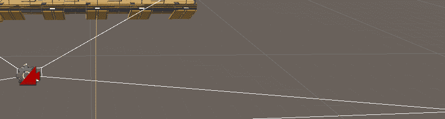
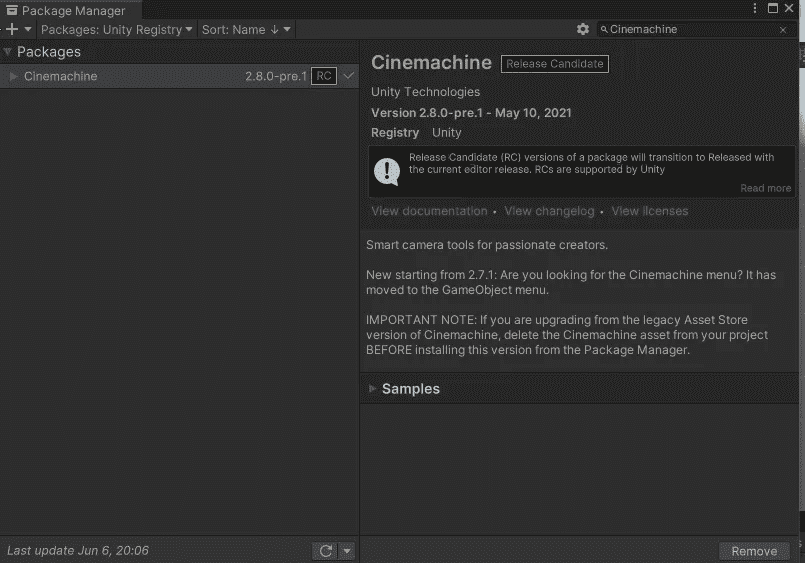
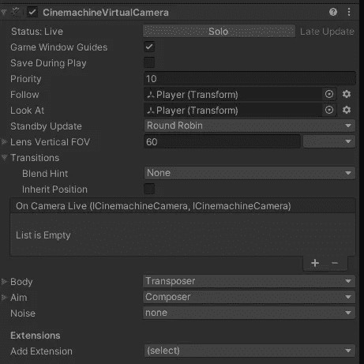

# 统一摄像机跟踪(Cinemachine)

> 原文：<https://levelup.gitconnected.com/camera-follow-in-unity-cinemachine-15b05a84e716>

//别管脚本了，让我们用简单的方法来做吧！

运动中的摄像机

我们都读过大量关于“如何让相机跟随玩家”的教程最常见的选项是 A)将**摄像机**连接到**玩家**上，B)编写一个脚本来处理基于玩家的摄像机移动。虽然这两种方法都是完成这项任务的完美方式，但我将使用 Cinemachine 来考虑第三种选择。

在以前的文章中，我使用 Cinemachine 虚拟摄像机来创建摄像机过渡和电影艺术。今天我将用一种更简单的方式来使用它。

首先，我们必须将 Cinemachine 软件包添加到引擎中。我们在 Unity 2021.2 中通过以下方式实现这一点:

1.  点击窗口
2.  单击包管理器
3.  将软件包更改为 Unity 注册表
4.  找到 Cinemachine —在 Unity 2021.2 中，这是版本 2.8.0-pre1 (RC)，您的版本可能会有所不同。
5.  单击安装

随着 Cinemachine 的安装，我们已经准备好将我们的虚拟摄像机添加到场景中，它将处理我们所有的摄像机逻辑。同样，这在 Unity 2021.2 中可能与你正在使用的版本略有不同，因为 Cinemachine 菜单已经移动到 GameObjects 菜单。**点击游戏对象> Cinemachine >添加虚拟摄像头。** Unity 2021.2 方便地为我们的主摄像头添加了一个 **Cinemachine Brain** ，但在该程序的早期版本中，您可能需要手动添加该组件。

如果我们单击虚拟摄像机并查看检查器，我们会看到以下选项:

我们关心的前两个是**跟**和**看**。我们在这两个区域设置了玩家变换，如果我们玩游戏，镜头会自然地跟随玩家。然而，你可能会注意到有一些奇怪的行为。当我们面对另一个方向时，相机会翻转，如果你这样设计你的游戏，这可能会很酷，但对我们来说，这不是我们想要的。第二，你可能会注意到，当我们移动时，相机会向左或向右浮动，这也不是我们想要的。幸运的是我们有选择！

如果你展开身体和目标子菜单，你会看到过多的新选项供我们玩。我们可以通过将**主体>绑定模式**更改为**“分配时锁定目标”**来摆脱翻转相机。我们可以通过调整阻尼值来消除漂移效应。在 **Aim** 内部，我们可以摆弄一下摄像机的精确位置。

这就是全部了！几次点击，我们就有了一个完全可定制的跟随凸轮，而无需编写一行代码。