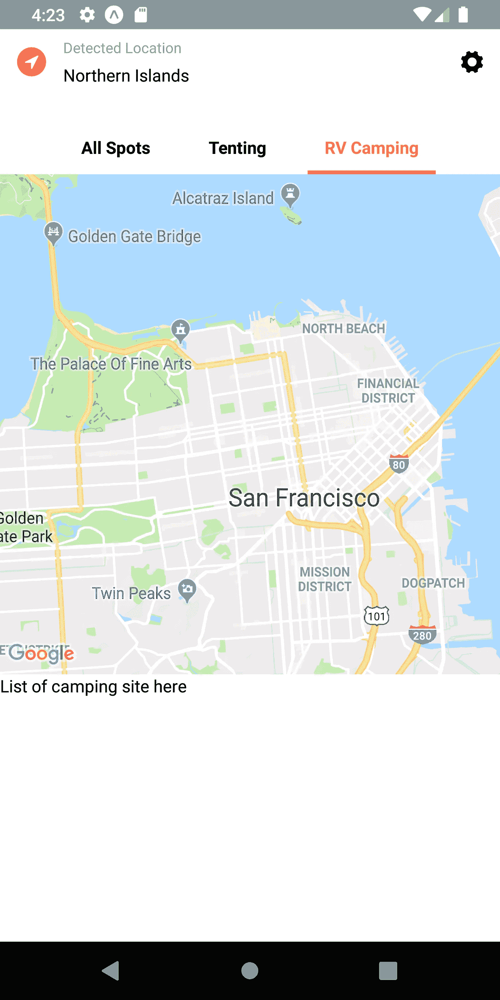
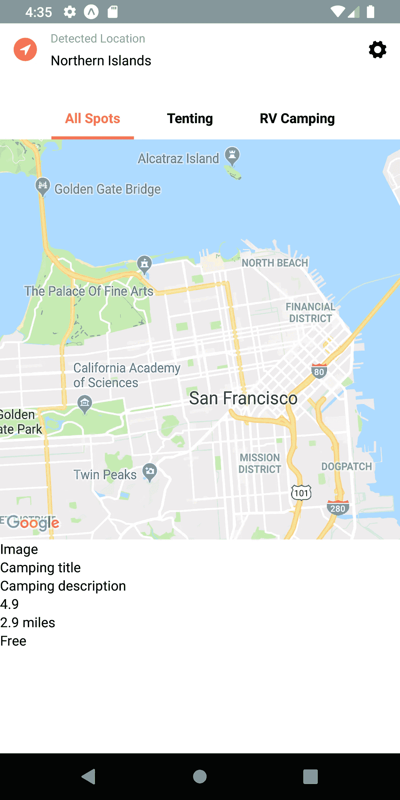
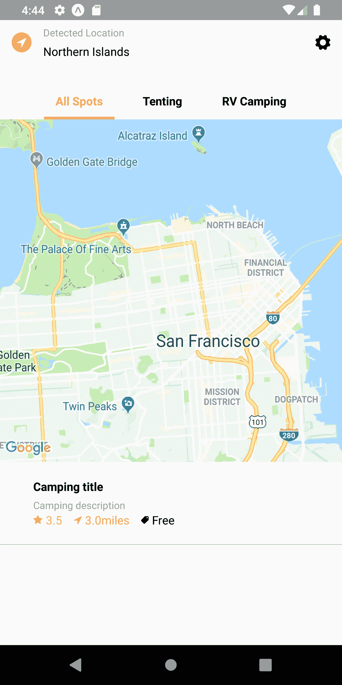
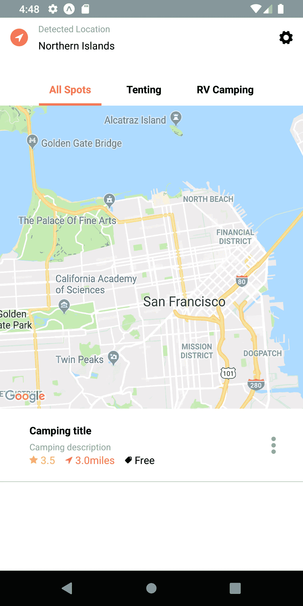
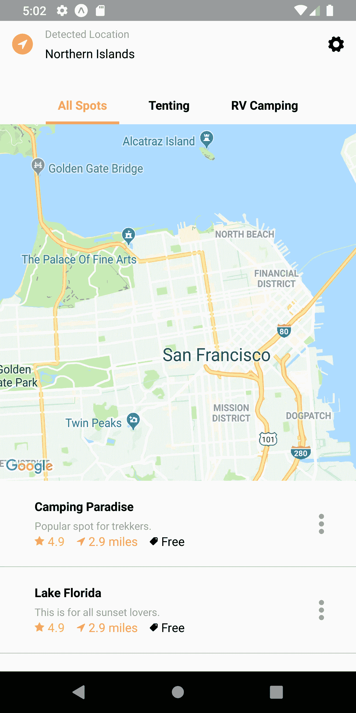
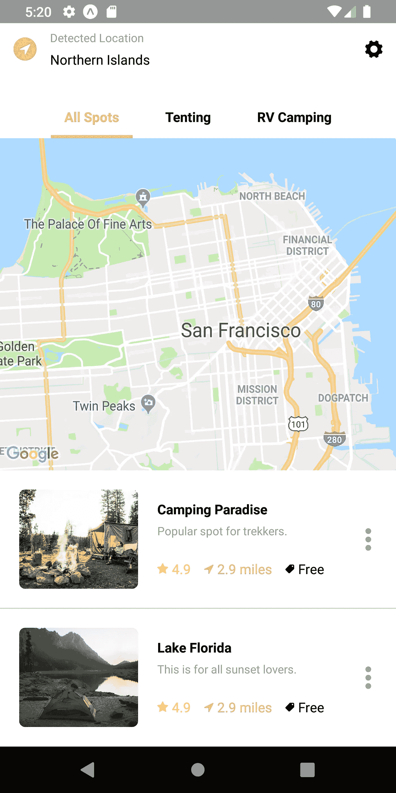

# 列表部分—露营点查找器应用程序 UI 克隆与 React 原生#2:

> 原文：<https://levelup.gitconnected.com/camping-spots-finder-app-ui-clone-with-react-native-2-list-section-bd29e6668d97>


本教程是我们使用 React Native 的露营点查找器应用程序 UI 克隆的第二部分。在上一部分中，我们成功地实现了地图视图部分以及自定义标题和标题选项卡。本教程是我们上一部分停止的同一教程的继续。建议浏览前面的部分，以便更好地理解和洞察整个项目。

[](https://kriss.io/camping-spots-finder-app-ui-clone-with-react-native-1-map-view-ui/) [## 露营景点查找应用程序 UI 克隆与反应原生#1:地图视图 UI - Kriss

### 露营景点查找应用程序 UI 克隆与反应原生#1:地图视图 UI 这个教程的灵感来自一个…

克里斯·艾奥](https://kriss.io/camping-spots-finder-app-ui-clone-with-react-native-1-map-view-ui/) 

本系列教程的灵感来自 [React native real estate 模板](https://www.instamobile.io/app-templates/real-estate-app-template-react-native/?ref=4094&campaign=gitconnect)，该模板使我们能够构建功能齐全、随时可部署的移动应用程序，任何人都可以使用它来构建自己的 React native 应用程序。这第二部分也是来自 Youtube 视频教程的编码实现和设计的延续，由 [React UI Kit](https://www.youtube.com/watch?v=ScaYmqX15WA&list=PLNRPou200YIeu4UllJkv8-Ca19Ld_eOay&index=14) 为 Camping Spots Finder 应用程序克隆。

在本教程系列的第二部分中，我们将实现我们在本教程的前一部分中分离的列表部分，并设置到设置屏幕的导航。但是首先，我们将对标题部分做一些简单的修改，以使它看起来干净和合适。然后，我们将开始实现列表部分，最后在末尾添加导航。

*那么，我们开始吧！*

## 对标题部分的简单更改

我们将对包括自定义标题和标题选项卡的标题部分进行一些简单的更改。在 Camping.js 文件的`render()`方法中，我们只打算将`renderMap()`和`renderList()`方法包含到`ScrollView`组件中。然后，我们将把父组件`View`更改为`SafeAreaView`组件，并将样式绑定到它。之后，我们将在`ScrollView`组件上包含`renderHeader()`方法，如下面的代码片段所示:

```
render(){
    return (
      <SafeAreaView style={styles.container}>
        {this.renderHeader()}
        <ScrollView style={styles.container}>
          {this.renderMap()}
          {this.renderList()}
        </ScrollView>
      </SafeAreaView>
    );
}
```

注意:我们还需要从 react-native 包中导入`SafeAreaView`组件。

我们添加了 SafeAreaView 作为父组件，因为它使我们能够在设备的安全区域边界内呈现内容。但是，我们需要注意的是，该功能仅适用于 iOS 平台。我们将不得不在 Android 平台中添加一些额外的样式，以实现与`SafeAreaView.`相同的输出

我们将用另一个父`View`组件包装`renderHeader()`方法的整个模板，并用额外的样式绑定它。然后，我们将在自定义标题部分的`View`组件之后调用父`View`组件中的`renderTabs()`方法，如下面的代码片段所示:

```
renderHeader() {
    return (
      <View style={styles.headerContainer}>

        <View style={styles.header}>
          <View style={{flex: 2, flexDirection: 'row'}}>
            <View style={styles.settings}>
              <View style={styles.location}>
                <FontAwesome name="location-arrow" size={14} color="white" />
              </View>
            </View>
            <View style={styles.options}>
              <Text style={{ fontSize: 12, color: '#A5A5A5', marginBottom: 5, }}>
                Detected Location
              </Text>
              <Text style={{ fontSize: 14, fontWeight: '300', }}>
                Northern Islands
              </Text>
            </View>
          </View>
          <View style={styles.settings}>
            <TouchableOpacity onPress={() => this.props.navigation.navigate('Settings')}>
              <Ionicons name="ios-settings" size={24} color="black" />
            </TouchableOpacity>
          </View>
        </View> 

        {this.renderTabs()}
      </View>
    )
}
```

我们需要将样式`headerContainer`添加到样式表组件中。下面提供了样式及其属性:

```
headerContainer: {
    top: 0,
    marginTop : 20,            //marginTop only in Android platform as SafeAreaView component doesnot work in it
    height: height * 0.15,
    width: width,
},
```

如果我们是为 Android 平台开发，我们需要记住添加`marginTop`样式属性。这是因为`SafeAreaView`组件不工作。

我们在模拟器屏幕上得到以下结果:



如您所见，我们在适当的位置提供了带有自定义标题和标题选项卡的标题部分。

我们将在前面的教程部分定义的`renderList()`方法中实现 list 部分。

# 实施列表部分

在这一步中，我们将实现列表部分，其中将有不同的露营点图像和描述。

## 包括模拟数据

我们将在`renderList()`方法内的一个数组中包含露营点的模拟数据。下面的代码片段提供了模拟数据:

```
const campings = [
      {
        id: 1,
        type: 'rv',
        name: 'Camping Paradise',
        description: 'Popular spot for trekkers.',
        rating: 4.9,
        distance: 2.9,
        price: 'Free',
        image: 'https://images.unsplash.com/photo-1525811902-f2342640856e?fit=crop&w=900&h=600&q=130',
      },
      {
        id: 2,
        type: 'tent',
        name: 'Lake Florida',
        description: 'This is for all sunset lovers.',
        rating: 4.9,
        distance: 2.9,
        price: 'Free',
        image: 'https://images.unsplash.com/photo-1506535995048-638aa1b62b77?fit=crop&w=900&h=600&q=130',
      },
    ];
```

我们已经将模拟数据定义为`campings`数组，其中包含带有宿营地细节的对象。我们将继续实现列表部分的模板。

## 正在为列表部分创建模板项目

我们将从在`renderList()`方法中实现一个简单的模板开始。该模板将包含一些带有手动输入模拟数据的`View`和`Text`组件，如下面的代码片段所示:

```
<View>
          <View>
            <Text>Image</Text>
          </View>
          <View>
            <Text>Camping title</Text>
            <Text>Camping description</Text>
            <View>
              <Text>4.9</Text>
              <Text>2.9 miles</Text>
              <Text>Free</Text>
            </View>
          </View>
          <View>
        </View>
       </View>
```

我们将在模拟器屏幕中得到以下结果:



没有添加任何样式和配置。我们将在下一步这样做。

## 添加适当的样式和图标

由于我们上面创建的模板不包含任何样式，我们将向它添加一些样式。然后我们将添加一些图标，这些图标来自于我们在前一个教程中导入的`Ionicons`和`FontAwesome`图标包。我们需要添加几个`flex`样式属性，以及添加更多带有样式的`View`组件，以给列表项模板一个合适的外观。下面的代码片段提供了实现正确列表项模板的代码:

```
<View style={styles.camping}>
        <View>
          <Image />
        </View>
        <View style={styles.campingDetails}>
              <View style={{ flex: 1, flexDirection: 'column', justifyContent: 'center' }}>
                <Text style={{ fontSize: 14, fontWeight: 'bold' }}>
                  Camping title
                </Text>
                <Text style={{ fontSize: 12, color: '#A5A5A5', paddingTop: 5 }}>
                  Camping description
                </Text>
              </View>
              <View style={{ flex: 1, flexDirection: 'row', }}>
                <View style={styles.campingInfo}>
                  <FontAwesome name="star" color="#FFBA5A" size={12} />
                  <Text style={{ marginLeft: 4, color: '#FFBA5A' }}>3.5</Text>
                </View>
                <View style={styles.campingInfo}>
                  <FontAwesome name="location-arrow" color="#FF7657" size={12} />
                  <Text style={{ marginLeft: 4, color: '#FF7657' }}>3.0miles</Text>
                </View>
                <View style={styles.campingInfo}>
                  <Ionicons name="md-pricetag" color="black" size={12} />
                  <Text style={{ marginLeft: 4, color: 'black' }}>Free</Text>
                </View>
              </View>
        </View>
</View>
```

我们有一个父组件`View`包含两个子组件`View`。第一个子组件`View`为`Image`组件保留。第二个`View`组件是为列表项中的细节部分保留的。第二个`View`组件由几个带有样式的子`View`组件组成。并且这些`View`组件包裹`Icon`组件以及`Text`组件。

正如您在上面的代码片段中看到的，每个`View`组件中都有几个样式绑定。有些是内嵌样式，有些是来自`Stylesheet`组件的样式。下面的代码片段提供了来自`Stylesheet`组件的样式:

```
camping: {
    flex: 1,
    flexDirection: 'row',
    borderBottomColor: '#A5A5A5',
    borderBottomWidth: 0.5,
    padding: 20,
  },
  campingDetails: {
    flex: 2,
    paddingLeft: 20,
    flexDirection: 'column',
    justifyContent: 'space-around',
  },
  campingInfo: {
    flexDirection: 'row',
    alignItems: 'center',
    marginRight: 14,
  },
```

我们将在模拟器屏幕中得到以下结果:



我们已经在模拟器屏幕上获得了正确但不完整的列表项。不完整，因为我们还需要在左边添加图像，在右边添加菜单图标。让我们先在右边添加菜单按钮。

## 添加垂直选项菜单按钮

我们将添加一个带有垂直选项图标的菜单按钮。我们想要包含的图标在`FontAwesome`或`Ionicons`图标包中不可用。我们需要从 vector icons 包中再导入一个图标包，即`SimpleLineIcons`图标包，如下面的代码片段所示:

```
import { FontAwesome , Ionicons, SimpleLineIcons} from '@expo/vector-icons';
```

我们将利用`SimpleLineIcons`包在右边添加一个垂直选项图标菜单按钮。为此，我们需要在`renderList()`的第二个子组件`View`中再添加一个`View`组件，如下面的代码片段所示:

```
<View style={styles.campingDetails}>
              <View style={{ flex: 1, flexDirection: 'column', justifyContent: 'center' }}>
                <Text style={{ fontSize: 14, fontWeight: 'bold' }}>
                  Camping title
                </Text>
                <Text style={{ fontSize: 12, color: '#A5A5A5', paddingTop: 5 }}>
                  Camping description
                </Text>
              </View>
              <View style={{ flex: 1, flexDirection: 'row', }}>
                <View style={styles.campingInfo}>
                  <FontAwesome name="star" color="#FFBA5A" size={12} />
                  <Text style={{ marginLeft: 4, color: '#FFBA5A' }}>3.5</Text>
                </View>
                <View style={styles.campingInfo}>
                  <FontAwesome name="location-arrow" color="#FF7657" size={12} />
                  <Text style={{ marginLeft: 4, color: '#FF7657' }}>3.0miles</Text>
                </View>
                <View style={styles.campingInfo}>
                  <Ionicons name="md-pricetag" color="black" size={12} />
                  <Text style={{ marginLeft: 4, color: 'black' }}>Free</Text>
                </View>
              </View>
            </View>

            <View style={{ flex: 0.2, justifyContent: 'center' }}>
              <SimpleLineIcons name="options-vertical" color="#A5A5A5" size={24} />
            </View>
</View>
```

我们添加了`View`组件来包装图标名为 `options-verticle`的`SimpleLineIcons`组件，并带有一些`color`和`size`道具。

我们在模拟器屏幕上得到以下结果:



我们在列表项的右边有选项按钮。现在，我们将手动占位符数据替换为之前在`campings`数组中定义的模拟数据。


## 正在加载…

## 集成模拟数据

在这一步中，我们将把准确的数据集成到列表项模板中准确的占位符中。因为我们有一个包含两个对象的数组，所以我们将使用 react-native 中可用的`map()`数组函数遍历该数组。`map()`函数允许我们遍历数组中的每一项，并返回所需的模板。`map()`函数中的父`View`组件将采用一个唯一的 id，称为`key`，它将唯一地标识每个列表项。为了实现`map()`数组函数并遍历该数组，该数组将返回包含模拟数据的每个项目的模板，我们需要将下面代码片段中提供的代码用于我们的`renderList()`方法:

```
return campings.map(
      camping => {
        return (
          <View key={`camping-${camping.id}`} style={styles.camping}>
            <View>
              <Image />
            </View>
            <View style={styles.campingDetails}>
              <View style={{ flex: 1, flexDirection: 'column', justifyContent: 'center' }}>
                <Text style={{ fontSize: 14, fontWeight: 'bold' }}>
                  {camping.name}
                </Text>
                <Text style={{ fontSize: 12, color: '#A5A5A5', paddingTop: 5 }}>
                  {camping.description}
                </Text>
              </View>
              <View style={{ flex: 1, flexDirection: 'row', }}>
                <View style={styles.campingInfo}>
                  <FontAwesome name="star" color="#FFBA5A" size={12} />
                  <Text style={{ marginLeft: 4, color: '#FFBA5A' }}>{camping.rating}</Text>
                </View>
                <View style={styles.campingInfo}>
                  <FontAwesome name="location-arrow" color="#FF7657" size={12} />
                  <Text style={{ marginLeft: 4, color: '#FF7657' }}>{camping.distance} miles</Text>
                </View>
                <View style={styles.campingInfo}>
                  <Ionicons name="md-pricetag" color="black" size={12} />
                  <Text style={{ marginLeft: 4, color: 'black' }}>{camping.price}</Text>
                </View>
              </View>
            </View>
            <View style={{ flex: 0.2, justifyContent: 'center' }}>
              <SimpleLineIcons name="options-vertical" color="#A5A5A5" size={24} />
            </View>
          </View>
        )
})
```

因此，我们将在模拟器屏幕中获得以下结果:



我们已经成功地实现了包含两个列表项的列表部分。列表项强调了实际应用程序中地图周围的露营点。我们仍然需要包括露营点的图像。所以现在，让我们把图片放进去。

## 在列表中包含图像

在这一步中，我们将处理一个包含在列表项左侧的图像。我们已经在定义了一个`Image`组件的`renderList()`方法的父`View`组件中分离出了一个子`View`组件。我们将为该图像组件提供源和一些样式属性，如下面的代码片段所示:

```
<View key={`camping-${camping.id}`} style={styles.camping}>
            <View style={{flex : 1, overflow: 'hidden'}}>
              <Image
                style={styles.campingImage}
                source={{ uri: camping.image }}
              />
            </View>
```

下面的代码片段提供了所需的样式:

```
campingImage: {
    width: width * 0.30,
    height: width * 0.25,
    borderRadius: 6,
  },
```

我们将在模拟器模拟中获得以下结果:

我们在左侧得到了图像，滚动事件也正常工作，但图像样式与实际应用程序中的图像样式不完全匹配。因此，我们将对`Image`组件做一些小的改动，以使它与实际的露营地点查找应用程序完全一样。

## 将图像组件更改为**图像背景**

我们将用`ImageBackground`组件替换`Image`组件。在 web 上，`ImageBackground`组件是 CSS 的`background-image`属性的同义词。`<ImageBackground>`组件和`Image`组件有相同的属性，我们可以在上面添加任何想要添加的子组件。但是首先，我们需要从 react-native 包中导入`ImageBackground`组件，如下面的代码片段所示:

```
import {
  ImageBackground,
  Image,
  Platform,
  ScrollView,
  StyleSheet,
  Text,
  TouchableOpacity,
  View,
  Dimensions,
  SafeAreaView
} from 'react-native';
```

我们需要添加`ImageBackground`组件来代替`Image`组件，并使用所需的道具和样式，如下面的代码片段所示:



列表部分的图像看起来与实际应用程序中的图像相似。至此，我们已经成功地完成了露营地点查找器应用程序 UI 克隆中列表部分的实现。带有露营地点信息的列表就像在实际应用程序中一样出现。

我们将为本系列教程的下一部分准备一个小的先决条件。即实现导航到设置屏幕。

## 导航至设置屏幕

这一步是本系列教程下一部分的一个小前提。在这一步中，我们只是将导航添加到我们在标题部分创建的设置图标按钮的设置屏幕中。我们已经将`TouchableOpacity`组件设置到`renderHeader()`函数内标题部分的设置按钮中。我们将添加一个导航控件来导航到`TouchableOpacity`组件的`onPress`事件中的设置屏幕，如下面的代码片段所示:

```
<View style={styles.settings}>
            <TouchableOpacity onPress={() => this.props.navigation.navigate('Settings')}>
              <Ionicons name="ios-settings" size={24} color="black" />
            </TouchableOpacity>
          </View>
```

因为我们的 Campings 屏幕已经在 navigator 堆栈中设置好了，所以提供`navigate()`功能的`navigation`实例在`prop`变量中对我们来说很容易得到。通过使用参数为“设置”的`navigate()`功能，我们只需点击标题部分的设置按钮，即可导航至设置屏幕，如下文仿真器模拟所示:

最后，我们已经成功地实现了列表部分，以及在我们的 Camping Spot Finder 应用程序 UI 克隆中导航到设置屏幕。

## 结论

本教程是露营景点查找应用程序 UI 克隆教程系列的第二部分。在这一部分中，我们从本系列教程第一部分停止的地方继续。在教程的这一部分，我们首先学习了如何利用`SafeAreaView`组件。然后，我们学习了如何使用`map()`数组函数将模拟数据集成到模板中。我们还了解了一个新组件，它是从 react-native 包中导入的`ImageBackground`组件，用于将图像正确地放置在列表部分。最后，我们了解了如何使用`prop`变量中的`navigation`实例提供的`navigate()`函数导航到设置屏幕。

在下一部分中，我们将在我们的露营点查找器应用程序 UI 克隆中实现设置屏幕的不同组件。

*所以，敬请期待！！*

*最初发表于* [*克里斯*](https://kriss.io/camping-spots-finder-app-ui-clone-with-react-native-2-list-section/) *。*

# 公开

这篇文章包括附属链接；如果您从本文提供的不同链接购买
产品或服务，我可能会收到报酬。