# 露营景点查找应用程序 UI 克隆与反应原生:地图视图 UI

> 原文：<https://levelup.gitconnected.com/camping-spots-finder-app-ui-clone-with-react-native-map-view-ui-c041d9c5e58a>


本教程的灵感来自于一个[房地产模板](https://www.instamobile.io/app-templates/real-estate-app-template-react-native/)，它使我们能够构建功能齐全、随时可以部署的移动应用，任何人都可以使用它来构建自己的 React 原生应用。本教程复制了 Youtube 视频教程中的编码实现和设计，由 [React UI Kit](https://www.youtube.com/watch?v=ScaYmqX15WA&list=PLNRPou200YIeu4UllJkv8-Ca19Ld_eOay&index=14) 为 Camping Spots Finder 应用程序克隆。视频教程以快速实现的速度编码为特色，这对初学者来说可能很难掌握。本系列教程将视频分成不同的部分。它还提供了一步一步的指南，任何人都可以很容易地遵循和实现自己的应用程序。

在本教程系列的第一部分，我们将实现地图，并设置标题和标签，这将为整个应用程序 UI 创建一个基础。

*那么，我们开始吧！*

在本教程中，我们将使用 Expo 作为 React 本地项目开发依赖项。首先，我们将使用 expo 客户端创建一个样板 React 本地应用程序。

## 创建样板 React 本地项目

因为我们将把 Expo 作为一个开发引擎，我们需要把它安装到我们的系统中。要在全球范围内安装 Expo，您需要先安装节点包管理器(NPM)。然后，我们需要运行以下命令:

```
npm install -g expo
```

现在，我们需要使用 Expo 创建一个样板 react 本地应用程序。为此，我们需要在所需的项目目录中运行以下命令:

```
expo init <project_name> // project name==> Camping Spots Finder
```

运行上述命令后，我们将被要求为样板应用程序选择模板。在这里，我们将选择**选项卡**模板，其中配置了几个示例屏幕和反应导航。选择屏幕截图如下所示:

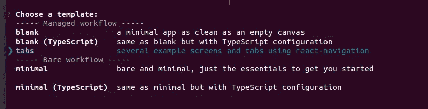

正如我们所看到的，我们选择了选项卡模板并按 enter 键。然后我们需要输入项目名称，之后，样板文件 React Native app 被配置到我们的目录中。

我们需要`cd`进入项目目录，然后运行命令:

```
expo start
```

您将在我们的模拟器屏幕上看到以下样板应用程序:

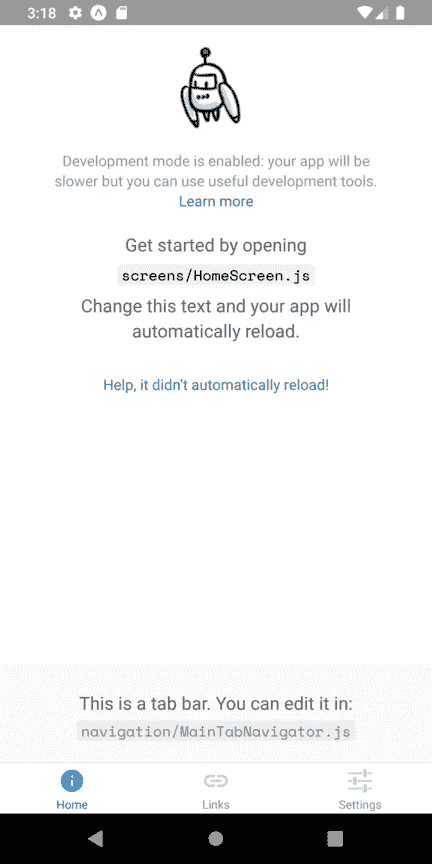

## 配置导航文件

我们已经在项目中为导航目的设置了导航器。但是现在，我们需要为我们的应用程序配置所需的导航器和导航文件。

所以首先，我们需要在项目的`/navigations`目录中创建一个 **ScreensNavigator.js** 文件。然后，我们需要在我们项目的`/screens`目录中创建一个 **Campings.js** 文件和 **Settings.js** 文件。我们的项目结构看起来类似于下面的截图:

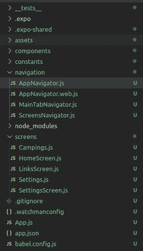

我们需要从 **HomeScreen.js** 中复制代码并粘贴到 **Campings.js** 文件中。同样，我们需要从 **SettingsScreen.js** 到 **Settings.js** Screen 做同样的事情，以便项目现在在模拟器中运行时没有错误。

现在在 **ScreensNavigator.js** 文件中，我们需要配置导航器，包括露营和设置屏幕。为此，我们需要使用`react-navigation`包中的`createStackNavigator`方法创建一个堆栈导航器，如下面的代码片段所示:

```
import React from 'react';
import { createStackNavigator } from 'react-navigation';

import Campings from '../screens/Campings';
import Settings from '../screens/Settings';

export default createStackNavigator({
  Campings: Campings,
  Settings: Settings,
});
```

我们已经将 **AppNavigator.js** 文件配置到我们的项目文件中。但是，我们需要用新的`ScreensNavigator`重新配置 AppNavigator.js 文件。为此，我们需要配置主 AppNavigator.js 文件，如下面的代码片段所示:

```
import React from 'react';
import { createAppContainer, createSwitchNavigator } from 'react-navigation';

import ScreensNavigator from './ScreensNavigator';

export default createAppContainer(createSwitchNavigator({
  Main: ScreensNavigator,
}));
```

现在，如果我们在模拟器中重新运行项目，我们将得到和以前一样的屏幕。

## **在 Camping.js 中创建地图视图**

在这一步中，我们将在 Camping.js 文件中为我们的 React Native Camping Spots Finder 克隆创建一个地图视图。为此，我们将使用[**react-native-maps**](https://docs.expo.io/versions/latest/sdk/map-view/)**包，它为我们提供了`MapView`组件。**

**首先，我们需要删除 Camping.js 中的所有代码。然后，我们将从我们的`react`和`react-native`包中导入所有必要的组件，如下面的代码片段所示:**

```
import React from 'react';
import {
  Image,
  Platform,
  ScrollView,
  StyleSheet,
  Text,
  TouchableOpacity,
  View,
} from 'react-native';
```

**接下来，我们需要使用以下命令将`react-native-maps`包安装到我们的项目中:**

```
expo install react-native-maps
```

**我们需要将`react-native-maps`包导入我们的 Camping.js 文件，如下所示:**

```
import MapView from 'react-native-maps';
```

**为了将地图包含到我们的露营屏幕中，我们需要使用 react-native-package 提供的`MapView`组件，如下面的代码片段所示:**

```
class Campings extends React.Component{
  render(){
    return (
      <View style={styles.container}>
        <ScrollView
        style={styles.container}
        contentContainerStyle={styles.contentContainer}>
          <View style={styles.map}>
            <MapView style={{flex: 1, height : 200, width : 200}} 
            initialRegion={{
              latitude: 37.78825,
              longitude: -122.4324,
              latitudeDelta: 0.0922,
              longitudeDelta: 0.0421,
            }}
            />
          </View>
        </ScrollView>
      </View>
    );
  }
}
```

**这里，我们将`MapView`组件绑定到一些样式以及`initialRegion`属性。`initialRegion`道具允许我们设置地图位置配置，如上面的代码片段所示。有几个`Views`组件和一个`ScrollView`组件用一些样式包装`MapView`，以便正确定位地图。下面的代码片段提供了所需的样式:**

```
const styles = StyleSheet.create({
  container: {
    flex: 1,
    backgroundColor: '#fff',
  },
  map :{
    flex : 1
  },
  contentContainer: {
    paddingTop: 30,
  },
});
```

**我们在模拟器屏幕上得到以下结果:**

**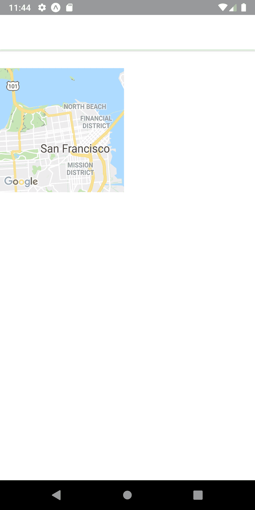**

## **配置地图样式**

**为了在屏幕上正确显示地图，我们将使用 react-native 包提供的`Dimensions`组件。通过使用`Dimensions`组件，我们可以得到整个 app 屏幕的`height`和`width`。然后，我们可以用我们的`MapView`配置它，在屏幕上正确显示地图。让我们按如下方式导入尺寸:**

```
import {
  Image,
  Platform,
  ScrollView,
  StyleSheet,
  Text,
  TouchableOpacity,
  View,
  Dimensions
} from 'react-native';
```

**我们需要使用`Dimensions`组件的 get 方法将`height`和`width`常量设置为我们的屏幕尺寸:**

```
const { width, height } = Dimensions.get('screen');
```

**接下来，我们需要将`height`和`width`尺寸添加到`MapView`组件，以便将其正确配置到屏幕上。下面的代码片段提供了实现这一点的代码:**

```
<MapView style={{flex: 1, height : height * 0.5, width}} 
   initialRegion={{
    latitude: 37.78825,
    longitude: -122.4324,
    latitudeDelta: 0.0922,
    longitudeDelta: 0.0421,
   }}
/>
```

**我们在模拟器屏幕上得到以下结果:**

**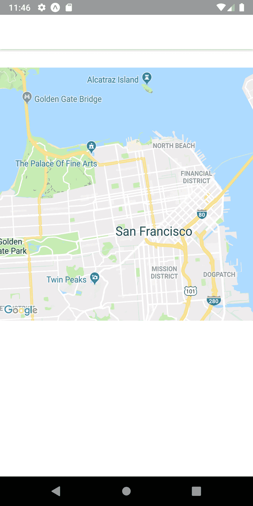**

**正如你所看到的，我们已经成功地将地图视图实现到我们的露营应用程序屏幕中。现在，我们将添加一个自定义标题到露营应用程序屏幕。**

## **实现标题部分**

**在本节中，我们将在我们的`MapView`组件之上实现一个 Header。标题将由右边的设置按钮露营地点名称组成。**

**但是首先，我们需要移除顶部的默认标题栏。为此，我们需要在 Campings.js 文件中添加以下代码:**

```
class Campings extends React.Component{
  static navigationOptions = {
    header: null,
  };
```

**在 navigator stack 提供的`navigationOptions`中将表头值设置为空时，顶部的默认表头消失。结果显示在下面的模拟器截图中:**

**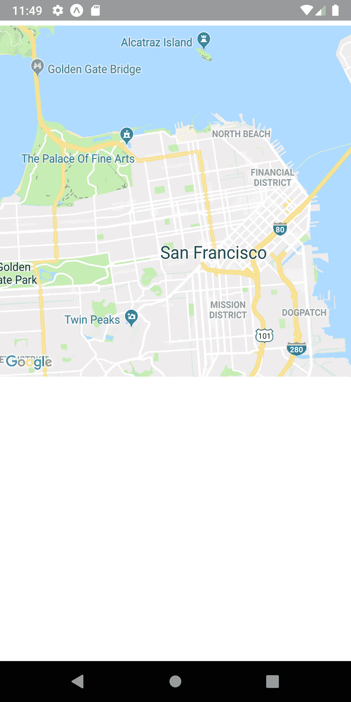**

**正如我们所看到的，默认标题消失了。现在我们可以实现我们的自定义标题栏。**

## **创建自定义标题**

**我们将从我们的营地现货查找应用程序克隆实现标题部分。标题部分由一些图标组成。因此，对于图标，让我们使用下面的代码导入 expo 包本身提供的矢量图标:**

```
import { FontAwesome , Ionicons} from '@expo/vector-icons';
```

**我们正在从 expo 包提供的 vector-icons 包中导入`FontAwesome`图标包和`Ionicons`图标包。**

**现在我们要创建一个名为`renderHeader()`的函数来返回模板。下面的代码片段提供了实现该功能的代码:**

```
renderHeader() {
    return (
      <View style={styles.header}>
        <View>
          <FontAwesome name="location-arrow" size={14} color="white" />
          <Text>Detected Location</Text>
          <Text>Northern Islands ()</Text>
        </View>
        <View>
          <Ionicons name="ios-settings" size={24} color="black" />       
        </View>
      </View>
    )
}
```

**在上面的代码片段中，我们添加了一些`Text`组件和由`View`组件包装的`Icons`。然后，我们需要将 `renderHeader()`函数调用到我们的`render()`函数中，如下面的代码片段所示:**

```
render(){
    return (
      <View style={styles.container}>
        <ScrollView
        style={styles.container}
        contentContainerStyle={styles.contentContainer}>
          {this.renderHeader()}                            //here
```

**我们将在模拟器屏幕中得到以下结果:**

**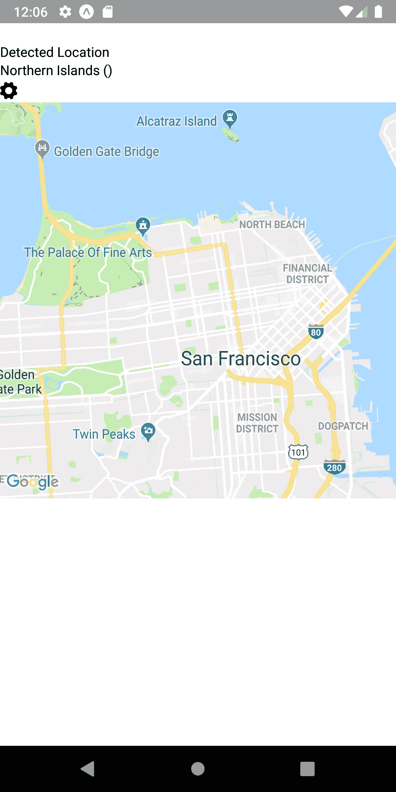**

**正如我们所看到的，我们在`MapView`的顶部获得了标题部分，但是看起来很不吸引人。因此，我们需要添加一些风格，以使它看起来很酷，就像在露营点查找应用程序。**

## **向页眉添加样式和配置**

**我们将添加一些样式配置到标题部分，以使它看起来更有吸引力。为了做到这一点，我们将使用大量的样式绑定。这里使用了 react-native 样式的 flex 属性。我们还可以深入了解如何使用 flex 属性。下面的代码片段提供了实现这一点的代码:**

```
renderHeader() {
    return (
        <View style={styles.header}>
          <View style={{flex: 2, flexDirection: 'row'}}>
            <View style={styles.settings}>
              <View style={styles.location}>
                <FontAwesome name="location-arrow" size={14} color="white" />
              </View>
            </View>
            <View style={styles.options}>
              <Text style={{ fontSize: 12, color: '#A5A5A5', marginBottom: 5, }}>
                Detected Location
              </Text>
              <Text style={{ fontSize: 14, fontWeight: '300', }}>
                Northern Islands
              </Text>
            </View>
          </View>
          <View style={styles.settings}>
            <TouchableOpacity >
              <Ionicons name="ios-settings" size={24} color="black" />
            </TouchableOpacity>
          </View>
        </View>
    )
 }
```

**在上面的代码片段中，设置`Icon`组件被`TouchableOpacity`组件包装，以使其可点击。然后，使用不同的内联样式绑定以及来自`Stylesheet`的样式绑定，以使标题部分具有合适的外观。下面的代码片段提供了此部分的样式:**

```
header: {
    flex: 1,
    flexDirection: 'row',
    alignItems: 'center',
    justifyContent: 'center',
    height: height * 0.15,
    paddingHorizontal: 14,
  },
  location: {
    height: 24,
    width: 24,
    borderRadius: 14,
    alignItems: 'center',
    justifyContent: 'center',
    backgroundColor: '#FF7657',
  },
  settings: {
    alignItems: 'center',
    justifyContent: 'center',
  },
  options: {
    flex: 1,
    paddingHorizontal: 14,
  },
```

**因此，我们在模拟器屏幕上得到以下结果:**

**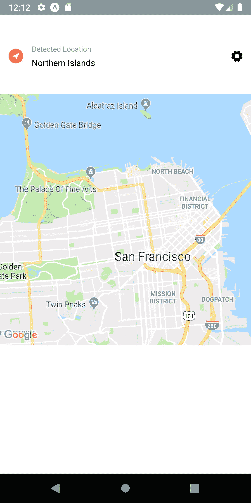**

**正如我们所看到的，标题部分现在看起来非常酷和吸引人，左边是导航箭头图标，右边是设置图标。它用于在实际应用程序中显示检测到的位置名称。**

**我们在返回标题部分模板的`renderHeader()`函数中创建了标题部分。这使得我们项目的`render()`方法中的代码看起来更加清晰和干净。因此，让我们实现`MapView`以及我们将在函数风格中实现的其他部分。**

## ****将 UI 部分划分为功能****

**这只是一个中间步骤，我们将把不同 UI 部分的编码实现分成不同的函数，以使`render`方法更少地填充代码。这将有助于我们更好地理解和阅读代码。`render()`方法将变得干净和清晰，所有的编码部分混合成一个。所以，让我们完成这个。**

**首先，我们将把`MapView`的代码移到`renderMap()`函数中，如下面的代码片段所示:**

```
renderMap(){
    return(
      <View style={styles.map}>
          <MapView style={{flex: 1, height : height * 0.5, width}} 
          initialRegion={{
            latitude: 37.78825,
            longitude: -122.4324,
            latitudeDelta: 0.0922,
            longitudeDelta: 0.0421,
          }}
          />
      </View>
    )
}
```

**现在，`renderMap()`方法将返回 MapView 组件模板。**

**然后，我们将在接下来的教程中实现地图组件下面的列表部分。但是，让我们首先为这个部分创建一个名为`renderList()`的独立函数，它返回列表部分的模板。下面的代码片段提供了该函数:**

```
renderList(){
    return(
      <View>
        <Text>List of camping site here</Text>
      </View>
    )
  }
```

**我刚刚在`View`组件中添加了一个`Text`元素，我们将在本教程的下一部分中配置它。**

**我们需要在项目的 render()方法上调用这些函数，如下面的代码片段所示:**

```
render(){
    return (
      <View style={styles.container}>
        <ScrollView
        style={styles.container}
        contentContainerStyle={styles.contentContainer}>

          {this.renderHeader()}                              //for header section

          {this.renderMap()}                                 //for MapView section
          {this.renderList()}                                //for List section

        </ScrollView>
      </View>
    );
}
```

**我们将在模拟器屏幕中得到以下结果:**

**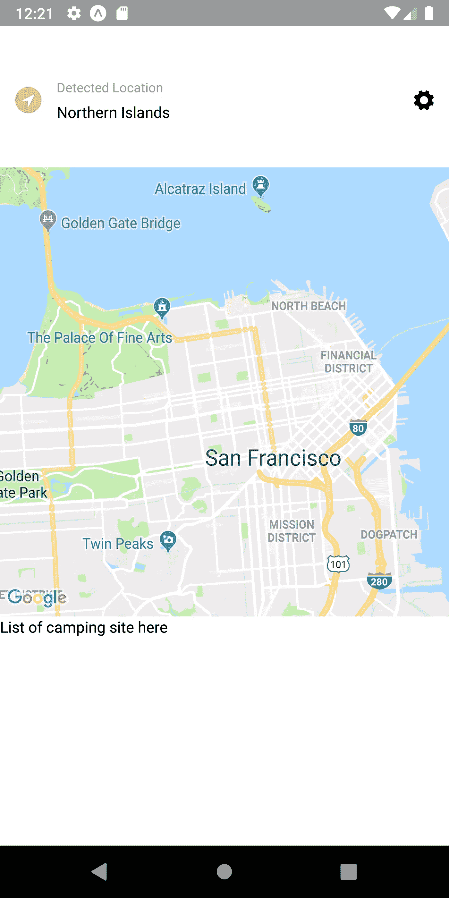**

**如我们所见，我们在屏幕上显示了所有三个部分。**

**但是我们还没有完成教程的这一部分。我们将在标题部分和`MapView`部分之间添加一个标题选项卡部分**。****

## **实现选项卡部分**

**在这一步中，我们将添加标签按钮到我们的标题部分，就像在原来的 Campings Spot Finder 应用程序中看到的那样。为此，我们将创建另一个函数来返回选项卡部分的模板。该函数被命名为`renderTabs()`，其实现在下面的代码片段中提供:**

```
renderTabs(){
    return (
      <View>
        <View>
          <Text>All Spots</Text>
        </View>
        <View>
          <Text>Tenting</Text>
        </View>
        <View>
          <Text>RV Camping</Text>
        </View>
      </View>
    )
}
```

**我们添加了一些由`View`组件包装的`Text`元素。然后，我们还需要在我们的`render()`函数中调用`renderTabs()`函数:**

```
render(){
    return (
      <View style={styles.container}>
        <ScrollView
        style={styles.container}
        contentContainerStyle={styles.contentContainer}>
          {this.renderHeader()}                               //for header section  
          {this.renderTabs()}                                 //for tabs section
          {this.renderMap()}                                  //for MapView section
          {this.renderList()}                                 //for List section

        </ScrollView>
      </View>
    );
  }
```

**我们在模拟器屏幕上得到以下结果:**

**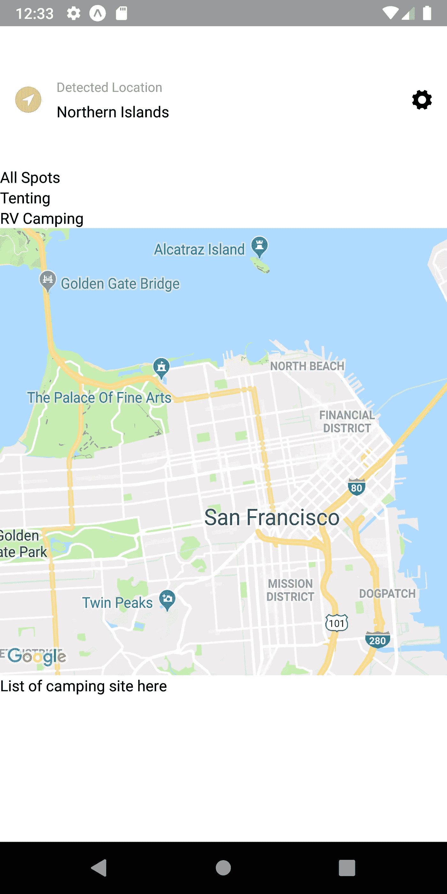**

**如您所见，在标题和`MapView`部分之间有一部分，但看起来不像标签。为了使它看起来像一个选项卡，我们需要添加一些样式和配置。**

## **向选项卡部分添加样式和配置**

**我们将向选项卡部分添加样式配置，以使它看起来像选项卡。为此，我们需要使用不同的样式绑定，包括 flex 属性。填充和字体属性。下面的代码片段提供了实现这一点的代码:**

```
renderTabs(){
    return (
      <View style={styles.tabs}>
        <View style={styles.tab}>
          <Text style={styles.tabTitle}>All Spots</Text>
        </View>
        <View style={styles.tab}>
          <Text style={styles.tabTitle}>Tenting</Text>
        </View>
        <View style={styles.tab}>
          <Text style={styles.tabTitle}>RV Camping</Text>
        </View>
      </View>
    )
}
```

**我们可以看到`View`和`Text`组件与`StyleSheet`绑定到不同的样式。下面的代码片段提供了所需的样式:**

```
tabs: {
    flex: 1,
    flexDirection: 'row',
    justifyContent: 'center',
    alignItems: 'flex-end',
  },
  tab: {
    paddingHorizontal: 14,
    marginHorizontal: 10,
    borderBottomWidth: 3,
    borderBottomColor: 'transparent',
  },
  tabTitle: {
    fontWeight: 'bold',
    fontSize: 14,
    marginBottom: 10,
  },
```

**因此，我们得到了比以前更有吸引力的标签，如下面的模拟器截图所示:**

**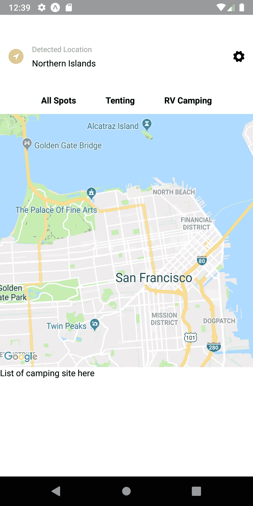**

**正如我们所看到的，我们得到了标题和地图部分之间的选项卡。现在，我们需要做的是添加一个活动选项卡样式以及一个配置来处理选项卡的活动样式。**

## **配置活动选项卡**

**我们将添加用于确定活动选项卡的编码实现。首先，我们需要一个名为`active`的状态来处理活动选项卡样式属性，如下面的代码片段所示:**

```
state = {
    active : 'all'
}
```

**我们需要创建一个函数来处理更改和状态，并在单击时将活动样式设置为正确的选项卡。为此，我们将创建一个名为`handleTab()`的函数，它将一个选项卡值作为参数，并在被触发时将活动状态设置为选项卡值。下面的代码片段提供了该函数的编码实现:**

```
handleTab = (tabKey) => {
    this.setState({ active: tabKey });
  }
```

**我们需要为活动选项卡定义一些样式。然后，这个样式配置需要被绑定到`renderTabs()`函数内的选项卡部分模板中的`Text`和`View`。下面的代码片段提供了活动选项卡所需的样式:**

```
activeTab: {
    borderBottomColor: '#FF7657',
  },
  activeTabTitle: {
    color: '#FF7657',
  },
```

**上面给出的样式将给予活动标签文本颜色以及在底部包围活动标签的`View`组件一个边框。**

**我们需要包含这些样式和`renderTabs()`函数，其值取决于选项卡的`active`状态。然后，我们还需要将`handleTab()`函数绑定到选项卡的`Text`组件的`onPress`事件。函数调用还应该按照所选的活动选项卡设置函数的参数。下面的代码片段提供了实现这一切的代码:**

```
renderTabs(){
    const {active} = this.state
    return (
      <View style={styles.tabs}>
        <View 
          style={[styles.tab, active === 'all' ? styles.activeTab : null]}>
           <Text 
             style={[styles.tabTitle, active === 'all' ? styles.activeTabTitle : null]}
             onPress={() => this.handleTab('all')}>
               All Spots
           </Text>
        </View>

        <View 
          style={[styles.tab, active === 'tent' ? styles.activeTab : null]}>
           <Text 
             style={[styles.tabTitle, active === 'tent' ? styles.activeTabTitle : null]}
             onPress={() => this.handleTab('tent')}>
               Tenting
           </Text>
        </View>

        <View 
          style={[styles.tab, active === 'rv' ? styles.activeTab : null]}>
            <Text style={[styles.tabTitle, active === 'rv' ? styles.activeTabTitle : null]}
            onPress={() => this.handleTab('rv')}>
               RV Camping
            </Text>
        </View>
      </View>
    )}
```

**因此，我们将在模拟器屏幕中获得以下结果:**

**最后，我们已经成功地实现了标题部分、标题标签部分和一个`MapView`部分。**

## **结论**

**这是我们的教程系列的第一部分，克隆露营点查找应用程序用户界面。在教程的这一部分，我们学习了如何使用 expo 建立一个样板 React Native app 项目。然后，我们学习了如何配置导航器和屏幕，以便为应用程序 UI 做准备。**

**在那之后，我们得到了如何使用`react-native-maps`包实现`MapView`的逐步指导，一个带有图标的标题部分，一个带有活动标签样式的标题标签部分。我们还得到了一个额外的指南，关于如何将 UI 部分分成不同的函数，返回一个所需的模板，以使代码干净。本系列教程的第一部分有点长，但是我们学到了更多的东西，并且为以后的部分设置了基本的 UI，这将使本系列更容易掌握和实现。**

**在下一部分中，我们将实现我们在本教程前面分离成一个函数的列表部分，并设置到设置屏幕的导航。**

***所以，请继续关注！！***

***最初发表于*[](https://kriss.io/camping-spots-finder-app-ui-clone-with-react-native-1-map-view-ui/)**。****

# ***公开***

***这篇文章包括附属链接；如果您从本文提供的不同链接购买
产品或服务，我可能会收到报酬。***