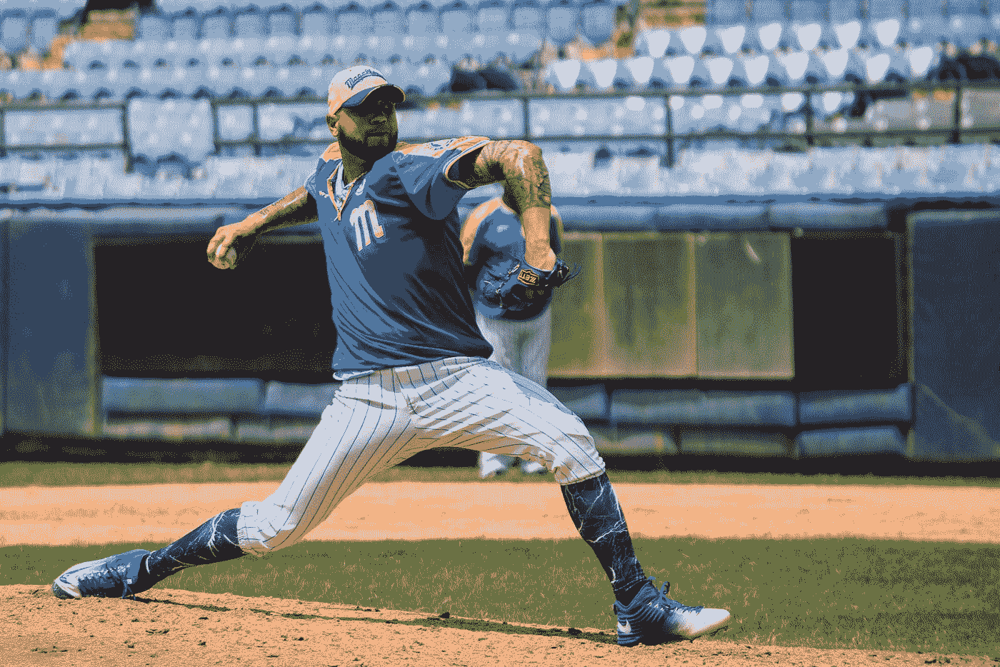
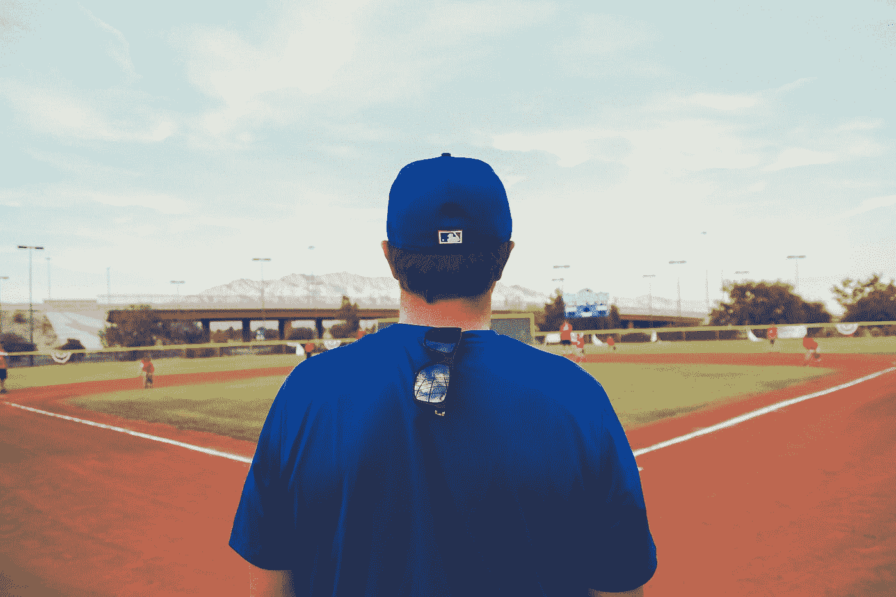

# 10 倍全职贡献者能成为成功的领导者吗？

> 原文：<https://levelup.gitconnected.com/can-a-10x-full-time-contributor-become-a-successful-leader-42dbc2c64a86>

## 视情况而定，这里有一个日本棒球的故事

布兰登·莫温克尔在 [Unsplash](https://unsplash.com?utm_source=medium&utm_medium=referral) 上的照片

篮球在日本和在美国一样受欢迎，甚至更受欢迎。顶级职业联赛 NPB 的每一场比赛都吸引了喧闹的人群，他们设法团结起来，一起为他们最喜欢的球队欢呼。

今天的故事是关于两名日本棒球运动员从球场上的超级巨星转变为休息区的头头，他们是 *Kanemoto* 和 *Ramirez* 。两个相似的关于昔日荣耀的故事，结局却截然不同。

金本友明在 NPB 演出，总共 21 年。他在中部联盟的两支球队广岛鲤鱼队和阪神老虎队之间平分时间。由于缺乏力量，他在职业生涯中的开局受到了击球表现不佳的影响，这是这位新秀在职业生涯的前三年努力解决的问题。他的努力得到了回报。到退休时，金本已经打出了 476 支全垒打和 2539 支安打，使他在这两项数据上都进入了全国前 10 名。

亚历克斯·拉米雷斯有一个完全不同的开始。他出生在委内瑞拉，在 MLB 开始了他的职业棒球生涯，在那里打了三年球，然后于 2001 年移居日本。在 NPB，Ramirez 成为了一名超级巨星，与 Kanemoto 没有太大不同，在他作为日本职业球员的 12 年里，他打出了 2017 支安打和 380 支本垒打。他挂靴前的最后一个赛季是在一个小联盟球队担任球员经理。

两人都是广受赞誉的超级巨星，在职业生涯中和退休后都获得了无数赞誉。拉米雷斯是第一个被邀请到著名的黄金球员俱乐部(Meikyukai)的西方球员。金本成为了同一家俱乐部的成员，也是日本棒球名人堂的成员。

两人在结束职业生涯后都进入了管理层，这正是有趣的地方。

从 2016 年到 2018 年，Kanemoto 管理了阪神老虎队三个赛季，结果好坏参半。事实上，他在 2018 赛季结束时辞职，当时球队在中部联赛中排名最后。

在小联盟的球员兼教练任期结束后，Ramirez 也进入了全职管理，于 2016 年加入了另一支 NPB 中部联盟球队 DeNA Baystars。在他担任经理的前四个赛季，拉米雷斯三次带领海湾之星队进入季后赛，一次进入日本系列赛，然后输给了太平洋联盟的国王队，福冈的软银鹰队，四场比赛比两场。

两位球员都受到了普遍的喜爱，并带着球迷的巨大期望开始了他们的角色。一个人获得了成功，另一个却没那么成功。这背后有什么特别的原因吗，或者仅仅是纯粹的运气？

# 成为超级明星的问题是

马修·T·雷德在 [Unsplash](https://unsplash.com?utm_source=medium&utm_medium=referral) 上的照片

成为超级明星一定很难，就像在棒球和其他行业一样。山顶是个寂寞的地方，和不如你的人玩一定很辛苦。换句话说，正如我的一位前经理在讨论超级明星工程师时所说的:

> 当你处于前 20%的时候，80%的时候你都在和不如你的人打交道

事实是，这高度依赖于*好*的定义。“不如你的人”是什么意思？让我们来看看另一项运动的超级明星，他也决定拿起棒球棒。

在 20 世纪 90 年代中期，个人原因导致迈克尔·乔丹(可以说是历史上最优秀的篮球运动员之一)尝试打棒球。他与芝加哥白袜队签约，并在 1994 年赛季被分配到双 A 联盟伯明翰男爵队。在那里，他取得了谨慎的成功，达到了 88 支安打和 3 支全垒打的平均打击率 0.202。尽管如此，这离他在公牛队篮球场上令人瞠目结舌的表现还有很长的路要走。

他在某一方面是超级巨星，也许在另一方面也很好，但不是同一类人。这就是为什么*好*的定义取决于上下文，如果想成为成功的领导者或管理者，具有傲慢态度的超级明星工程师真的需要改变他们的思维模式。

这是第一个思维转变。第二个是关于理解管理和全职贡献是两个完全不同的工作，要求完全不同。衡量这位经理的标准是她整个团队的表现，而不是她自己。在一个球队中，不仅仅是一个人或者一种球员。

# 各有所爱

何塞·弗朗西斯科·莫拉莱斯在 [Unsplash](https://unsplash.com?utm_source=medium&utm_medium=referral) 上拍摄的照片

通常，超级明星是非常专业化的。在棒球运动中，像目前在 MLB 为天使队效力的日本王牌投手大谷宗平这样既擅长投球又擅长击球的双向球员少之又少。这意味着由超级明星转变为经理的技能不一定适用于他们管理的每个团队成员。

这就是为什么有一个完整的教练团队来支持经理，但这不是经理放弃试图理解他们的球员的借口。

> 对经理来说，与球员相处比成为榜样更重要。

在办公室里，这转化为领导发展**同理心**和**信任**。

同理心有助于领导者了解其下属所处的具体情况，从家里的麻烦到工作上的问题。这并不意味着过去必须生活在相同的特定环境中，而是意味着能够产生共鸣。

信任是信任他人的工作，即使你并不完全了解他们的能力。这是超级巨星贡献者的一个特殊斗争点，因为有时他们用自己以前的表现作为衡量他们追随者的尺度。这只能对团队的一部分起作用，即使这样，也是不公平的。

它只对特定的子集起作用，这些子集做的工作与明星过去做的工作相同，因此为一个击球手击球，为一个软件工程师编码。但即使这样，你也不能指望人们有同样的潜力。作为一名领导者，你应该推动你的团队发挥最大的潜能，而不是你自己。没有两个人是完全一样的，即使是双胞胎也不例外。

# 将这一切结合在一起

照片由 [NeONBRAND](https://unsplash.com/@neonbrand?utm_source=medium&utm_medium=referral) 在 [Unsplash](https://unsplash.com?utm_source=medium&utm_medium=referral) 上拍摄

最后，我们不知道为什么 Kanemoto 和 Ramirez 作为经理会有如此不同的结果。将此归因于个性或态度会对他们不利，因为有许多因素会影响团队的整体表现，从人际关系化学到个人健康。不过有一点是肯定的，拉米雷斯的胜算不大，他最终胜出。在异国他乡做一名经理并不容易，除了其他问题之外，你还需要适应不同的文化、不同的语言和不同的做事方式。

可以肯定的是，他努力工作，非常谦虚地取得了今天的成就，并采用了仆人领导者的心态，将他的技能从伟大的击球手变成了成功的经理。也许，作为球员兼教练在小联盟的一年帮助他培养了新角色所需的同理心，从超级明星变成了更普通、更现实的人。

拉米雷斯的故事表明，如果努力工作，任何超级明星都可以过渡到管理职位。当然，每个人的潜力都是不同的，有些人比其他人更容易管理，但只要有正确的心态，强调团队成功高于个人荣耀，你就可以实现团队应有的伟大。

这真的是关键信息:如果你是全职贡献者的 10 倍，考虑转向管理，准备好重新学习一切。也许你天生擅长管理人，就像你擅长编码一样，也许不是。他们是两个完全不同的学科，当不是你个人需要击球时，你以前的荣耀可能会成为障碍而不是推动者。

***全披露:*** *我是阪神猛虎队的粉丝，但我对金本没有任何怨恨。我只是认为拉米雷斯作为一名经理到目前为止表现得更好。随着 DeNA 今年失去了他们的超级明星 Tsutsugoh，我们将会看到这种情况是否会继续下去。*