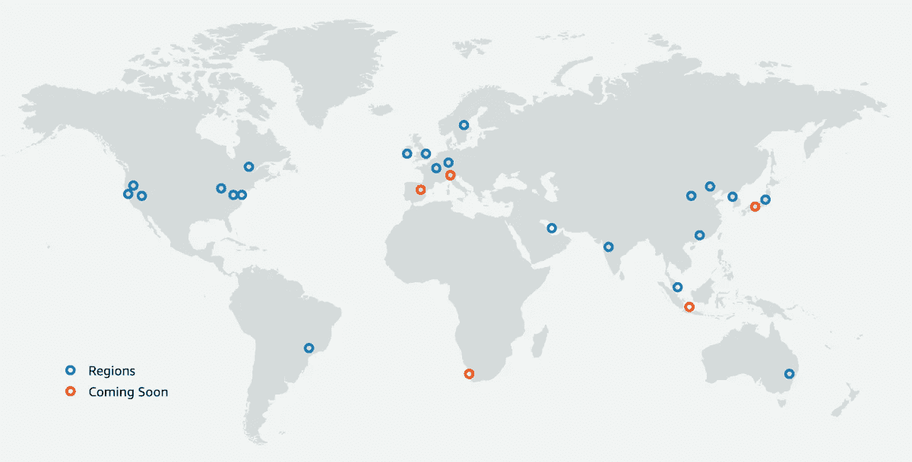

# 区块链可以分散到云上吗？

> 原文：<https://levelup.gitconnected.com/can-a-blockchain-be-decentralized-on-the-cloud-807959af28ef>

## 许多云提供商，如 AWS、Azure、GCP 和 IBM 都在提供“区块链即服务”或 BaaS，但是…它是否有助于区块链的权力下放？？

在 AWS 上创建区块链是如何去中心化的？这是我的学生 Vader S 提出的问题，来自我的一门课程[Udemy](https://www.udemy.com/user/henrique-246/)，这是一个非常非常好的问题！

也可以看看关于这个话题的视频。

你可能注意到了，有时候我在 AWS 云上部署以太坊节点，问题是:这个可以去中心化吗？我认为创建区块链的原因是不让 AWS Amazon 云和其他大型云提供商控制您的数据，同时防止关闭区块链！

是的，这是一个非常好的问题。AWS Amazon Web Services 是最大或最大的云提供商之一，还有其他云提供商，如 IBM、微软 Azure、谷歌云、阿里云、Rackspace 等。尽管如此，这些都是大公司，他们基本上控制了互联网的很大一部分。您日常使用的互联网可能有 90%以上是由这些大型云提供商托管的。大多数人和公司都没有本地服务器，因为它们很贵，所以大部分互联网都托管在云上。当你使用网飞、谷歌、亚马逊或任何其他网站或使用移动应用程序时，大多数这些应用程序都托管在云上。

现在的问题是，如果您将区块链节点部署在云上，是否会产生某种程度的集中化？
答案并不容易。这是一个是和不是。

假设您想要在公共区块链中部署一个节点。公共区块链本质上是分散的。比特币、以太坊、Dogecoin 和许多其他货币都是去中心化的，这意味着当你部署额外的节点时，你就增加了去中心化，去中心化是公共区块链的主要好处之一，没有单点故障，没有单点控制。

当您部署一个节点时，比方说，在像 AWS 这样的公共云上部署一个以太坊节点，您对该节点所做的是下载整个区块链、整个分类帐，并验证交易。您的节点也将是广播事务的中继节点，因此每次有新的事务或每次挖掘器挖掘新的事务/块时，该事务都将通过所有节点验证事务，并且它们将向其对等节点广播事务。这个由成千上万个节点组成的庞大网络中的区块链在它们之间传递消息并验证交易。

当您将这些节点中的一个部署在云上而不是部署在您自己的机器上时，我会说，从去中心化的角度来看，这没有好坏之分。您再部署一个节点；即使它在 AWS 或集中式云提供商上，您仍然与节点一起为网络做出贡献，并且它将是另一个验证事务的节点。

问题的第二部分是，如果这些大型云提供商最终关闭该节点，会发生什么？如果你想准确，是的，AWS 可能会突然关闭。然而，从历史上看，这些云提供商非常非常可靠，我认为他们不会关闭任何东西，除非他们有来自当局或政府的一些请求。例如，想象一下，如果你决定在 AWS 上托管一个非法网站，无论是卖毒品的网站还是非法的网站。他们将从法院、警方或当局获得关闭该网站的命令，因为它像是非法活动。我不认为区块链节点在未来的任何时候会出现这种情况。区块链是分布式数据库。运行以太坊节点或比特币节点并不违法，你可以使用云，因为他们有很好的 SLA——服务水平协议——基本上说，99.9%的时间，服务器将启动并运行。所以云通常是非常可靠的。

我也理解，在云上部署区块链节点存在一些反对意见，因为如果每个人都只在云上部署区块链节点，你可能会有点集中。

嗯……例如，AWS 在澳大利亚、香港、日本、新加坡、印度、巴林、欧洲、英国、美国和巴西有许多不同的数据中心。虽然他们有许多不同的位置，但这不足以完全分散一个区块链。尽管如此，我相信可能大多数需要像 crypto exchange 这样的完整节点的公司都会在云上这样做，因为这样更快、更容易、更可靠。然而，我同意，它对权力下放没有多大贡献。

如果你想要一个完全分散的区块链，区块链需要允许任何人运行节点，你不需要有一个具有巨大计算能力的云提供商。这就是为什么在大多数区块链，包括以太坊区块链，比特币，Dogecoin 等，你可以从你的电脑上运行完整的节点，因为它不；不需要太多空间。如果我在比特币的例子中没有错的话，大约 300 千兆字节的空间和 Dogecoin 只需要 70 千兆字节的存储空间，这意味着任何人都可以运行一个节点！

我在我的电脑上运行 dogecoin node full node，因为我想为网络做贡献，当更多的人为网络做贡献时，它就变得更加分散。

我们希望区块链允许我们在一台普通计算机上运行全部节点，以确保我们可以有更多的分散。这就是拥有小块尺寸的架构良好的区块链如此重要的原因。块大小不应该增加太多，以精确地允许分散化特征。例如，比特币有 1 兆字节的块，而比特币现金有 8 兆字节的块。大多数比特币最大化主义者不接受将比特币块从 1 兆字节增加到 8 兆字节，因为这可能会增加运行完整节点所需的空间。如果每分钟产生 8 兆字节，这将使区块链的大小呈指数级增长，这将使它在存储方面有更多的要求，并且可能以后它将不再可能在普通计算机上运行节点。另一方面，在比特币上，你仍然可以在笔记本电脑上运行一个完整的节点，这对于去中心化非常重要。

我希望人们继续在任何笔记本电脑上运行他们自己的节点，这样他们就能继续保持高度的去中心化。

最后，我同意在 AWS 和其他云提供商上部署一个节点不会增加太多的去中心化，但它确实有助于节点验证事务。区块链上的节点越多，区块链的弹性就越大，即使您以更集中的方式运行节点，您也总是在为区块链做贡献。网络效应总是存在的。您仍然在云上做出一些贡献，因为您的节点正在验证事务并帮助广播事务。

## 二等兵区块链呢？

如果您正在为许可/私有区块链运行一个节点呢？嗯，根据我的工作经验，大多数时候，当一个组织或公司想要为他们的私有区块链部署一个节点时，他们确实会使用云。同样，这是因为云使部署任何东西都变得容易得多，并且您没有任何前期成本，不像预部署服务器。

这些私人区块链可能有许多不同的用途。例如，沃尔玛/IBM Food Trust 是一个非常成功的用例，它旨在跟踪绿叶商品的供应链，从农民到消费者跟踪商品。这非常有助于追踪，例如，是否有被沙门氏菌或某种疾病污染的产品。这使得跟踪和剔除被产品污染的批次变得非常容易。

IMB 与沃尔玛合作，目前，沃尔玛的所有供应商都需要在这个区块链上。为了连接到这个区块链，这些农民可以轻松地在 IBM cloud 上部署一个节点，因为他们提供的是 BaaS——区块链即服务。

如果 IBM 突然关闭会发生什么？如果他们所有的数据中心都爆炸了，会发生什么？这个区块链也将因为中央集权问题而关闭。然而，在这些私人推广区块链，目标并不是真正有一个巨大的权力下放。他们的价值更多地来自于所有同行的透明度，最终，他们是私人区块链，他们背后有一个法律实体。

**🚀跟随我的媒介，也请检查我的🧱区块链课程:**

**🐶** [**有史以来第一次 Dogecoin 课程**](https://www.udemy.com/course/-dogecoin-course-the-first-complete-dogecoin-course/?referralCode=9416B1408224CE309DD8)

**👨‍🎓** [**Fintech、云和网络安全课程**](https://www.udemy.com/course/fintech-technologies-cloud-and-cybersecurity/?referralCode=F1D4EA005A2881735A36)

**📖****[**完整的 NFTs 教程**](https://www.udemy.com/course/the-complete-nft-course-learn-everything-about-nfts/?referralCode=AAEE908D13D0E2276B19)**

****👨‍🎓** [**Unblockchain 课程**](https://www.udemy.com/course/blockchain-deep-dive-from-bitcoin-to-ethereum-to-crypto/?referralCode=B8463EE382E6D313304B) **—脑洞大开的区块链课程****