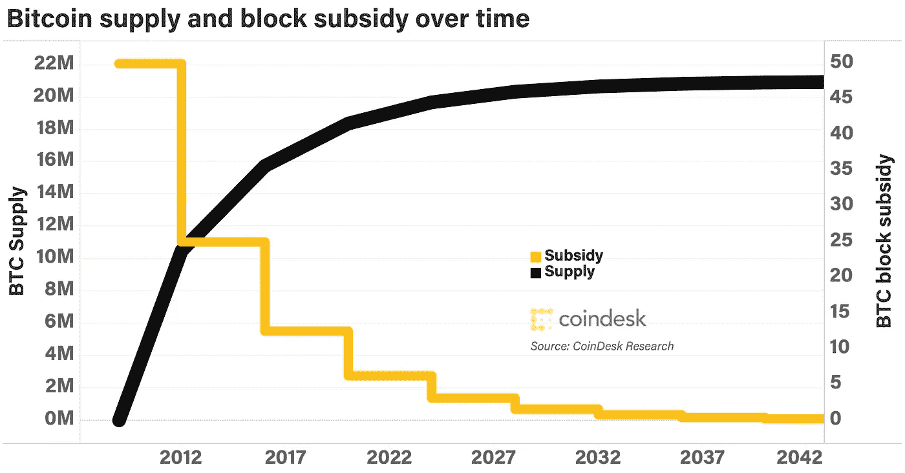
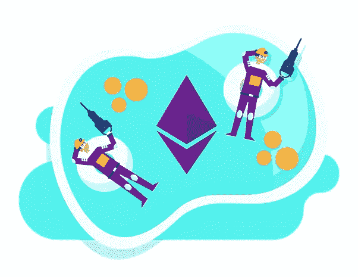
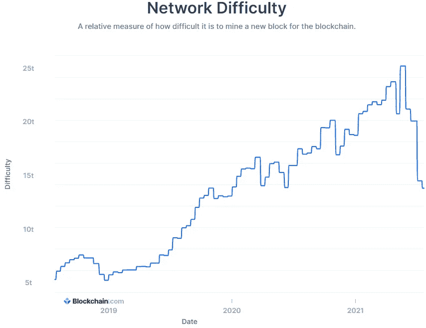
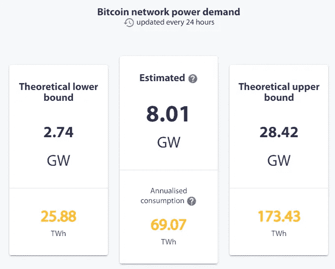
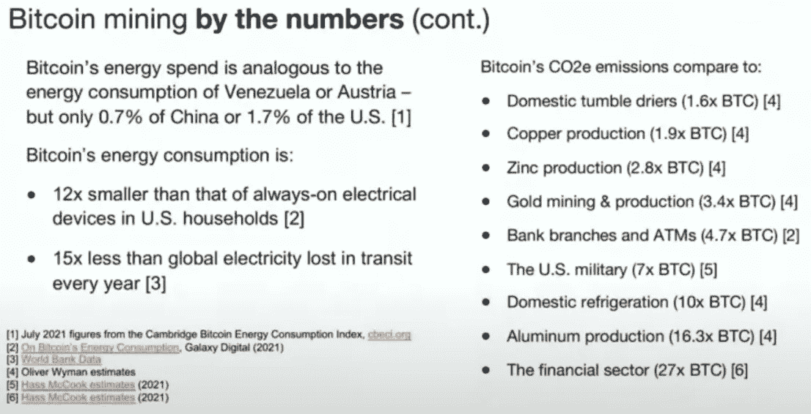

# 比特币矿工会破产吗？他们挣多少钱？又有哪些用例？

> 原文：<https://levelup.gitconnected.com/can-bitcoin-miners-ever-go-bankrupt-how-much-money-do-they-make-and-what-are-the-use-cases-25fe064f627>

## 比特币矿工对网络的贡献如何，矿池如何工作，开采一个比特币区块要花多少电？比特币有哪些用例？

我在区块链的课程中的 Udemy 学生 Krit 问了我一些关于比特币挖矿的非常有趣的问题。你可以从下面的文章中看到，当我谈到采矿时，我变得相当兴奋！

克里特，这是给你的。

***第一个问题:采矿费是否只支付给每个区块的一个成功矿工，即 8000 个节点中的 1 个？如果是的话，似乎大部分矿工都会破产，除了矿工作为一个群体来汇集资源。一台电脑要花 27 万年才能开采一个区块。我无法想象单个矿工能有多大的计算机能力在 10 分钟内开采一个街区。你能告诉我开采一个街区需要多少电力吗？***

这真是一个很酷的问题！让我来分解一下:

区块奖励固定为 6.25 BTC，每 4 年减半，或者更准确地说，每 210 000 个区块减半，考虑到我们每 10 分钟就有一个新区块，也就是大约 4 年。因此，下一次比特币区块奖励减半将在 2024 年初的某个时候发生，奖励将被削减至 3.125 BTC。

资料来源:Coindesk

此外，每次用户发送比特币交易时，他都必须支付交易费。该矿商还将收到同一区块交易的交易费。

因此，在比特币的例子中，采矿奖励目前是 6.25 BTC 加上用户支付的费用，这是矿工开采一个区块时平均每 10 分钟支付给他们的。这是多少钱？嗯，在我写这篇文章的时候，我将选择最近开采的区块。你也可以按照[这个链接](https://www.blockchain.com/btc/block/00000000000000000005ae0670d9d16bd82cf6c7588e83d19acfb3c020a7fa15)自己检查区块。

在这里，我们将查看[模块 692365](https://www.blockchain.com/btc/block/00000000000000000005ae0670d9d16bd82cf6c7588e83d19acfb3c020a7fa15) 。开采这个区块(在这种情况下是一个名为 F2Pool 的采矿池)的矿工已经获得了 6.25 BTC 的区块奖励加上 0.0079 BTC 的费用奖励。

按照目前的速度，这大约转化为:

街区奖励:6.25 BTC = 209，800 美元

酬金:0.0079 BTC = 265 美元

因此，开采该区块的矿工或资金池将获得价值约 210，0 00 美元的比特币，如果你问我，这是一个相当大的便士！

因为回报相当诱人，所以很多人投入大量资源去挖掘比特币，无论是硬件还是电力。在比特币的早期，2009 年和 2010 年，你可以用笔记本电脑开采比特币并获得回报。但现在竞争如此激烈，所有这些人都投入了如此多的资源，用笔记本电脑成功开采一个区块的可能性极低。如你所说，用一台普通的计算机成功地做到这一点需要几千年的时间。

目前，用笔记本电脑挖掘比特币就像试图用孩子们在沙滩上使用的玩具铲子挖掘黄金一样。数学上不是不可能，但是用这么小的铲子可能要花一千年才能找到金子。因此，我们需要重型机械。

这就是用笔记本电脑挖矿比特币的感觉。

现在我们来谈谈采矿池。目前，矿工为了获得更稳定的回报和避免破产，所做的就是加入一个矿池。矿池基本上汇集了大量矿工的资源，从比特币网络的角度来看，充当单个矿工。例如，如果一个矿池有 10%的矿工参与开采(这是我们在链接中看到的 F2Pool 的情况)，这意味着该矿池将开采 10%的区块。10%的比特币块每天大约有 14 块。对该池有贡献的矿工将根据他们的贡献获得采矿奖励。你可以用个人电脑的计算能力做出贡献，这就像用沙滩铲挖金子一样，你将获得与工作成比例的回报(可能只有几分钱)。另一方面，拥有重型机械的人会对矿池做出更多贡献，并获得与其贡献成比例的奖励。即使拥有大量重型机械的大型采矿场也使用采矿池，以便获得更可预测和稳定的回报。

我喜欢的那种矿池。

点击这个链接可以看到更多关于 F2Pool 代表他们的矿工获得了多少区块和多少奖励的细节:[https://btc.com/stats/pool/F2Pool](https://btc.com/stats/pool/F2Pool)

现在是问题的第二部分:

## H **开采一块比特币需要多少电力？**

电花了多少，要看比特币挖矿难度如何。这一难度每两周调整一次，以保持平均每 10 分钟生产一次砌块。当更多的矿工加入网络时，难度需要调整，并且难度会增加(因为更多的矿工意味着他们会比 10 分钟更快地发现块，并且网络希望保持 10 分钟的平均值)。如果矿工离网，为了降低难度，保持 10 分钟平均，难度也会调整。这就是最近发生的事情，矿工在中国被禁止，不得不突然关闭他们的采矿设备。挖掘难度进行了调整，以适应网络中新的 hashrate(即计算能力)。

来源:https://www.blockchain.com/charts/difficulty

在目前的难度水平下，整个比特币网络每秒产生大约 101 万亿哈希的计算能力，这是每 10 分钟挖掘一个区块所需的能力。给你一个概念，一个太拉哈希是 1 0 或 10 亿个哈希，而网络目前每秒使用 1 00 倍。这基本上是[工作共识机制](/bitcoin-proof-of-work-the-only-article-you-will-ever-have-to-read-4a1fcd76a294)的一部分。长话短说这个 hashrate 基本上是网络上的计算机做了多少计算来解决工作证明挖掘和挖掘比特币块背后的数学问题。因此，要开采一个区块，我们需要:

每个比特币块的哈希数
=(网络哈希率)* (10 分钟)
= (101 *次/秒)* 600 秒)
= 60 600 次
= 60 600 000 000 000 000 000 个哈希数(即所有矿工一起开采一个比特币块的计算次数)

做所有这些计算需要相当多的电力。尽管如此，与其他行业如黄金开采、金融行业，甚至空调行业相比，比特币的耗电量更低，效率更高。

来源:[https://cbeci.org/](https://cbeci.org/)

根据剑桥大学的估计，比特币网络的年消费量可能为 70 TW，如果我的计算是正确的，这是开采一个比特币块所需要的:

每比特币块 TW

= 70 TW / 365 天/ 24 小时/ 6 个街区

= 0.0013318 兆瓦= 1.3318 千兆瓦= 1 331 800 千瓦

所以…如果我的计算是正确的，开采一个比特币区块需要 1 331 800 千瓦。

顺便说一下，我想借此机会分享一张由 [Nic Carter](https://medium.com/u/a063100e6515?source=post_page-----25fe064f627--------------------------------) 在上周的 [Bword 会议](https://youtu.be/0ULLJu21sc8)上准备并展示的非常好的幻灯片:

与其他行业相比，比特币的二氧化碳排放量

***第二个问题:有了比特币区块链，最快的矿工往往是一个采矿区块的赢家假设没有人拥有更快的机器加入区块链？***

嗯，没那么线性。矿工们正在努力寻找一个叫做随机数的数字。这个随机数是一长串数字，挖掘者需要强力挖掘，即多次尝试不同的随机数，通常是数十亿次，直到其中一个猜测的随机数将生成满足挖掘条件的散列。您可以在此阅读更多关于此[工作证明流程的信息。回到挖掘难度，挖掘难度基本上是找到正确 nonce 的难度的度量。](/bitcoin-proof-of-work-the-only-article-you-will-ever-have-to-read-4a1fcd76a294)

最快的采矿者，即具有较高散列率的采矿者，能够执行更多的随机数计算，即具有更强大的机器或大型采矿场的采矿者将增加开采区块的概率，但是没有单个采矿者将总是赢得比赛。

想象一下，世界上只有三名矿工:

*   Krit 拥有所有采矿权的 40%(即比特币总价值)
*   肯特拥有全部采矿权的 35%(即比特币总价值)
*   亨利拥有全部采矿权的 25%(即比特币总价值)

克里特是最快的，因此，他将赢得 40%的时间，肯特将赢得 35%的时间，亨利将赢得 25%的时间。当然，我说的“赢”是指找到正确的 nonce，授予矿工开采该区块的权利。

我还制作了一个视频来回答这些问题。看看吧！

***第三个问题:比特币区块链的主要用途是用于支付。比特币区块链的用户还有哪些实际好处？***

作为第一代区块链，比特币和其他加密货币，如莱特币、比特币现金和 Dogecoin，实际上只有一个功能:支付和价值储存。因此，他们不允许创建智能合同，不像其他区块链像以太坊，EOS 或创。

我认为比特币的主要使用案例和优势是:

*   **比特币是一种巨大的价值储存手段**。比特币是通货紧缩的，它通常被视为数字黄金。比特币是一种很好的对冲通胀的工具。任何人都可以在比特币区块链中储存任意数量的钱。
*   比特币是**支付结算**的最佳系统。比特币不仅是一种非常可靠的资金转移方式，而且在支付结算方面也提供了惊人的保证。在比特币区块链，你可以发送 100 美元或 100，00 0，00 0 美元，一旦矿工处理交易，你可以 100%地相信支付在区块链完全结算。你可以相信比特币区块链在全球发送 100，00 0，00 0 美元，你可以完全相信在不到一个小时的时间里，交易完全在区块链完成，并且没有回滚。世界上没有其他系统能提供这种程度的信任。银行需要几天时间来完成这种交易。
*   **比特币也非常适合小额支付**。比特币闪电网络可以用来以少得离谱的费用进行快捷支付。例如，您可以发送价值 1 美元的比特币，交易将在不到 5 秒钟内完成，交易费用低于 0.001 美元。在萨尔瓦多，比特币现在被接受为官方货币，大多数人使用与闪电网络兼容的钱包。以下是 Android 和 iOS 的 lighting 兼容比特币钱包的小列表:
*   [微风](https://breez.technology/)
*   [凤凰](https://phoenix.acinq.co/)
*   [Muun](https://muun.com/)
*   [罢工](https://strike.me/)

答:最后，我要说的是，比特币的最大用途是一个很小但很重要的词:信任。

我希望你喜欢这篇文章。我希望你喜欢它。请关注我的中型博客！🤠🦄🚀

**🚀关注我并查看我的🧱区块链课程:**

**🐶****有史以来第一个 Dogecoin 课程**

****👨‍🎓** [**Fintech、云和网络安全课程**](https://www.udemy.com/course/fintech-technologies-cloud-and-cybersecurity/?referralCode=F1D4EA005A2881735A36)**

****📖** [**完整的 NFTs 教程**](https://www.udemy.com/course/the-complete-nft-course-learn-everything-about-nfts/?referralCode=AAEE908D13D0E2276B19)**

****👨‍🎓** [**Unblockchain 课程**](https://www.udemy.com/course/blockchain-deep-dive-from-bitcoin-to-ethereum-to-crypto/?referralCode=B8463EE382E6D313304B) **—脑洞大开的区块链课程****