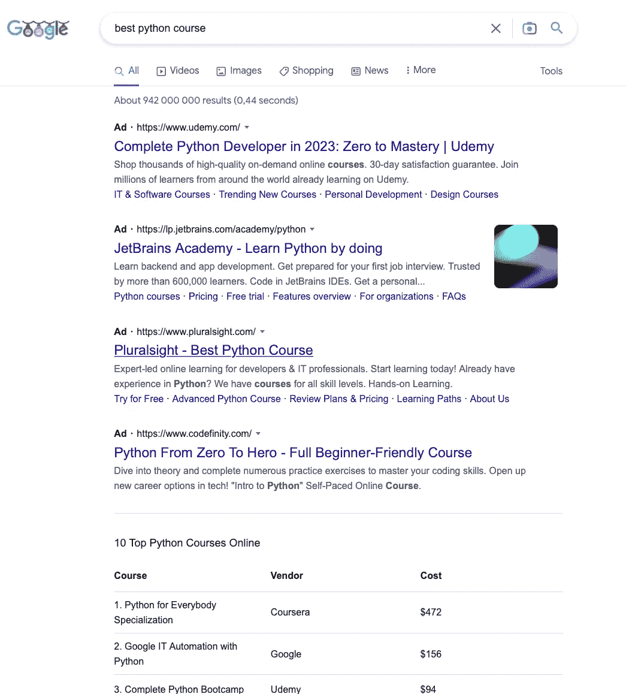
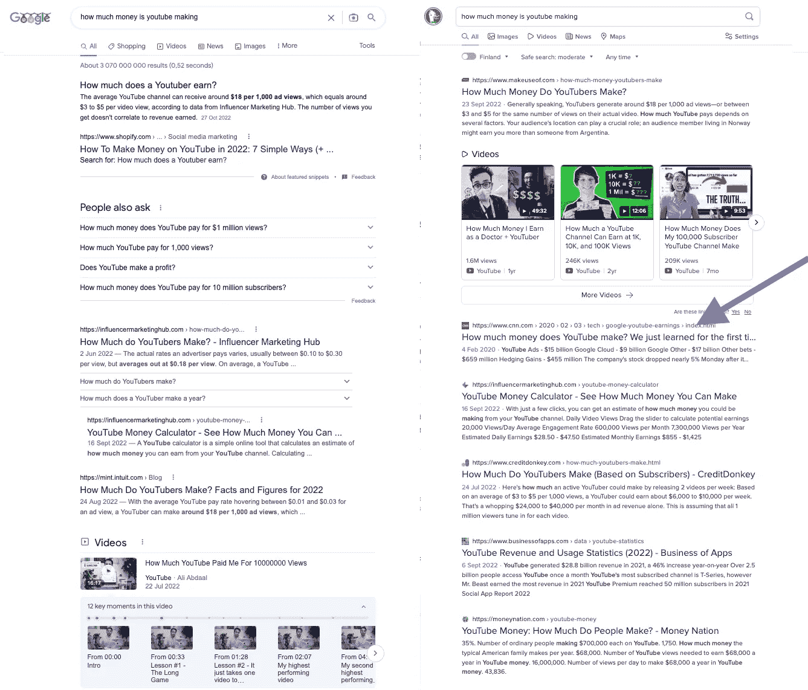
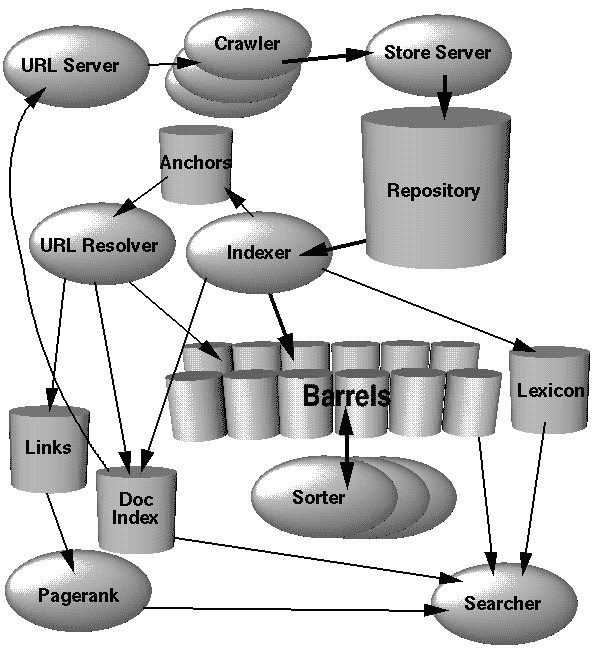

# ChatGPT 能取代 Google 吗

> 原文：<https://levelup.gitconnected.com/can-chatgpt-replace-google-6a2c5c484082>

谷歌搜索面临许多威胁，但 ChatGPT 不在其中


兰迪·塔兰皮在 [Unsplash](https://unsplash.com?utm_source=medium&utm_medium=referral) 上的照片

11 月 30 日，OpenAI 发布了 ChatGPT 测试版。一周之内，它在内容创作领域掀起了一场迷你风暴。

当它公开发布时，基于 ChatGPT 的应用程序将遍布全球只是时间问题。非技术世界也会很快赶上它。

与此同时，微软的竞争对手可能会开始积极推动他们的工程经理拿出他们的人工智能武器。如果没有，他们将建立一个战略，以应对由人工智能生成的内容主导的新世界。

现在，我正在享受一个似曾相识的时刻。

# 谷歌和微软的赵雨菁时刻:

90 年代末，微软在与美国司法部的反垄断诉讼中败诉。它对网景浏览器(Mozilla Firefox 和 Javascript 之父)的死亡负有责任，并通过强迫他们使用 Internet Explorer 非法垄断了 Windows 用户市场。

微软在网络领域的谨慎举措，加上其持续的诉讼责任，确保了网络空间不会被一家公司垄断。

谷歌利用了市场空白。基于其高度相关的搜索引擎，谷歌建立了一个巨大的网络形象，还开发了 Chrome (2008 年)。与 90 年代的浏览器不同，它可以不受阻碍地访问所有平台(包括 Windows ),并很快成为世界上事实上的浏览器。

在这样做的时候，Chrome 服务于一个许多用户没有意识到的不可告人的动机:当用来浏览 GMail(2004 年制造)和其他谷歌应用程序时，它变得更加精简和高效，以堆积谷歌的库存:

*个性化的用户数据。*

今天，随着微软支持的 OpenAI 在 GPT 的发布，互联网提出了一个谷歌不愿回答的问题:

> 聊天 GPT 能取代谷歌吗？

# 谷歌搜索正在从相关性排行榜上掉出:

谷歌最主要的收入来源是搜索。

不管有没有 ChatGPT，这个消息对谷歌都不是好事。它的搜索结果不稳定。人们正在发现这一点。

以下是我个人经验的 5 点总结:

## #1:谷歌搜索结果只有广告，很少或没有有机搜索结果:

诚然，谷歌的搜索平台是广告驱动的。很长一段时间，广告只占据了头把交椅。

这变得更糟，广告开始占据更大的面积。通常，它们占据了整个页面，却没有有机的条目。



来源:作者截图

谷歌的网站管理员宣言曾经说过，要想在搜索结果中名列前茅，一个网站需要在文件夹下放置相关内容。折叠大约是用户滚动之前的第一个可见页面区域。

> 谷歌违反了规定

不遵守这一规则的网站(例如，其顶级关键词*在*之下，而*不在*之内)在谷歌搜索排名中排名下降。

谷歌违反了自己的规则，当用户在寻找有机来源时，它给广告商的链接让出了更多/完整的空间。

## #3:搜索引擎优化迷的游戏:

当我建立我的第一个 WordPress 博客时，我的任务是在搜索结果中名列前茅，而不用向谷歌支付一分钱。(那时，我相信它对有机结果的偏好)

结果是，我不够好。但是我注意到的事实是，有大量的 WordPress 插件保证了第一的位置，一些网站管理员似乎利用这些工具+联盟营销赚了数百万。

他们的秘制酱？谷歌友好的搜索引擎优化。

他们使用的简单技术是在网页的相关位置填充关键字(在第一段，所有的标题和副标题，等等)。内容是否满足用户的搜索查询并不重要。

例如，在早期，WikiHow 上的许多内容曾经毫无意义，但它却高居搜索排行榜之首。

## 第四名:YouTube:

如今，那些待办网站已经被取代/排名下降。猜猜谁取代了他们？YouTube。

现在，我明白了 YouTube 是谷歌早该有的摇钱树。谷歌以不到 10 亿美元的价格收购了它。它终于实现了它的真正价值。2019 年[财务报告](https://edition.cnn.com/2020/02/03/tech/google-youtube-earnings/index.html)显示，仅在那一年，YouTube 就为谷歌赚了 150 亿美元。

但谷歌不(想)明白的是，导航到 YouTube 会有摩擦。最近，很多，由于谷歌贪婪的广告算法。如果去 YouTube 仍然值得，用户会很乐意看广告。

这将是值得的搜索条件，如:“如何修复汽车轮胎”。

它不太相关，比如:“如何创建 excel 公式。”

然后就没意义了。当用户打算复制粘贴(例如“ *Linux 文件同步命令*”)的时候，去 YouTube 看一个 20 秒的广告，就像是每天去你当地的警察那里，只为了验证你的护照有效期还在未来。

## 第五名:达克达克戈:

说到相关性，DuckDuckGo 赢了。我试着问“YouTube 赚多少钱”。讽刺的是:谷歌不知道。



来源:作者截图

## #6:杂项:

有时，谷歌的搜索结果很难满足用户的期望。例如，对于[引用的(那些用“”括起来的)查询](https://news.ycombinator.com/item?id=27052634)，它不能给出任何结果。

在其他时候，死亡互联网理论的支持者声称，整个搜索引擎优化游戏是被操纵的，互联网的大部分都是假的:

```
Large proportions of the supposedly human-produced content on the internet are 
actually generated by AI networks in conjunction with paid secret media 
influencers in order to manufacture consumers for an increasing range of 
newly-normalized cultural products.
```

# ChatGPT 能取代 Google 搜索吗？

OpenAI 的最新发明让全世界都在谈论。标题中的问题是整个社交媒体的趋势，所以我不透露来源。

ChatGPT 不会很快取代谷歌搜索。这并不是因为 ChatGPT 不能上网，缺乏近期信息。

它不会取代谷歌的原因是它与谷歌不同。提供类似 Google 服务的架构观点需要一组不同于 ChatGPT 中使用的选择。

ChatGPT(及其前身 GPT)的目的是:

*   文本信息之外的含义——就数据和情感而言
*   根据意图(用户询问的内容)和上下文(已经讨论过的内容)生成响应

谷歌搜索的目的是提供基于关键词输入的信息。

*   它本身不会产生任何信息。
*   以近乎实时的方式提供基于不断增长的 web 内容的结果

然而，为了理解这种差异，我们必须深入研究 Google 搜索和 ChatGPT 的工作原理。

让我们深入研究一下。

# 谷歌搜索的工作原理:



谷歌架构(来源:[斯坦福大学](http://infolab.stanford.edu/~backrub/google.html)

*   在一个非常高的层面上，谷歌搜索只是一个网络爬虫加上一个巨大的数据库索引。这个指数还在不断增长。
*   Crawler 定期搜索万维网，并将更新的 URL 添加到其数据库中。
*   **最重要的是:**它在那些页面上存储了所有完整的 web 文档，由网站管理员提供的关键字作为关键字。这是通过 HTML 锚文本和 meta 标签完成的。每次用户搜索“巡洋舰滑板”，谷歌*几乎*都会挑出所有以“**巡洋舰滑板**”为关键词的页面(如**abc.com**和**pqr.com**)。
*   更重要的是:除了网页内容，谷歌还存储了历史上最接近可信度的基准:反向链接**得分**。如果 abc.com/about 的**有 50 个指向它的链接(称为反向链接)，这个数字将被存储为 abc.com/about.html**数据库记录的一部分。如果**pqr.com/about**有 29 个链接指向它，那么这个数字也存储在**pqr.com/about**数据库记录中。然后，这被转换成一个复杂的图形，其细节太复杂了，本文无法涵盖。****

我们还没完。最重要的部分是对这些候选页面进行排序，这使得只显示与用户最相关的结果成为可能。这项工作是由谷歌著名的核心算法 Pagerank 执行的，该算法由谷歌创始人拉里(Larry)和谢尔盖(Sergey)撰写。

该算法的[详细解释](https://en.wikipedia.org/wiki/PageRank)使用了先进的数学概念，超出了本文的范围。下面的总结足以理解它的目标。

*   在数百万几乎被谷歌收录的网页中，只有少数幸运者幸存下来。这些是具有正确的关键词密度(但不是过度填充，这在 21 世纪初是常见的)，无害的内容(根据谷歌的指导方针)，没有两面性(即抄袭)，以及其他几个可信度标准的网站。
*   Pagerank 然后使用各种分数处理页面，反向链接是其中之一。
*   除此之外，在过去的十年里，作为 AMP 框架的一部分，Google 制定了一些强制性的标准(例如 DOM 标准化、页面加载时间、不要放置太重的 javascript 等)。)的可搜索性。
*   具有通过所有过滤器的最高分数的一个被放置在顶部。
*   以上所有仅适用于**有机搜索结果**。当网站管理员为某些关键词向谷歌付费时，只要用户与活动人口统计相匹配，并且网站管理员的预算没有用完，网站就会获得第一名。如果它碰巧也是顶部的有机结果，那么它享有双重位置(这在大多数情况下是正确的，但我最近无法验证它)

基于我们的原始示例，搜索“巡洋舰滑板”将导致**abc.com**成为最热门的搜索结果，击败**pqr.com**。

同样，上面的解释对于本文的范围来说过于简单了。随着时间的推移，谷歌的原始算法不仅发生了变化，而且还得到了一些基于人工智能的自然语言理解+世代细微差别。

例如，谷歌搜索，通过其 MUM AI 模型，可以[检测到](https://mashable.com/article/google-suicide-domestic-violence-ai-prevention)搜索用户是否试图寻找自杀的方法，并可以提供精神帮助，而不是满足他/她的查询。

# ChatGPT 的工作原理:

我还没有深入了解 ChatGPT 如何从用户查询中获取意义并提供有见地的答案。然而，我将试图从一个外行的角度剖析它的制作。

任何人工智能模型都是在已知输入->已知输出的情况下建立的。这就是它如何推导出它的规则。

例如:

```
x = 3, y = 9\.  => y = 3*x, right?
x = 4, y = 16\. => wrong, y = 4*x.
x = 5, y = 25\. => wrong again, y = 5*x
```

最终，人工智能模型不用多久就会知道:

```
y = square(x)
```

这与训练一只狗去带球(用食物奖励它)而不是拿棍子(用同一根棍子惩罚它)没有太大区别。

## 一个基于人工智能的聊天机器人，在一个非常高的层次上，包含以下内容:

**解析器**:这是通过标记化(将句子分成动词、名词、宾语和主语)来完成的

**情感分析器:**根据单词的顺序，判断有无“！”等符号还有“？”，和其他音调指示器，情感可以被教导。情绪分析器通常会发出一个分数:*正面或负面情绪分数*。更细致入微？*愤怒得分:0.8，沮丧得分:0.2，挖苦得分:0.4。*

**反馈循环:**在训练聊天机器人模型时，信号的制作者向它输入已知的文本输入，并将预期的结果标记为正确/错误。

例如，假设一个数据模型有 3 个输入:

```
“Peter ate the banana angrily” (subject = Peter, Verb = eat, object = banana)
“Joanna ran the sprint hastily” (subject = Joanna, Verb = run, object = sprint)
“The elephant saved the child carefully.” (subject = Elephant, Verb = save, object = child)
```

在用这些对发信号通知足够多的句子之后，模型将对句子结构和术语有足够的了解。当被调用时，它将根据需求给出期望的输出。(例如*乔安娜救了香蕉——*搞笑，但是根据它学的造句没有错。)

这已经够简单了。但人工智能的真正用途是当它被训练成从以下句子元组中推断各种语言现象时:

```
The pavement was wet and slippery. (**cause**)
A sign board told visitors to walk carefully (**possible outcome**), 
or they would slip and hurt themselves. (**effect of wetness + falling**)

It rained heavily last night. (**cause**)
The river was overflowing. (**effect of water flow**)
The collector issued the flood warning (**consequence**)
```

在上面的例子中，潮湿会伤害人，但它会产生各种其他结果，如草地的生长。所有这些现象都只是语言模型的原始数据输入( **<键> <值>** 对原因、效果、后果等等)，语言模型打算使用它们变得强大。

> 更大更广泛的模型更强大。然而，它们的计算量很大。

越多这样的比特输入到模型中，模型就变得越厚。与此同时，使用它的计算成本也变得很高。根据 Twitter 的估计，免费的 ChatGPT 测试版每月花费 open ai 300 万美元，很快就会变成数十亿美元。

在某个时候，微软将有意义地从其渴望人工智能的客户群中提取成本。

## 自然语言生成(NLG)阶段:

这相对更简单，因为它包含了以前输入的相同语言规则。这一次，它生成响应内容。它所需要的只是一本合适的字典。可选地，它可以来源于基于使用的任何词典或语言存储库，例如研究期刊、杂志等。

NLG 阶段的一个重要部分是做适当的情绪管理。比如 AI 不应该为了回应愤怒的用户输入而吐槽愤怒的输出等等。它也应该没有歧视的偏见。

ChatGPT 接受了 1750 多亿个参数的训练，这意味着它具有处理各种语言输入的广泛能力。因此，它知道研究论文和大量文献的内容，能够推断它们的意义，也能写故事和好诗。

# 为什么大家都在问 ChatGPT 取代 Google？

谷歌的可替代性问题是由它自己的行为引起的。

为了利用它的主导地位(并防止用户离开它)，谷歌开始从论坛(Quora)、新闻网站、教程网站、维基百科和它最喜欢的子 YouTube 中嵌入内容。这种做法也导致了它与出版社的法律纠纷。

> 世界开始下意识地把谷歌当成聊天机器人。

结果，大多数用户开始把它作为一种即兴问答工具，而不是在被称为万维网的复杂的链接迷宫中导航。

> 谷歌可以回答任何问题。
> 
> -普通网络搜索者

它通过安卓、默认设置(谷歌在 iOS 和安卓系统中都是默认设置)和 Gmail 应用程序深入人们的生活，进一步强化了这一点。

正是在这个意义上，许多用户感到谷歌的存在正受到 ChatGPT 的威胁。

# 结论:

我已经探索过 [ChatGPT 能否写小说](https://tipsnguts.medium.com/can-chatgpt-write-a-novel-1f98180f16a1)。ChatGPT 的强大之处在于它对人类语言的理解，并基于数百万页的文本内容生成响应。

搜索(寻找来源、过滤、排名和展示)与解释不同——这是 ChatGPT 擅长的任务，尽管有其不完美之处。

凭借其市场份额，谷歌搜索没有面临任何直接威胁。这部分也是由于其庞大的用户行为+研究数据库存。凭借其强大的技术基础，它可以极其灵活地进行调整。

然而，ChatGPT 作为微软的宝贝，最终会找到进入 Bing 的方法。自从微软在 2000 年代的网络失败以来，谷歌搜索一直在所有平台上获胜——这部分归功于它与苹果的霸权(苹果允许它成为 iOS 的默认搜索引擎，每年支付可观的费用——这是在美国反垄断扫描仪下的一笔交易)。

由于有偏见的人工智能(ChatGPT 也有这种担忧)日益逼近的诉讼威胁，谷歌已经决定从现在开始反对任何新的人工智能搜索举措。

得出结论，如果:

*   由于 ChatGPT、*和*，Bing+ /其他微软企业级产品提供了更多的性价比
*   DuckDuckGo 设法取得重大进展(可能导致微软收购它)

…对于谷歌搜索来说，道路会很快变得陡峭。

随着人类可用人工智能的到来，潮流将在当前十年内发生转变。

想为 Medium 写作？还是读完介质上的每一个故事？

使用此链接成为会员[。你的会员费的一部分将支持笔磁铁的写作。](https://tipsnguts.medium.com/membership)

想在每次 Pen Magnet 发布时收到电子邮件吗？[点击这里加入他的订户名单](https://tipsnguts.medium.com/subscribe)。

[**笔磁**](https://tipsnguts.medium.com/) 是流行的高级开发者访谈电子书的作者:

[**高级开发人员面试综合方法(40+例题)**](https://tipsnguts.gumroad.com/l/crrzat/)