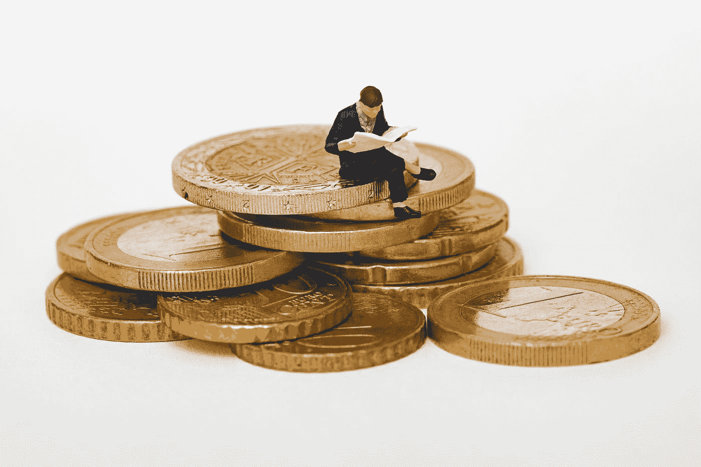

# 数据科学能预测股市吗？

> 原文：<https://levelup.gitconnected.com/can-data-science-predict-the-stock-market-2f559c221032>

## 数据科学已经能够预测人类行为，那么为什么不能预测股票市场呢？

尼古拉斯·卡佩罗在 [Unsplash](https://unsplash.com?utm_source=medium&utm_medium=referral) 上拍摄的照片

无可争议的是，数据科学并没有成为人类行为的伟大预测工具。

这一点从社交媒体如何根据你最近的在线互动向你展示文章、视频和要购买的产品可以明显看出。

同样明显的是，网飞知道如何推荐你应该疯狂观看的电视剧。

# 数据科学能预测股市吗？

## 对什么是数据科学的简要描述

照片由[皮埃特罗·詹](https://unsplash.com/@pietrozj?utm_source=medium&utm_medium=referral)在 [Unsplash](https://unsplash.com?utm_source=medium&utm_medium=referral) 上拍摄

对于那些可能不熟悉术语“ ***数据科学*** ”的人，请允许我简要地阐明这一点。

数据科学是收集数据并为公司和企业分解这些数据。

数据科学可以从注意到一家制鞋公司因为某种风格而增长 30%引起注意，预测母亲在一年中分娩次数最多的时间。

**数据科学**可以提供帮助(这只是几个例子):

*   帮助推进和个性化医疗保健
*   帮助管理交通
*   有助于预测犯罪，从而防止犯罪发生
*   协助组建运动队

看到数据科学在不同领域的益处，华尔街试图利用这一高度专业化的学科赚钱就不足为奇了。

## 华尔街希望利用数据科学

杰里米·贝赞格在 [Unsplash](https://unsplash.com?utm_source=medium&utm_medium=referral) 上拍摄的照片

可能让许多刚刚进入数据科学领域的人感到惊讶的是，华尔街自 20 世纪 80 年代以来一直在雇人尝试预测股票市场。

最初取得了一些成功，但在前进的道路上也有许多障碍。

即使我们中的许多人，尤其是在美国，为自己的个性感到自豪，我们的许多选择也是可以很容易预测的。

实际上，我们是例行公事的动物。正因为如此，跟踪我们的购买，以及何时、何地，甚至如何购买。

互联网和 cookies 使得企业可以更好地收集民众的数据。

## 寻找替代数据

[M. B. M.](https://unsplash.com/@m_b_m?utm_source=medium&utm_medium=referral) 在 [Unsplash](https://unsplash.com?utm_source=medium&utm_medium=referral) 上拍摄的照片

这些“ ***替代数据*** 可以概括为:

*   手机使用
*   社交媒体活动
*   网站访问
*   产品评论
*   信用卡交易
*   卫星技术
*   新闻来源

## 那么，科学是否指向数据科学能够预测股票市场

照片由[大卫·普帕扎](https://unsplash.com/@dav420?utm_source=medium&utm_medium=referral)在 [Unsplash](https://unsplash.com?utm_source=medium&utm_medium=referral) 上拍摄

答案是一个响亮的是！

麻省理工学院最近的一项研究显示，计算机的表现比人类高出 57%。

“替代数据是这些奇怪的代理信号，有助于跟踪一家公司的基本财务状况，”第一作者迈克尔·弗莱德说，他是信息和决策系统实验室(LIDS)的博士后，在麻省理工学院新闻文章中发表。“我们问，‘你能不能将这些嘈杂的信号与季度数据结合起来，以高频率评估一家公司的真实财务状况？’结果答案是肯定的。"

## 有趣的事实:这是华尔街数据科学家的收入

马修·斯特恩在 [Unsplash](https://unsplash.com?utm_source=medium&utm_medium=referral) 上的照片

根据他们的技能和经验，一个典型的 ***华尔街数据科学家*** 一年能挣 15 万美元左右！

然而，那些加入数据科学训练营的人甚至可以赚得更多！

## 想成为数据科学家？

照片由[this engineering RAEng](https://unsplash.com/@thisisengineering?utm_source=medium&utm_medium=referral)在 [Unsplash](https://unsplash.com?utm_source=medium&utm_medium=referral) 上拍摄

那么你是想成为一名数据科学家，还是想提升自己的技能？

以下是 21 个数据科学最佳在线训练营**！**

**#数据科学#数据美丽#数据**