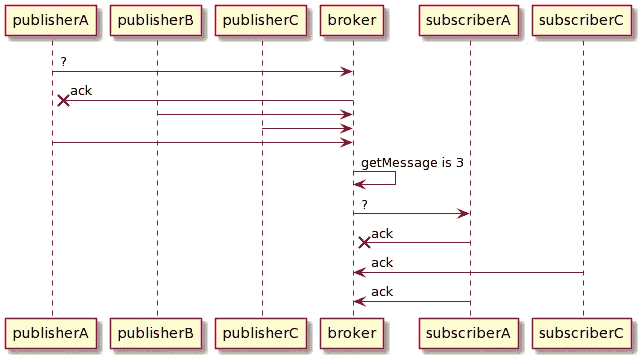
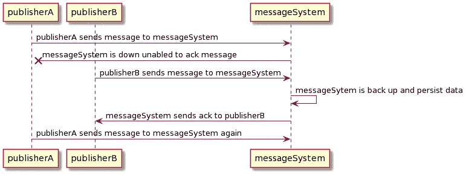
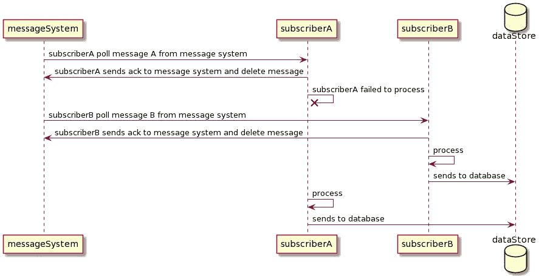
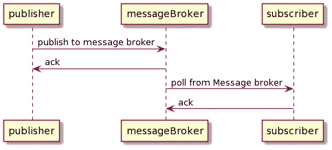
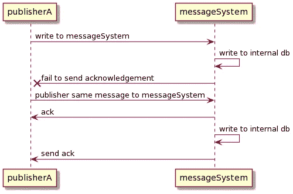
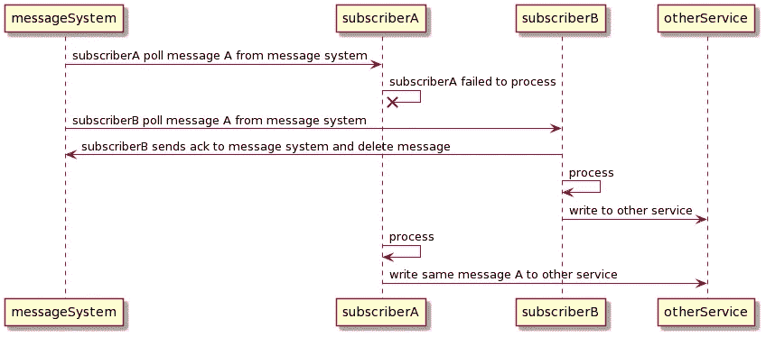

# 实际系统中是否存在一次性处理队列？

> 原文：<https://levelup.gitconnected.com/can-exactly-once-processing-queue-in-real-systems-even-exist-b5eacc77ab83>

## 您如何设计您的应用程序将决定该属性是否有保证。

由作者提供

FIFO 队列是一个消息队列，它保证只传递一次，在接收端没有重复的消息。这个属性听起来很简单，但是在分布式系统环境中很难实现。

如今，很多云技术已经将所有分布式系统组件抽象成我们理解的术语。然而，即使他们可以推销他们的服务或消息队列是 FIFO 队列，对这些属性仍然有某些限制。你不能仅仅依赖他们的一次性消息传递和 FIFO 队列服务，也不能像通常那样水平地设计你的系统，因为在那个环境中可能不具备这样的特性。

在本文中，让我们深入研究 FIFO 队列的属性，我将带您了解破坏这些属性的三个简单场景，以及如何解决这个问题。在本文的最后，您可以自己确定 FIFO 队列属性是否可以存在于分布式系统中。

# 现实世界中的 FIFO 队列

FIFO 队列是按先进先出顺序排列的消息队列。这意味着您发布到消息队列的任何消息都将按照发布的顺序进行检索。

这听起来很容易理解。我们经常在 101 课程中学习创建一个队列来回答算法问题。我们意识到顺序在先进先出的方式中很重要。这也意味着—检索时不会有重复的消息。

因此，我们可以得出结论，FIFO 队列的两个主要属性是——消息以先进先出的方式排序，以及系统中没有重复的消息。

# 消息排序

在单一环境中创建 FIFO 队列非常简单。单个发布者发布到消息系统，单个订阅者订阅消息系统。发布者会等到订阅者确认消息后，再将消息发送到下一个值。

在上面的场景中，我们有一个发布者线程和一个订阅者线程。我们可以通过某种时间戳或序列 id 来保证消息是有序的。

然而，在多个并发的发布者和消费者环境中，消息排序很难实现。为什么？让我们看看下面的场景，我们有许多发布者和一个订阅者，以及多个订阅者和一个发布者。

在多发布者环境中，导致消息乱序的一种情况是每个发布者都向消息代理发布消息。代理通常需要确认他们已经收到了来自订阅者的消息，否则消息将会丢失。如果代理服务器关闭，发布者通常会再次向代理发送消息。

假设您有两个发布者——发布者 A 和发布者 b。发布者 A 在发布者 b 之前向消息系统发送带有时间戳的消息。当发布者 A 向代理发送消息时，代理由于某些内部服务器错误而未能确认该消息。几次过后，它又回来了。同时，发布者 B 将其消息发送给消息代理。消息代理从发布者 b 接收消息。然后，发布者 A 以重试的间隔再次向消息代理发送消息。我们有一个订单信息不匹配。

由作者提供

为了实现消息排序，多个发布者需要相互协调先发送哪条消息。有两种方法可以做到这一点:要么发布者相互协调以附加一个顺序概念，要么消息系统必须确保每个传入系统的顺序概念。无论哪种方式，我们都需要一种集中的方法来获得时间戳概念，以避免时钟漂移和序列 id，从而提供一致性。我们可以有一个协调系统，如 Zookeeper，来协调消息发送后的订单交付。然而，上述解决方案意味着我们需要将我们的吞吐量限制在一次一个发布者。

再来看接收端。如果我们有多个订阅者订阅一个队列，可能会出现消息乱序的情况。如果您有两个订户—订户 A 和订户 b，在订户 A 确认它从队列中轮询的消息后，实例死亡。同时，订户 B 从队列中接收下一个即将到来的消息，接受并处理它。一旦订户 A 备份，它就处理该消息。在这种情况下，系统违反了字母排序属性。

由作者提供

我们还可以使用与发布者场景相同的解决方案，其中一个订阅者将等待前一个订阅者完成处理，然后轮询下一条消息。在这种情况下，我们还将吞吐量限制为一次一个订户。

从上面的两个例子中，我们知道创建消息排序的解决方案是限制一次一个发布者和订阅者的吞吐量。假设 publisher 的多个线程异步发布到同一个消息系统。那样的话，秩序就没有意义了。根据发布者的计划时间，消息显示在队列中。在订户端，我们需要一次处理一条消息，以避免任何混乱。

# 恰好一次消息

为了得到一个恰好一次的消息，我们不希望在消息系统中复制数据。让我们从同步环境的角度出发，深入研究多个发布者和订阅者场景。

同步环境中很少会出现重复消息。发布者一次可以发布一个数据；一旦收到前一个，就发布下一个，以确保代理中没有重复的数据。在用户端，我们一次接收一个数据。因此，不会出现信息被多个订户接收的任何竞争情况。

由作者提供

在多发布者环境中，我们可以看到重复数据是如何出现在消息系统中的。假设多个发布者发布到消息队列。如果消息代理由于某个发布者不可用而未能向其发送确认，那么他们将多次重试系统以避免消息丢失。

由作者提供

解决这个问题的一个方法是创建一个相关标识符。相关标识符将是标识消息上的幂等键的 id。因此，如果消息系统接收到相同的相关标识符，它知道它之前已经被接收过。例如，亚马逊 SQS 将 FIFO 队列中的`deduplicationId`用作关联 id。但是，它有 5 分钟的过期时间。如果发布者在 5 分钟后发送第二条消息，消息代理不能保证它是否拒绝重复的消息。

另一方面，在多个用户中几乎不可能实现一次交付。然而，即使您可以在传输层上确保一次，您可能也不希望这样。如果消息代理在订阅者收到消息后立即删除它，那么即使在订阅者处理数据之前，仍然有崩溃的可能。在这种情况下，您希望消息系统再次传递消息。

由作者提供

接收复制消息恰好一次处理是可能的。让我们来看一个场景:订户 A 收到了来自代理的消息。就在订户 A 将要删除消息之前，订户 B 轮询代理的消息。因此，订户 B 将具有与订户 a 相同的消息。对此的一个解决方案是在接收器端创建持久存储。订户可以在每次轮询期间将传入消息写入持久存储。一旦成功写入存储，它将从消息代理中删除队列。持久存储将防止重复值。同时，将有另一个消息处理异步运行的后台线程来处理这些消息。这个概念类似于各种数据库系统如何使用预写日志来存储提交。

# 关闭

单一环境中的 FIFO 队列很容易理解。然而，在分布式环境中，系统可以通过让单个发布者一次发布一个消息来实现 FIFO 队列，以提供排序并创建防止消息复制的系统。

如果你设计的系统可以处理上述两种情况，那么你的 FIFO 队列可以存在于分布式系统中。如果您不能在队列中提供这两个属性，您的系统就不能进行一次性处理。

现在，你告诉我，在整个系统中能确切地——一次性处理事件存在吗？

**感谢阅读！如果你喜欢这篇文章，你可以关注我，也可以关注我的** [**中型**](https://medium.com/@edwardgunawan880) **更多类似的文章。**

*最初发表于*[*https://edward-huang.com*](https://edward-huang.com/distributed-system/architecture/cloud/2021/02/15/can-exactly-once-processing-queue-in-real-systems-even-exist/)*。*