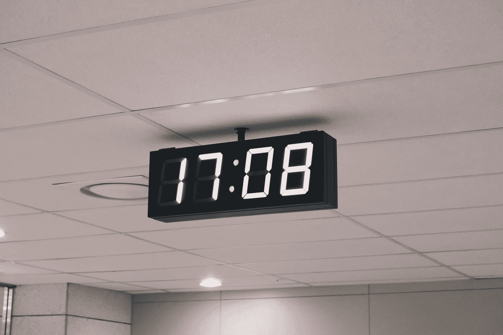
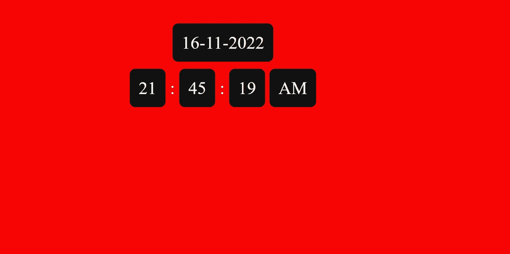

# 我可以用 HTML 编写一个数字钟吗

> 原文：<https://levelup.gitconnected.com/can-i-code-a-digital-clock-in-html-79074b2c10ef>

## 是的，你可以。让我们看看如何！



[敏库康](https://unsplash.com/@minkus?utm_source=medium&utm_medium=referral)在 [Unsplash](https://unsplash.com?utm_source=medium&utm_medium=referral) 上的照片

# 超文本标记语言

## 我在这里做什么

创建一个容器来放置时钟。我正在屏幕中间的一个盒子里定位时钟。我正在使用 ***外部样式表*** 和 ***JavaScript*** 的方法为 CSS 和 JavaScript 定义相应的文件。

```
<!DOCTYPE html>
<html lang="en">

<head>
  <meta charset="UTF-8">
  <title>Digital Clock</title>
  <!--Referencing a CSS Style Sheet-->
  <link rel="stylesheet" href="./style.css">
</head>

<body>
  <!--Creating a small container for the clock to stay in-->
  <div class="container">
    <div class="clock"></div>
  </div>
 <script  src="./script.js"></script>
</body>

</html>
```

## 长话短说

这是为那些没有耐心阅读整篇文章的人准备的，他们是来复制粘贴代码的。下面，我总结一下 HTML 页面。

*   使用 div 标签创建容器。
*   引用 CSS 和 JavaScript 文件。

# 半铸钢ˌ钢性铸铁(Cast Semi-Steel)

## 我在这里做什么？

这是主观的，你可以根据自己的要求来设计。我不是设计狂，所以我会保持简单。此外，解释 CSS 代码的每一行是不必要的，因为它们是不言自明的。下面的文章解释了一些最常用的 CSS 属性。

[](https://www.tutorialrepublic.com/css-reference/css3-properties.php) [## CSS3 属性

### 下一节包含 CSS3 属性列表和简短描述。以下部分包含…

www.tutorialrepublic.com](https://www.tutorialrepublic.com/css-reference/css3-properties.php) 

```
body {
  background-color: rgb(246, 4, 4);
  color: #fff;
  padding-top: 100px;
}

.container {
  display: flex;
  justify-content: center;
}

.clock {
  font-size: 2em;
}

span {
  background-color: #111;
  border-radius: 10px;
  color: #fff;
  display: inline-block;
  margin: 0.2em 0;
  padding: 0.5em;
}
```

## 长话短说

*   设计容器——基本上按照你的要求粉刷墙壁。

# Java Script 语言

## 我在这里做什么？

这里让我们使用两个内置的 JavaScript 函数`date`和`time`。以下是解释。

## **日期**

我们将使用`date`函数在 JavaScript 中创建一个对象，该对象将为我们提供您正在使用的系统的当前日期和时间。下面是语法

```
var date = new Date();
```

要获得`date-month-year`格式的日期，您可以使用。

```
var date = today.getDate()+'-'+(today.getMonth()+1)+'-'+today.getFullYear();
```

**语法**

*   `getDate()` —提供一个月中的某一天。值的范围从 1 到 31。
*   `getMonth()` —提供当前月份。值的范围从 0 到 11。其中 0 代表一月，11 代表十二月。
*   `getFullYear()` —提供当前年份。

## **时间**

通过使用下面给出的函数，你可以得到当前系统的`h:i:s`格式

```
today = new Date();
var time = today.getHours() + ":" + today.getMinutes() + ":" + today.getSeconds();
```

*   `getHours()` —提供 0–23 之间的当前小时。
*   `getMinutes()` —提供 0–59 之间的当前分钟数。
*   `getSeconds()` —提供 0–59 之间的当前秒数。

## **在 Javascript 中使用日期和时间函数**

对于上面讨论的函数，现在我们可以将这些函数包含在下面。

```
const clock = document.querySelector('.clock');

// Assigning time values to constants 
const tick = () => {
  const now = new Date();
  let h = now.getHours();
  const m = now.getMinutes();
  const s = now.getSeconds();
  let am_pm = 'AM';

  var today = new Date();
  var date = today.getDate()+'-'+(today.getMonth()+1)+'-'+today.getFullYear();

// Defining html for digital clock
  const html = 
  `
  <center><span>${date}</span></center>
  <span>${h}</span> : 
  <span>${m}</span> : 
  <span>${s}</span>
  <span class="ampm">${am_pm}</span>
  `; 

//printing html code inside div.clock
clock.innerHTML = html;
};

//refreshing clock every 1 second
setInterval(tick, 1000);
```

## 修改

如果您不想显示秒，那么您可以删除下面的`span`标签。

```
<span>${s}</span>
```

执行此操作后，您将得到一个 24 小时格式的数字时钟，要使它成为 12 小时格式，请添加下面的代码片段。

```
if (h >= 12) 
{
  h -= 12; 
  am_pm = "PM";
};

if (h == 0) 
{
  h = 12;
  am_pm = "AM";
};
```

## 长话短说

*   理解`date`和`time`功能。
*   以 24 小时或 12 小时格式显示时钟。

# 履行

要访问完整的代码，你可以访问下面列出的我的 GitHub 库。此外，我使用 GitHub 页面来部署结果。

## 密码

[](https://github.com/Tanu-N-Prabhu/digitalClock) [## GitHub-Tanu-N-Prabhu/数字时钟

### 此时您不能执行该操作。您已使用另一个标签页或窗口登录。您已在另一个选项卡中注销，或者…

github.com](https://github.com/Tanu-N-Prabhu/digitalClock) 

## 部署

 [## 数字显示式时钟

### 编辑描述

塔努-恩-帕布](https://tanu-n-prabhu.github.io/digitalClock/) 

# 结果

现在，在您最喜欢的代码编辑器中键入所有代码，并执行以下代码。一定要给它们起相应的名字`index.html`、`style.css`、`script.js`。



我的数字时钟

# 结论

如果你正在阅读这篇文章，那么它表明你已经完成/理解了本教程。让我知道如何感受它。此外，使用注释部分删除您修改过的数字时钟版本。我觉得总有进步的空间。感谢阅读我的文章。敬请关注更多内容。快乐编码。