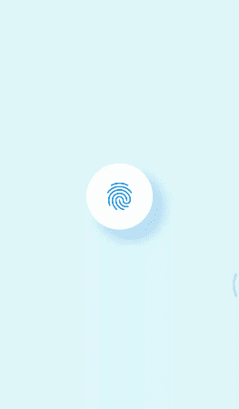

# 在颤振中能做到吗？

> 原文：<https://levelup.gitconnected.com/can-it-be-done-in-flutter-2e5a8fe966f8>

最近我遇到了这个动画挑战，有人在 twitter 上发布了这个挑战，是用 SwiftUI 制作的。

这个挑战在 React Native 中已经由 [**威廉·坎迪隆**](https://www.youtube.com/watch?v=_s8JbxZx4aA) ( [威廉·坎迪隆](https://medium.com/u/4bdbd6b3a30a?source=post_page-----2e5a8fe966f8--------------------------------) ) 完成了。所以我从他那里得到了灵感，在 Flutter 中也这么做了。



最终动画

这里发生的事情不多，对吧？长按的话，一些小工具就是这么简单的动画。让我们快速分解一下动画在改变什么。

1.  圆形尺寸
2.  圆形进度条
3.  指纹图标进度

所有的动画在这里同时发生——这些动画的真实的单一来源，控制器在每一帧上提供新的值，我们的小部件得到重建。让我们找出密码。

动画控制器

对于动画，我们要扩展**SingleTickerProviderStateMixin**哪个 AnimationController **vsync:这个**引用它。补间<双>动画在制作动画时，在 400 毫秒的持续时间内提供值 0…0.2…0.5…1。 **AnimationStatusListner** 将在动画运行、结束或丢弃时监听状态。现在让我们看看真正的部分。

# 手势检测器和动画生成器

我们用手势检测器部件包装容器。长按时，将调用手势**_ onlongpresstart**方法。我们从 calling _controller.forward()运行动画，反之亦然，用于 **_onLongPressEnd** 。

```
*//checks animation is already running.* if (!_controller.isAnimating) {      
_controller.forward();    
} 
else {      
_controller.forward(from: _controller.value); 
*//animation runs from last value* }
```

如果您仔细观察动画，如果动画已经开始但尚未结束，则动画将再次从长按上一个值开始。

> **注意**:试着将持续时间减少到 3000 毫秒进行观察。

**AnimationBuilder** 小部件获取控制器参数，并在值改变时让子部件重建。至少在这种情况下，这种方法比在动画监听器上调用 setState(){}要好。

# 动画小部件

1.  **圆形比例动画**

```
Transform.scale(
 scale: ((_controller.value * 0.2) + 1),
  child: Container(
      width: 100,
    height: 100,
  )
 )
```

这非常简单，只需包装容器来转换小部件。将比例值设置为 1 意味着圆的原始大小，当值改变时，它将开始逐渐增加。

**2。** **圆形进度条**

比以前更棘手…嗯！在颤动盒中找到合适的工具。嗯…我们可以用 Flutter 创建一个自定义的。

CustomPaint 允许我们使用绘画风格和已经定义的形状在画布上绘制任何东西。

```
//let use draw only stroke instead filling whole circle
..style = PaintingStyle.strokestartAngle =-pi/2 (clockwise 12 o'lock)
endAngle = (pi * 2 * _conroller.value);canvas.drawArc(Rect.fromCircle(center: offset, radius: radius) ,startAngle,endAngle, false, p);
```

Rect.fromCircle()将根据我们提供的偏移量从中心绘制半径为 n 的圆形。这里的 startAngle 和 endAngle 会形成一个顺时针方向的弧线。最后一个对象 p 将在画布上绘制。

**3。指纹进度动画**

这是我们做的一点小改动！我们将两个图标叠放在堆栈中，随着动画的进展动态地改变高度。通过定位小部件包装 ClipRect，并在中心设置第二个图标。

> 为什么是 ClipRect 而不仅仅是容器？

首先，ClipRect 小部件做的是**裁剪出他们孩子的矩形部分。这意味着在这里，我们可以从零高度到完整的图标高度逐渐显示图标。有了容器，就不可能成为不受父约束约束的子对象。**

```
// icon will visible from bottom to top 
alignment: Alignment.bottomCenter//from zero height to full icon height       
heightFactor: _controller.value,
```

就是这样！我们已经完成了所有部件的动画制作。现在只需为我们的动画挑战画龙点睛。

# 动画状态列表器

```
..addStatusListener((AnimationStatus status) {
        switch (status) {
          case AnimationStatus.forward:
            break;
          case AnimationStatus.completed:
            isAnimationCompleted = true;
            _controller.reverse();
            break;
          case AnimationStatus.reverse:
            break;
          case AnimationStatus.dismissed:
            if (isAnimationCompleted) {
              setState(() {
                showFingerPrint = !showFingerPrint;
              });
              isAnimationCompleted = false;
            }
            break;
        }
```

我们需要做的就是当动画结束时，我们调用 _controller.reverse()来反转动画并显示复选图标。就是这样！

想在里面多加点吗？像在 SwiftUI 挑战赛中一样加入新形态设计动画。

> 欲查看完整源代码，请点击此处
> 
> 【https://github.com/gurupatel107/fingerprint_animation.git 

[](https://skilled.dev) [## 编写面试问题

### 一个完整的平台，在这里我会教你找到下一份工作所需的一切，以及…

技术开发](https://skilled.dev)