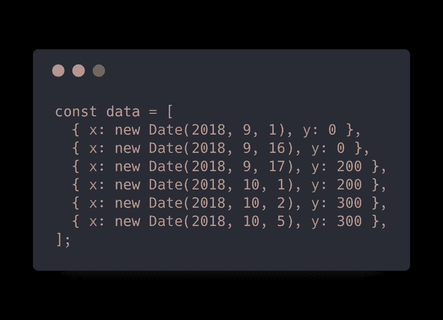
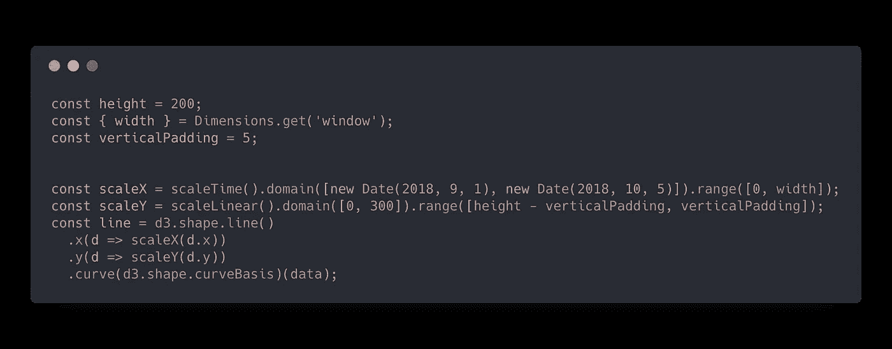
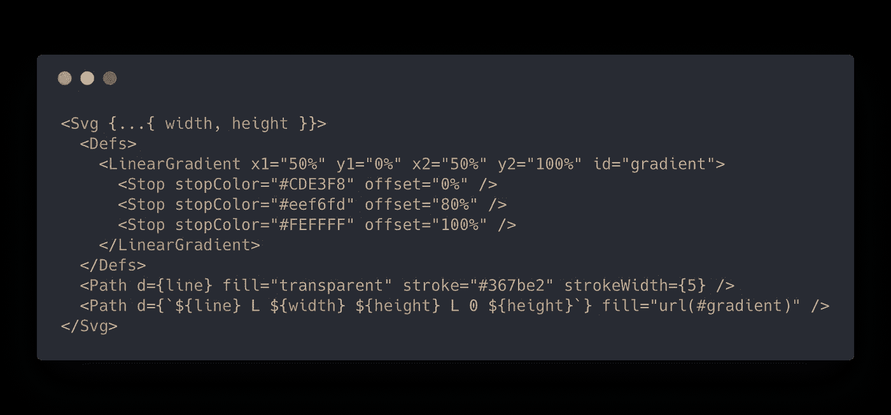
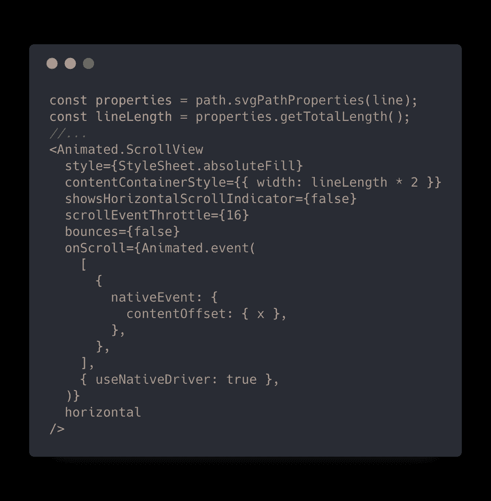
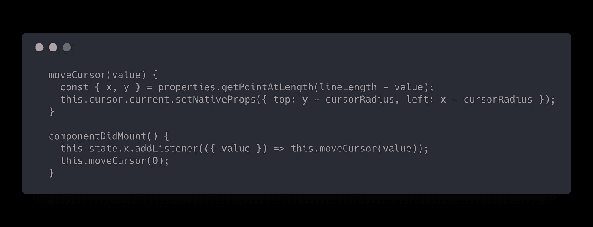
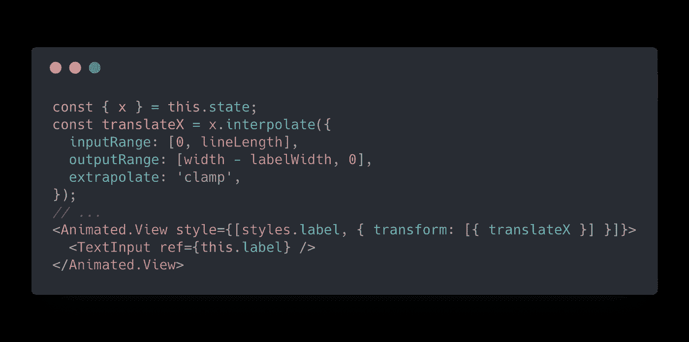
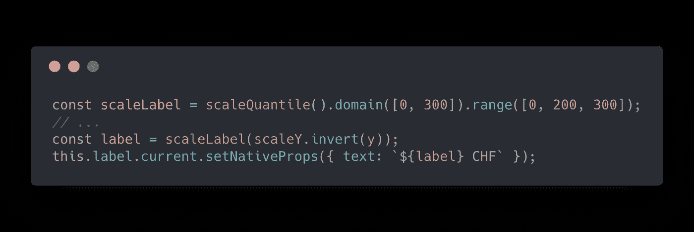

# 在 React Native 中可以做到吗？使用 D3 的旋转图

> 原文：<https://levelup.gitconnected.com/can-it-be-done-in-react-native-revolut-chart-using-d3-52cecfe93639>

在本周的视频中，我们试图复制打开 [Revolut app](https://www.revolut.com/) 时向你问候的美丽图表。

如果你有应用程序动画和效果的例子，你想知道:“它能在 React Native 中完成吗？🤔“，请[给我发投稿](mailto:wcandillon@gmail.com)。

这个例子的全部点心在[这里](https://snack.expo.io/@wcandillon/revolut-chart)都有。我们用的是 D3.js 和 React 原生 SVG。下面是我们将使用的数据。

首先，我们将使用 D3 来构建图形。我们需要将 x 和 y 值缩放到图表的宽度和高度。最后，我们使用 curve()函数在点之间进行平滑处理。

我们使用 D3 来构建图形线

我们在 SVG 中使用了这一行两次。一次显示蓝色笔划。然后，我们可以添加直线(图形容器的右侧和底部)到路径，并用线性渐变填充它。

我们用来显示图形的 SVG

接下来，我们在图表顶部有一个 [ScrollView](https://facebook.github.io/react-native/docs/scrollview) 组件，这样我们就可以在该行上滑动光标。为此，我们需要获得路径的长度。为此，我们可以使用 [svg-path-properties](https://www.npmjs.com/package/svg-path-properties) 。为了在图形线上准确地从一端滑动到另一端，所以 ScrollView 的大小需要是路径长度的两倍。当然，我们需要收听 *onScroll* 事件。

现在我们可以监听滚动值，获得 *x* 和 *y* 坐标(再次使用 svg-path-properties)，并沿着图形移动光标。我们使用 [setNativeProps](https://facebook.github.io/react-native/docs/direct-manipulation) 来移动它，而不会在 React 端触发新的渲染。

我们将光标移过图表的线条

最后一步，我们需要滑动光标上方的标签，如下所示。为了能够使用 *setNativeProps* 更新标签值，我们使用了一个*文本输入*组件，而不是*文本*。

当 scroll 为 0 时，标签位于屏幕右侧。当值为线长度时，转换为 0。

为了显示正确的标签值，我们需要使用 D3 的`scale.invert`从`y`值返回到原始值(例如 300)。反转会给我们一个连续值，我们可以通过使用新的标度将它们转换成离散值。

我们使用 scale.invert()以及带有离散值的新刻度来显示标签。

# 那都是乡亲们！

希望你喜欢这个故事。期待阅读您对此的看法。如果你想开始一个很酷的 React 原生项目，别忘了看看最全面的 React 原生初学者工具包 [React 原生草图元素](https://react-native.shop/elements)。

 [## 反应原生草图元素

### 经过两个月的制作，React 本地草图元素终于出现了。反应原生元素涵盖了广泛的…

hackernoon.com](https://hackernoon.com/react-native-sketch-elements-889f010f9626)