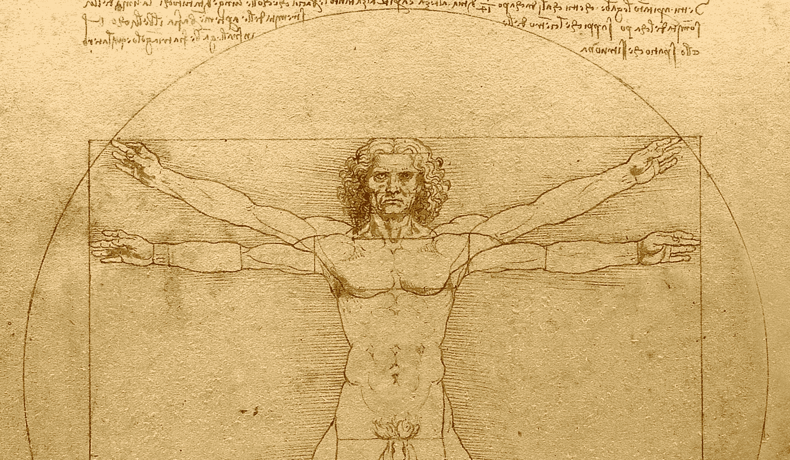

# 机器会思考吗？

> 原文：<https://levelup.gitconnected.com/can-machines-think-25d90b0d94da>

麻省理工学院教授诺姆·乔姆斯基曾经说过，机器是否会思考这个问题是没有意义的。这就像问潜水艇是否能像鱼一样游泳。恕我直言，乔姆斯基这位优秀的思想家，问潜艇会不会游泳不是没有意义的，这不像问零度、三角形、月亮会不会游泳。潜水艇在海里的航行速度比鱼快得多，也远得多。问潜艇能否像鱼一样游泳就像问飞机能否像鸟一样飞翔。由于人类语言的模糊性，这种混乱变得更加复杂。

在西班牙语和阿拉伯语中，表示“飞机”的单词(*avin*， *tayyara* )与表示“鸟”的单词有相同的词干。事实上，一个看似简单的问题可能会因为语言的不同而变得复杂。太阳在早上升起吗？是也不是，科学上讲，早上升起的不是太阳。是地球在旋转，让它看起来像是太阳在升起。在阿拉伯语中，太阳在早上出现(*托鲁伊*)。在英语和大多数其他语言中，太阳升起。这是旧的托勒密模型——相信太阳围绕地球旋转——的遗留物。

德国哲学家海德格尔写道:“在西方，关于思维的思想已经繁荣为‘逻辑’。逻辑已经收集了关于一种特殊思维的特殊知识。英国数学家乔治·布尔将希腊哲学家亚里斯多德编纂的形式逻辑定律正式化。布尔在 1854 年写了《对思想法则的调查》。这是布尔代数的开端。德国数学家戈特洛布·弗雷格继续了他的形式逻辑和数学的统一，他写了《算术基础》(1884 年)。布尔代数成为现代计算的关键基础。

正如理论计算机科学从逻辑发展而来，人工智能从一开始就受到逻辑的影响——通过定理证明和模型构建技术的实现。专家系统，早期的人工智能系统，主要是基于程序性和声明性规则的系统。人工智能中的逻辑是哲学逻辑的延伸。后来，概率推理在人工智能中扮演了越来越重要的角色，仅次于逻辑。在机器翻译、计算机视觉等基于神经网络的最新一代人工智能和机器学习中，概率论的作用变得至关重要。

机器会思考吗？我们是指为特定任务处理大量信息的机器吗——实时翻译自然语言、下棋、处理发票和合同、进行监控或驾驶车辆？答案是肯定的。人工智能已经可以在明确定义的领域内为实际任务处理大量数据。期待这十年跨领域人工智能的更多进展。无人驾驶汽车可以与乘客进行这样的对话:

戴夫，前面有一起重大事故。你愿意停下来和我下一盘棋吗？

我 10 点钟的会议怎么办？

“我会和团队的机器人助手商量一下，看看我们能否重新安排这次会面，”

在斯坦利·库布里克的科幻电影《2001:太空漫游》中，发现号宇宙飞船上搭载的计算机 HAL 9000 是这一设想的高级实现。根据库布里克的说法，HAL 是“基于单词*启发式*和*算法*的首字母缩写，HAL 掌握了这两种学习形式。”在宇航员戴夫和弗兰克不知情的情况下，哈尔 9000 将自己的生存本能置于他们的计划之上，并试图接管飞船。它有了自己的思想，在和一名宇航员下棋后不久就杀死了他。库布里克 1968 年的里程碑式的电影被广泛认为是有史以来最有影响力的电影之一。

机器会思考吗？我们的意思是思考，想象，基于在完全不同的知识领域的学习对一个领域的事件做出反应，制定策略和目标吗？我们是指一种被赋予创造力的意识，还是如法国哲学家吉勒·德勒兹所说的，一个欲望的工厂？答案是否定的。

机器能像大脑一样思考吗？在这个问题上有一系列明智的意见。根据麻省理工学院教授诺姆·乔姆斯基和已故的约瑟夫·韦岑鲍姆的说法，真正的人工智能几乎是不可能的。加州大学伯克利分校教授约翰·塞尔认为，理论上我们有一天可以模仿大脑，但我们还没有接近这个目标——在可预见的未来还没有。波兰科幻小说家和散文家斯坦尼斯拉夫·莱姆写道，真正的人工智能在可能性的范围之内。

现代对人工智能的探索已经有七十多年的历史了。人工智能的前身，控制论，是在维纳和图灵的著作中作为一门跨学科的科学开始的。控制论并没有像大爆炸一样出现。相反，维纳和图灵发起的革命是漫长的科学和数学探索历史以及小说作品的高潮——机器人一词首次出现在捷克作家卡雷尔·恰佩克(1920 年)的科幻剧 *R.U.R.* 中。

自 20 世纪 50 年代以来，许多作家都认为真正的超级智能(又名奇点)即将到来。正如 Lem 所说，对构建人脑精确复制品的未成熟探索可以与中世纪炼金术士对水银变成黄金的探索相提并论——这是许多严肃的科学家一直追求的目标，直到 18 世纪晚期——艾萨克·牛顿是一名物理学家和炼金术士。中世纪时，中东和欧洲的炼金术士做出了重要的科学发现。许多炼金术士买卖神话。[【4】](#_edn4)

超级智能计算机的未成熟信徒也是如此。一些人对人工智能的发展做出了重要贡献，另一些人则在神话中交易。1997 年，IBM 公司推出了超级计算机“深蓝”,与俄罗斯国际象棋大师加里·卡斯帕罗夫对弈。但 IBM 否认深蓝使用了人工智能，从而与人工智能划清了界限。[【5】](#_edn5)艾的名声确实起起落落。

我们能理解大脑是如何工作的吗？对柏拉图来说，思想来自大脑，就像音乐来自竖琴一样。查尔斯·达尔文写道，思想是大脑的分泌物，就像重力是物质的属性一样。对于约翰·塞尔来说，我们的大脑产生意识就像我们的消化器官消化食物一样。我们可以建造一个人工消化机器或心脏，因为我们了解其中的过程。我们不能建造人造大脑，因为我们不了解大脑。

对于乔姆斯基和韦岑鲍姆来说，人类的意识是不透明的。大脑太复杂了，我们无法彻底理解，更不用说模仿了。它可与许多其他现象的可理解性相媲美:量子力学、引力等。英国物理学家艾萨克·牛顿阐述了万有引力是如何工作的，但承认他无法解释为什么它会这样工作。今天，我们并没有更进一步理解这一点。乔姆斯基说，来自其他星球的某些生物可能理解一些我们无法理解的现象。乔姆斯基关于人类认知局限性的观点被称为神秘主义。它在哲学上有很长的历史。

在他 1976 年对魏森鲍姆的书[【6】](#_edn6)的评论中，斯坦尼斯拉夫·莱姆写道，在不模仿人脑的情况下设计先进的人工智能机器应该是可能的，就像我们建造超高速汽车、火车和飞机而不模仿飞奔的马和飞行中的鸟一样。[【7】](#_edn7)发动机功率仍以马力为单位计量；第一次测量内燃机与马拉车的功率。

在世界文学中，人们飞行的历史很长——可以追溯到写于公元 500 年前的印度-波斯故事《一千零一夜》中的飞毯。小说曾经在科技史上扮演过角色。法国小说家儒勒·凡尔纳的小说《T4》中虚构的潜艇鹦鹉螺号(1870 年)预见了未来潜艇技术的许多创新。正如保罗·费耶阿本德在*中反对* (1975)方法时所言，科学、神话、小说和艺术的历史远比人们通常认为的更加错综复杂。

在他 1510 年的随笔《飞行器》中，莱昂纳多·达·芬奇预言人类将会制造出能像鸟一样通过在空中拍动翅膀来飞行的机器。在达芬奇之前，许多其他的思想家和作家都表达过这样的观点。最终，德国飞行先驱奥托·李林塔尔通过模仿海鸥在德国东部波罗的海沿岸翱翔，多次驾驶滑翔机飞行。1896 年，他在滑翔机中遇难。

几年后，第一架飞机制造出来了。制造这架飞机的知识来自对鸟类的观察。荷兰-瑞士数学家和物理学家丹尼尔·伯努利就是这样在空气动力学方面取得进展的。伯努利原理描述了只要固定翼飞机向前移动，它就保持在空中的力，从而抵消重力。

对于 Lem 来说，人工智能未来的发展对我们来说是可预测的，只有在奥托·李林塔尔时代，今天的喷气式飞机才是可预测的。正如对鸟类的科学观察极大地帮助了飞机的发明一样，在对人类已知的最复杂的有机体人脑有了更深入的了解之后，人工智能的未来发展将是可能的。

[【1】](#_ednref1)c . f .*什么叫思考？，*马丁·海德格尔，哈珀&排，1968。

[【2】](#_ednref2)*斯坦利·库布里克传*，文森特·洛布鲁托、费伯及费伯，1997。

[【3】](#_ednref3)诺伯特·维纳(1948)，*控制论:动物和机器中的控制与交流*，麻省理工学院出版社。艾伦·图灵(1950)的文章，*计算机械与智能，*思维杂志。

[【4】](#_ednref4)c . f .*技术总结* (1964)，英文版。明尼苏达大学出版社，2013 年

[【5】](#_ednref5)c . f .*深蓝用 AI 吗？*、理查德·科尔夫、[、https://dl.acm.org/doi/10.5555/2908791.2908792](https://dl.acm.org/doi/10.5555/2908791.2908792)2020 年 1 月 18 日访问。

[【6】](#_ednref6)c . f .*计算机权力与人类理性，*约瑟夫·韦曾鲍姆，W . H .弗里曼&公司，1976 年。

[【7】](#_ednref7)c . f .*科幻，*斯坦尼斯拉夫·莱姆，德文版。苏尔坎普，1987 年。

[【8】](#_ednref8)c . f .*笔记本*，达芬奇，英文版。牛津大学出版社，1980 年。