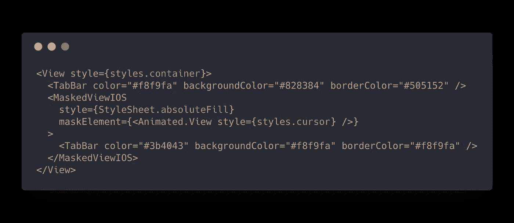
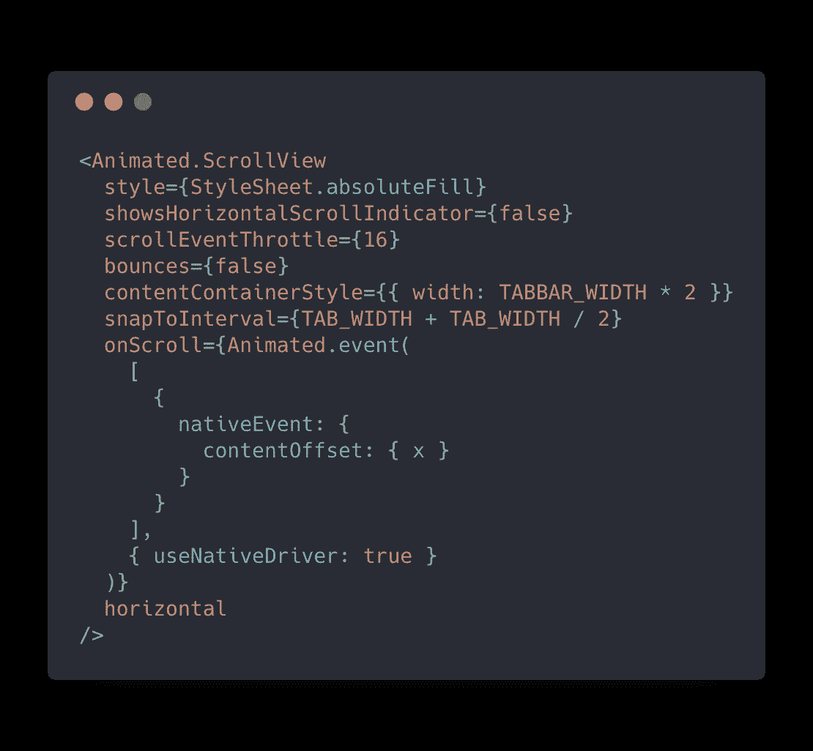
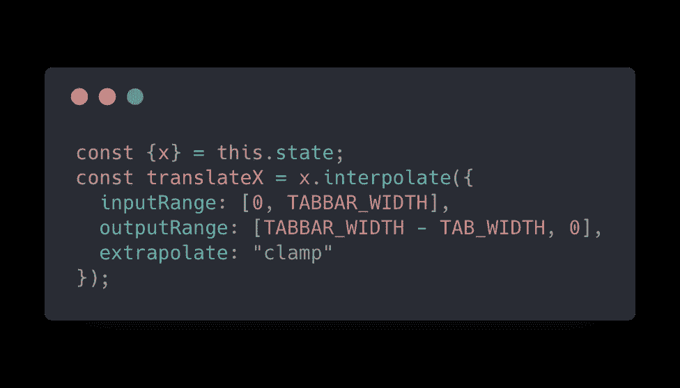

# 在 React Native 中可以做到这一点吗？构建 Chrome iOS TabBar

> 原文：<https://levelup.gitconnected.com/can-this-be-done-in-react-native-chrome-ios-tabbar-c76e5698dfb7>

在 iOS 上升级到最新版本的谷歌 Chrome 后，我注意到当从一个选项卡切换到另一个选项卡时，该应用程序有一个很酷的动画。我想知道:这能在 React Native 中实现吗？

如果你有应用程序动画和效果的例子，你想知道:“它能在 React Native 中完成吗？🤔“，请[给我发投稿](mailto:wcandillon@gmail.com)。

实现的全部点心可在[这里](https://snack.expo.io/@wcandillon/google-chrome-tabs)获得。为了实现这个例子，我们在彼此之上添加了两个相同的选项卡栏(除了颜色)。我们使用[*MaskedViewIOS*](https://facebook.github.io/react-native/docs/maskedviewios)*来遮罩上面的一个。*

两个标签栏相互重叠，最上面的一个被屏蔽。

在这两层之上，我们有一个透明的[滚动视图](https://facebook.github.io/react-native/docs/scrollview)，它将驱动*遮罩元素*的滑动。

我们监听滚动值以驱动遮罩元素的滑动。

从那里，我们需要插入屏蔽光标的平移。当滚动值为 0 时，当我们滚动标签栏的宽度时，遮罩在右边和左边。

当滚动为 0 时，当我们滚动标签栏的宽度时，遮罩在右边和左边。

# 那都是乡亲们！

希望你喜欢这个故事。期待阅读您对此的看法。如果你想开始一个很酷的 React 原生项目，别忘了看看最全面的 React 原生初学者工具包 [React 原生草图元素](https://react-native.shop/elements)。

 [## 反应原生草图元素

### 经过两个月的制作，React 本地草图元素终于出现了。反应原生元素涵盖了广泛的…

hackernoon.com](https://hackernoon.com/react-native-sketch-elements-889f010f9626)