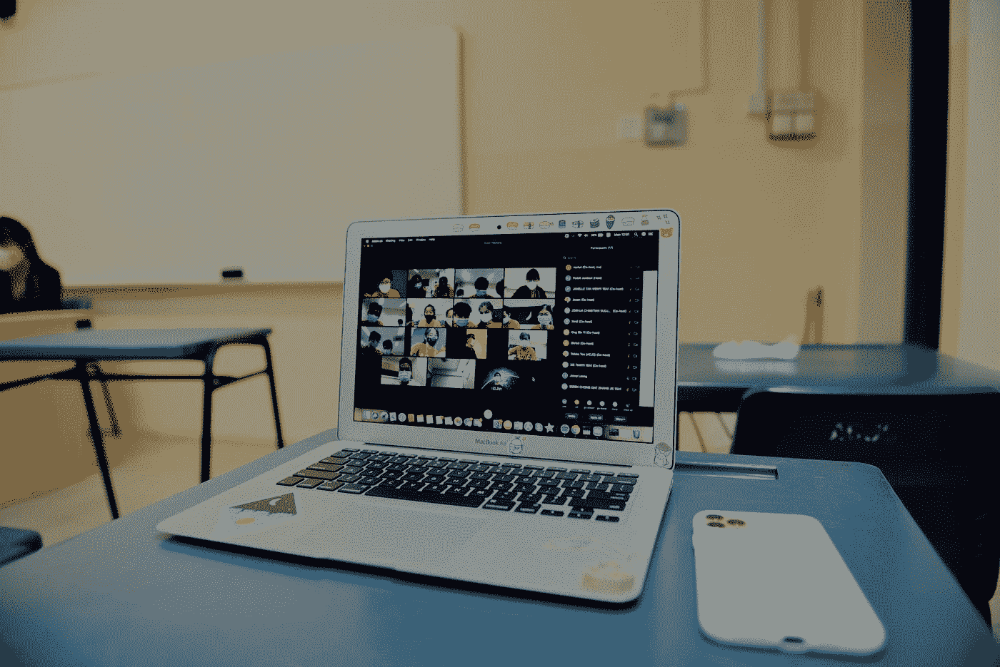

# 我们只能在 2022 年举行有意义的会议吗

> 原文：<https://levelup.gitconnected.com/can-we-have-only-meaningful-meetings-in-2022-49432e904a81>

## 我的新年决心:减少花在会议上的时间

照片由[卢卡斯劳](https://unsplash.com/@lucaslaw__?utm_source=medium&utm_medium=referral)在 [Unsplash](https://unsplash.com?utm_source=medium&utm_medium=referral)

自从疫情疫情爆发以来，我花了很多时间参加会议。如果我把我们花在会议上的时间与疫情时代之前相比，至少翻了三倍。

疾病的爆发永远改变了我们的工作方式。我们一直在家工作，到目前为止一切都很好。我不用花时间在交通上，工作效率也更高。

这带来了一些缺点。我需要接听的电话数量，以及我参加的在线会议数量，已经达到了顶点。*状态电话，与队友讨论，整天在电话或谷歌会议上讨论设计。*

我讨厌不必要的会议。我今年的目标是减少我花在会议上的时间，取消所有不必要的会议。

为此我做了一些分析:

# 为什么大家要开那么多会？

我经常被拉去参加不需要我参与的会议。我注意到很多次，在一个只需要两个人的讨论中，很多团队成员被邀请。

***这种趋势从顶部开始。无事可做的经理们把每个人都拉去开会，收集他们无法利用的信息。***

这让你觉得很忙，但最终，你并没有取得多大成就。这给了一些人快感，他们继续这种会议趋势。

一封邮件或一个聊天线程就能解决的小事，被拉长成了一场会议。人们偏离真正主题的会议。

# 这些会议有多分散注意力？

时不时的交流会有很大的成本。 ***是时候在手头的任务和会议*** 之间进行上下文切换了。

许多人还没有准备好理解和接受这一点。 ***会议是有价值的，但是太多的会议会把生产力踢出窗外*** 。

此外，开完会后，我会感到疲倦，需要休息。我抓起一杯咖啡/茶，休息一会儿，好像完成了一项大任务。

# 我计划如何减少会议

从我开始职业生涯的时候起，我就一直对会议说不。我想只参加我能做出贡献或有外卖的会议。

我的同事很合作。高年级学生也很理解。从去年开始，我已经把我的会议时间减少了一半。

尽管如此，我每天都花时间开会。其中一些会议是和我的团队，其余的是和其他团队。

我正在努力制定的规则是，少开一些更有意义的会议:

*   ***如果有事可以在聊天上解决，我们就不会打扰对方*** 。
*   我们设置了 ***【无中断】时间*** 。在这个时间段，我们不会打断任何人，除非有重要的事情被打破。
*   一旦我们偏离主题，任何与会者都可以而且应该提醒其他人。
*   仅邀请必要的个人参加会议。

# 离别的思绪

会议是我们工作文化的一个非常重要的方面。多亏了疫情和 WFH，这些会议现在都在网上进行。

我们大多数人都在努力工作，那些不必要的会议成了你主要的时间消耗者。

我一直在努力减少会议次数，缩短会期。到目前为止我是成功的，但是还有很长的路要走。一天下来，我想要一种成就感。

我希望你喜欢阅读这篇文章。如果你愿意支持我当作家，请我喝杯咖啡，可以考虑报名 [***成为中等会员***](https://singhamrit.medium.com/membership) ***。每月只需 5 美元，你就可以无限制地使用 Medium。***