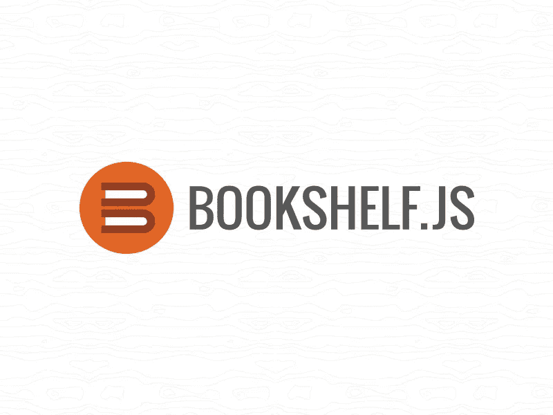

# 不学 SQL 能和数据库交流吗

> 原文：<https://levelup.gitconnected.com/can-you-communicate-with-databases-without-learning-sql-74fa39b05179>

## 第 3 部分— Bookshelf.js



> Bookshelf 是 Node.js 的 JavaScript ORM，构建在 [Knex](http://knexjs.org/) SQL 查询构建器上。它具有基于承诺的和传统的回调接口、事务支持、渴望/嵌套渴望关系加载、多态关联以及对一对一、一对多和多对多关系的支持。
> 
> *-* 根据 [Bookshelf.js 官方文档](https://bookshelfjs.org/)

为了更好地理解书店的运作，我们将使用*在线购物系统*的概念。为了简单起见，我们将只处理以下两个实体， *i)客户，ii)订单。*每个客户可以下一个或多个订单，每个订单属于一个客户。

# 1)安装

你可以用`npm`安装*书架* .js，现在*书架*在后台使用 **knex SQL 查询构建器**作为它的数据库访问层，所以你也需要安装那个。

```
*$ npm install bookshelf knex*
```

您还必须为您选择的数据库手动安装下列驱动程序之一:

```
*$ npm install pg
$ npm install mysql
$ npm install sqlite3*
```

本文中的所有例子都基于 MySQL 驱动程序，即 mysql2。此外，数据库运行在我的本地机器上。

# 2)建立数据库连接

将以下代码放入您的**中。/util/database.js**

```
const knex = require('knex')({
  client: 'mysql',
  connection: {
    host     : '127.0.0.1',
    user     : 'your_username', //replace with your username
    password : 'your_password', //replace with your password
    database : 'your_db_name', //replace with your db name
    charset  : 'utf8'
  }
});

bookshelf = require('bookshelf')(knex);

// Bookshelf supported plugins.
bookshelf.plugin('registry');
bookshelf.plugin('visibility'); 

module.exports = bookshelf;
```

请记住，使用 Bookshelf 时，您需要明确地将插件添加到您的对象中，因为它们不是核心 Bookshelf 模块的一部分。因此，注册表插件用于访问`.model()`方法，可见性插件用于支持文件的不同可见性模式。

# 3)定义模型和定义关系

模型是表示数据库中的表的抽象。在 bookshelf 中，它是通过访问 Bookshelf 对象上的`.model()`方法创建的。

通过在您的**中放置以下代码来定义客户模型。/models/customer.js**

```
const bookshelf = require('../util/database');

const Customer = bookshelf.model('Customer', {
  tableName: 'customers',
  orders() {
    return this.hasMany("Order")
  }
});

module.exports = Customer;
```

现在，如果您过去使用过 Sequelize 或其他一些基于 SQL 的 ORM，您一定会注意到一些非常不同和奇怪的东西。你有吗？因此，我们没有在客户模型的定义中定义任何字段/列，所以 Bookshelf 不知道我们数据库表的任何内容。这是因为与 Sequelize 不同，使用 Bookshelf，您必须手动创建数据库、表和表中的列。

现在，在我们的例子中，每个客户都有一个 **id、**一个**名字、**和一个**电子邮件**。这代表了客户表的 3 个字段/列。因此，客户模型通过一个 *hasMany* 关系与订单模型相关联。*一个客户可以有多个订单。*

通过在您的**中放置以下代码来定义订单模型。/models/order.js**

```
const bookshelf = require('../util/database');

const Order = bookshelf.model('Order', {
  tableName: 'orders'
})

module.exports = Order;
```

每个订单将有一个 **id** 和一个**总**购买价格。这表示订单表的两个字段/列。

# 4)编写查询

在下面的代码片段中，我们执行以下操作:

I)插入新客户。

ii)使用 ***customerId*** 外键为该客户插入 2 个新订单。

iii)选择/获取当前客户的所有订单。

```
const Customer = require("./models/customer");
const Order = require("./models/order");

let customerId = null;
Customer.forge({ name: "Joey Tribianni", email: "jt@gmail.com" })
  .save()
  .then((customer) => {
    customerId = customer.id;
    return Order.forge({ total: 45, customer_id: customerId }).save();
  })
  .then((order) => {
    return Order.forge({ total: 55, customer_id: customerId }).save();
  })
  .then((order) => {
    return Customer.where({ id: customerId }).fetch({
        withRelated: ['orders'], require: true
    });
  })
  .then(result => {
      console.clear();
      console.log("Result is : ", result.toJSON());
  })
  .catch((err) => {
    console.log(err);
  });
```

所以，这就是这个有用的 Node.js ORM。我希望本文提供的信息对您有价值，并帮助您简化和优化数据库操作。

# 其他资源:

*   [*了解更多关于书架的信息*](https://bookshelfjs.org/)
*   [*链接到我的 GitHub 库*](https://github.com/KritikaSharmaKS/Bookshelf-Youtube)

*原载于*[*https://www.theimmigrantprogrammers.com*](https://www.theimmigrantprogrammers.com/p/can-you-communicate-with-databases-dce)*。*