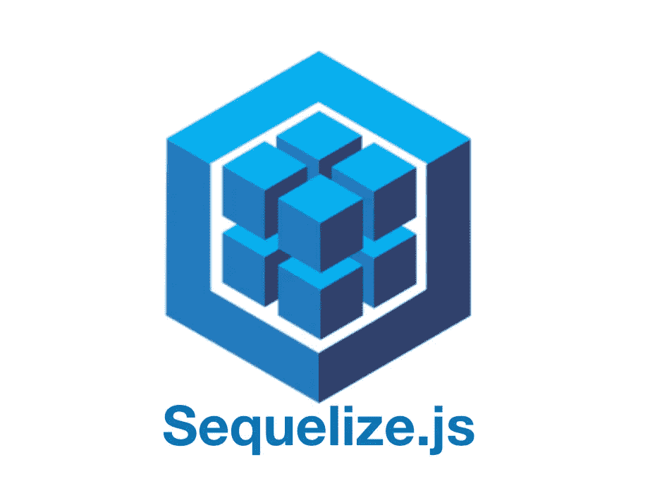

# 不学 SQL 能和数据库交流吗

> 原文：<https://levelup.gitconnected.com/can-you-communicate-with-databases-without-learning-sql-8bb6a50999d7>

## 第 1 部分—顺序

Sequelize 是一个基于承诺的 Node.js ORM。



为了更好地理解 Sequelize 的作用，我们将使用一个*在线购物系统*的概念。为了简单起见，我们将只处理以下两个实体， *i)客户，ii)订单。*每个客户可以下一个或多个订单，每个订单属于一个客户。

# 1)安装

您可以使用 npm 来安装 sequelize 软件包:

```
*npm install --save sequelize*
```

您还必须为您选择的数据库手动安装下列驱动程序之一:

```
*$ npm install --save pg pg-hstore* #Postgres *$ npm install --save mysql2 
$ npm install --save mariadb 
$ npm install --save sqlite3 
$ npm install --save tedious* #Microsoft SQL Server
```

本文中的所有例子都基于 MySQL 驱动程序，即 mysql2。此外，数据库运行在我的本地机器上。

# 2)建立数据库连接

将以下代码放入您的**中。/util/database.js**

```
const Sequelize = require("sequelize");

const sequelize = new Sequelize("your_db_name", "your_username", "your_password", {
  dialect: "mysql",
  host: "localhost", *//Optional* 
});

module.exports = sequelize;
```

请注意，在使用 localhost 运行数据库时，使用 host 参数是可选的，因为该参数的默认值已经设置为 localhost。但是，您可以随时覆盖该值。

# 3)定义模型

模型是表示数据库中的表的抽象。在 Sequelize 中，它是一个扩展了[模型](https://sequelize.org/master/class/lib/model.js~Model.html)类的类。

通过在您的**中放置以下代码来定义客户模型。/models/customer.js**

```
const Sequelize = require("sequelize");
const sequelize = require("../util/database");

const Customer = sequelize.define("customer", {
  id: {
    type: Sequelize.INTEGER,
    autoIncrement: true,
    allowNull: false,
    primaryKey: true,
  },
  name: {
    type: Sequelize.STRING,
    allowNull: false,
  },
  email: {
    type: Sequelize.STRING,
    allowNull: false,
  },
});

module.exports = Customer;
```

每个客户都有一个 **id、**一个**姓名、**和一个**电子邮件**。这代表了客户表的 3 个字段/列。

通过在您的**中放置以下代码来定义订单模型。/models/order.js**

```
const Sequelize = require("sequelize");

const sequelize = require("../util/database");

const Order = sequelize.define("order", {
  id: {
    type: Sequelize.INTEGER,
    autoIncrement: true,
    allowNull: false,
    primaryKey: true,
  },
  total: {
    type: Sequelize.INTEGER,
    allowNull: false,
  },
});

module.exports = Order;
```

每个订单将有一个 **id** 和一个**总**购买价格。这表示订单表的两个字段/列。

# 4)从序列模型中创建实际的数据库表

下面的代码将放入**中。/index.js** 文件。

```
const sequelize = require("./util/database");

const Customer = require("./models/customer");
const Order = require("./models/order");

sequelize
  .sync()
  // .sync({force: true})
  .catch((err) => {
    console.log(err);
  });
```

我们在 sequelize 对象上使用了`.sync()` 方法，以便将 sequelize 模型映射到数据库中的实际表。执行上述代码将产生以下效果。

```
Executing (default): CREATE TABLE IF NOT EXISTS `customers` (`id` INTEGER NOT NULL auto_increment , `name` VARCHAR(255) NOT NULL, `email` VARCHAR(255) NOT NULL, `createdAt` DATETIME NOT NULL, `updatedAt` DATETIME NOT NULL, PRIMARY KEY (`id`)) ENGINE=InnoDB;
Executing (default): SHOW INDEX FROM `customers`

Executing (default): CREATE TABLE IF NOT EXISTS `orders` (`id` INTEGER NOT NULL auto_increment , `total` INTEGER NOT NULL, `createdAt` DATETIME NOT NULL, `updatedAt` DATETIME NOT NULL, `customerId` INTEGER, PRIMARY KEY (`id`), FOREIGN KEY (`customerId`) REFERENCES `customers` (`id`) ON DELETE SET NULL ON UPDATE CASCADE) ENGINE=InnoDB;
Executing (default): SHOW INDEX FROM `orders`
```

现在，您一定已经注意到了，`.sync()`方法还有另一种变化，即通过将 **force** 字段设置为 **true** 向该方法传递一个对象。

使用`.sync({force: true})` Sequelize 额外添加了“删除表”查询，因此，每次调用该方法时，如果该表已经存在，就会被删除。执行`.sync({force: true})` 会有以下效果。

```
Executing (default): DROP TABLE IF EXISTS `orders`;
Executing (default): DROP TABLE IF EXISTS `customers`;

Executing (default): DROP TABLE IF EXISTS `customers`;
Executing (default): CREATE TABLE IF NOT EXISTS `customers` (`id` INTEGER NOT NULL auto_increment , `name` VARCHAR(255) NOT NULL, `email` VARCHAR(255) NOT NULL, `createdAt` DATETIME NOT NULL, `updatedAt` DATETIME NOT NULL, PRIMARY KEY (`id`)) ENGINE=InnoDB;
Executing (default): SHOW INDEX FROM `customers`

Executing (default): DROP TABLE IF EXISTS `orders`;
Executing (default): CREATE TABLE IF NOT EXISTS `orders` (`id` INTEGER NOT NULL auto_increment , `total` INTEGER NOT NULL, `createdAt` DATETIME NOT NULL, `updatedAt` DATETIME NOT NULL, `customerId` INTEGER, PRIMARY KEY (`id`), FOREIGN KEY (`customerId`) REFERENCES `customers` (`id`) ON DELETE SET NULL ON UPDATE CASCADE) ENGINE=InnoDB;
Executing (default): SHOW INDEX FROM `orders`
```

总之，只有当您不需要维护表中的数据时，才使用 **force** 选项在模型模式和数据库之间进行同步。

> 如果您正在从头开始一个项目，并且您的数据库还不存在，那么可以从头开始使用 Sequelize 来自动创建数据库中的每个表。此外，如果您想使用 Sequelize 连接到一个已经充满了表和数据的数据库，这也是可行的！Sequelize 让你在两种情况下都被覆盖。

# 5)定义关联

因此，客户模型通过一个 *hasMany* 关系与订单模型相关联。现在，既然我们已经通知了 Sequelize 这个关联，它将负责为您在订单表中创建 ***customerId*** *外键(链接到主键，****id****)*。

```
const sequelize = require("./util/database");

const Customer = require("./models/customer");
const Order = require("./models/order");

Customer.hasMany(Order);

sequelize
  .sync()
  .catch((err) => {
    console.log(err);
  });
```

[点击此处了解更多协会信息。](https://sequelize.org/master/manual/assocs.html)

# 6)编写查询

在下面的代码片段中，我们执行以下操作:

I)插入新客户

ii)使用 ***customerId*** 外键为该客户插入一个新订单。

iii)选择当前客户的所有订单。

```
const sequelize = require("./util/database");

const Customer = require("./models/customer");
const Order = require("./models/order");

Customer.hasMany(Order);

let customerId = null;
sequelize
  .sync()
  .then((result) => {
    return Customer.create({name: "Chandler Bing", email: "cb@gmail.com"})
    console.log(result);
  })
  .then(customer => {
    customerId = customer.id;
    console.log("First Customer Created: ",customer);
    return customer.createOrder({total: 45});
  })
  .then(order => {
    console.log("Order is : ",order);
    return Order.findAll({ where: customerId});
  })
  .then(orders => {
    console.log("All the Orders are : ",orders);
  })
  .catch((err) => {
    console.log(err);
  });
```

所以，这就是这个有用的 Node.js ORM。我希望本文提供的信息对您有价值，并帮助您简化和优化数据库操作。

# 其他资源:

*   [*阅读更多关于 Sequelize*](https://sequelize.org/master/index.html)
*   [*链接到我的 GitHub 库*](https://github.com/KritikaSharmaKS/Sequelize-Youtube)

*原载于*[*https://www.theimmigrantprogrammers.com*](https://www.theimmigrantprogrammers.com/p/can-you-communicate-with-databases)*。*