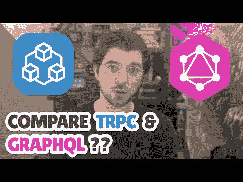
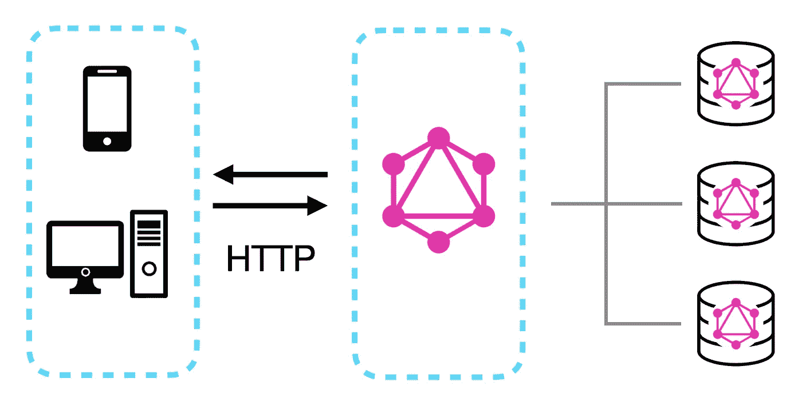
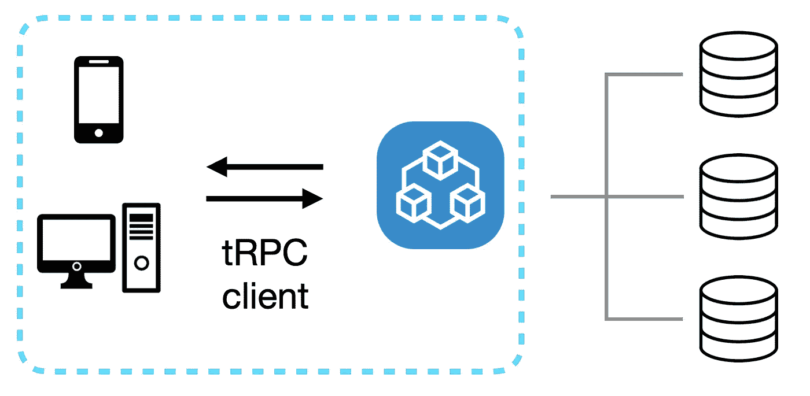
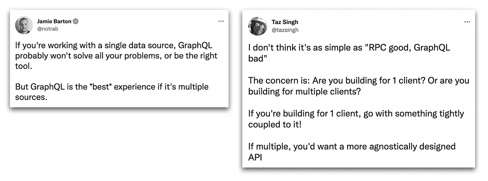

# 能不能比较一下 GraphQL 和 tRPC？

> 原文：<https://levelup.gitconnected.com/can-you-compare-graphql-and-trpc-572e8b98bf48>

在 Twitter 上有很多关于“GraphQL 与 tRPC”为应用程序构建一个现代后端的讨论。GraphQL 作为 REST 的事实上的继任者在最近几年变得流行起来，而 tRPC 则解决了全栈应用中的端到端安全问题。这就像[把苹果比作橘子](https://twitter.com/alexdotjs/status/1597182082941595648?s=20&t=hisusYuNOJ46q08HF8Is8w)。

TLDR；GraphQL 是一种查询语言，tRPC 是一个库。

作为一名在过去几年中使用 GraphQL 的开发人员，这引发了我对两者进行比较，看看他们都擅长什么(以及不擅长什么)。

点击下图观看这篇博文的 [YouTube 视频版本](http://www.youtube.com/watch?v=_Tc7YVR-0LU):

## 但首先；您可能一直在错误地使用 GraphQL

GraphQL 是您的 API 的查询语言，它不是 REST 的一对一替代。这是一种比 REST 更灵活的查询 API 的方式，让您可以控制请求的响应。在许多 Twitter 对话中，我发现人们将 GraphQL 与 REST 进行比较，这与 GraphQL 是不同的。此外，GraphQL 类型系统并不意味着用于端到端类型安全，至少不是以第一种方式。相反，这是一种记录 API 并确保 API 运行时类型正确的方法。

## 我们可以对比 GraphQL 和 tRPC 吗？

GraphQL 是 API 的查询语言，而 tRPC 是一组用于构建端到端类型安全 API 的库。如前所述，这就像把苹果比作橘子。但是让我们把他们两个都分解一下，了解一下他们的特点。

## GraphQL 是一种查询语言

GraphQL APIs 通常使用 HTTP 作为传输层，GraphQL 查询作为 POST 请求发送给 API。然后，API 处理查询，并将结果作为 JSON 响应返回。这与 REST APIs 的工作方式相同，但 GraphQL 是一种查询语言，而不是一种协议。这意味着您可以在任何传输层和任何协议上使用 GraphQL。这也是为什么你可以在你的前端应用中使用 GraphQL，因为它只是一种查询语言。

GraphQL 本身只不过是一种查询语言，根据它的规范，由 GraphQL 实现库和框架来实现这种查询语言。这意味着实现 GraphQL 有很多不同的方式，使用 GraphQL 也有很多不同的方式。这也是为什么在您的前端应用程序中有许多不同的使用 GraphQL 的方法。

## tRPC 是一个库

tRPC 是一组使用 TypeScript 来确保整个应用程序的类型安全的库。它的主要目的是使在单个代码库中构建端到端的类型安全应用程序变得容易。基础是一个 tRPC 服务器，您可以在其中定义端点(或路由)、这些端点的类型定义，并处理与数据源(如数据库)的任何连接。

您可以使用 tRPC 客户端库在前端应用程序中使用 tRPC API。您不是直接发送 HTTP 请求来获取数据，而是让 tRPC 客户端为您处理，就像 API 的 ORM 一样。这个客户端可以在不依赖代码生成的情况下进行强类型 API 调用。您可以将 TypeScript 类型从服务器直接导入前端应用程序，而无需生成任何代码。

## GraphQL 和 tRPC 有什么区别？

这是一个非常主观的问题，但我认为知道 GraphQL 和 tRPC 的区别是很重要的。这样，您可以自己决定在应用程序中使用什么。

## GraphQL 非常适合查询多个数据源

GraphQL 擅长将多个数据源组合成一个查询。GraphQL 经常用于数据建模和架构，它非常适合这一点。例如，如果您想查询来自一个服务的数据(比如一个 Headless CMS)和来自另一个服务的数据(比如一个数据库)，您可以使用 GraphQL 在一个查询中完成。您甚至可以在字段或类型级别组合这些数据。这是脸书和 GitHub 等公司使用 GraphQL 的主要原因之一。

*推文来自* [*杰米·巴顿*](https://twitter.com/notrab) *和* [*塔兹·辛格*](https://twitter.com/tazsingh) *。*

而 tRPC 并不真正意味着这一点。它旨在构建端到端的类型安全 API，而不是真正用于组合多个数据源。你可以这么做，但这不是 tRPC 的目的。

## tRPC 非常适合端到端类型的安全

tRPC 对于端到端的类型安全非常有用，它允许您在前端应用程序中使用与后端应用程序中相同的类型。GraphQL 没有在前端和后端之间共享类型定义的内置方法，但是您可以使用 GraphQL 模式来生成 TypeScript 类型定义。但这不同于端到端类型的安全。每次更新 GraphQL 模式时，都必须重新生成类型。

当使用 tRPC 时，您正在使用 TypeScript 构建一切。这意味着您可以将类型从服务器直接导入到您的前端应用程序中。tRPC 客户端可以直接从 tRPC 服务器访问 TypeScript 类型。在您的前端应用程序中查询 tRPC 时，您不需要外部库，因为它都内置在 tRPC 库中。

## GraphQL 允许解耦服务；单一代码库的 tRPC

GraphQL 非常适合去耦服务，因为它与编程语言和传输层无关。这意味着您可以使用任何编程语言和任何传输层。公开 GraphQL API 的服务可以用任何编程语言实现，例如 TypeScript 和 Go，并且仍然能够相互通信。对于技术多样化的团队和公司来说，这是一个扩展和限制团队间依赖性的好方法。

tRPC 并不真的是为了这个。它意味着在一个单一的代码库中，在 TypeScript 中构建端到端的类型安全 API！它将前端和后端紧密地结合在一起，例如在 monorepo 中。您可以在前端和后端应用程序中使用相同的类型，这允许您快速迭代您的应用程序。如果您正在构建一个全栈 TypeScript 项目，有什么不喜欢的呢？

## tRPC 比 GraphQL 更容易使用

“tRPC 比 GraphQL 更容易使用”是人们在比较 GraphQL 和 tRPC 时经常使用的说法。但是由于 tRPC 是一个库，而 GraphQL 是一种查询语言，所以不可能进行比较。对于 GraphQL，由开发人员使用许多可用的实现之一来构建 GraphQL，而 tRPC 是一组可以开箱即用的库。这使得它不是一个公平的比较，但无论如何让我们打破它。

例如，您可以使用模式优先的 GraphQL 服务器库构建一个 GraphQL API。您必须定义一个 GraphQL 模式，编写解析器从数据源收集数据，然后从该模式生成类型。作为一名开发人员，走这条路需要做大量的工作，并且需要做出许多选择。

但是您也可以使用代码优先的 GraphQL 服务器库来构建 GraphQL API。这意味着您可以编写解析器，然后从解析器生成模式。就开发人员体验而言，代码优先库更接近 tRPC，但仍然比使用像 [StepZen](https://stepzen.com/) 这样的 GraphQL 即服务更具挑战性。

然后，您还可以选择各种各样的 GraphQL 客户端库。您可以使用 GraphQL 客户端库，如 [Apollo Client](https://www.apollographql.com/docs/react/) 或 [urql](https://formidable.com/open-source/urql/) 来帮助您进行缓存和状态管理，或者使用只处理 HTTP 请求的库。有许多选择，当您刚接触 GraphQL 时可能不清楚。

## 结论

在这篇博文中，我解释了 GraphQL 和 tRPC 的区别。我希望这篇博文能帮助你理解这两者之间的区别，并希望你现在能更好地决定在你的下一个项目中使用哪一个。在 GraphQL 和 tRPC 之间进行选择时，要问自己的主要问题是:

*   您是否希望在一个查询中查询多个数据源，并保持您的服务解耦？如果是这样，GraphQL 是一个完美的选择。如果您想要端到端的类型安全，并且不关心前端和后端的解耦，tRPC 是更好的选择。
*   你打算使用多种编程语言吗？选择 GraphQL，因为它是与编程语言无关的。如果您想在整个应用程序中使用 TypeScript，tRPC 可能是更好的选择。

在 GraphQL 和 tRPC 之间进行选择时，还有许多其他事情需要考虑，但在我看来这些是主要的。我很想听听你对此的想法，所以请通过 Twitter 告诉我，地址是 [@gethackteam](https://twitter.com/gethackteam) 。

# 分级编码

感谢您成为我们社区的一员！在你离开之前:

*   👏为故事鼓掌，跟着作者走👉
*   📰查看[升级编码出版物](https://levelup.gitconnected.com/?utm_source=pub&utm_medium=post)中的更多内容
*   🔔关注我们:[Twitter](https://twitter.com/gitconnected)|[LinkedIn](https://www.linkedin.com/company/gitconnected)|[时事通讯](https://newsletter.levelup.dev)

🚀👉 [**加入升级人才集体，找到一份神奇的工作**](https://jobs.levelup.dev/talent/welcome?referral=true)