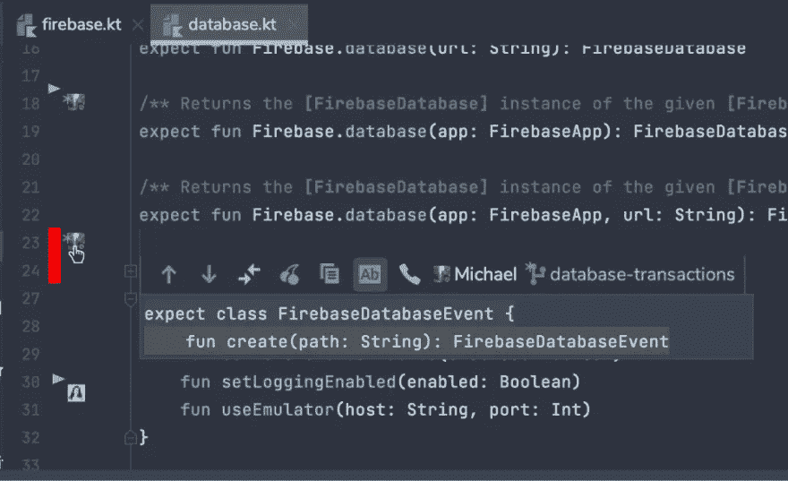

# 您能在合并冲突发生之前解决它们吗？

> 原文：<https://levelup.gitconnected.com/can-you-resolve-merge-conflicts-before-they-happen-546cc089999c>

*解决合并冲突很有趣！*——从来没有人说过。没有人喜欢他们，但这并不能改变他们是工作的一部分这一事实。在这篇短文中，我想简要地解释它们的来源，展示如何解决它们，并且，作为一个额外的奖励，建议一个可能避免它们的解决方案。

# 合并冲突—它们是什么？

当 Git 无法自动解决两次提交之间的代码差异时，就会发生合并冲突。它们可能是合并分支的结果，在 rebase 过程中或者当你在 Git 中挑选的时候。

好消息是 Git 非常擅长于计算如何集成更改，所以大多数时候您是安全的。当完全相同的行被修改，Git 不能决定哪个版本是正确的时，困难的部分就开始了。它会在终端中通知您，并让您负责修复它。

# 以正常方式解决合并冲突

好的，那么我们如何解决冲突呢？我们既可以手动解决它们，也可以使用 Git GUI，比如内置在 VS Code 或 JetBrains IDEs 中的 GUI，或者单独的桌面应用程序，比如 [Tower](https://www.git-tower.com/mac) 或 [Sourcetree](https://www.sourcetreeapp.com/) 。

让我们看看手动解决冲突。

冲突的变更很容易被发现，因为它们会被`<<<<<<<`和`>>>>>>>`标记在文件中。在`=======`之前的部分是你的版本，之后的部分是他们的版本。删除不需要的行(包括冲突标记)，保留正确的行。

# 早期合并冲突检测

合并冲突并不像看起来那么可怕，但事实是解决它们可能是一个漫长而乏味的过程，尤其是在大型项目中。

这就是 GitLive 派上用场的地方——这是一个强大的工具，当您在编辑器中做出与任何其他分支上的更改相冲突的更改时，它会在 ide 中向您发出警告。这些警告向您显示潜在的冲突，并让您有机会在合并冲突发生之前解决它们。

# 从 GitLive 开始

安装最新的 GitLive [VS 代码扩展](https://marketplace.visualstudio.com/items?itemName=TeamHub.teamhub)或 [JetBrains 插件](https://plugins.jetbrains.com/plugin/11955-gitlive)开始使用。

当你打开一个文件时，你会在编辑器的空白处看到修改标记，显示你的队友相对于你的文件版本所做的修改。当你和你的队友在编辑时，这些会实时更新。

如果你做了一个有冲突的改变，你会看到亮红色的冲突指示器。这些冲突可能是您尚未提交的本地变更，或者是您的分支上与您的团队成员的变更相冲突的现有变更。

在 JetBrains 中，点击作者的头像(或者你可以滚动 VS 代码中受影响的行),检查一个修改，看看有什么不同，他们来自哪个分支，甚至直接在你的本地文件中挑选修改。

就这样，希望你会发现我的关于如何处理合并冲突的小指南很有用，并且下次你遇到合并冲突时不会惊慌。请在评论中告诉我你的想法！

# 分级编码

感谢您成为我们社区的一员！在你离开之前:

*   👏为故事鼓掌，跟着作者走👉
*   📰查看[级别提升编码](https://levelup.gitconnected.com/)中的更多内容
*   🔔关注我们:[推特](https://twitter.com/gitconnected) | [领英](https://www.linkedin.com/company/gitconnected)
*   🚀👉 [**软件工程师的顶级工作**](https://jobs.levelup.dev/)