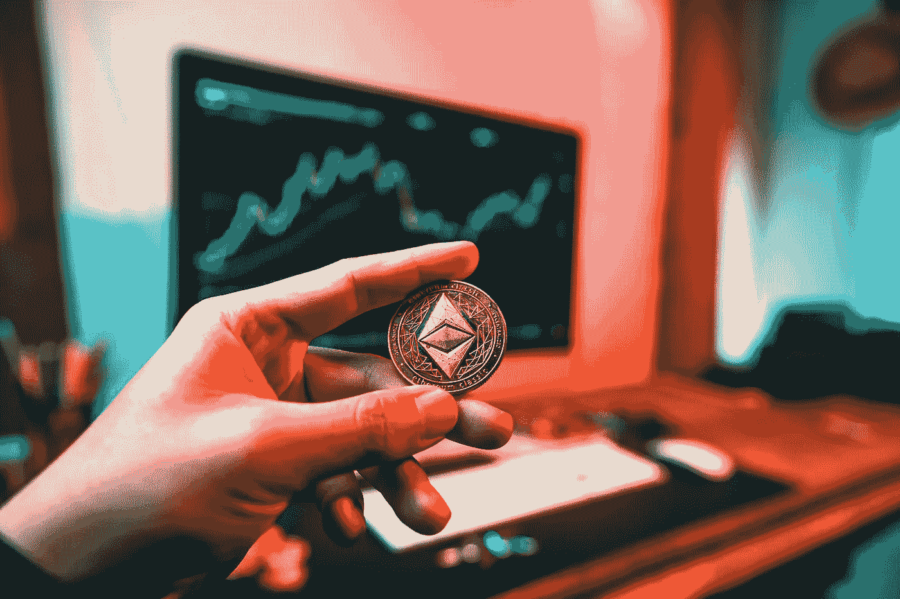

# 2022 年还能开采以太坊吗？

> 原文：<https://levelup.gitconnected.com/can-you-still-mine-ethereum-in-2022-bedfb6ab8e23>

以太坊 2.0 再次延迟…这对于采矿来说意味着什么

[Art Rachen](https://unsplash.com/@artrachen?utm_source=unsplash&utm_medium=referral&utm_content=creditCopyText) 在 [Unsplash](https://unsplash.com/s/photos/ethereum?utm_source=unsplash&utm_medium=referral&utm_content=creditCopyText) 上拍摄的照片

以太坊向股权证明的重大转变的启动日期再次被推迟。4 月 12 日，以太坊开发者 Tim Beiko 在推特上写道，发布可能会在计划的 6 月发布后“几个月”进行。这意味着我们可能会在 9 月和 11 月之间的某个时候发布。虽然这种转变似乎永远不会发生，但 Tim 继续说道“我们肯定已经进入了以太坊的最后一章”。

以太坊合并延期——来源:Twitter.com

我毫不怀疑这个发布最终会发生，但我真的希望这是最后一次推迟。与此同时，这种延迟让 GPU 所有者直到今年晚些时候才能挖掘以太坊，获得一点额外的被动收入。采矿不像去年这个时候那么有利可图，但根据你的电费，回报仍然是合理的。在这篇文章中，我将概述以太坊采矿目前的盈利能力，与 LHR 卡讨论采矿，并分享我喜欢的采矿软件。

# 还值得挖掘吗？

只要开采难度没有显著变化，开采利润本质上是随着以太坊价格波动的；以太坊的价值增长越多，采矿就越有利可图。当以太坊的价值约为 3000 美元时，Nvidia 3080 目前每天的税后利润约为 3-4 美元，每千瓦时 0.13 美元。当以太坊推动价值超过 4000 美元时，每天的利润超过 5 美元，每月增加 60 美元。

随着时间的推移，随着越来越多的硬件开始挖掘以太坊，难度不断上升。也就是说，2022 年的难度比 2021 年增长得更慢。这可能是由于 ETH 的价值增长放缓，以及不愿意购买采矿硬件，向股权证明的过渡迫在眉睫。尽管 ETH 的价值相对持平，但矿业力量的缓慢增长有助于保持矿业收入。

采矿目前是否值得将是个人的选择。在我所在的地区，电费为每千瓦时 0.13 美元，这意味着用我的欠压 Nvidia 3080 采矿每天大约花费我 0.69 美分——不错。每天的净利润约为 3 美元，如果合并直到 9 月份才发生，单个 GPU 就可以为你净赚 450 美元。然而，这是假设 24/7 的正常运行时间，以太坊的价格不会改变。

## 热

只要有利润，有些人就会开采，但当设备磨损、噪音、热量和努力不再值得时，其他人就会有一个阈值。随着北半球进入夏季，热量是一个主要的考虑因素。如果采矿让你的工作空间或卧室变热，你可能会发现自己在试图让房间降温。请记住，冷却一个房间是非常耗能的，所以打开空调来补偿采矿热会很快耗尽你的利润。这对环境也不好！

如果你有一个单独的采矿设备，把它搬到地下室或车库可以帮助它保持凉爽，避免降低你家里的舒适度。如果你在你的个人电脑上开矿，过渡到只在晚上开着窗户开矿也会有帮助。

即使你不介意炎热的房间，你也要确保监控 GPU 上的温度，并确保调整风扇速度以补偿不断上升的环境温度。具有 GDDR6X 内存的 GPU 对环境温度特别敏感；降低和提高机箱风扇速度确实有助于降低 GPU 温度。我喜欢找到冷却我的 GPU 的方法，而不仅仅是转动 GPU 的风扇；显卡最常见的部件故障之一是风扇，由于采矿需要长时间工作，降低风扇速度有助于延长寿命。

# 使用低哈希速率 GPU 进行挖掘

如果你拥有一个带有哈希速率限制器的当代显卡，你仍然可以挖掘以太坊。我首选的挖矿软件 T-Rex 现在在单独挖矿以太坊的时候可以达到一张非限牌性能的 78%。这意味着所有 LHR Nvidia 卡仍然是有利可图的，但是，它削减了已经很小的利润。

T-Rex 还提供了一种叫做双重采矿的东西，它本质上是将 GPU 分成两半，以同时开采以太坊和另一种类似 Ravencoin 的硬币。这两种硬币的散列率都降低了，但是，散列率限制器不会降低任何效率。我将在最后的参考资料部分链接一篇解释双重采矿的文章。

双重挖掘的问题是，你积累的每一个硬币池都更小，需要更长的时间才能达到你可以在不损失太多费用的情况下提取的程度。我个人更倾向于使用 T-Rex 的`--lhr-low-power`模式挖掘以太坊，以更低的功耗获得 75%的性能。

# 尼斯哈什从来没有这么好看过

重要的是要考虑到今年秋天你会产生多少 ETH。如果您使用单个 GPU，可能需要几个月的时间来生成足够的 ETH，以便在不损失大量网络费用的情况下将其从您的池中收回。这就是 NiceHash 真正有用的地方，也是为什么它值得在这个不确定的挖掘时期使用。

NiceHash 是计算能力的市场。由于以太坊目前是消费显卡最有利可图的用途之一，当你使用 NiceHash 时，你的计算机可能会挖掘以太坊，但从技术上讲，它也可以用于其他任务。NiceHash 用比特币支付给你，如果你用他们的工具把收益直接转到 CoinBase，你就零手续费！

提取收益无需支付任何费用，这尤其对小型矿商来说是一大优势。这种方法的缺点是，你的硬币将进入你的交换钱包，并且 NiceHash 产生的钱通常比用池子采矿产生的钱略少。

如果你打算卖掉你开采的硬币，那么交换钱包是很棒的；你可以把你的硬币免费送到比特币基地专业版，然后支付较低的费用出售。当谈到低收入时，游泳池和 NiceHash 之间的差异是波动的。在撰写本文时，使用 NiceHash 的单个 3080 只比矿池少赚 0.06 美元。按照这个速度，在你增加的收入抵消提取费用之前，你需要在一个池子里开采几个月。

# 我最喜欢的采矿工具

如果你打算用水池采矿，那么我有两个可靠的选择供你选择。我的第一选择通常是以太明，因为我已经用了很长时间。自从 EIP-1559 消除了池在其铸造块中处理支付的能力，池现在彼此都非常相似。所以以太矿是一个安全的选择，但它并没有什么特别之处。

一个值得考虑的独特池是 2 分钟。2miners 允许您使用 Nano 接收每日支出，无需交易费。如果你喜欢更普通的硬币，他们也会用比特币支付给你，费用比以太坊支付低得多。

说到采矿软件，我是 T-Rex 的忠实粉丝。底线是它们在性能方面都相当接近，所以我不会过多强调你对 miner 的选择。无论你选择什么，只要确保它相对受欢迎，并且你使用的下载链接来自一个有信誉的来源。

# 包扎

虽然看到合并被进一步推迟令人失望，但这对许多享受采矿带来的被动收入的 GPU 所有者来说是个好消息。确保记住温度，因为北半球的事情变暖了，不要忘记考虑在最后几个月使用尼斯哈什代替游泳池。

> **注意:**如果你喜欢在 Medium 上阅读我和其他人的内容，考虑使用下面的链接订阅，以支持这样的内容创作，并解锁无限的故事！

 [## 用我的推荐链接加入媒体-威尔·诺里斯

### 作为一个媒体会员，你的会员费的一部分会给你阅读的作家，你可以完全接触到每一个故事…

medium.com](https://medium.com/@willmnorris/membership) 

# 资源

*   [使用 2 名矿工进行零费用开采](/how-to-pay-zero-fees-mining-ethereum-d318898cfb81)
*   [使用 LHR GPU 进行双重挖掘](/unlock-the-full-potential-of-low-hash-rate-gpus-with-dual-mining-8cf343c0c968)
*   [以太坊更新文档](https://ethereum.org/en/upgrades/)
*   [以太矿池](https://ethermine.org/)
*   [2 分钟池](https://2miners.com/)
*   [霸王龙矿工](https://github.com/trexminer/T-Rex/releases)