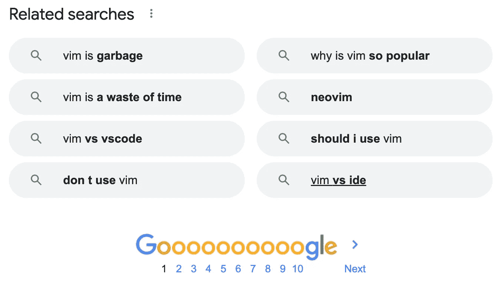
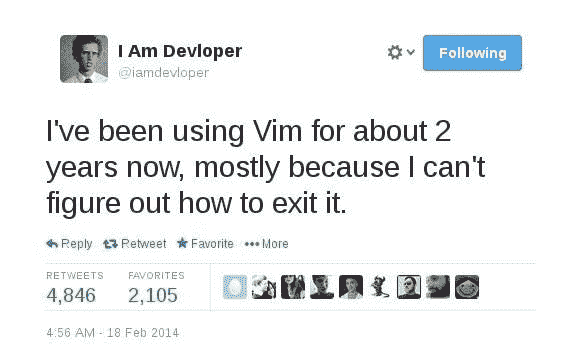
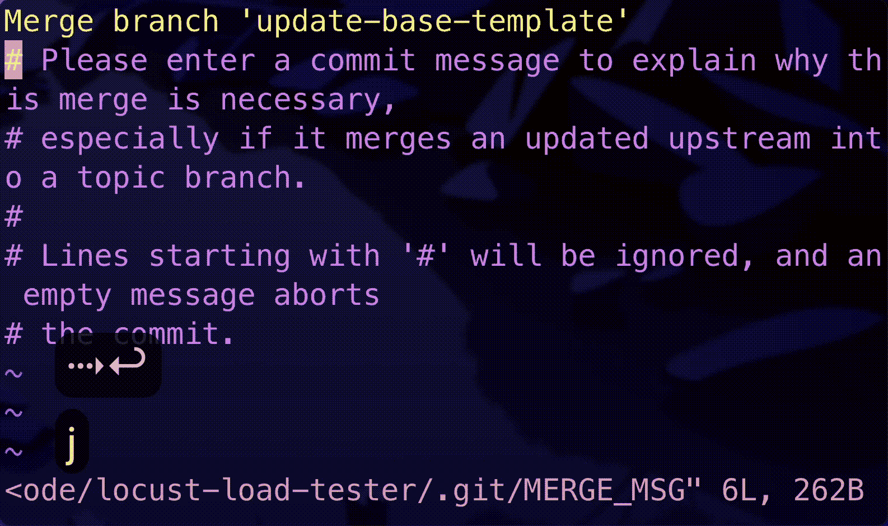
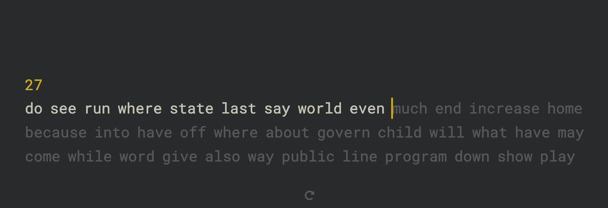

# 好像掌握不了 Vim？原因如下。

> 原文：<https://levelup.gitconnected.com/cant-seem-to-master-vim-here-s-why-37077ba46511>

## 剧透:你玩的游戏不够多

由[萨姆·帕克](https://unsplash.com/@melocokr?utm_source=medium&utm_medium=referral)在 [Unsplash](https://unsplash.com?utm_source=medium&utm_medium=referral) 拍摄的照片

# 为什么大多数人不使用 Vim

维姆已经存在了好几年了。它过去是，现在仍然是一个极度分化的工具。不要只是相信我——甚至谷歌搜索结果也这么说:

作者截图

原因很简单——大多数工程师不使用它，因为学习曲线很陡。我是说，*极其*陡峭。下面这个臭名昭著的“退出 Vim”迷因证明了这个事实:

来源于 Reddit

我将永远记得我第一次遇到 Vim ( *见下面的 GIF*)的时候，我做了一个`git merge <branch> master`然后挣扎着退出 Vim。

使用`:q 退出 VIM！`(GIF 作者)

不仅如此，在您对 Vim 有所精通之前，您不会真正获得它的好处。让我向您展示一下学习 Vim 的典型感觉:

1.  您将学习每种模式的基本命令
2.  您试图将它集成到您的日常工作流程中，但是您偶尔仍然使用箭头键和鼠标来导航
3.  您可以练习和学习更高级的按键
4.  在这两者之间的某个地方，你会感到沮丧并想，“*当我可以使用箭头键和鼠标时，为什么我必须使用这些键来导航？？？*
5.  你放弃学习 Vim 了

学习 Vim 是一回事，精通是另一回事。

因为学习曲线如此陡峭，**你的手指实际上花在回忆应该按什么键上的时间比你的手移动鼠标花的时间还要多**。

但是就像生活中的许多事情一样，你只有在付出足够的努力后才会感受到回报。

> 播下努力的种子，你将收获成功的果实。找点事情做，全神贯注地去做。你会超越的。—以色列摩尔·阿依弗

一旦这些 Vim 按键感觉像是肌肉记忆的一部分，那就是你知道你开始收获劳动果实的时候了。

正如您已经知道的，Vim 不是一个容易学习的工具。下面就来看看 Vim 到底适不适合你。

# 如何发现 Vim 不适合你

## 你是一个“功能重于形式”的人

你认为你使用的工具并不重要，只要它能完成工作。学习像 Vim 这样过于复杂的工具和记忆按键是浪费时间，而 IDE 或其他简单的工具实际上可以做同样的事情。

> 微优化根本不是你的风格。

## 你打字(相对)慢

当您(几乎)完全不再需要鼠标，用击键代替鼠标时，Vim 就变得高效了。如果你每分钟打不到 80 个字(*我想出的一个任意数字！*)，我觉得 Vim 可能对你的工作流程补充不太多。

我的打字速度是每分钟 112 字。在这里测试你的！(作者 GIF)

## 你不喜欢玩游戏

我想出这个代理是因为使用 Vim 和玩视频游戏有一个共同点——按钮捣碎。

这让我想起了我玩电子游戏的时候，我不得不记住按键组合来完成某些动作。

维姆感到奇怪的相似。它是你从完美的击键中获得的多巴胺。

学习 Vim 也类似于在角色扮演游戏(RPG)中“提升”你的角色。RPG 游戏如此受欢迎的原因是因为强化你的角色的旅程通过奖励得到强化，使其非常容易上瘾。学习 Vim 和看到(延迟的)回报(通过提高生产力)几乎同样令人上瘾。

# Vim 的优势

如果你不认同以上任何一点，只是喜欢挑战，下面是你从学习 Vim 中得到的一些好处:

1.  你将快速编写*代码*
2.  你看起来会比其他工程师更酷——看到你代码的人会说，“*哇，你是怎么做到的！！！？*”
3.  使用集成 Vim 的其他工具将极大地提高您的工作效率——从 web 浏览([*Vim ium chrome extension*](https://chrome.google.com/webstore/detail/vimium/dbepggeogbaibhgnhhndojpepiihcmeb?hl=en))到在 VSCode 上编程( [*VIM extension*](https://marketplace.visualstudio.com/items?itemName=vscodevim.vim) )到使用命令行([*Vim plugin on Oh My Zsh*](https://github.com/ohmyzsh/ohmyzsh))到做笔记( [【T21 黑曜石](https://medium.com/gitconnected/the-one-reason-i-moved-from-notion-to-obsidian-as-an-engineer-68c4d78f412c) )

# 包扎

如果你已经是 Vim 大师或者最近成为 Vim 大师，我相信你会同意我的观点，Vim 不仅仅是一种工具，而是一种生活方式。

***支持我！*** —最后，如果你喜欢你所阅读的内容，并且*没有*订阅 Medium，请考虑支持我，并通过我在这里的推荐链接[订阅](https://davidcjw.medium.com/membership) ( *注意:你的一部分会员费将作为推荐费*分摊给我)。否则，留下一个👏🏻鼓掌或💬注释也有助于算法！

# 分级编码

感谢您成为我们社区的一员！更多内容见[升级编码出版物](https://levelup.gitconnected.com/)。
跟随:[推特](https://twitter.com/gitconnected)，[领英](https://www.linkedin.com/company/gitconnected)，[通迅](https://newsletter.levelup.dev/)
**升一级正在改造理工大招聘➡️** [**加入我们的人才集体**](https://jobs.levelup.dev/talent/welcome?referral=true)