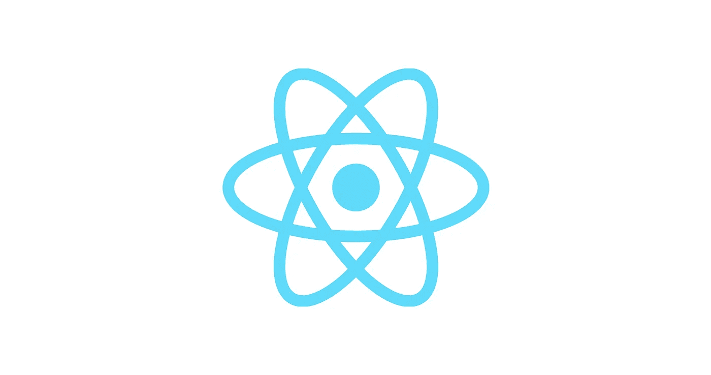
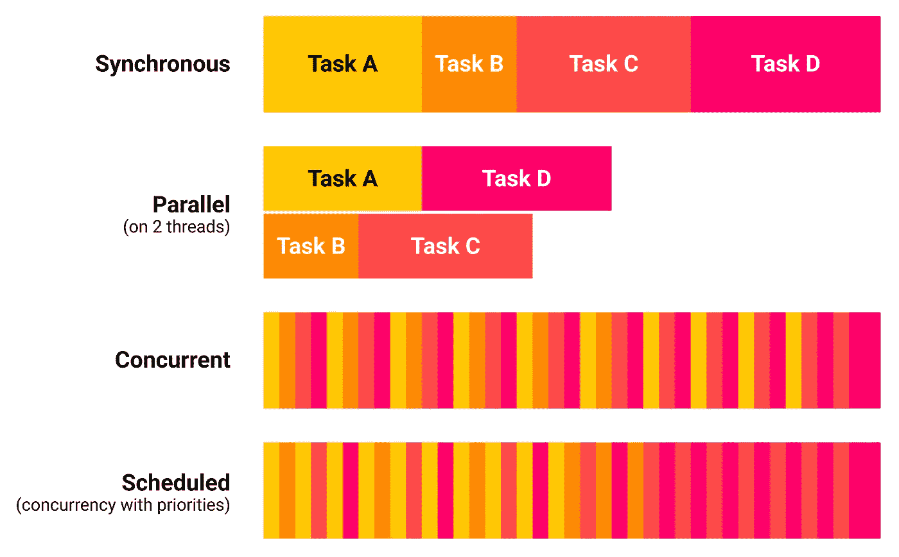
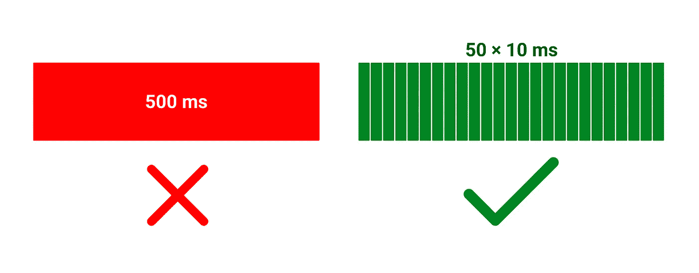

# 如何用 React 同时渲染一个

<canvas></canvas>

> 原文：<https://levelup.gitconnected.com/non-blocking-canvas-rendering-with-concurrent-react-f46032b03efa>

## 在不阻塞主线程的情况下在画布上呈现

React 徽标|来源:维基共享资源

新的 React 18 提供了[并发功能](https://pl.reactjs.org/blog/2022/03/29/react-v18.html#new-feature-transitions)，让你的应用响应更快。不幸的是，它只涵盖了组件渲染部分——组件效果仍然会阻塞主线程。在本文中，我将向您展示[使用-过渡-效果](https://www.npmjs.com/package/use-transition-effect)，这是我开发的一个新包，可以同时运行重度效果*(就像在画布上渲染)*。

并发渲染要好得多…我会在文章的最后回到这个例子。

# 基础知识

让我们暂时忘记 *React* ，以便更全面地了解前端性能问题。这将有助于更深入地理解并发特性是如何工作的。

## 是什么让前端感觉很慢？

当用户试图与前端应用程序交互时，前端应用程序会感觉很慢，但页面没有响应，因为它正在处理其他事情。

当一个任务执行时间过长时，它会阻止浏览器响应用户输入:页面感觉很慢。

## 什么是任务？

**任务**是浏览器渲染一个帧的工作单元。
它由以下步骤组成:

这些步骤通常被称为“渲染管道”

你可以在这篇 web.dev 文章 中找到更多关于渲染管道的信息。

## 什么是长任务？

一个 [**长任务**](https://web.dev/long-tasks-devtools/#what-are-long-tasks) 是一个耗时超过 50 毫秒的任务，50 毫秒的值基于以用户为中心的性能模型 [RAIL](https://web.dev/rail/) 。如果一项任务耗时超过 50 毫秒，用户输入就会感觉被延迟了(这就是我们大脑的工作方式，🧠).

了解任务持续时间如何影响感知绩效

如果你考虑长任务问题，问题不在于给定的任务花费太长时间，而在于它**阻塞了**其他任务。

> 这里的主要问题不是性能，而是调度。
> ——丹·阿布拉莫夫([超越 React 16](https://youtu.be/nLF0n9SACd4?t=1932) )

## 如何解锁主线程？

解锁主线程主要有两种策略——*并行*和*并发*。

不同的任务运行策略

**并行性**是关于在**多线程上运行，**所以可能*字面上*在独立的 CPU 内核上同时运行多个任务。

**并发**是关于在一个**单线程**上运行，并在任务之间快速切换，以创造一个*并行运行它们的假象*。

**调度**是一种包含任务优先级的并发性变体。

## 为什么是并发/调度而不是并行(WebWorker)？

web worker API 允许你在多线程上运行 JavaScript 代码。不幸的是，WebWorker API 有许多限制。最大的问题是缺少 DOM 访问。此外，您必须复制数据以便在线程之间发送，这本身就可能引入一个很长的任务。

从我个人的经验来看，WebWorkers 擅长数据处理和数字运算，但很难用于 UI 相关的东西。使现有代码在 WebWorker 环境中工作比为调度程序调整代码要困难得多。

TLDR；如果 WebWorker 适合您的情况，那太好了，使用它吧！否则，使用并发/调度。

## 并发性需要什么？

并发是指在不同的任务之间快速切换。要切换到另一个任务，您必须中断/暂停当前任务。要中断当前任务，可以使用生成器函数。常用的技术是每 10 ms 暂停一次，这样浏览器还有 6 ms 的时间来完成渲染流水线，满足 60 FPS *的 16 ms 截止时间(因为 1s / 60* ≈ *16 ms 所以是 16 ms)。*

要决定运行哪个任务，您需要一个调度程序。

要解除主线程的阻塞，您必须将长任务拆分成多个短任务

## 如何构建一个简单的“调度程序”

我实现了一个非常简单的调度程序(它一次只能运行一个生成器函数，没有优先级)。想法是运行生成器函数，直到我们到达截止时间(10 ms)，暂停它，并使用`setTimeout()`安排一个函数来恢复它。

检查 src/scheduler.js 文件。

这个实现离生产就绪还差得很远。比如`setTimeout()`引入 4 ms lag(最小 setTimeout 延迟)，我们不能调度多个函数，也没有优先级(所以是简单的并发)。好在我们可以使用 React 团队开发的 [**调度器**](https://www.npmjs.com/package/scheduler) 包。它处理所有这些调度程序功能。此外，有了单个调度程序，就不太可能出现资源匮乏的情况(通过竞争调度程序)。

# 调度程序包

从 React 17 开始，`react-dom`包包含了`scheduler`包作为依赖项。在 React 18 的并发特性中使用了`scheduler`包，比如并发组件渲染。

## 并发组件渲染算法如下:

1.  开始渲染一个新的虚拟 DOM。
2.  如果渲染时间超过阈值*(例如 10 ms)* ，则中断渲染。否则，将呈现的虚拟 DOM 应用于真实 DOM。
3.  主线程被解除阻塞—运行其他高优先级任务，如事件处理程序，并呈现一个帧。
4.  如果渲染被中断，请恢复渲染，然后转到步骤 2。

它将组件渲染任务分成几个较小的非阻塞任务。这里有一个例子可以让你看到它的作用:

useDeferredValue()使输入总是有响应的。去抖是不可能的。

值得注意的是，目前，并发渲染需要昂贵组件的记忆。你可以用`useTransition()`钩子达到和`useDeferredValue()`一样的效果，但是更罗嗦。

正如我在文章开头所说，它只涵盖了组件渲染部分— **组件效果仍然可以阻塞主线程**。让我们看看如何使用 scheduler 包来解除阻塞组件效果中的主线程。

# 使用调度程序包

这些是调度程序 API 最重要的部分:

所有导出的函数都带有前缀`unstable_`，以强调我们不应该期望它们会遵循语义版本化。如果您想使用 scheduler API，我建议重新导出这些函数。这样，万一将来 API 发生变化，您就有了一个适应的地方:

重新导出调度程序 API，以便更好地控制意外的 API 更改。

# useTransitionEffect()

为了集成生成器函数、调度器和 React，我创建了`**use-transition-effect**`包( [npm](https://www.npmjs.com/package/use-transition-effect) ，[源代码](https://github.com/piotr-oles/use-transition-effect/blob/main/src/use-transition-effect.ts))。您不必升级到 React 18，它也适用于 React 17。我鼓励你看看源代码——只有 100 行代码。该 API 类似于 React 中的`[useTransition](https://reactjs.org/docs/hooks-reference.html#usetransition)`钩子:

`startTransitionEffect`让您在不阻塞主线程的情况下安排长时间运行的效果。它需要一个生成器函数作为参数，因此您可以放弃阻塞主线程:

此外，您可以生成并返回一个清理函数，该函数将在过渡停止时运行(包括卸载):

`stopTransitionEffect`让你停止当前长时间运行的效果。你可以把它作为一个`useEffect`清理:

`isPending`指示过渡效果何时激活，以显示待定状态:

`scheduler`包导出了`unstable_shouldYield()`函数，如果当前任务耗时太长，该函数返回 true。你可以用它来决定何时让步:

如果你想在一个过渡效果中更新状态，你必须用`scheduler`包中的`unstable_runWithPriority()`函数包装这个更新(优先级高于`IdlePriority`)。否则，过渡效果内的状态更新将在过渡效果结束时运行:

这是前面使用`useTransitionEffect()`实现素数计算的例子:

最有趣的文件是 src/ *PrimesResult.js*

# 实际用法

不得不承认，在前端找素数并不是一个实际的例子。我选择它是因为它简单。但是还有更实际的:

## 在

<canvas>上渲染</canvas>

如果你渲染大量的数据点/图形，迟早会遇到性能问题。您可以尝试使用 WebWorker 和 [OffscreenCanvas](https://developer.mozilla.org/en-US/docs/Web/API/OffscreenCanvas) ，但是在撰写本文时，OffscreenCanvas [还没有得到很好的支持](https://caniuse.com/offscreencanvas)。此外，您将不得不做出重要的更改来适应现有的代码。

使用`*useTransitionEffect()*`，你可以在不阻塞主线程的情况下，在背景画布上进行增量渲染。

本文开头的例子。我希望源代码现在看起来更熟悉。

## 处理数据

从/向工作人员发送数据需要数据序列化。如果您必须处理相对较大的数据，仅仅是从/向工作人员发送数据就可能会导致一个很长的任务。

使用`*useTransitionEffect()*`，您不必序列化任何数据。您可以增量处理它，而不会阻塞主线程。

# 结论

调度是交付响应性用户界面的一种非常强大的技术。我们必须记住，我们的一些用户使用的设备要慢得多——因此，即使你的网站感觉响应迅速，也可能是因为你有一台用于开发的高端计算机。启用 CPU 节流*(Chrome 中的 DevTools / Performance 选项卡)*并观察它的行为是个好主意。

我觉得用`unstable_` API 还是可以的。我认为在下一个 React 版本中不会有太大的变化。我怀疑 React 团队在等待[调度 API](https://developer.mozilla.org/en-US/docs/Web/API/Scheduler) 在所有浏览器中可用。然后，他们将决定是否希望将他们的实现作为浏览器 API 上的一个瘦抽象，或者是否希望完全摆脱它。无论哪种方式，迁移都应该很容易。

如果你喜欢这个[使用-过渡-效果](https://github.com/piotr-oles/use-transition-effect)包，请给它一个⭐️星，如果你喜欢这个内容，我欢迎你关注我的媒体账户——这是我的第一篇文章，我打算写更多👨‍💻