# CanvasXpress vs. Plotly:哪个数据可视化库更好？

> 原文：<https://levelup.gitconnected.com/canvasxpress-vs-plotly-which-data-visualization-library-is-better-fcd0725e8b8f>

## CanvasXpress 将图表中的用户交互提升到了一个新的水平


卢克·切瑟在 [Unsplash](https://unsplash.com?utm_source=medium&utm_medium=referral) 上的照片

近年来，数据变得越来越重要。特别是，已经创建了许多库，使开发人员和数据科学家能够直接在浏览器中浏览和可视化数据。Plotly.js 是最流行的数据可视化 JavaScript 库之一，但也不乏竞争对手。

具体来说，CanvasXpress 是一个用于数据分析和可视化的新 JavaScript 库，它承诺提供许多使 Plotly 被广泛采用的功能，但更注重用户交互。

现在，让我们了解您需要了解的关于 CanvasXpress 和 Plotly 的一切，了解两者都提供了什么，并在最重要的方面对它们进行比较，以找出哪个库最适合您。

# 什么是 CanvasXpress？

[CanvasXpress](https://canvasxpress.org/) 是一个独立的、开源的、用于数据分析的高级 JavaScript 库，提供 40 多种图表类型。你可以在这里看到它们。CanvasXpress 可在移动设备、平板电脑和桌面设备上的所有现代浏览器中运行，旨在通过复杂且不引人注目的用户界面进行可重复的研究。

此外，它还提供了配置、完整且轻松的数据审计跟踪，以及一些用户交互。你可以在 GitHub 上找到 [CanvasXpress 库](https://github.com/neuhausi/canvasXpress)。

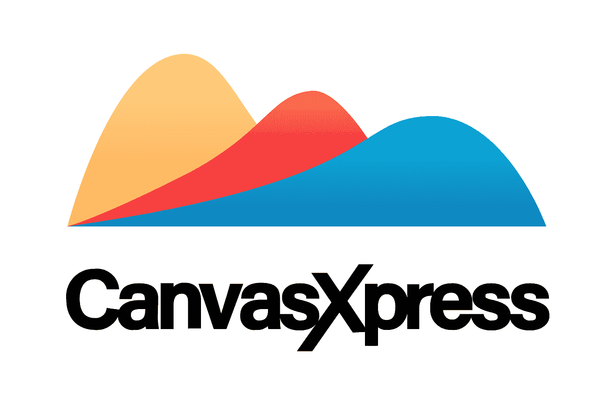

CanvasXpress 的标志[ [来源](https://github.com/neuhausi/canvasXpress)

您可以使用 npm 安装 CanvasXpress，如下所示:

```
npm install [canvasxpress](https://www.npmjs.com/package/canvasxpress)
```

# 什么是 Plotly？

[Plotly.js](https://plotly.com/) 是一个高级的、声明性的 JavaScript 图表库，附带 40 多种图表类型，包括 3D 图表、统计图和 SVG 地图。Plotly.js 是免费开源的，你可以在 [GitHub](https://github.com/plotly/plotly.js) 上查看源代码、报告问题或者投稿。


Plotly 的 logo [ [来源](https://en.wikipedia.org/wiki/Plotly#/media/File:Plotly-logo.png)

您可以使用以下命令通过 npm 安装 Plotly.js:

```
npm install [plotly.js-dist](https://www.npmjs.com/package/plotly.js-dist)
```

# CanvasXpress vs. Plotly

现在让我们来看一下 CanvasXpress 和 Plotly 之间的直接比较，重点放在数据可视化库中最重要的方面。

## 支持的编程语言和框架

CanvasXpress 和 Plotly 都支持最流行的 JavaScript 框架，如 Node.js、React、Angular 和 Next.js。具体来说，这两个库支持以下语言:

*   **CanvasXpress** : R，Python，PHP，JavaScript，ggplot，Dash。
*   **Plotly.js** : Python，R，Julia，JavaScript，ggplot2，F#，MATLAB，Dash。

## 导入和导出数据集格式

这两个库都允许您定义 JSON 格式的图表。这使您能够以一种可以在不同编程语言之间轻松共享的格式对数据集、数据可视化逻辑和图表配置进行编码。

Plotly 中的 JSON 条形图定义如下:

同样，这是 CanvasXpress 中相同的 JSON 条形图定义的外观:

**阴谋地**

*   **导入数据格式** : JSON，CSV，.xls，. xlsx。
*   **导出数据格式** : JSON，CSV，。xls，。xlsx，PNG，JPEG，WebP，SVG，PDF。

**CanvasXpress**

*   **导入数据格式** : JSON、XML、PNG、CSV、TSV、. xls
*   **导出数据格式** : JSON、PNG、CSV、TSV、SVG .xls

请注意，CanvasXpress 还支持。png 文件作为数据导入格式。具体来说，您可以通过拖放操作轻松地从. png 图像中加载数据，如下所示:

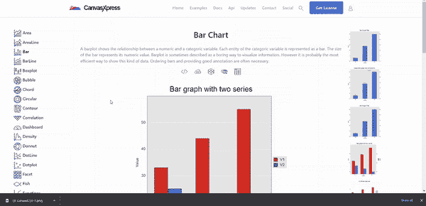

在 CanvaXpress 中从. png 文件导入数据集

这样，CanvasXpress 将不会显示与简单图像相同的图表。相反，它会自动从。作为导入提供的 png 图像，并在交互式图表中相应地绘制它。

## 可用图表

两个库都支持 40 多种类型的图形。把它们都展示出来会花太多时间。而是让我们通过两张图片来对比一下。请注意，这两个数据可视化和分析库也支持 3D 图形。这意味着两者都允许您在三维空间中探索数据。

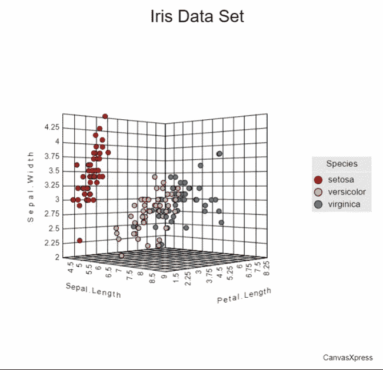

CanvasXpress 中的三维散点图[ [来源](https://canvasxpress.org/examples/scatter3d-1.html#)

**CanvasXpress**

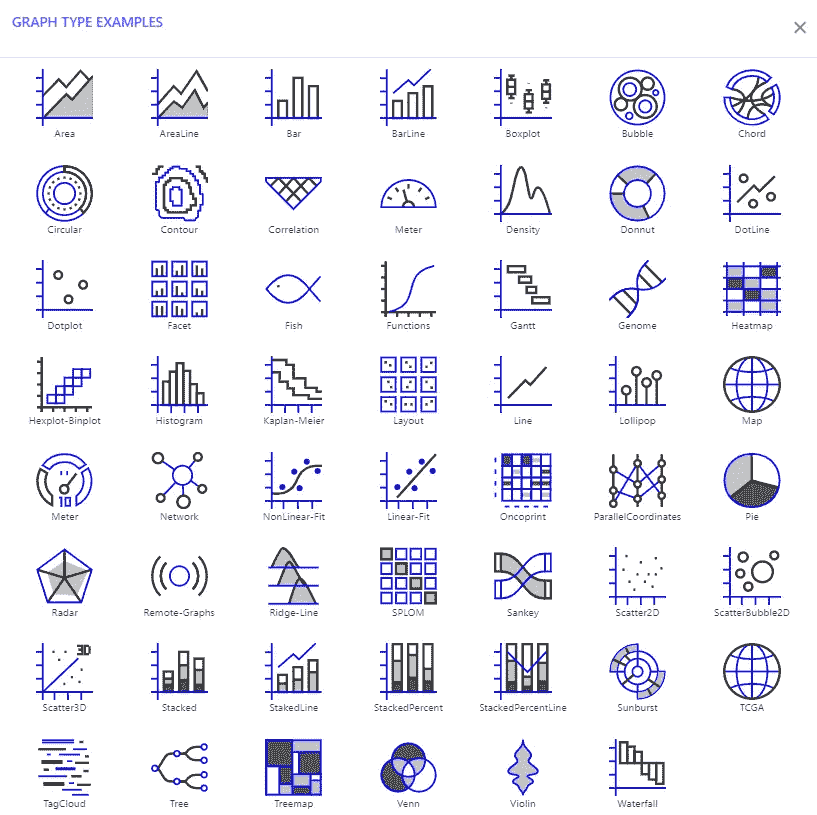

CanvasXpress 支持的图表列表

在这个页面的左侧菜单中，您可以找到 CanvasXpress 提供的每个图表的实例。

**阴谋地**

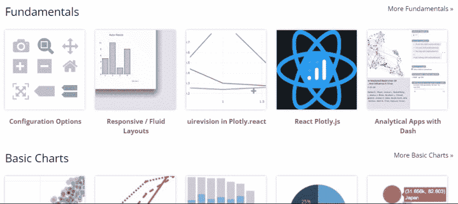

Plotly.js 支持的图表列表

请注意，在 Plotly 提供的所有图表中，该页面仅包含几个按类别组织的示例图表。Plotly.js 支持的所有图表示例列表可在[此处](https://plotly.com/javascript/)获得。

## 可用的用户交互

从我们到目前为止所看到的，这两个图书馆似乎没有很大的不同。CanvasXpress 和 Plotly 之间最大的区别是提供给最终用户的交互水平。

**阴谋地**

Plotly 只为其用户提供三种类型的交互:[悬停](https://plotly.com/javascript/hover-events/)、[点击](https://plotly.com/javascript/click-events/)和[缩放](https://plotly.com/javascript/zoom-events/)。您可以在下面看到这三种方法:

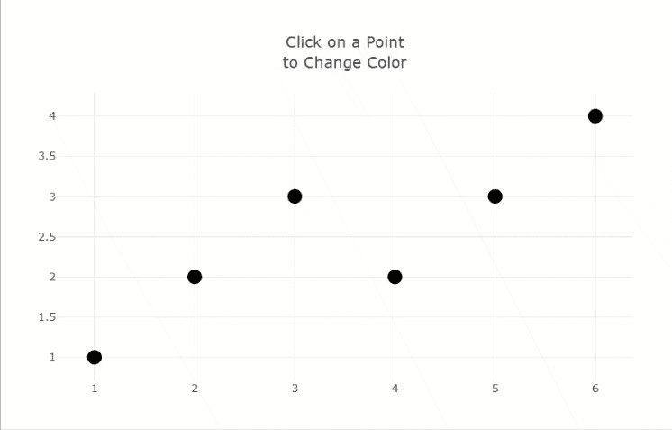

在 Plotly.js [ [Source](https://plotly.com/javascript/plotlyjs-events/#hover-event) ]中悬停、单击和缩放图表

请记住，Plotly 允许您将自定义回调与这些事件相关联。因此，您还可以更改悬停文本的格式、颜色和大小。这只是一个例子，你可以在这里了解更多关于定制事件处理程序[的内容。尽管如此，Plotly 本身提供的交互显然很差。](https://plotly.com/javascript/hover-text-and-formatting/)

另外，默认情况下，Plotly 带有一个工具栏。

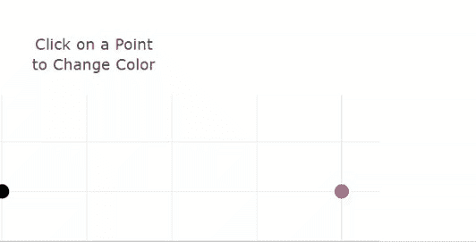

鼠标悬停时出现的绘图工具栏

您可以通过将鼠标悬停在任何图表的右上角来激活它，无论其类型如何。

然而，与 CanvasXpress 本地提供给用户的工具相比，这里可用的工具极其有限。我们来深究一下。

**CanvasXpress**

详细分析 CanvasXpress 自带的所有交互会花费太多时间。你可以在这里看到所有的，但是让我们只关注最重要的。请记住，这里显示的交互在每个图表上都是自然存在的，无论其类型如何。

CanvasXpress 中的基本交互如下所示:

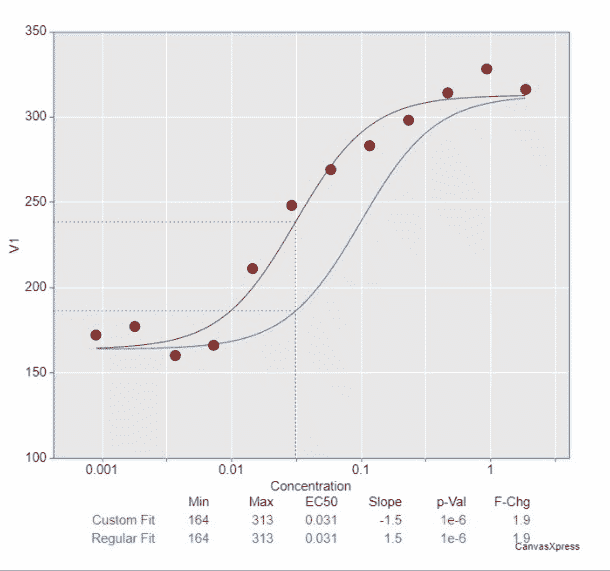

在 CanvasXpress 中悬停、调整图表大小和缩放图表

如你所见，这包括悬停、点击、调整大小和缩放。其他交互可以通过将鼠标悬停在任何图表右上角激活的工具栏来实现:

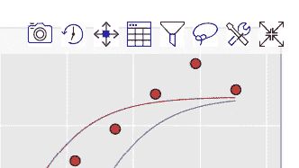

CanvasXpress 工具栏

这些按钮允许您:

1.  将图表导出到. png 文件
2.  [以一种互动视频的形式再现](https://canvasxpress.org/docs/audit.html#reproduce)到目前为止你与图表的互动
3.  移动画布
4.  查看以表格格式绘制的数据集
5.  [浏览数据并即时更改数据](https://canvasxpress.org/docs/wrangling.html)
6.  执行套索选择
7.  进入定制窗口
8.  进入全屏模式

具体来说，点击按钮 7。调出下面的“定制”窗口:

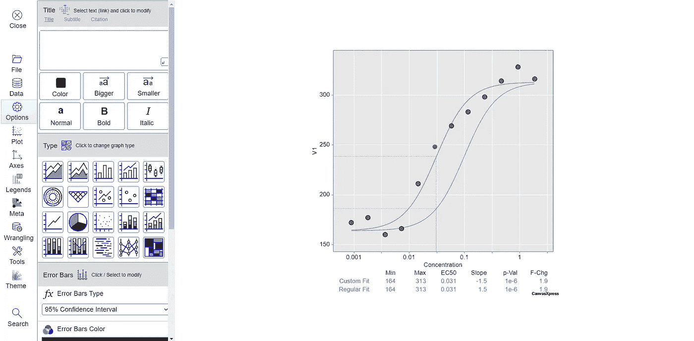

CanvasXpress“定制”窗口

这里，CanvasXpress 提供了几个工具来实时更改图表的数据、类型和外观。这种高级模式可用于每个图表，并提供了无限的可能性。

此外，通过右键单击图表，您可以访问其他几个功能来定制图表并与之交互。

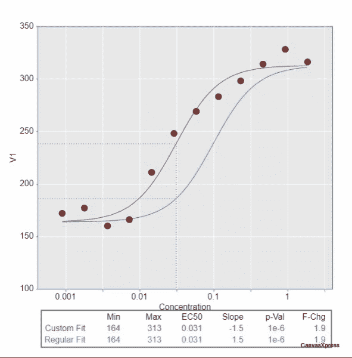

CanvasXpress 右键菜单

以下是您可以在上面看到的“定制”窗口中探索的许多功能的快捷方式。

最后，CanvasXpress 允许您通过[广播事件](https://canvasxpress.org/docs/broadcast.html)链接多个图形的交互:

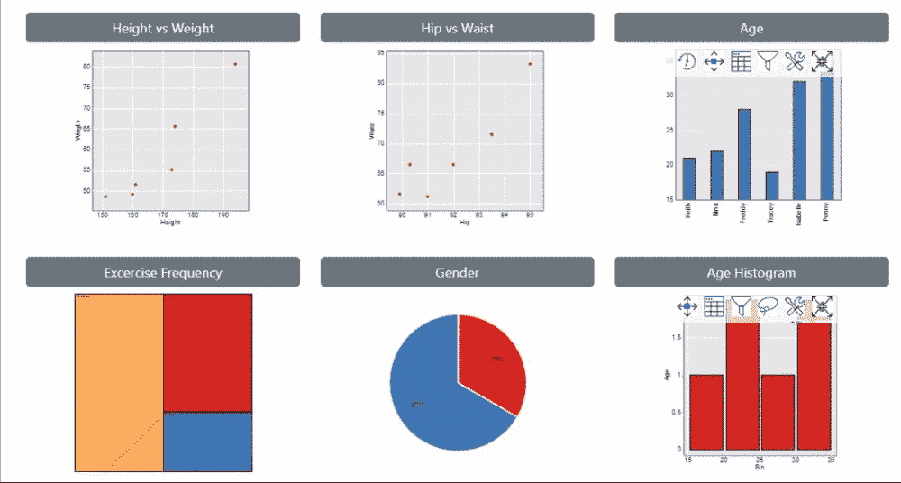

CanvasXpress 广播活动

请记住，为了简单起见，这里我们只触及了 CanvasXpress 为用户提供的功能的表面。另外，不要忘记您可以在代码中定制图表对用户行为的反应方式。你可以在[的官方文档](https://canvasxpress.org/docs.html)中仔细看看 CanvasXpress 在用户交互方面提供了什么。

# 你应该选择哪一个？

js 是一个成熟的项目，承载着一个大型社区和高质量的文档。然而，当涉及到用户交互和为最终用户提供的工具时，它就显得不够了。这意味着，如果您需要社区的支持，或者如果您不希望最终用户与图表进行大量交互，它是静态绘制和探索数据的完美库。

另一方面，如果您希望为最终用户提供直接在图表上播放数据并与之交互的方式，您应该考虑 CanvasXpress。虽然是一个相对较新的项目，但它本身提供的交互令人印象深刻，有时甚至感觉很神奇。具体来说，CanvasXpress 似乎是数据科学家和经验丰富的用户的完美工具，因为它允许他们实时处理数据集，以研究结果会发生什么。

# 结论

在本文中，您看到了 CanvasXpress 和 Plotly 之间的直接比较，以帮助您选择最适合您需求的库。Plotly.js 是最广泛采用的 JavaScript 数据可视化库之一。因此，虽然有几十个类似的库，但 Plotly 代表了一个基准。相比之下，CanvasXpress 相当新，它提供了一种全新的数据可视化和分析方法。这是因为 CanvasXpress 自带了比 Plotly 更多的用户交互，允许您以前所未有的方式探索和处理数据。

感谢阅读！我希望这篇文章对你有所帮助。请随意留下任何问题、评论或建议。