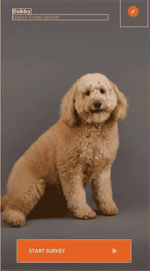

# 使用视图寻呼机的带指示器的刷卡视图

> 原文：<https://levelup.gitconnected.com/card-swipe-view-with-indicator-using-view-pager-ae5c01c7fe5>

在这篇文章中，我将向你展示如何使用 Kotlin 中的 view pager 来实现一个动态的可滑动卡片视图。我假设你对 Kotlin 和 Android 有一些基本的了解

我们现在将创建一个新的空项目，不再多说，让我们直接进入代码:

# 第一步:

首先，我们将设置 activity_main.xml 布局

```
<?xml version="1.0" encoding="utf-8"?>
<androidx.constraintlayout.widget.ConstraintLayout xmlns:android="http://schemas.android.com/apk/res/android"
    xmlns:app="http://schemas.android.com/apk/res-auto"
    xmlns:tools="http://schemas.android.com/tools"
    android:layout_width="match_parent"
    android:layout_height="match_parent"
    tools:context=".fragment.PetsFragment">

    <androidx.constraintlayout.widget.ConstraintLayout
        android:id="@+id/layout_empty"
        android:visibility="gone"
        android:layout_width="match_parent"
        android:layout_height="match_parent">

        <TextView
            android:id="@+id/textView5"
            android:layout_width="wrap_content"
            android:layout_height="wrap_content"
            android:layout_marginStart="24dp"
            android:layout_marginLeft="24dp"
            android:layout_marginTop="24dp"
            android:fontFamily="@font/gotham_bold"
            android:text="@string/txt_pets"
            android:textColor="@color/txt_dark_gray"
            android:textSize="26sp"
            app:layout_constraintEnd_toEndOf="parent"
            app:layout_constraintHorizontal_bias="0.0"
            app:layout_constraintStart_toStartOf="parent"
            app:layout_constraintTop_toTopOf="parent" />

        <ImageView
            android:layout_width="wrap_content"
            android:layout_height="wrap_content"
            android:src="@drawable/ic_empty"
            app:layout_constraintBottom_toBottomOf="parent"
            app:layout_constraintEnd_toEndOf="parent"
            app:layout_constraintStart_toStartOf="parent"
            app:layout_constraintTop_toTopOf="parent" />

        <ImageView
            android:id="@+id/img_add_pets"
            android:layout_width="wrap_content"
            android:layout_height="wrap_content"
            android:src="@drawable/ic_add"
            android:scaleType="center"
            app:layout_constraintBottom_toTopOf="@+id/textView6"
            app:layout_constraintEnd_toEndOf="@+id/textView6"
            app:layout_constraintStart_toStartOf="@+id/textView6" />

        <TextView
            android:id="@+id/textView6"
            android:layout_width="wrap_content"
            android:layout_height="wrap_content"
            android:layout_marginBottom="24dp"
            android:text="@string/add_first_pet"
            android:fontFamily="@font/gotham_book"
            app:layout_constraintBottom_toBottomOf="parent"
            app:layout_constraintEnd_toEndOf="parent"
            app:layout_constraintStart_toStartOf="parent" />

    </androidx.constraintlayout.widget.ConstraintLayout>

    <androidx.constraintlayout.widget.ConstraintLayout
        android:id="@+id/layout_main"
        android:layout_width="match_parent"
        android:layout_height="match_parent">

        <TextView
            android:id="@+id/textView7"
            android:layout_width="wrap_content"
            android:layout_height="wrap_content"
            android:layout_marginStart="24dp"
            android:layout_marginTop="16dp"
            android:fontFamily="@font/gotham_bold"
            android:text="@string/txt_pets"
            android:textColor="@color/txt_dark_gray"
            android:textSize="26sp"
            app:layout_constraintEnd_toEndOf="parent"
            app:layout_constraintHorizontal_bias="0.0"
            app:layout_constraintStart_toStartOf="parent"
            app:layout_constraintTop_toTopOf="parent" />

        <ImageView
            android:layout_width="50dp"
            android:layout_height="50dp"
            android:layout_marginEnd="24dp"
            android:src="@drawable/ic_add"
            android:scaleType="fitXY"
            app:layout_constraintBottom_toBottomOf="@+id/textView7"
            app:layout_constraintEnd_toEndOf="parent"
            app:layout_constraintTop_toTopOf="@+id/textView7" />

        <androidx.viewpager.widget.ViewPager
            android:id="@+id/view_pager"
            android:layout_width="match_parent"
            android:layout_height="0dp"
            android:layout_marginTop="16dp"
            android:layout_marginBottom="50dp"
            android:clipToPadding="false"
            android:foregroundGravity="center"
            android:overScrollMode="never"
            app:layout_constraintBottom_toBottomOf="parent"
            app:layout_constraintEnd_toEndOf="parent"
            app:layout_constraintStart_toStartOf="parent"
            app:layout_constraintTop_toBottomOf="@+id/textView7" />

        <LinearLayout
            android:id="@+id/slider_dots"
            android:layout_width="match_parent"
            android:layout_height="0dp"
            android:orientation="horizontal"
            android:gravity="center_vertical|center_horizontal"
            app:layout_constraintBottom_toBottomOf="parent"
            app:layout_constraintEnd_toEndOf="parent"
            app:layout_constraintStart_toStartOf="parent"
            app:layout_constraintTop_toBottomOf="@+id/view_pager" />

    </androidx.constraintlayout.widget.ConstraintLayout>

</androidx.constraintlayout.widget.ConstraintLayout>
```

# 第二步:

打开 MainActivity.kt 并如下所述声明这些变量:

```
private lateinit var adapter: PetAdapter
private lateinit var models: ArrayList<PetsModel>
private lateinit var viewPager: ViewPager
var sliderDotspanel: LinearLayout? = null
private var dotscount = 0
```

现在是初始化变量的时候了，我将在 MainActivity 上呈现的列表中添加虚拟值:

```
viewPager = findViewById(R.id.*view_pager*)
sliderDotspanel = findViewById(R.id.*slider_dots*)

models = ArrayList()
models.add(PetsModel(R.drawable.*dummy_image*,"Dobby", "Dog"))
models.add(PetsModel(R.drawable.*dummy_image*,"Kitto", "Cat"))
models.add(PetsModel(R.drawable.*dummy_image*,"Cozmo", "Lambardor"))
models.add(PetsModel(R.drawable.*dummy_image*,"Tiger", "German Shepherd"))
models.add(PetsModel(R.drawable.*dummy_image*,"Husky", "Husky"))
models.add(PetsModel(R.drawable.*dummy_image*,"Cat", "Unknown"))adapter = PetAdapter(models, this@MainActivity)
viewPager.*adapter* = adapter
```

# 第三步:

让我们转到适配器部分，看看如何创建一个叫做 pageAdapter 的东西，它负责在屏幕上呈现片段。创建一个名为“PetAdapter”的新 Java 类，并扩展“PagerAdapter ”,只需将下面的代码复制粘贴到该类中，我将用简单的方式解释它。

```
import android.content.Context;
import android.view.LayoutInflater;
import android.view.View;
import android.view.ViewGroup;
import android.widget.ImageView;
import android.widget.TextView;
import androidx.annotation.NonNull;
import androidx.viewpager.widget.PagerAdapter;

import com.celeritassolution.cardwipeview.R;
import com.celeritassolution.cardwipeview.model.PetsModel;

import java.util.ArrayList;

public class PetAdapter extends PagerAdapter {

    private ArrayList<PetsModel> models;
    private LayoutInflater layoutInflater;
    private Context context;

    public PetAdapter(ArrayList<PetsModel> models, Context context) {
        this.models = models;
        this.context = context;
    }

    @Override
    public int getCount() {
        return models.size();
    }

    @Override
    public boolean isViewFromObject(@NonNull View view, @NonNull Object object) {
        return view.equals(object);
    }

    @NonNull
    @Override
    public Object instantiateItem(@NonNull ViewGroup container, final int position) {
        layoutInflater = LayoutInflater.*from*(context);
        View view = layoutInflater.inflate(R.layout.*item*, container, false);

        ImageView imageView;
        TextView title, desc;

        imageView = view.findViewById(R.id.*image*);
        title = view.findViewById(R.id.*title*);
        desc = view.findViewById(R.id.*txt_des*);

        imageView.setImageResource(models.get(position).getImage());
        title.setText(models.get(position).getTitle());
        desc.setText(models.get(position).getDesc());

        container.addView(view, 0);
        return view;
    }

    @Override
    public void destroyItem(@NonNull ViewGroup container, int position, @NonNull Object object) {
        container.removeView((View)object);
    }
}
```

我们首先定义类的构造函数，我们将传递两个参数一个数组列表，它将保存数据以决定在主活动和上下文中创建多少项。我们更关心将为我们带来奇迹的 instantiateItem()。基本上，这个方法将为给定的位置创建页面。适配器负责将视图添加到这里给出的容器中，尽管它只需要确保在从 finishUpdate(ViewGroup)返回时完成这项工作

ref:[https://developer . Android . com/reference/Android/support/v4/view/pager adapter](http://Official documentation for the pageAdapter)

以及返回视图数量的 getCount()方法。

# 第四步:

让我们创建将在适配器中展开的 item.xml 布局:



该项目的布局可以是任何东西，为简单起见，我们将去这个布局，或者你也可以有你自己的布局实现。:)
所以只要把代码复制粘贴下来就行了。

```
<?xml version="1.0" encoding="utf-8"?>
<LinearLayout xmlns:android="http://schemas.android.com/apk/res/android"
    xmlns:app="http://schemas.android.com/apk/res-auto"
    android:orientation="vertical"
    android:layout_width="match_parent"
    android:layout_height="match_parent">

    <androidx.cardview.widget.CardView
        android:layout_width="match_parent"
        android:layout_height="match_parent"
        android:layout_margin="8dp"
        app:cardCornerRadius="8dp">

        <androidx.constraintlayout.widget.ConstraintLayout
            android:layout_width="match_parent"
            android:layout_height="match_parent">

            <ImageView
                android:id="@+id/image"
                android:layout_width="match_parent"
                android:layout_height="0dp"
                android:cropToPadding="true"
                android:scaleType="centerCrop"
                android:src="@drawable/dummy_image"
                app:layout_constraintBottom_toBottomOf="parent"
                app:layout_constraintEnd_toEndOf="parent"
                app:layout_constraintStart_toStartOf="parent"
                app:layout_constraintTop_toTopOf="parent" />

            <TextView
                android:id="@+id/title"
                android:layout_width="wrap_content"
                android:layout_height="wrap_content"
                android:layout_marginStart="32dp"
                android:layout_marginTop="24dp"
                android:fontFamily="@font/gotham_bold"
                android:text="Dobby"
                android:textColor="@color/white"
                app:layout_constraintEnd_toEndOf="parent"
                app:layout_constraintHorizontal_bias="0.0"
                app:layout_constraintStart_toStartOf="parent"
                app:layout_constraintTop_toTopOf="@+id/image" />

            <TextView
                android:id="@+id/txt_des"
                android:layout_width="0dp"
                android:layout_height="wrap_content"
                android:layout_marginEnd="32dp"
                android:fontFamily="@font/gotham_narrow_bold"
                android:text="English Cocker Spaniel"
                android:textColor="@color/txt_gray"
                android:textSize="12sp"
                app:layout_constraintEnd_toStartOf="@+id/img_edit_pet"
                app:layout_constraintHorizontal_bias="0.0"
                app:layout_constraintStart_toStartOf="@+id/title"
                app:layout_constraintTop_toBottomOf="@+id/title" />

            <ImageView
                android:id="@+id/img_edit_pet"
                android:layout_width="72dp"
                android:layout_height="72dp"
                android:layout_marginEnd="8dp"
                android:scaleType="fitXY"
                android:src="@drawable/ic_edit"
                app:layout_constraintEnd_toEndOf="parent"
                app:layout_constraintTop_toTopOf="parent" />

            <Button
                android:id="@+id/btn_start"
                style="@style/Widget.AppCompat.Button.Borderless"
                android:layout_width="0dp"
                android:layout_height="wrap_content"
                android:layout_marginStart="12dp"
                android:layout_marginEnd="50dp"
                android:layout_marginBottom="24dp"
                android:background="@drawable/btn_login"
                android:drawableRight="@drawable/ic_play"
                android:fontFamily="@font/gotham_narrow_bold"
                android:paddingStart="32sp"
                android:paddingTop="18dp"
                android:paddingEnd="32sp"
                android:paddingBottom="18dp"
                android:text="@string/start_survey"
                android:textAlignment="viewStart"
                android:textColor="@color/white"
                app:layout_constraintBottom_toBottomOf="parent"
                app:layout_constraintEnd_toEndOf="parent"
                app:layout_constraintStart_toStartOf="@+id/title" />

        </androidx.constraintlayout.widget.ConstraintLayout>

    </androidx.cardview.widget.CardView>

</LinearLayout>
```

我们已经完成了适配器，现在让我们回到我们的主要活动，并完成这一部分。

我们现在必须在视图页下面实现指示器，所以让我们从这里开始:首先，我们将从一个适配器中获得指示器的计数，这个适配器是我们之前通过调用而创建的，如下所示。然后，我们将动态创建图像视图，并将这些图像视图添加到名为“sliderDotspanel”的线性布局中，最后，我们将为选定和未选定的指示器设置图像可绘制性

```
dotscount = adapter.*count* val dots = *arrayOfNulls*<ImageView>(dotscount)

for (i in 0 *until* dotscount) {
    dots[i] = ImageView(this)
    dots[i]!!.setImageDrawable(
           ContextCompat.getDrawable(this,
           R.drawable.*non_active_dot*))
    val params = LinearLayout.LayoutParams(
          LinearLayout.LayoutParams.*WRAP_CONTENT*,
          LinearLayout.LayoutParams.*WRAP_CONTENT
    )* params.setMargins(8, 0, 8, 0)
    sliderDotspanel!!.addView(dots[i], params)
}
dots[0]?.setImageDrawable(
           ContextCompat.getDrawable(
           this, R.drawable.*active_dot*)
           )
```

# 最后一步:

我们已经创建了 viewpager、它的适配器、布局和所有东西，现在我们只需将指示器与 View Pager 连接起来，以在滑动时监听视图的变化，为此我们必须设置“setOnPageChangeListener ”,每当页面发生变化或增量滚动时都会调用它，并覆盖它的方法。

```
viewPager.setOnPageChangeListener(object: ViewPager.OnPageChangeListener{
    override fun onPageScrollStateChanged(state: Int) {}

    override fun onPageScrolled(
            position: Int, 
            positionOffset: Float, 
            positionOffsetPixels: Int){}

    override fun onPageSelected(position: Int) {
        for (i in 0 *until* dotscount) {
            dots[i]?.setImageDrawable(
            ContextCompat.getDrawable(
            this@MainActivity,R.drawable.*non_active_dot*)
            )
        }
        dots[position]?.setImageDrawable(
        ContextCompat.getDrawable(
        this@MainActivity,R.drawable.*active_dot*)
        )
    }
})
```

“onPageSelected”方法将在新页面被选中时调用，并且在每个页面选择中，我们必须相对于所选位置移动我们的指示器。

答对了，现在就这样。您可以参考我的 GitHub repo 以获得本文中使用的资源和完整的项目。
[https://github.com/aasif1297/CardwipeView](https://github.com/aasif1297/CardwipeView)