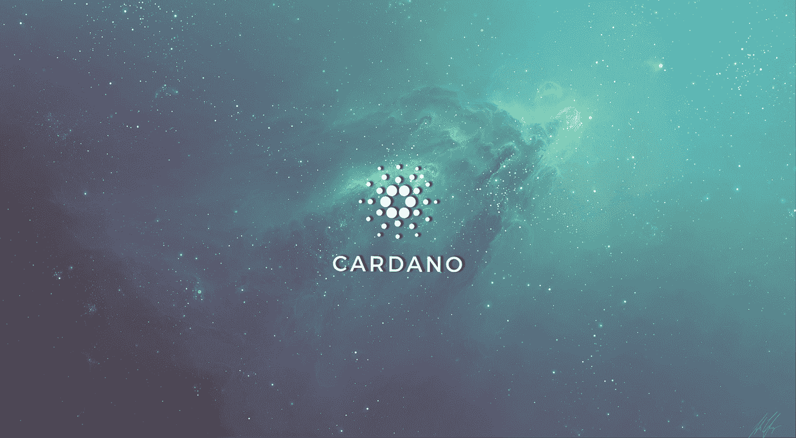

# 卡尔达诺(ADA)可能很快就会从其发射台看到链上流动性的提升

> 原文：<https://levelup.gitconnected.com/cardano-ada-could-soon-see-an-on-chain-liquidity-boost-from-its-launchpad-a79810cf7857>

随着这一新协议的推出，Cardano 生态系统可能很快就会获得链上流动性解决方案。

随着 OccamRazer 的推出，Cardano 生态系统可以看到其链上流动性的大规模扩张，occam Razer 是一个分散的融资平台和流动性解决方案，专为网络需求量身定制。

该平台有可能成为今年其他 Launchpad 解决方案已经取得的类似成功。这将极大地提高 Cardano 的市场地位。

# 卡尔达诺的缓慢发展过程告一段落

Cardano 因其缓慢的开发和引导过程而臭名昭著。缓慢但稳定的进展被有意接受，以保证网络的安全性。但是这个发展的时代对于卡尔达诺来说可能正在慢慢走向终结。在 Cardano 上开始项目并从花费数年时间开发的功能中获益的时机已经慢慢到来。

在 Cardano 上推出的第一个主要的去中心化应用是 Occam Finance。一个旨在让 Cardano 成为筹款网络的项目。这一愿景的第一个组成部分将是“OccamRazer”，这是一个去中心化的金融平台，为专业风险投资参与者提供一整套合规和监管技术工具。

launchpad 将拥有一个用户友好的界面，使不太懂技术的网络参与者也能使用它。

# OccamRazer 的目标是将新的参与者带入 Cardano 生态系统

根据该公司的博客文章，OccamRazer 已经完全准备好生产，并将很快托管第一批筹款资金。Occam Finance 认为，其平台最终将发展成为一个全面的生态系统，远远超越 Launchpad 和其他更传统的 DeFi 产品。

通过为新兴的新项目群创建一个发射台，OccamRazer 将为 Cardano 生态系统带来新的参与者、公司、应用程序和风险资本。这反过来又有可能从当地社区吸引数百万用户到卡尔达诺。

该公司在博文中写道:

> 能够为分散式筹款提供完整的服务将使 DeFi on Cardano 成为一个真正的全球现象。

使用 OccamRazer launchpad 的第一批项目将是 Catalyst 项目(Cardano 的分散式社区主导的融资平台)的早期成功项目。因此，奥卡姆金融说，这些项目将被独特地定位为成长为一个“准备好并等待”的 Cardano 生态系统，因为社区已经验证了它们。

为了支持 Occam 生态系统，该公司将推出 OCC 令牌，它利用了 Cardano 的本地资产功能。

我在每月的[时事通讯中分享了更多私密的想法，你可以在这里查看](https://mailchi.mp/bf8f8e8ed697/keep-in-touch-with-lukas)。请在评论中告诉我，并在各种社交媒体平台上加入我:

[推特](https://twitter.com/WiesfleckerL) ● [Instagram](https://www.instagram.com/lukaswiesflecker/) ● [脸书](https://www.facebook.com/lukaswiesfleckerr)●[bit clout](https://bitclout.com/u/lukaswiesflecker)●[Snapchat](https://www.snapchat.com/add/luggooo)●[LinkedIn](https://www.linkedin.com/in/lukas-wiesflecker-1b11251a5/)

无论你做什么，都要带着爱和激情去做！