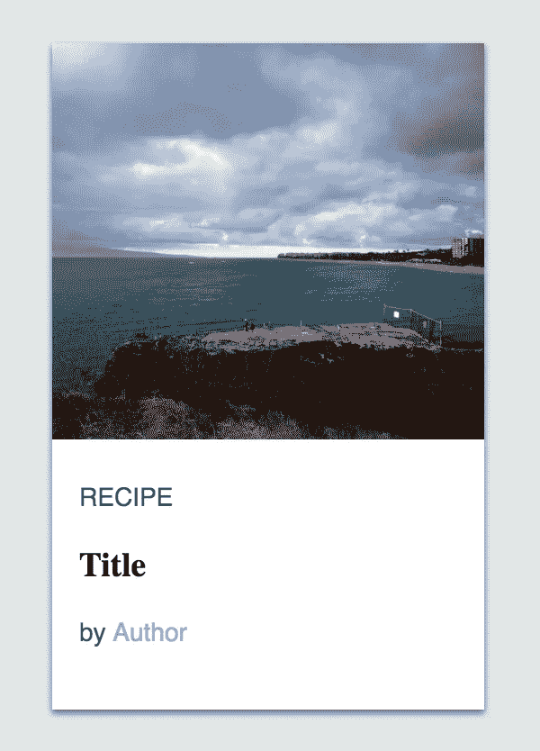

# 卡片悬停动画— WotW

> 原文：<https://levelup.gitconnected.com/cards-hover-animation-wotw-7d1304f16ec6>

## 使用 JavaScript、CSS 和 Vue 创建悬停时的扩展卡片动画。


欢迎来到“每周小部件”系列，在这里我拍摄了令人敬畏的 UI/UX 组件的 gif 或视频，并用代码将它们赋予生命。

> *查看所有* [*本周小部件文章*](https://levelup.gitconnected.com/wotw/home) *并关注 Gitconnected，确保您不会错过任何即将到来的小部件教程*

几周以来，我一直很忙，在 [Wizeline Academy](https://academy.wizeline.com/) 准备和讲授 Vue.js 课程，但我又带着另一个互动组件回来了。

今天，我们将制作一个卡片列表，当鼠标悬停(或在手机中点击)时，卡片会显示动画。灵感来自 [Kreativa 工作室](https://dribbble.com/KreativaStudio)创作的这个[运球](https://dribbble.com/shots/4579038-Foodiefit-Interaction-studio-included)，看起来是这样的:


## 准备

对于今天的小部件，我们将使用 [Vue.js](https://vuejs.org/) ，对于一些特定的动画，我们将使用 [TweenMax](https://greensock.com/tweenmax) 库。

如果你想继续，你可以派生这个已经有依赖关系的 [codepen 模板](https://codepen.io/ederdiaz/pen/bMLbNp)。

## 初始标记

对于这个组件，我将从制作一张卡开始。它将被分为两部分:图像和带有文本元素的页脚。

此外，对于每个元素，我将设置一个特定的类，以便我们可以稍后对其进行样式化。

```
<div id="app">
  <div class="card-row">
    <div class="card">

      

      <div class="card-footer">
        <p class="card-text">RECIPE</p>
        <h3 class="card-title">Title</h3>
        <p class="card-text">by 
          <span class="card-author">Author</span>
        </p>
      </div>
    </div>
  </div>
</div>
```

在这一点上，我们应该只有一个大的图像和一些文字如下。

## 式样

在做任何事情之前，我们需要让卡片看起来像参考，以便处理任何需要的动画。

首先我会匹配车身背景色。然后在`card-row`中，我将利用`flex`、`justify-content`属性和`align-items`来居中显示内容——在本例中是卡片。

```
body {
  background-color: #E1E7E7;
}

.card-row {
  display: flex;
  justify-content: center;
  align-items: center;  
  min-width: 780px;
  width: 100%;
  height: 500px;
}
```

现在让我们设计卡片。`position`将被设置为`relative`，以便能够定位页脚元素并将其附加到底部。此外，我们将`overflow`属性设置为`hidden`，以便能够调整背景图像的大小，而不会超出卡片的范围。

```
.card {
  position: relative;
  background-color: #FFFFFF;
  height: 370px;
  width: 240px;
  margin: 10px;
  overflow: hidden;
  box-shadow: 0px 2px 4px 0px rgba(0,0,0,0.5);
}
```

对于图像，我将`position`设置为`absoulte`，将`left`和`right`属性设置为`-9999px`，即使我们对图像的宽度进行动画处理，这个技巧也应该使图像水平居中。

```
.card-image {
  /* center horizontally overflown image */
  position: absolute;
  left: -9999px;
  right: -9999px;
  margin: auto;

  height: 220px;
  min-width: 100%;
}
```

最后但同样重要的是，我们需要设计页脚及其内容的样式。为此`position: absolute`和`bottom:0`应该将容器保持在底部。剩下的只是让元素看起来有点像引用的规则。

```
.card-footer {
  position: absolute;
  bottom: 0;
  height: 130px;
  padding: 10px 15px;
  font-family: Helvetica;
}
.card-text {
  font-size: 14px;
  color: rgba(0, 0, 0, 0.7);
}
.card-title {
  font-family: Serif;
}
.card-author {
  font-size: 14px;
  color: #BAB096;
}
```

之后，我们应该有这样的东西:



## 行为

在接下来的步骤中，我们将需要不止一张卡，所以让我们声明至少三张卡的数据。

```
const cards = [
  {title: 'Gooey PBJ Brownies', author: 'John Walibur', image: 'https://placeimg.com/640/480/nature'},
  {title: 'Crisp Spanish Tortilla Matzo Brei', author: 'Colman Andrews', image: 'https://placeimg.com/640/480/animals'},
  {title: 'Grilled Shrimp with Lemon and Garlic', author: 'Celeste Mills', image: 'https://placeimg.com/640/480/arch'}
]
```

然后，让我们创建 Vue 实例，将其数据绑定到卡的数据，并声明一个变量来跟踪当前的卡:

```
new Vue({
  el: '#app',
  data: {
    cards: cards,
    selectedCard: -1
  }
})
```

现在，在我们的模板中，我们可以使用这样的`v-for`指令来呈现这些卡片:

```
<div id="app">
  <div class="card-row">
    <div v-for="(card, index) in cards" 
      :key="index"
      :ref="`card_${index}`"
      @mouseover="hoverCard(index)"
      @mouseout="hoverCard(-1)"
         class="card">

      

      <div class="card-footer">
        <p class="card-text">RECIPE</p>
        <h3 class="card-title">{{card.title}}</h3>
        <p class="card-text">by 
          <span class="card-author">{{card.author}}</span>
        </p>
      </div>
    </div>
  </div>
</div>
```


你可能已经注意到我绑定了几个事件`@mouseover`和`@mouseout`。两者都触发了一个名为`hoverCard`的方法，我们还没有声明它，所以让我们开始吧。

```
// ... vue instance
  methods: {
    hoverCard(selectedIndex) {
      this.selectedCard = selectedIndex
    },
    isSelected(cardIndex) {
      return this.selectedCard === cardIndex
    }
  }
```

## 制造悬停效果

我们将利用`selectedCard`属性和`isSelected`方法为我们要制作动画的元素设置一个类，但是首先让我们为整张卡片添加一些简单的 CSS 过渡。

```
.card {
  /* the other rules */
  transition: height 0.3s, box-shadow 0.3s;
}
.card:hover {
  height: 410px;
  box-shadow: 20px 20px 40px 0px rgba(0,0,0,0.5);
}
```

通过在`.card`中添加过渡线，我们表明`height`和`box-shadow`应该被动画化。然后当卡片被悬停时，它的高度会随着阴影增加，以使它看起来越来越靠近我们。

现在我们将使用`isSelected`方法将`.selected`卡设置为图像。在这种情况下，我没有使用`:hover`,因为用户可以将鼠标悬停在文本上，而我们仍然希望图像动画运行，而不仅仅是在图像悬停时。

```
<!-- card markup -->
    
```

就像我们处理卡片一样，让我们添加一个过渡和一个`.selected`状态:

```
.card-image {
  /* the other rules */
  transition: height 0.3s, opacity 0.3s;
}
.card-image.selected {
  height: 410px;
  opacity: 0.3;
}
```

当悬停时，图像会改变其大小，我们只需要设置高度，因为宽度会自动调整以保持纵横比。


现在图像扩大了，感觉作者文字太亮，看不清楚。我将重复最后的步骤，使卡片悬停时看起来更暗:

```
<!-- card -->
  <!-- card-footer -->
    <span 
        class="card-author" 
        :class="{'selected': isSelected(index)}">
            {{card.author}}
    </span>.card-author {
  /* the other rules */
  transition: color 0.3s;
}
.card-author.selected {
  color: #6a6456;
}
```

## 将其他卡片分开

我们就快到了，但是还缺少一些东西。在参考文献中，当卡片被悬停时，其他卡片会远离它，就像排斥效应一样。

那种效果不是只用 CSS 就能轻易做到的。我们需要通过计算每张牌应该移动到哪里来制作动画，然后用`TweenMax`制作动画。

我将创建一个名为`animateCards`的新方法，它将在`selectedCard`改变时被触发。

然后，对于每张卡片，我们需要知道它们应该向哪个方向移动。

*   首先，当没有选择卡片时，一切都应该保持不变`direction = 0`。
*   当一张牌在所选牌的前面时，它应该向左移动`direction = -1`。
*   如果卡片在所选卡片之后，它必须向右移动`direction = 1`。
*   最后，如果卡片是选中的那张，它应该不会移动`direction = 0`。

```
// methods
    hoverCard(selectedIndex) {
      this.selectedCard = selectedIndex
      this.animateCards()
    },
    animateCards () {
      this.cards.forEach((card, index) => {
        const direction = this.calculateCardDirection(index, this.selectedCard)
        TweenMax.to(
          this.$refs[`card_${index}`], 
          0.3, 
          {x: direction * 50} 
        ) 
      })  
    }, 
    calculateCardDirection (cardIndex, selectedIndex) {   
      if(selectedIndex === -1) { 
        return 0 
      } 
      const diff = cardIndex - selectedIndex 
      return diff === 0 ? 0 : diff/Math.abs(diff) 
    },
```

计算方向后，在`this.$refs`的帮助下，我们可以选择每张牌，并使 TweenMax 改变它的位置。

而现在最后的结果！

这就是本周**小工具**的全部内容。下周见，关注 [gitconnected](https://levelup.gitconnected.com) 获取每周小工具！

如果你渴望更多，你可以查看其他 WotW:
— [滚动卡片列表](http://ederdiaz.com/blog/2018/05/23/making-a-scrolling-card-list-wotw/)
— [动画导航](http://ederdiaz.com/blog/2018/05/15/making-an-animated-nav-component-wotw/)
— [流体布局](http://ederdiaz.com/blog/2018/05/09/how-i-made-a-fluid-layout-component-wotw/)

另外，如果你想看下周的某个小部件，可以在评论区发表。

*原载于* [*埃德迪亚兹*](http://ederdiaz.com/blog/2018/06/19/cards-hover-animation-wotw/) *。*