# 使用 Python 和 AI 卡通化你自己

> 原文：<https://levelup.gitconnected.com/cartoonize-yourself-using-python-and-ai-24fdd4913206>

> 我花了 10 个小时研究漫画卡通图书馆，这里是我的见解和学习，在一个超级简单的格式在 5 分钟阅读。

你有没有想过，作为一个迪士尼角色，你会是什么样子？让我们来了解一下！

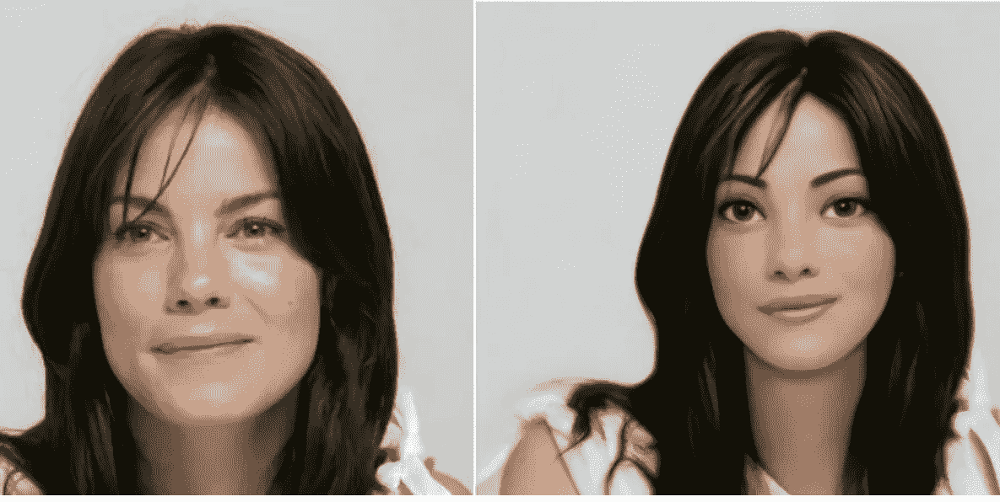

人工智能(AI)最近已经能够做很多事情，这个领域正在快速发展。它能够检测图像和视频中的对象，检测动作，总结文章，撰写文章，并在最近生成图像和视频。

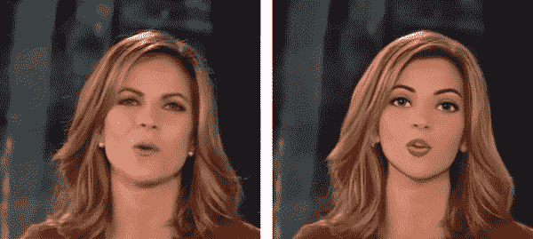

视频的卡通化

但是它能实现你在迪斯尼电影中的梦想吗？它能把你的图像转换成迪士尼公主或王子吗？
一起来了解一下吧！

我们将使用 GANs 的魔力，使用一个叫做 VToonify 的模型(它也可以卡通化视频)。

> 注意:即使你不理解 GANs 或者是 Python 的初学者，你仍然可以非常轻松地摆弄代码。

存储库链接是 https://github.com/williamyang1991/VToonify 的。

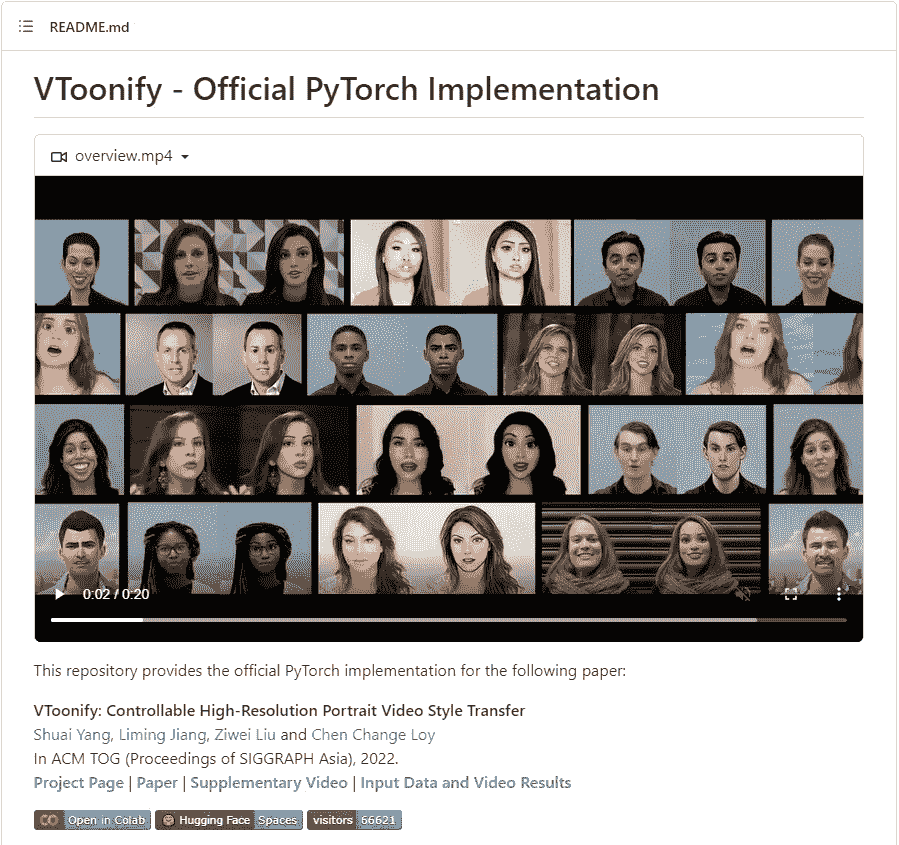

让我们使用 open in Colab 按钮在 Colab 中运行模型。单击该按钮后，您应该会看到类似这样的内容。一个名为**推论 _ 游乐场. ipynb** 的笔记本应该在 colab **打开。**

运行安装 gradio 和 huggingface_hub 库的第一个单元。这

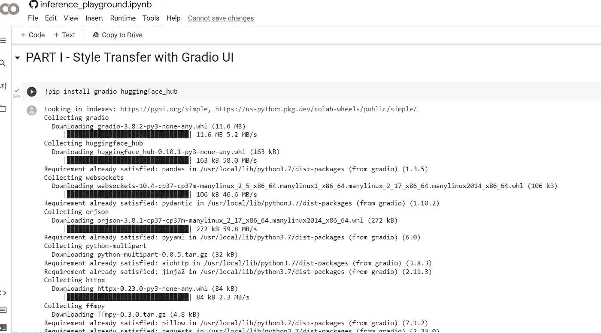

运行安装 CUDA 的第二个和第三个单元，并从 github 克隆 Vtoonify 库。第四个单元将 cd 到“DEMO_DIR ”,在那里存储库被克隆。

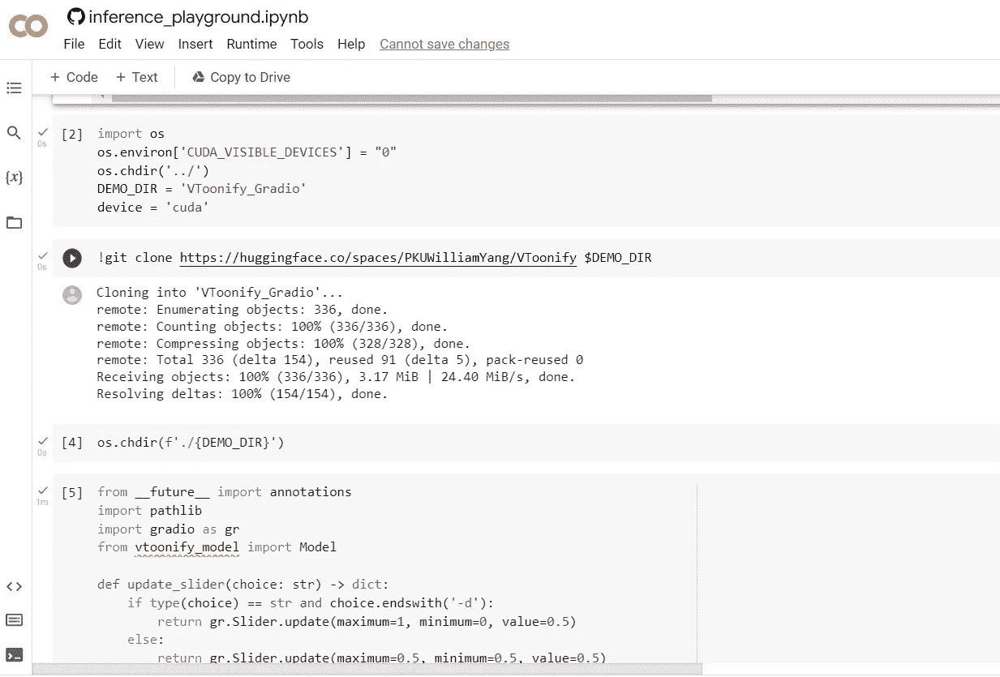

下一个单元格从 vtoonify_model 导入 gradio 和 model。它还为 GPU 和 CPU 设置了限制。运行此单元将设置 gradio 并显示一个示例

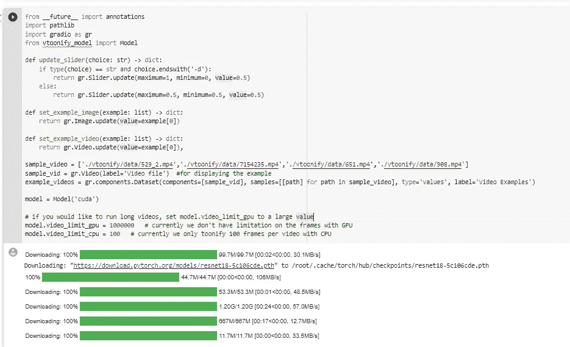

运行接下来的两个单元格，您应该会看到类似这样的内容。这是 colab 笔记本内部的 Gradio UI。

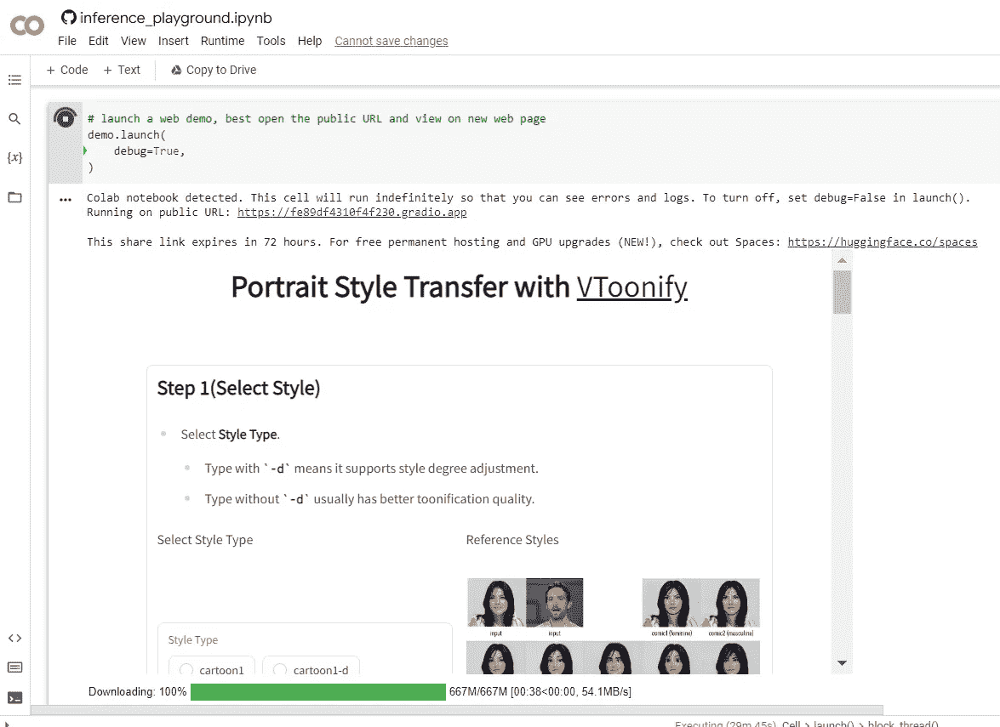

这是加载了模型的 gradio UI。你可以上传视频和图片，玩模型。选择模型并上传您想要卡通化的图像。

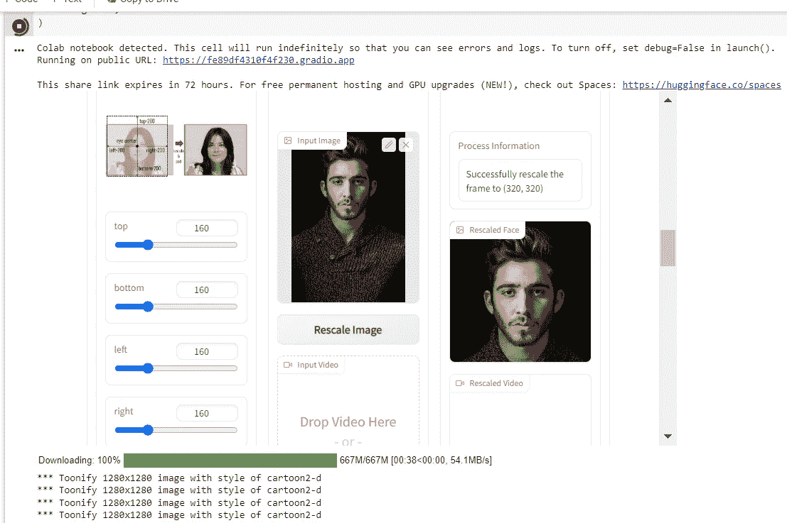

当模型输出时，您应该会看到类似这样的内容。这是我们用作示例的图像和模型的结果。

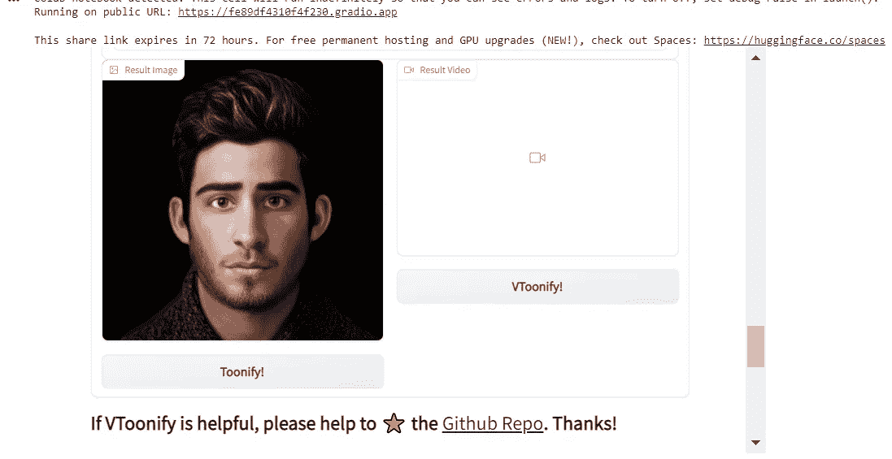

Vtoonify 模型有多个支持漫画和插图的模型。您可以在加载模型时选择它。

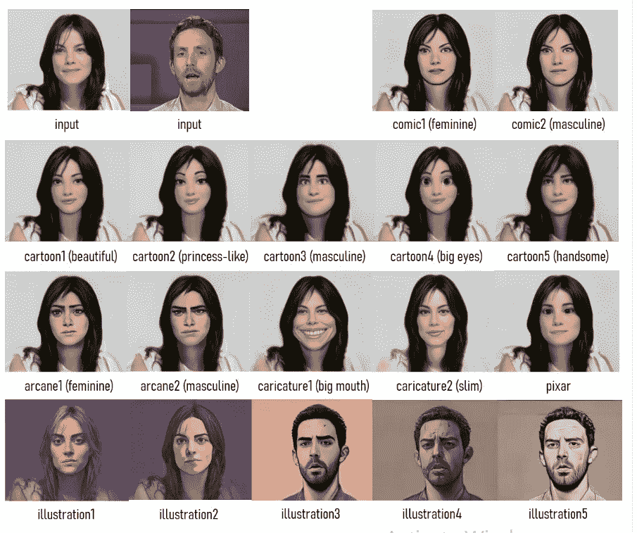

下面是模型的一些其他输出，带有参数调整。可以调一下参数，自己试试。

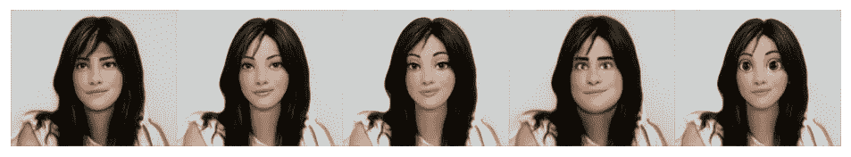 [## 使用 Python 和 AI 给黑白照片上色。

### 想知道你以前的黑白照片在现实中是什么样子吗？让我们找出答案。

levelup.gitconnected.com](/colorize-black-and-white-photos-using-python-and-ai-5b3e5f85df44) 

如果你不想运行谷歌 colab 笔记本的麻烦，你可以使用下面的链接直接运行这个模型[https://huggingface.co/spaces/PKUWilliamYang/VToonify](https://huggingface.co/spaces/PKUWilliamYang/VToonify)
它看起来会像这样。(不涉及代码)

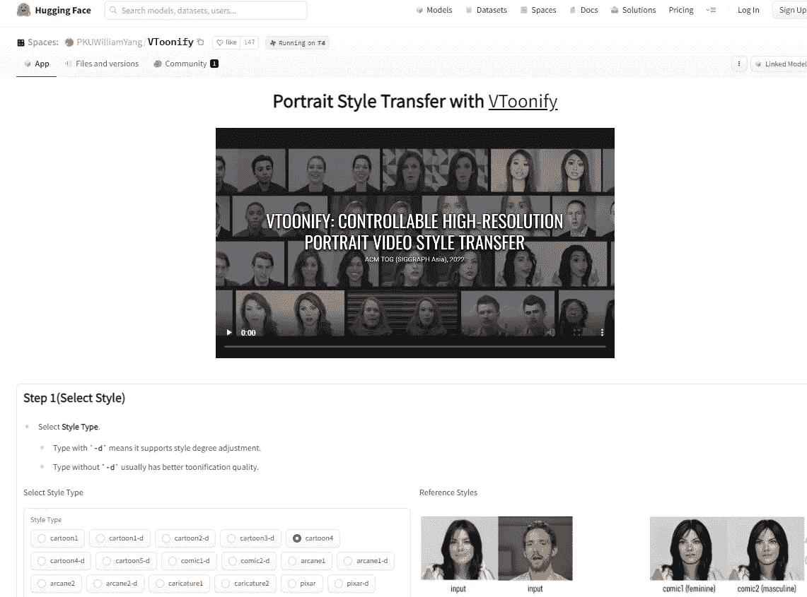

所以现在你有一个人工智能模型来卡通化你的图像。

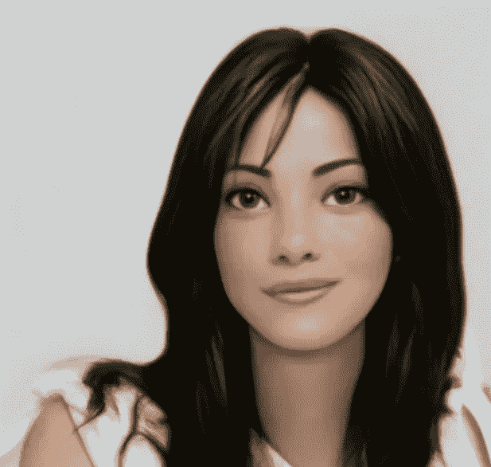

> **你对人工智能和机器学习有热情吗？**你想让**了解**在该领域的最新进展和见解吗？****
> 
> 然后**订阅介质是必须的**。只需每月 5 美元，你就可以从该领域的专家那里获得丰富的知识和见解。
> 
> 另外，你的订阅有助于支持独立作家和像我一样的研究人员。随着人工智能世界的快速变化，保持消息灵通至关重要。
> 不要错过——今天就加入 Medium，成为人工智能革命的一份子。这是你做过的最好的决定。
> **今日订阅中** **利用本** [**链接**](https://medium.com/@arjungullbadhar/membership) **。**

 [## 使用 Python 和 AI 给黑白照片上色。

### 想知道你以前的黑白照片在现实中是什么样子吗？让我们找出答案。

levelup.gitconnected.com](/colorize-black-and-white-photos-using-python-and-ai-5b3e5f85df44)  [## 使用人工智能和 Python 去模糊图像。

### AI 可以对你很想发布但因为最终变得模糊而无法发布的图片/图像进行去模糊吗？

levelup.gitconnected.com](/deblurring-images-using-ai-and-python-2e4f295c95d1)