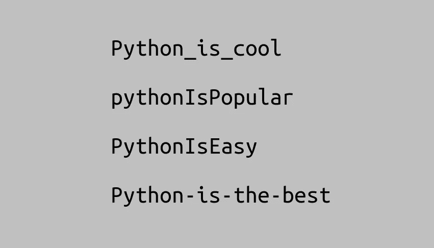

# Python 中的案例样式

> 原文：<https://levelup.gitconnected.com/case-styles-in-python-fd9591e57f86>

## 根据人教版 8，如何写它们及其用法

那是 Python。图片由我提供。

就像我在上面的图片中写的，你可以用不同的方式用 Python 写一个字符串，每种方式都有它的用途。你如何在它们之间做出选择？让我们学习一下。

# 首先:PEP 8

根据 Python 官方文档， [PEP 8](https://www.python.org/dev/peps/pep-0008/) 是[吉多·范·罗苏姆](https://en.wikipedia.org/wiki/Guido_van_Rossum)自己写的一个文档:

> 给出了 Python 代码的编码约定，这些代码构成了 Python 主发行版中的标准库。

换句话说，PEP 8 只是编写 Python 的风格约定。您不需要使用这些指南，您的代码仍然可以工作。然而，根据 Python 的禅宗思想，可读性很重要。因此，如果您和整个 Python 社区遵循相同的指导方针，这将提高代码的可读性，并创建一个更容易阅读他人代码的体验。

# PEP 8 命名约定

即使你没有应用 PEP 8 的所有指导方针，仅仅命名约定就能在你的代码写得好坏上扮演重要的角色。此外，我认为这是你能从指南中得到的最简单的改进。读完人教版 8，我选择了最常见的案例，其中有必要选择一种案例风格:

*   对于变量、函数、方法和模块:Snake Case。
*   上课用:帕斯卡格。
*   对于常量:大写的蛇形。

最好的方法是提高代码的可读性。有些语言有命名约定，就像上面所说的，你可以使用，也可以随心所欲地写(没有人会批评你，除了你的同事，他们会讨厌你)。

无论如何，让我(最后)解释一下单词组合的情况，对于例子，我会用这个:

**基数:** `first name`

# 骆驼箱

这种情况通过大写每个单词的首字母(除了第一个)并删除单词之间的空格来组合单词:

**骆驼案:**

这种情况在许多语言中用于各种目的，而在 Python 中使用不多，因为 Pascal Case 是默认的方法。

# 帕斯卡案例

这种情况也称为大写字母，因为通过大写所有单词(甚至是第一个单词)并删除单词之间的空格来组合单词:

**帕斯卡案例:**

这种类型在 Python 中非常常用于类名:`OverflowError`或`ValueError`(类除外)。

# 蛇案

这个是 Python 中用的最多的。它通过用下划线替换单词之间的空格来组合单词:

**蛇案:** `first_name`

有时，最好使用全大写的这种类型，也称为常量大小写(当然，在 Python 中用于常量):

**恒案(**大写蛇案 **):** `FIRST_NAME`

# 烤肉串盒

这一个像蛇的大小写，但是用破折号代替下划线来代替单词之间的空格:

**烤肉串案:** `first-name`

这种情况在 Python 中很少见，但在 URL 中却很常见。在 Django (Python 框架)中编写[命名空间 url 名称](https://docs.djangoproject.com/en/3.0/intro/tutorial03/#namespacing-url-names)时，有时经常使用这种风格。

# 结论

就像我说的，你可以在它们之间自由选择，但从我的经验来看，尽量使用和你的团队一样的。这在调试或者只是阅读某人的代码时会有很大帮助。快乐编码。