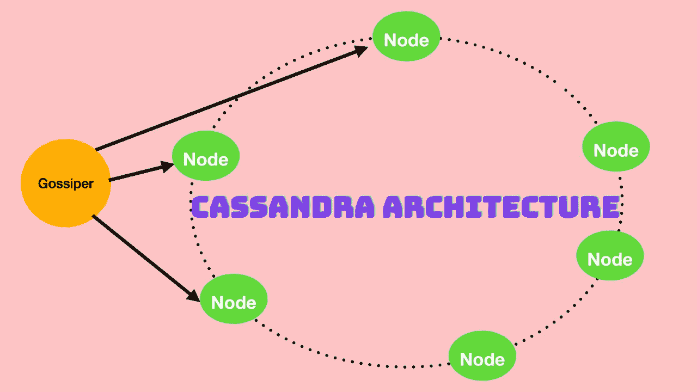
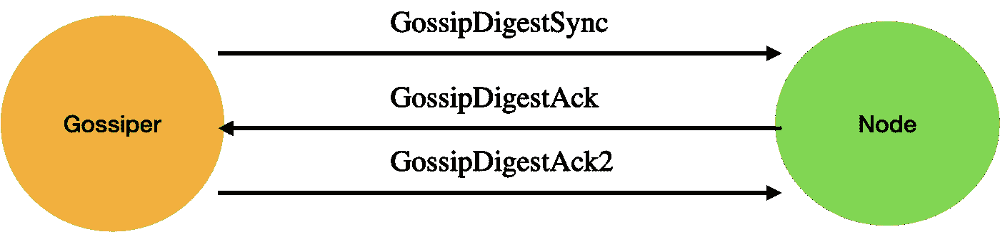

# Cassandra 架构及其如何执行读写操作

> 原文：<https://levelup.gitconnected.com/cassandra-architecture-and-how-it-performs-read-and-write-operations-669fd4e75d37>

Cassandra 是一个分布式数据库，用于以非常高的规模执行读写操作。为了理解如何读写操作，我们需要理解几个概念:

1.  八卦协议和故障检测
2.  告密者
3.  戒指和令牌
4.  瓜分者ˌ分割者

# 流言和故障检测

为了支持分散和分区容错，Cassandra 使用了一个 gossip 协议，允许每个节点跟踪集群中其他节点的状态信息。流言在计时器上每一秒都在运行。

Gossip 协议通常假设故障网络通常用于大型分散式网络系统中，用于分布式数据库中的自动复制机制。当服务器节点启动时，它向 gossiper 注册自己以接收端点状态信息。Cassandra gossip 用于故障检测，Gossiper 类维护活节点和死节点的丢失。

八卦协议的工作原理:

1.  GossipDigestSync
2.  GossipDigestAck
3.  GossipDigestAck2

当长舌妇确定另一个端点死了，它通过在本地列表中标记它死了并记录这个事实来判定那个端点。Cassandra 有一个故障检测算法，称为 Phi 累积故障检测器。

故障检测基于两个主要思想。

1.  故障检测应该是灵活的，这可以通过将故障检测与被监控的应用程序分离来实现。
2.  它不依赖于心跳协议。它有一个数字作为怀疑级别，表示它对该节点失效的置信度。

# 告密者

告密者的工作是提供关于网络拓扑的信息，以便 Cassandra 可以有效地路由请求。告密者会找出与其他节点相关的节点。snitch 将确定群集中每个节点的相对主机接近度，并确定从哪些节点进行读写。

# Snitch 如何参与读操作

当 Cassandra 必须执行读取操作时，它必须联系由一致性号确定的多个副本。为了支持最大的读取速度，Cassandra 选择单个副本来查询完整的对象，并要求其他副本提供哈希值，以确保所请求数据的最新版本。snitch 帮助识别将返回 fasted 的副本，这是查询完整数据的副本。

默认的告密者是拓扑不知道的，称为简单告密者。

Cassandra 提供了一种可插拔的方式来描述集群拓扑，它还提供了一种称为动态 Snitching 的功能，如果随着时间的推移进行读写，这有助于优化路由。

动态告密实现使用 gossip 协议的修改版本。动态 snicker 了解每个节点的网络拓扑和性能。它还跟踪正在执行压缩的节点。它避免将流量导向繁忙或性能不佳的节点。动态告密使用流言蜚语使用的 Phi 失败机制的修改版本。

# 戒指和令牌

Cassandra 将一个集群管理的数据表示为一个环。环中的每个节点被分配一个或多个由令牌描述的数据范围，令牌确定了它在环中的位置。一个节点声明对小于的值范围的所有权。或者等于每个令牌并且大于前一节点的最后一个令牌。这就是所谓的令牌范围。通过使用哈希函数计算分区键的令牌，将数据分配给节点。

# 虚拟节点

不是给一个节点分配一个范围，而是给一个节点分配多个更小的范围。在不同的机器有不同的可用计算资源的系统中，Vnodes 非常有用。该节点的另一个优点是，它们加速了一些更重量级的 Cassandra 操作，例如引导新节点、停用节点和修复节点。这是因为与多个较小范围上的操作相关联的负载更均匀地分布在集群的节点上。

# 分割者

一个分割器决定如何在 Cassandra 集群中分配数据。分区器的作用是根据分区键列计算令牌。主键中可能存在的任何聚类列用于确定拥有代表该分区的令牌的给定节点内的行的排序。

# 协调节点

每当客户端请求任何读取和写入操作时，该客户端都连接到充当该操作的协调节点的任何节点。协调器节点创建密钥的散列，并找到具有该令牌范围的数据的节点。在这些节点中，基于来自 Snitch 的数据来决定选择哪些节点进行读取和写入。然后，协调器向该特定节点请求读/写操作。