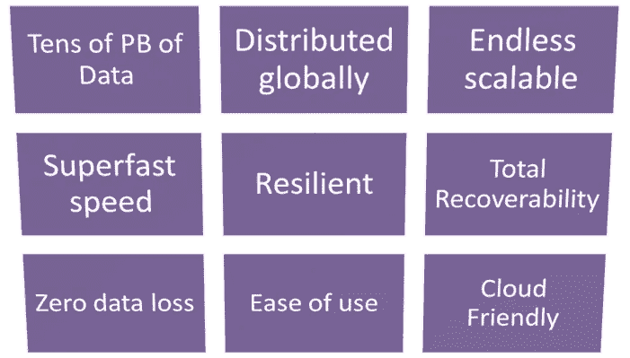
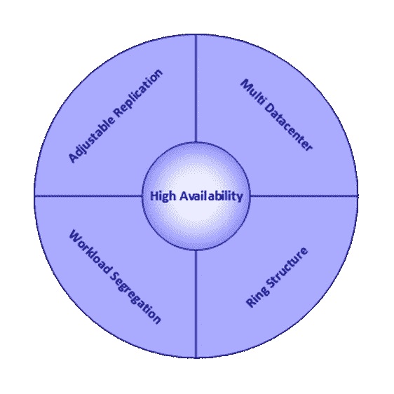
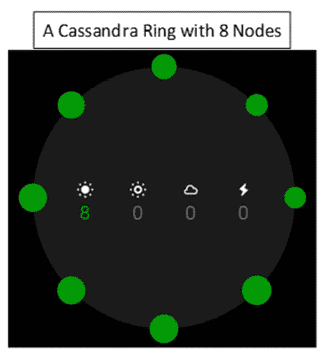
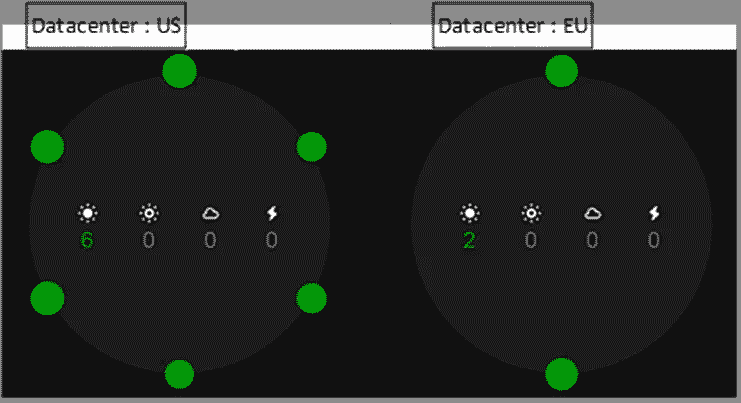
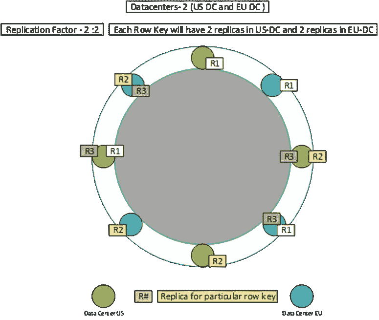
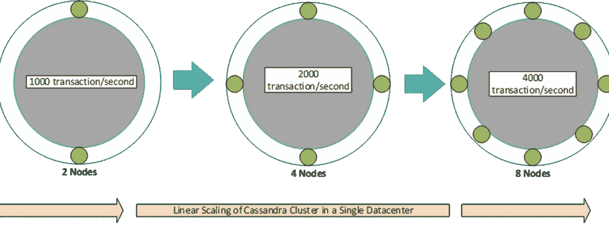
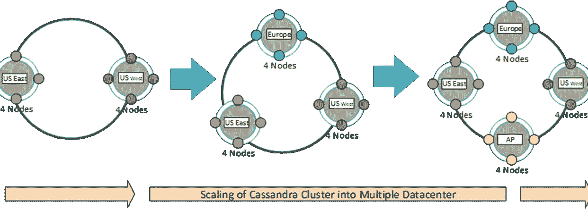

# Cassandra —适合可扩展性、性能、可用性和可维护性的数据存储

> 原文：<https://levelup.gitconnected.com/cassandra-the-right-data-store-for-scalability-performance-availability-and-maintainability-8d7ed7d40f48>

Cassandra 是一个开源的、分布式的、基于列的数据库管理系统(DBMS)。Cassandra 号称是为大容量分布式数据设计的，具有高可用性、高吞吐量和高可靠性。

> *当我们审视这里的整体生态系统时，我们发现 Cassandra 正受到来自三个方向的挑战***:*针对关键任务应用的传统 RDBMS、针对大数据分析的 NoSQL 数据库*以及内存数据库中的**

*但最大的问题是 Cassandra 是不是像它声称的那样是一个伟大的数据库？它真的是一个多用途的多维数据存储吗？更多的是炒作还是真的？为了找到这个问题的答案，让我们让 Cassandra 做一个**垃圾邮件测试**。本文将举例说明，Cassandra 如何实现*可伸缩性、性能、可用性*和*可维护性*因素。*

# *高可用性*

*在我们开始可用性测试之前，让我们了解# Cassandra #架构的一些关键特性。*

**

*这张图表是作者的作品*

***环形结构***

*与典型的主从工作模式相反，Cassandra 集群以**环形方式**工作。*环*中的每个*节点*具有相同的角色和响应度。换句话说，所有节点都是相同的，并且没有控制其他节点的主节点。因此，不存在单点故障。*

**

*截图由作者拍摄。*

***多数据中心***

*Cassandra *集群*的*环*可以跨越多个数据中心(DC)。Cassandra 既支持虚拟 DC，也支持实体 DC。例如，我们有两个# *数据中心*，位于两个不同的地理位置:Douglous County(美国)和 Rotterdam(欧盟)。数据存储在两个 DC 中，但是当我们查看*集群*的 Cassandra 的*环*时，所有节点都向我们提供了类似于任何查询的输出，同时保持本地 DC 和远程 DC 行为不变。查询可以在本地 DC 进行，也可以在*环*中的所有 DCs 上进行。*

**

*截图由作者拍摄。*

***复制***

*Cassandra 还提供内置但可定制的复制功能，在#Cassandra *环*中的*节点*上存储数据的冗余副本。这意味着，如果一个*集群*中的任何节点出现故障，该*节点的*数据的一个或多个副本在*集群*中的其他机器上是可用的。此外，如果任何一个*数据中心*出现故障，其他数据中心上的数据仍然可用。*

***数据可以在单个数据中心的*多个节点中复制***，在多个数据中心或在多个云提供商之间*复制。**

*Cassandra 的可调特性允许通过配置定制复制因子和复制分布。Cassandra 复制可以是:*在单个数据中心，* *跨多个数据中心*或*跨多个云提供商。**

*现在，让我们通过图表来了解多数据中心复制:*

**

*这张图表是作者的作品*

# *可量测性*

*Cassandra 是线性可伸缩的。这意味着可以通过简单地添加新的*节点*来增加容量或可扩展性。Cassandra 既可以水平扩展(添加更多的*数据中心*)也可以垂直扩展(添加更多的*节点*)。*

***在单个数据中心中扩展***

**

*这张图表是作者的作品*

***扩展到多个数据中心***

**

*这张图表是作者的作品*

***节点调试和退役***

*数据库系统伸缩能力的一个主要因素是添加和删除操作的简单和流畅程度。随着虚拟节点( *vnodes* )的引入，向现有的*集群*添加*节点*或者移除一个节点，都被大大简化了。*

*当一个新的*节点*加入*集群*时，它承担来自*集群*中其他节点的偶数部分数据的责任。如果一个节点出现故障，负载会均匀分布在*集群*中的其他*节点*上。一个简单的*节点工具*命令(*节点工具*退役)可以安全地从*集群*中删除一个*节点*。这将*节点*负责的范围分配给其他*节点*并适当地复制数据。*

# *表演*

*一般来说，#NoSQL 数据库附带了许多影响性能的架构最佳实践。作为一个完全的 NoSQL 数据库，Cassandra 拥有任何其他 NoSQL 数据库所拥有的所有性能优势。Cassandra 实际上融合了 NoSQL 的所有最佳实践，使其领先于其他 NoSQL 竞争者。*

***完全分布:** Cassandra 在*集群*的*环*中的所有*节点*上提供自动数据分布。Cassandra *环*中的每个节点处理*集群*中每个活动的相应份额。Cassandra 的*无主*架构有助于降低读写延迟。*

***异步**:同步技术会导致不令人满意的缓慢响应时间，因为分布式 DBMS 会花费大量时间来检查更新是否准确、完整地在网络上传播。Cassandra 的*异步分发*通过异步处理传播克服了这个问题，从而提供了高性能的读写。*

***最终一致性:** Cassandra 的*最终一致*数据模型和*节点修复*功能确保了*集群*的一致性会随着时间的推移而自动维护。*

*Cassandra 的架构允许任何授权用户连接到任何数据中心的任何节点，并使用 *CQL 语言*访问数据。特定站点的用户对数据的大多数请求可以通过存储在该站点的数据来满足(本地读/写)。这加速了查询处理，因为通信和中央计算机延迟被最小化。还可以将复杂的查询拆分成子查询，这些子查询可以在几个站点并行处理，从而提供更快的响应。*

# *可维护性*

***自我修复:** Cassandra 的*最终一致性*特性使得恢复故障节点变得非常容易。如果*节点*中的数据损坏，我们可以使*节点*离线，擦除损坏的数据，然后将节点重新连接到*环*。Cassandra 的*最终一致性*将按照配置从其他节点传播数据。*

***平滑升级:** Cassandra 的最终一致性特性也让升级变得平滑，甚至可以做原地版本升级。*

***快照和备份:** Cassandra 支持使用 *nodetoo* 或 *opscenter* 等工具自动备份数据/集群快照。可以对一个或所有或特定的密钥空间进行备份。备份可以存储到本地存储或远程云存储，如*亚马逊 S3* 桶。 *OpsCenter* 允许完整恢复、表级恢复或时间点恢复。*

***灵活恢复:**可以使用*节点工具*从 Cassandra *快照*中恢复 Cassandra 数据。它允许完整恢复、表级恢复或时间点恢复。*