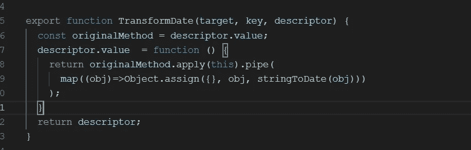
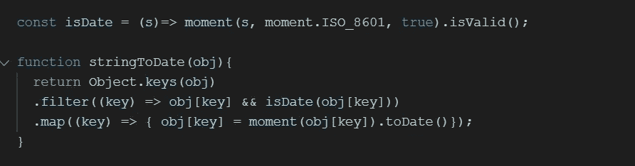
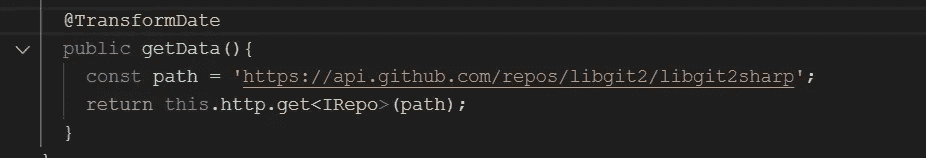

# 将 HTTP Json 响应中的日期字符串转换为 Angular

> 原文：<https://levelup.gitconnected.com/casting-date-string-from-http-json-response-using-decorator-in-angular-bbf8040e9d01>

## 使用装饰模式的干净和强类型的解决方案

Typescript 最重要的好处就是[强打字](https://betterprogramming.pub/6-typescript-typing-system-tricks-you-should-know-5aa39bda8049?sk=b8a4adbb43a591a64da08b4987ea079d)。TypeScript 提供编译时类型检查，因此开发人员可以在大型复杂的应用程序中更高效地工作。

装饰模式是 TypeScript 中另一种常用的模式。[将装饰模式和强类型结合起来，我们可以在 Angular 中构建一个干净而强大的解决方案](https://medium.com/p/94eb49ba16b1)。

在本文中，我将向您展示如何在 Angular 应用程序中将 HTTP JSON 响应转换为强类型对象。


## 强制转换 JSON 响应

一个非常简单的例子是使用 TypeScript 接口将 JSON 响应“转换”成定义的数据结构，如下所示:

```
export interface IRepo {
    name: string;
    created_at: Date;
}...
// Use interface IRepo to "Cast" the resposne
const path = 'https://api.github.com/repos/libgit2/libgit2sharp';
return this.http.get**<IRepo>**(path);
```

因此，在组件中，我们可以简单地使用属性绑定到 HTML。

```
{{repo.name}}
```

但是，如果我们尝试格式化“created_at”日期属性，就会遇到问题

```
x.created_at.toLocaleDateString("en-US")***Error: x.created_at.toLocaleDateString is not a function***
```

抛出该错误是因为“created_at”是一个字符串，尽管它在 IRepo 界面中被声明为“Date”。

## 为什么日期还是字符串？

问题的根本原因是 typescript 中的接口只是针对编译器的，它不在生成的 javascript 中，所以这个接口“cast”方法实际上是一个类型检查或类型断言。

> 类型断言允许你设置一个值的类型，并告诉编译器不要推断它。此时，作为一名程序员，您可能比 TypeScript 本身更了解变量的类型。

因为 JSON 格式中没有日期类型，所以日期被视为字符串。如果我们想为“created_at”获得一个真正的日期类型，我们必须显式地转换它。

## 转换日期装饰器

由于上述用例非常常见，我们希望编写一段代码，用于我们应用程序中的所有 HTTP 响应处理。

Decorator 是合适的工具，因为它是作为函数编写的，但也可以作为元数据添加到类声明、方法或属性中。换句话说，就是“写一次，到处用”。

装饰器的要点非常简单。



`stringToDate` 函数将遍历对象属性，并将 ISO 格式的字符串属性转换为 date。



装饰器的用法简单如下



现在，我们可以在组件中使用`created_at` 作为真正的日期类型。

```
x.created_at.toLocaleDateString("en-US")
```

装饰器可以应用于所有返回 HTTP JSON 响应的方法。当然，它需要改进以处理更复杂的数据结构，比如具有数组和嵌套对象属性的对象。但是你明白了。

你可以在 [*StackBlitz*](https://stackblitz.com/edit/angular-handle-date-decorator) *中找到这个例子。*

快乐编程。

*如果您还不是 Medium 的付费会员，* [***您可以访问此链接***](https://sunnysun-5694.medium.com/membership) *。你可以无限制地阅读媒体上的所有报道。我会收你一部分会员费作为介绍费。*