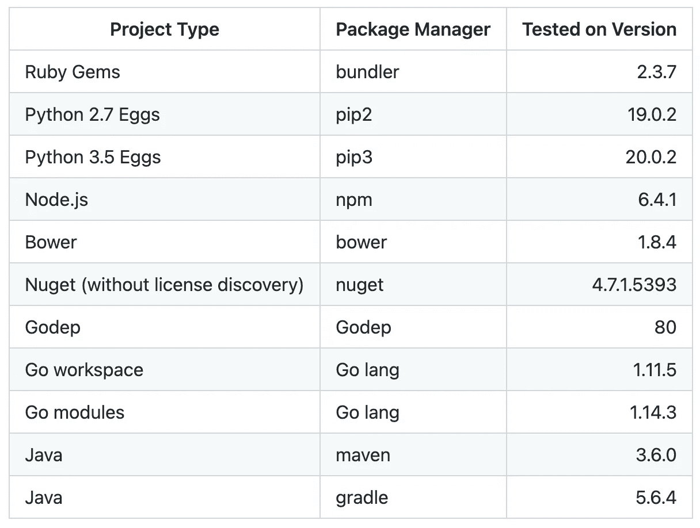

# 使用许可证查找器对您的开源软件使用情况进行分类

> 原文：<https://levelup.gitconnected.com/catalog-your-open-source-software-usage-using-license-finder-1f3d85b8e709>

需要弄清楚你的软件到底依赖于哪些开源许可？我最近发现了一个很棒的工具，您可以在本地和 CI/CD 工作流中使用，以确保您不会使用坏的许可证。


照片由[迪米特里·卡拉斯泰列夫](https://unsplash.com/@dkfra19?utm_source=medium&utm_medium=referral)在 [Unsplash](https://unsplash.com?utm_source=medium&utm_medium=referral) 上拍摄

[https://github.com/pivotal/LicenseFinder](https://github.com/pivotal/LicenseFinder)

这款应用被称为“许可证查找器”，这一点也不奇怪。对于您的每一个依赖项，它会出去找到特定的许可证，并给你一个漂亮的报告。不仅如此，它还会检查您是否批准或允许了某些许可证，您可以在单个回购中管理这些许可证，或者在一个组织的多个回购中继承决策。

> LicenseFinder 与您的软件包管理器一起工作，查找依赖项，检测软件包中的许可证，将这些许可证与用户定义的许可许可证列表进行比较，并向您提供可操作的异常报告。

如本文所述，license finder 可与多种语言(包括 Python、Java、.网，仙丹，等等。



# 本地设置

如果你在 Mac 上，你至少需要 Ruby 2.4，你可以通过 Ruby 版本管理器或者通过`brew install ruby`安装。

从那里你可以运行`gem install license_finder`,它将在你的系统上安装许可证查找器。

安装完 gem 后，你可以从你的代码库的根目录运行`license_finder`，它会检测你正在使用哪种项目和哪个包管理器，并获取你的依赖项的许可证。

运行该命令后，您应该会看到一长串未经许可的许可证输出，如果没有，请查看错误消息以解决问题。

# 在 CI/CD 中设置

我在 GitHub 操作中使用了 license finder，配置如下:

```
name: License Finder Check

on:
  pull_request:
    branches: [main]
  push:
    branches: [main]

jobs:
  license_finder:
    name: "Run license finder"
    runs-on: ubuntu-latest
    steps:
      - uses: actions/checkout@v2
      - name: Set up Ruby
        uses: ruby/setup-ruby@v1
        with:
          bundler-cache: true
          cache-version: 1
          ruby-version: 3.0.3
      - name: Set up License Finder
        run: gem install license_finder
      - name: License Finder
        working-directory: ui
        run: license_finder
```

每当添加具有新许可证的新依赖项时，该构建将在 PR 上失败，以便在合并到代码库之前解决它。


马库斯·斯皮斯克在 [Unsplash](https://unsplash.com?utm_source=medium&utm_medium=referral) 上拍摄的照片

# 许可和批准

现在您可以运行`license_finder`，要将许可的许可证添加到您的列表中，只需运行:

```
license_finder permitted_licenses add MIT
```

这个特定的许可证将存储在您的`doc/dependency_decisions.yml`文件中。如果您再次运行`license_finder`，您应该不会再看到任何关于“MIT”许可的错误。

如果您有一个内部库或想要排除一个特定的库而不允许它使用许可证，您可以运行:

```
license_finder approvals add awesome_gpl_gem --who CTO --why "Go ahead"
```

这也将附加到`dependency_decisions`文件中，并且在运行`license_finder`时不会再出错。

# 继承全球批准

如果您有几个 repos，并且想要远程共享一个通用的许可决策文件，您可以通过开发机器上的符号链接共享该文件，或者将该文件放在每个人都可以访问的地方(例如，一个新的 GitHub 存储库)。

要从 GitHub 添加继承的决策文件，您可以运行:

```
license_finder inherited_decisions add https://github.com/example/doc/dependency_decisions.yml
```

如果您需要包含一个访问令牌，您可以像这样运行:

```
license_finder inherited_decisions add_with_auth https://github.com/example/doc/dependency_decisions.yml Bearer '$TOKEN'
```

请注意，这将在您的本地`dependency_decisions.yml`文件中创建一个条目，然后您可以批准或允许特定于您的存储库的许可。

# 报告

一旦你配置好了一切，你就可以运行`license_finder report`了，你会得到一个 CSV 格式的正在使用的许可证输出。其他支持的输出是文本、html 或 markdown。

如果您一直在推迟获取您所有的开源软件许可证，或者只是不知道从哪里开始，请查看 license finder 作为一个解决方案来帮助您！

如果你喜欢这篇文章，考虑一下[订阅 Medium](https://medium.com/@ascourter/membership) ！

如果你或你的公司有兴趣找人进行技术面试，那么请在 Twitter ( [@Exosyphon](http://twitter.com/Exosyphon) )上给我发 DM，或者访问我的[网站](https://andrewcourter.com/)。如果你喜欢这样的话题，那么你可能也会喜欢我的 Youtube 频道。如果你喜欢 3D 打印的东西，去我的 [Etsy 商店](https://www.etsy.com/listing/1273702925/6-sided-fidget-cube)看看。祝您愉快！