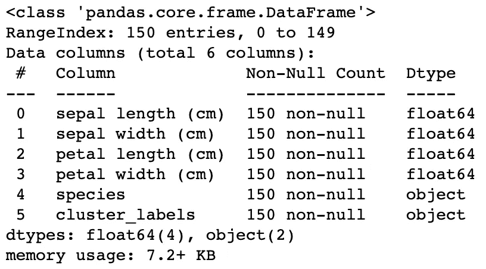

# 使用机器学习的数据识别和分类

> 原文：<https://levelup.gitconnected.com/categorising-using-machine-learning-5601baf9a05e>

## 一个关于如何给花分类的奇特的数据科学例子


我通过退休一直在哥伦比亚工程学习[应用机器学习](https://online-exec.cvn.columbia.edu/applied-machine-learning)。这是一个为期 5 个月的课程，我真的很喜欢，并会推荐。

教练都很好，很有帮助，尤其是罗伯特·曼里克兹和普内特·萨拉斯瓦特。他们举办“办公时间”网络研讨会，帮助完成复杂的作业，同时也提供我们所学内容的实际演练。

在我之前的两篇文章《[使用 ML](/predicting-titanic-survivors-using-ml-8570ef4e89e8) 预测泰坦尼克号幸存者》和《[使用 ML](/predicting-house-sale-prices-using-ml-30b829fd9556) 预测房屋销售价格》中，我使用了一个伟大的数据科学和机器学习资源，名为 [Kaggle](https://www.kaggle.com/) 。他们为数据科学家提供免费的数据集进行实践。还有比较机器学习的分析和建模的比赛。对于本教程，我将使用“ [scikit-learn](https://scikit-learn.org/stable/modules/classes.html#module-sklearn.datasets) ”提供的“[虹膜数据集](https://scikit-learn.org/stable/modules/generated/sklearn.datasets.load_iris.html#sklearn.datasets.load_iris)”。

在一些“办公时间”网络研讨会中，Robert 向我们介绍了几个数据集，这些数据集有不同的目标/需要解决的问题。在“[泰坦尼克号——灾难中的机器学习](https://www.kaggle.com/c/titanic/data)”数据集中，目标是预测谁在泰坦尼克号灾难中幸存。在"[房价-高级回归技术](https://www.kaggle.com/c/house-prices-advanced-regression-techniques/data)"数据集中，目标是预测爱荷华州埃姆斯市的房屋销售价格。本教程将有一个分类目标/问题要解决。

我将提供数据科学和机器学习的实用介绍，而不是深入幕后的数学(数学很复杂！).虽然这些名字听起来很花哨，但实际上它们分别是统计学家和统计学的现代名称。我们不要在这里自欺欺人，这主要是复杂的数学。

## 步骤 1:确定项目范围

虹膜数据集对三种不同类型的花进行了各种测量: **Setosa** 、 **Versicolor** 和 **Virginica** 。这个项目的范围是试图确定允许我们对花卉进行分类的关键测量。

## 第二步:收集数据

在这种特殊情况下，这是非常容易的。这些都在" [scikit-learn](https://scikit-learn.org/stable/modules/classes.html#module-sklearn.datasets) "库中提供给我们。我们将从那里加载“[虹膜数据集](https://scikit-learn.org/stable/modules/generated/sklearn.datasets.load_iris.html#sklearn.datasets.load_iris)”。

```
from sklearn.datasets import load_irisdata = load_iris()
df = pd.DataFrame(data=data.data, columns=data.feature_names)df.head()
```


## 步骤 3:清理数据

第一步是加载我们的数据。我正在使用 Python 3(带有 **pandas** 、 **numpy** 、 **seaborn** 、 **matplotlib** 和 **sklearn** 库)和 Jupyter notebooks "**jupyterlab**"如果你想继续的话。

加载必要的库。

```
import numpy as np
import pandas as pd
import seaborn as sns
import matplotlib.pyplot as pltfrom sklearn.datasets import load_iris
from sklearn.model_selection import train_test_split, GridSearchCV
from sklearn.tree import DecisionTreeClassifier, DecisionTreeRegressorfrom sklearn.datasets import load_iris
from sklearn.cluster import KMeans
```

Jupyter 笔记本电脑的定制。

```
sns.set_style('darkgrid')
plt.rcParams.update({'font.size': 16})%matplotlib inline
```

数据集不会自动包含目标列。可以按如下方式添加。

```
data.target
```


```
data.target_names
```


我们可以看到 Setosa 是 0，Versicolor 是 1，Virginica 是 2。我们应该使用“**特征工程**创建一个新特征，将“ **id** ”映射到“**友好名称**”。

```
def flower_map(x):
    if x == 0:
        return "Setosa"
    elif x == 1:
        return "Versicolor"
    elif x == 2:
        return "Virginica"df['species'] = data.target
df['species'] = df['species'].map(flower_map)
```

这个看起来像这样。

```
df.head()
```


## 步骤 4:探索性数据分析(EDA)

除了我在课程中学到的东西，我还发现了这篇非常棒的文章，它向我展示了我以前从未见过的 EDA 技术。我推荐关注@pranshu453，因为他写得很好。他看起来像一个新的媒体作家，所以跟随他并给他一些支持会很好。

[](https://medium.com/analytics-vidhya/exploratory-data-analysis-iris-dataset-4df6f045cda) [## 探索性数据分析:Iris 数据集

### 使用 Pandas、Matplotlib 和 Seaborn 库对鸢尾花数据集进行数据分析和可视化

medium.com](https://medium.com/analytics-vidhya/exploratory-data-analysis-iris-dataset-4df6f045cda) 

这些是探索数据的典型的第一步。

```
df.info()
```



一些重要的观察结果是，数据集中没有空值(好消息)，有四个包含测量值的列和两个分类列(包括我们刚刚创建的“**物种**”特征)。

```
df.describe()
```


这只是让我们对我们的数据有一个感觉。它显示了我们有多少非空行，平均值、标准偏差、最小值、最大值等等。

```
df[df.duplicated()]
```


我们有一个重复的行。现在我们要决定如何处理这个单一条目。有可能测量值是合法的复制品，并且两朵花具有相同的测量值。

```
df['species'].value_counts()
```


如果我们删除重复的 Virginica，将导致我们的数据不平衡。目前每种类型有 50 朵花。我怀疑一个复制品可能只是一朵同样尺寸的花。在这种情况下，我们不应该删除它。

```
sns.set(font_scale=1.5)
plt.figure(figsize=(12,10))
sns.scatterplot(data=df, x='sepal length (cm)', y='sepal width (cm)', hue='species', s=70)
```


从视觉上看，使用散点图，似乎没有任何明显的方法来使用萼片长度和宽度测量来分类花。

```
sns.set(font_scale=1.5)
plt.figure(figsize=(12,10))
sns.scatterplot(x=df['petal length (cm)'], y=df['petal width (cm)'], hue=df['species'], s=70)
```


现在这描绘了一幅完全不同的画面。例如，你可以看到，如果花瓣长度小于 2 厘米或花瓣宽度小于 0.75，你肯定是在看一朵 Setosa 花。您可以将类似的规则应用于 Versicolor 和 Virginia，但是您可以看到有一点重叠，这可能很难手动处理。

```
sns.pairplot(df, hue='species', height=4)
```


这个配对图证实了我们已经知道的东西。这只是一个很好的方式来看看是否有任何其他功能可能对我们有用。

```
plt.figure(figsize=(10,11))
sns.heatmap(df.corr(), annot=True)
plt.plot()
```


这张热图也证实了我们已经知道的东西。我们对高于 0.5 或低于-0.5 的强相关性感兴趣。我们可以看到我们的花瓣长度和宽度是高度相关的。萼片长度和花瓣长度和宽度之间似乎也有很强的相关性。

```
df.groupby('species').agg(['mean', 'median'])
```


这是找到每朵花的平均值和中间值的简便方法。

```
fig, axes = plt.subplots(2, 2, figsize=(16,9))sns.boxplot(y='petal width (cm)', x='species', data=df, orient='v', ax=axes[0, 0])
sns.boxplot(y='petal length (cm)', x='species', data=df, orient='v', ax=axes[0, 1])
sns.boxplot(y='sepal length (cm)', x='species', data=df, orient='v', ax=axes[1, 0])
sns.boxplot(y='sepal width (cm)', x='species', data=df, orient='v', ax=axes[1, 1])plt.show()
```


这个盒状图告诉我们，Setosa 分布不广，特征集较小，Versicolor 分布平均，特征集一般，Virginica 分布高度，特征集较大。

```
fig, axes = plt.subplots(2, 2, figsize=(16,9))sns.violinplot(y='petal width (cm)', x='species', data=df, orient='v', ax=axes[0, 0], inner='quartile')
sns.violinplot(y='petal length (cm)', x='species', data=df, orient='v', ax=axes[0, 1], inner='quartile')
sns.violinplot(y='sepal length (cm)', x='species', data=df, orient='v', ax=axes[1, 0], inner='quartile')
sns.violinplot(y='sepal width (cm)', x='species', data=df, orient='v', ax=axes[1, 1], inner='quartile')plt.show()
```


这是可视化我们数据的另一个有用的方法。

```
sns.FacetGrid(df, hue='species', height=5).map(sns.distplot, 'sepal length (cm)').add_legend()
sns.FacetGrid(df, hue='species', height=5).map(sns.distplot, 'sepal width (cm)').add_legend()
sns.FacetGrid(df, hue='species', height=5).map(sns.distplot, 'petal length (cm)').add_legend()
sns.FacetGrid(df, hue='species', height=5).map(sns.distplot, 'petal width (cm)').add_legend()plt.show()
```


正如我们所看到的，Setosa 在花瓣的宽度和长度方面是独立的。云芝和海滨锦鸡儿大部分是分开的，但有轻微的重叠。

## 步骤 5:建立数据模型

**基尼系数和熵值** 基尼系数和熵值是计算信息增益的标准。基尼系数和熵都是节点杂质的量度。换句话说，他们测量数据集的任何元素在被随机标记时被错误标记的频率。具有多个类的节点是不纯的，而只有一个类的节点是纯的。

基尼指数的值介于 0 和 0.5 之间，熵值介于 0 和 1 之间。在计算上，熵更复杂，因为它使用对数，因此基尼系数的计算会更快。

如上所述，基尼指数的最小值是 0。当节点是纯的，并且节点中包含的所有元素都是一个唯一的类时，就会发生这种情况。因此，该节点不会被再次分割。最佳分割由具有较小基尼系数的特征选择。当两个类的概率相同时，它得到最大值。如果一组数据的分割相等，基尼系数将为 0.25。

熵是信息的一种度量，它表示特征与目标之间的无序程度。类似于基尼指数，最佳分割由具有较少熵的特征选择。当两个类的概率相同时，它获得最大值，当熵具有最小值 0 时，节点是纯的。

让我们看一个例子…

首先，让我们把数据集分离出来，只包含两朵花。

```
df_two = df.loc[df.species != "Virginica", :].copy()df_two.species.value_counts()
```


```
sns.set(font_scale=1.5)
plt.figure(figsize=(9,7))
sns.scatterplot(x=df_two['petal length (cm)'], y=df_two['petal width (cm)'], hue=df['species'], s=70)
```


现在这里一个明显的分裂可能是说，如果花瓣宽度小于或等于 0.75，那么它是 Setosa，否则它是 Versicolor。如果我们故意把它分成 0.25。

```
def gini_sum(p_list):
    return np.sum([x * (1 - x) for x in p_list])top_leaf = gini_sum([50/100, 50/100])
print("Top Leaf Gini :", top_leaf, '\n')leaf_1 = df_two.loc[df_two['petal width (cm)'] <= 0.25, 'species']
leaf_2 = df_two.loc[df_two['petal width (cm)'] > 0.25, 'species']print("Leaf 1 Contents:")
print(leaf_1.value_counts(), '\n')
print("Leaf 2 Contents:")
print(leaf_2.value_counts(), '\n')leaf_1_gini = gini_sum([34/34])
leaf_2_gini = gini_sum([50/66, 16/66])leaf_1_wt = 34/100
leaf_2_wt = 66/100bot_leaf_total = (leaf_1_wt * leaf_1_gini) + (leaf_2_wt * leaf_2_gini)print("Bottom leaf total Gini :",  round(bot_leaf_total,4) )
print("Information Gain =", round(top_leaf - bot_leaf_total,4) )**Top Leaf Gini : 0.5 

Leaf 1 Contents:
Setosa    34
Name: species, dtype: int64 

Leaf 2 Contents:
Versicolor    50
Setosa        16
Name: species, dtype: int64 

Bottom leaf total Gini : 0.2424
Information Gain = 0.2576**
```

我们可以看到 50 朵 Setosa 花中有 16 朵被错误地分类了。如果我们使用正确的分割会怎样？

```
def gini_sum(p_list):
    return np.sum([x * (1 - x) for x in p_list])top_leaf = gini_sum([50/100, 50/100])
print("Top Leaf Gini :", top_leaf, '\n')leaf_1 = df_two.loc[df_two['petal width (cm)'] <= 0.75, 'species']
leaf_2 = df_two.loc[df_two['petal width (cm)'] > 0.75, 'species']print("Leaf 1 Contents:")
print(leaf_1.value_counts(), '\n')
print("Leaf 2 Contents:")
print(leaf_2.value_counts(), '\n')leaf_1_gini = gini_sum([34/34])
leaf_2_gini = gini_sum([50/66, 16/66])leaf_1_wt = 34/100
leaf_2_wt = 66/100bot_leaf_total = (leaf_1_wt * leaf_1_gini) + (leaf_2_wt * leaf_2_gini)print("Bottom leaf total Gini :",  round(bot_leaf_total,4) )
print("Information Gain =", round(top_leaf - bot_leaf_total,4) )**Top Leaf Gini : 0.5 

Leaf 1 Contents:
Setosa    50
Name: species, dtype: int64 

Leaf 2 Contents:
Versicolor    50
Name: species, dtype: int64 

Bottom leaf total Gini : 0.2424
Information Gain = 0.2576**
```

我们可以看到这两朵花被正确地分成两片叶子，50 片是 Setosa 的，50 片是 Versicolor 的，这是我们所期望的。我们是手动进行的，因为在这种情况下，我们自己进行分割在视觉上很容易。

Sklearn 库有办法为您完成这个手动过程。

## 决策树分类器

```
features = ['sepal length (cm)', 'sepal width (cm)', 'petal length (cm)', 'petal width (cm)']X = df_two.loc[:, features]
y = df_two['species']dtc_model = DecisionTreeClassifier(random_state = 1)dtc_model.fit(X, y)print("Training Accuracy : {}".format( dtc_model.score(X, y) ))
**Training Accuracy : 1.0**pd.DataFrame({"feature" : features, "importance" : dtc_model.feature_importances_}).sort_values(by='importance')
```


正如你所看到的，库已经确定了"**花瓣宽度(cm)** "是进行分割的最重要的特征。

让我们先用两朵花试试这个…

```
import graphviz
from sklearn.tree import export_graphvizdef Plot_Tree(model, class_names, feature_names):
    dot_data = export_graphviz(dtc_model, out_file=None,  
                    filled=False, rounded=True,
                    special_characters=True,
                    class_names = class_names,
                    feature_names= feature_names)
    graph = graphviz.Source(dot_data)  

    return graphPlot_Tree(dtc_model, class_names=['Setosa','Versicolour'], feature_names=features)
```


正如你在上面看到的，0.8 被选为最佳分割点。

```
leaf_1 = df_two.loc[df_two['petal width (cm)'] <= 0.8, 'species']
leaf_2 = df_two.loc[df_two['petal width (cm)'] > 0.8, 'species']
print("Leaf 1 rows :", leaf_1.shape[0])
print("Leaf 2 rows :", leaf_2.shape[0])top_leaf = gini_sum([50/100, 50/100])
print("Top Leaf Gini :", top_leaf)print(leaf_1.value_counts())
print(' ')
print(leaf_2.value_counts())bot_leaf = 50/100 * gini_sum([50/50]) + 50/100 * gini_sum([50/50, 50/50])print("Next leaf total Gini :",  round(bot_leaf,2) )
print("\nInformation Gain =", round(top_leaf - bot_leaf, 2) )**Leaf 1 rows : 50
Leaf 2 rows : 50
Top Leaf Gini : 0.5
Setosa    50
Name: species, dtype: int64

Versicolor    50
Name: species, dtype: int64
Next leaf total Gini : 0.0

Information Gain = 0.5**
```

现在让我们用三朵花来试试…

```
features = ['sepal length (cm)', 'sepal width (cm)', 'petal length (cm)', 'petal width (cm)']X = df.loc[:, features]
y = df['species']X_train, X_test, y_train, y_test = train_test_split(X, y, test_size=0.3, random_state=1)dtc_model = DecisionTreeClassifier()dtc_model.fit(X_train, y_train)print("Training Accuracy : {}".format( dtc_model.score(X_train, y_train) ))
print("Testing Accuracy : {}".format( dtc_model.score(X_test , y_test ) ))Plot_Tree(dtc_model, class_names=['Setosa', 'Versicolour', 'Virginica'], feature_names=features)**Training Accuracy : 1.0
Testing Accuracy : 0.9555555555555556**
```


**决策树分类器**有很多配置选项。


```
dtc_model = DecisionTreeClassifier()params = {
    "max_depth"         : [1,2,3,4,5,10],
    "criterion"         : ['entropy', 'gini'],
    "max_features"      : [0.5, 1],
    "max_leaf_nodes"    : [2,3,5],
    'min_samples_leaf'  : [2,3,5],
    'min_samples_split' : [2,3,5]
}gs = GridSearchCV(dtc_model, params, cv=3)gs.fit(X_train, y_train)print("Training Accuracy : {}".format( gs.score(X_train, y_train) ))
print("Testing Accuracy : {}".format( gs.score(X_test , y_test ) ))**Training Accuracy : 0.9714285714285714
Testing Accuracy : 0.9555555555555556**gs.best_params_**{'criterion': 'entropy',
 'max_depth': 5,
 'max_features': 0.5,
 'max_leaf_nodes': 5,
 'min_samples_leaf': 2,
 'min_samples_split': 5}**
```

这是它看起来的样子…

```
Plot_Tree(gs.best_estimator_, class_names=['Setosa','Versicolour', 'Virginica'], feature_names=features)
```


## k 均值

在我们的数据集中，我们知道我们的数据中有 3 个聚类(“**花**”)。我用下面的“ **n_clusters** ”手动插入了这个。

```
X = df.drop(columns='species')
y = df['species']kmeans = KMeans(n_clusters=3)
kmeans.fit(X)df['cluster_labels'] = kmeans.labels_
df['cluster_labels'] = df['cluster_labels'].astype(str)kmeans.cluster_centers_**array([[6.85      , 3.07368421, 5.74210526, 2.07105263],
       [5.9016129 , 2.7483871 , 4.39354839, 1.43387097],
       [5.006     , 3.428     , 1.462     , 0.246     ]])**
```

如果我们不知道我们有多少个集群，有一种方法可以解决这个问题。

```
interia_list = []
for k in range(1, 15):
    kmeans = KMeans(n_clusters=k)
    kmeans.fit(X, y)
    interia_list.append(kmeans.inertia_)plt.plot(interia_list)
plt.xticks(range(1, 15))
plt.xlabel("n_clusters")
plt.ylabel("Interia")
plt.show()
```


我们在这里寻找的是肘部的底部，在我们的例子中是 3。

" **Intertia** "是一个值，表示质心和它们各自的聚类成员的误差平方和。


```
df.cluster_labels.value_counts()
```


```
df.groupby('cluster_labels').mean()
```


```
plt.figure(figsize=(6,4))
sns.scatterplot(data=df, x='petal length (cm)', y='petal width (cm)', hue='cluster_labels')
plt.scatter(x = kmeans.cluster_centers_[:,2], y=kmeans.cluster_centers_[:,3], marker='X', s=80, color='black')
plt.show()
```


## 随机 Forrest 分类器与 Ada Boost 分类器

通常我们会想要比较模型来评估哪一个给出最好的结果。我们可以这样做的方法如下。

```
from sklearn.metrics import classification_report
from sklearn.ensemble import AdaBoostClassifier, RandomForestClassifierfeatures = ['sepal length (cm)', 'sepal width (cm)', 'petal length (cm)', 'petal width (cm)']X = df.loc[:, features]
y = df['species']X_train, X_test, y_train, y_test = train_test_split(X, y, test_size=0.3, random_state=1)RF = RandomForestClassifier(n_estimators=50)
RF.fit(X_train, y_train)print("Random Forest:\n")
print(classification_report(y_test, RF.predict(X_test)))ABC = AdaBoostClassifier(n_estimators=50)
ABC.fit(X_train, y_train)
print("\nAdaBoost:\n")
print(classification_report(y_test, ABC.predict(X_test)))
```


我希望您对此感兴趣，并再次特别感谢 Robert Manriquez 的出色培训和课程支持。

我希望你觉得这篇文章有趣并且有用。如果您想随时了解情况，请不要忘记关注我并注册我的[电子邮件通知](https://whittle.medium.com/subscribe)。

# 迈克尔·惠特尔

*   ***如果你喜欢这个，请*** [***跟我上媒***](https://whittle.medium.com/)
*   ***更多有趣的文章，请*** [***关注我的刊物***](https://medium.com/trading-data-analysis)
*   ***有兴趣合作吗？*** [***我们上 LinkedIn***](https://www.linkedin.com/in/miwhittle/) 连线吧
*   ***支持我和其他媒体作者*** [***在此报名***](https://whittle.medium.com/membership)
*   ***请别忘了为文章鼓掌:)←谢谢！***