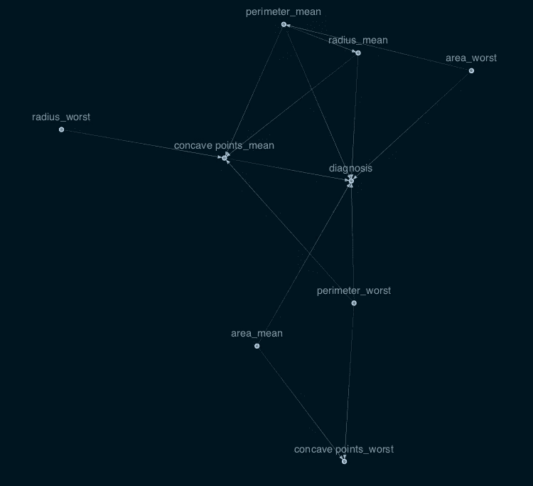

# 因果推理

> 原文：<https://levelup.gitconnected.com/causal-inference-3d45b98ed6ae>


图片由来自[皮克斯拜](https://pixabay.com/?utm_source=link-attribution&utm_medium=referral&utm_campaign=image&utm_content=6076266)的[古斯塔沃·雷森德](https://pixabay.com/users/gustavorezende-1488336/?utm_source=link-attribution&utm_medium=referral&utm_campaign=image&utm_content=6076266)拍摄

假设您创建了一个新的游戏应用程序。尽管应用程序占用的空间很小，而且响应速度很快，但卸载率还是很高。你想降低应用程序的卸载率。为了达到这个目标，首先要比较卸载了应用程序的用户和没有卸载的用户。

结果显示，游戏进度和卸载之间存在相关性。这是否意味着通过游戏帮助人们进步；也许通过降低难度，卸载率会降低？不一定。情况可能是这样的，例如，喜欢游戏的用户可以更频繁地玩游戏，从而允许他们进步。降低的难度可能会降低这些用户的参与度。这个结果并不一定表明有直接的关联。只是一些用户通过游戏进步，而这些用户恰好保留了他们的应用。

因果推理是一种技术，通过这种技术我们可以确定因果解释是否准确；在上面描述的场景中。它通过控制混杂因素起作用。它让我们更好地了解原因和影响，以便我们可以做出更好的决定。

在这篇文章中，我将使用 Kaggle 上可用的威斯康星州乳腺癌(诊断)数据。

# GitHub 链接

[](https://github.com/10-Academy-quad-squad/casual-graph) [## GitHub-10-学院-四人小队/休闲-图表

### 目录是业内常见的挫折，尤其是当涉及到从…获取业务见解时

github.com](https://github.com/10-Academy-quad-squad/casual-graph) 

# 数据

该数据集包含 569 个恶性和良性肿瘤细胞样本。数据集的前两列分别存储样本的唯一 ID 号和相应的诊断(M =恶性，B =良性)。

第 3–32 列包含 30 个实值特征，这些特征是根据乳腺肿块细针抽吸(FNA)的数字化图像计算得出的。这些特征描述了图像中出现的细胞核的特征，并且可以用于建立模型来预测肿瘤是良性的还是恶性的。

这 30 个特征来源于为每个细胞核计算的以下 10 个实值特征。

*   半径(从中心到周边各点的平均距离)
*   纹理(灰度值的标准偏差)
*   周长
*   区域
*   平滑度(半径长度的局部变化)
*   紧凑性(周长/面积— 1.0)
*   凹度(轮廓凹陷部分的严重程度)
*   凹点(轮廓凹陷部分的数量)
*   对称
*   分形维数(“海岸线近似值”-1)

# 数据集探索


在 569 个发现中，357 个(或 62.7%)被标记为恶性，其余 212 个(或 37.3%)被标记为良性。


该图显示了我们的输入特征与诊断之间的相关性。现在让我们按照与诊断相关性的递增顺序创建一个分布。


我们可以观察到与诊断具有较高相关性的特征具有非常不同的恶性和良性分布图。而具有低相关性的特征具有相似的恶性和良性分布图。这表明它们在诊断中不是起作用的因素。这里我们将使用与诊断相关性较高的前 9 个特征。

# 烧灼感

> CausalNex 是一个 Python 库，允许数据科学家和领域专家共同开发超越相关性并考虑因果关系的模型。“因果关系”提供了一个实用的“假设”库，用于使用贝叶斯网络测试场景。

在这里，我们将使用因果关系来共同开发超越相关性并考虑因果关系的模型。关于 CausalNex 提供的功能的深入解释和用法演示，我推荐这两篇文章。

[](https://causalnex.readthedocs.io/en/latest/03_tutorial/03_tutorial.html) [## 第一个 CausalNex 教程- causalnex 0.10.0 文档

### 本教程将带你通过一个示例工作流程，使用 CausalNex 来评估一个学生是否会通过或失败…

causalnex.readthedocs.io](https://causalnex.readthedocs.io/en/latest/03_tutorial/03_tutorial.html) [](https://ljubica-vujovic.medium.com/causalnex-in-action-finding-the-why-behind-the-scenes-c50b78abc888) [## 行动中的因果关系——寻找幕后的原因

### 学习如何使用因果关系并在数据中寻找因果关系

ljubica-vujovic.medium.com](https://ljubica-vujovic.medium.com/causalnex-in-action-finding-the-why-behind-the-scenes-c50b78abc888) 

# 从数据中学习结构

CausalNex 库侧重于使用有向无环图(Dag ),这是一种有用的数据结构。现在我们先用因果关系建立一个因果结构模型。


这张图有太多的联系，我们无法从中推断出太多的东西。让我们通过应用边修剪来减少边的数量。边缘修剪允许我们移除权重低于定义阈值的边缘。简化图形可提高网络的可视化程度，并可用于提取主要结构。



简化的图表显示六个特征直接影响诊断。

# 因果图的稳定性

图形的稳定性显示了我们发现的特征之间的相关性是否在现实中存在。在稳定的图形中，当数据大小发生变化时，特征之间的相关性不会发生实质性变化。我们将使用 Jaccard 相似性指数来计算图形之间的相似性。

> Jaccard 相似性指数(有时称为 Jaccard 相似性*系数*)比较两个集合的成员，以查看哪些成员是共享的，哪些是不同的。这是对两组数据相似性的度量，范围从 0%到 100%。百分比越高，两个种群越相似。

```
def jaccard_similarity(g, h):
    i = set(g).intersection(h)
    *return* round(len(i) / (len(g) + len(h) - len(i)), 3)
```

有 50%数据的随意图。


60%数据的随意图。


60%和 70%数据的因果图之间的 Jaccard 相似度为 86.7%。

70%数据的随意图。


60%和 70%数据的因果图之间的 Jaccard 相似度是 85.7%。我们已经设法通过增加 10%的数据来获得大于 80%的 Jaccard 相似性指数，这表明我们的图是稳定的。

# 贝叶斯网络

> 贝叶斯网络是联合概率分布的紧凑、灵活和可解释的表示。它也是知识发现的有用工具，因为有向无环图允许表示变量之间的因果关系。

贝叶斯网络由两部分组成:结构和参数。该结构是有向无环图(DAG ),其表达了与节点相关联的随机变量之间的条件独立性和依赖性。这些参数由与每个节点相关联的条件概率分布组成。

CausalNex 提供了我们将要使用的 BayesianNetwork 实现。但在此之前，我们需要将图简化为马尔可夫毯，并离散化数字特征。

# 将一个图简化为它的马尔可夫毯

现在，假设目标是我们感兴趣的变量。我们不需要网络中的所有节点，而只需要目标的马尔可夫毯。

> 变量的 Markov blanket (MB)是贝叶斯网络中包含预测该变量的所有有用信息的节点子集。换句话说，变量 MB 之外的节点(已知 MB 中的节点)不会影响感兴趣的变量。

当我们有一个大图和一个感兴趣的变量时，这个概念特别有用。我们不需要考虑整个图，只需要考虑马尔可夫毯子图就可以做出更有效的推断。

```
bn = BayesianNetwork(sm)
blanket = get_markov_blanket(bn, 'diagnosis')
edge_list = list(blanket.structure.edges)
edge_list
```


# 离散化数字特征

CausalNex 提供了我们将要使用的 BayesianNetwork 实现。但是 BayesianNetwork 实现期望其所有特征都是离散值。


正如我们所看到的，我们数据集中的所有要素都是连续的，无法像现在这样适合贝叶斯网络。假设我们试图在给定其他特征的情况下预测目标，我们可以使用监督学习方法来离散化其他特征。


在对我们的数据进行离散化之后，所有连续的特征值被映射到 8 个唯一的值。

# **列车**

最后，我们将使用离散特征来拟合条件概率。然后，我们使用测试数据计算召回率、精确度、f1 和准确度。


# **结论**

为了进行比较，我们用整个数据集和特征训练了一个逻辑回归模型，结果如下所示。


结果表明，Logistic 回归具有较好的准确性。尽管逻辑比贝叶斯网络表现得更好，贝叶斯网络让我们能够提出更多的问题，理解和量化数据中更好的因果关系。

[1]:柳比卡·伍约维奇:行动中的因果关系——寻找幕后的原因。[https://towards data science . com/sales-forecasting-from-time-series-to-deep-learning-5d 115514 bfac](https://ljubica-vujovic.medium.com/causalnex-in-action-finding-the-why-behind-the-scenes-c50b78abc888)。

[2]:格雷格·安斯利-马利克(Greg Ainslie-Malik):因果推断:在杂乱的数据中确定影响。[https://www . splunk . com/en _ us/blog/platform/causal-inference-determining-influence-in-dirty-data . html](https://www.splunk.com/en_us/blog/platform/causal-inference-determining-influence-in-messy-data.html)。

[3]: Lina Faik:机器学习算法如何包含更好的因果关系？[https://towards data science . com/how-can-machine-learning-algorithms-include-better-cavity-e 869 ca 60 e 54d](https://towardsdatascience.com/how-can-machine-learning-algorithms-include-better-causality-e869ca60e54d)。