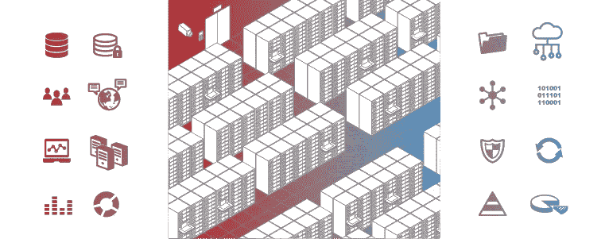

# CBA 选一个栈？

> 原文：<https://levelup.gitconnected.com/cba-to-choose-a-stack-bea9e834302c>

**CBA:当然是成本效益分析！**

所以你在选择一个新的框架，这就像在高草中跋涉。去过那里。就在几年前，我也遇到过同样的情况，我来自一个科学/工程背景，在那里 FORTRAN 和 MATLAB 的旧版本代码是主要内容。看在上帝的份上，我从未写过一行 Python、JS 甚至 HTML 代码。

你可能在同一个地方，或者你可能是一个产品所有者或首席执行官，在将你推向不同方向的开发人员之间进行选择。

**如此。很多。观点。**

*Flask vs. Django 争夺网络服务器？应用前端的角度与反应？后端还是无服务器？芒果和杨桃，哪个有助于编码员更好地集中注意力？*

最常见的争论——以及无数关于 CodeMentor 和 Medium 的文章、reddit 上的“讨论”和更具技术性的网站上充满行话的被动攻击——都有一个共同点。他们选择两种东西(框架，或者语言，或者其他什么)来争论，基于一些经验和需求… **可能和你的**相似也可能不相似。

与其写另一个关于 A 和 B 的案例，希望这篇文章能给你一些指导，告诉你如何为自己选择一个框架。

# 第一部分:自己选择。

我经常听到赞成和反对的观点，这些观点都是完全正确的，但对于手头的业务/商业/技术/健全的需求来说，它们真的不是高优先级的。真的，定制这样的讨论来满足你的需求的唯一方法是开发一个框架选择框架(提醒我哭泣的 unicode 是什么？).

这也被称为**成本效益分析**。首先，让我们梳理出一些要问的问题和要思考的事情。我认为有三个优先领域:人的因素(你的团队)，商业因素(我能多快建立起来/它将花费多少)，以及性能因素(它工作得多快/多好)。

# 需要考虑的问题

# a.你的团队

你的团队知道什么和喜欢什么是一个重要的因素，但是不要害怕要求团队成员学习新的东西。仅仅为了满足团队成员而将一个应用程序拆分成几种语言将会导致一个 rats nest 架构。试着梳理出你团队情绪背后的逻辑。想想扩大团队会有多容易。

> “我用 Clojure 写。这个社区很小，所以你会觉得很难找到开发者。但是，那些在那里的人觉得很有趣。所以我可以诱惑他们放弃生产 Django 的美好、安全、高薪的工作——只是因为他们使用我的堆栈很愉快。”
> ~我尊敬的室友、连续创业家鲁尼·S，打破常规思考。

需要考虑的事项:

*   当前能力(人们在哪些方面有超过 18 个月的经验？少于这个数不算——人们学得很快。)
*   在这个框架中雇佣有经验的开发人员有多容易？
*   雇佣优秀的开发人员有多容易？^^
*   多快能让开发人员和新员工入职？

# b.MVP 的速度/成本

基本上，有多少东西是你可以用来达到目的的，而不是你自己建造的。生态系统的规模在这里非常重要！

*   生态系统有多大(StackOverflow 上的标签数量，google 搜索结果的数量，无论你想用什么指标)以及它的发展轨迹如何(增长？还是快死了？)
*   可以从教程和堆栈溢出中复制/粘贴多少代码？
*   官方文件 a 是否存在，b 是否有好的、当前的例子？

对于后端，询问类似以下的问题:

*   我可以获得现成的数据库管理和管理工具吗？它们有多成熟/集成得多好？
*   我可以获得现成的 API 自动文档和验证吗？(提示:是的，你可能有。但是有多好呢？获得正确的文档是一场多大的噩梦？)
*   现成的权限和用户管理？
*   框架(尤其是使用 ORM 时)支持我选择的数据库吗？
*   我有很多业务规则吗，还是我在做更简单的事情([这里有一篇非常有用的文章，是我刚刚提到的那种，评估两种不同的 ORM](https://www.eversql.com/django-vs-sqlalchemy-which-python-orm-is-better/))。

对于前端，可以问这样的问题:

*   我想使用模板/组件库/cookiecutter 吗？它对我的框架可用吗？**不，真的，它真的写在那个框架里吗，或者只是假装说它支持它？**注意这一点，尤其是对于你的前端技术……那里有很多看起来很棒的“开箱即用的仪表板”类型的东西，但在材料 UI 或类似的东西中创建你自己的可能会更干净！
*   我想使用什么样的登录/认证流程，有现成的或教程中提供的受良好支持的工作流吗？
*   数据结构变化的程度和速度如何？我将如何管理和规范化我的前端状态，我将如何保持它与后端同步？
*   我的路由在我的 SPA 中会是什么样子，如何管理 URL？
*   我的整个站点必须用这个构建吗，或者我可以使用子组件吗(例如，如果从静态站点迁移，一次只做一部分可能是有用的)？
*   作为模块或组件，我需要哪些“开箱即用”的杀手级特性？Converse:现在有没有我需要快速介绍的杀手级特性，它们在一个框架中可以作为插件使用，而在另一个框架中却不能？

# c.表演

如果你已经很好，真正在规模上，或者有真正具体的性能限制(例如，它需要运行在 256Mb ram 的芯片上)，这方面将占主导地位。如果不是，你可能应该忽略这一点。

在我见过的每个应用中，**性能是由你的开发人员如何构建、处理和更新数据决定的，而不是由使用的框架决定的**。如果你有性能问题，很可能会有一堆唾手可得的果实，比起为了边际效益而改变你的整个框架来说，解决这些问题(比如像这些这样的[问题)更具成本效益。最坏的情况是，您的数据模式需要重组。这也不能通过改变框架来解决。](https://medium.com/dailyjs/react-is-slow-react-is-fast-optimizing-react-apps-in-practice-394176a11fba?fbclid=IwAR13i8IwMlyQG54GfTtibSj-rZEBfSJK6qlXyC-m-e67Hv7CbSiJcSr6WdI)

然而，如果你必须考虑:

*   RAM 要求。使用 loadsa loadsa RAM 提升到下一层性能服务器真的很重要，所以保持后端的内存需求非常紧张是很好的。随着规模的扩大，你的首席财务官不会那么眼馋，尤其是如果你是自举或是有现金流问题的话。
*   感知绩效是 UX 的一个关键部分。例如，一些前端框架使得预先呈现空白组件变得容易，因此用户不会因为等待长时间运行的请求完成而感到沮丧。
*   特定/重量级计算需求。例如，科学应用程序可能需要交换大量数据，所以在这种情况下，我会看看用您的框架管理套接字的库有多成熟。实时数据馈送也是如此。
*   数据结构。存在框架开关*促进*数量级性能提高的情况。例如，选择一个对 GraphQL 有良好支持的框架可能会让您的团队更有效地组织通过 API 获取的数据。

# 怎么做

首先，[这里有一个谷歌表单，你可以复制它作为你自己的 CBA](https://docs.google.com/spreadsheets/d/1-8zpscryze2eo3TilIwF3BQBtI1d-B0OSl8JAcGoEfA/edit?usp=sharing) 的模板。现在:

*   列出上面的问题，并添加任何可能出现的问题或限制。
*   对于第一个框架，依次考虑每个问题。是否有中立、赞成或反对的感觉/理由？
*   试着经历一个把感觉转化为理性的思考过程！
*   在赞成一栏写赞成，在反对一栏写反对。
*   对正反两面进行加权(重要性)
*   对另一个框架重复上述步骤。
*   与您的团队一起审查权重。您是否获得了适合您业务需求的相对重要性？
*   把它们加起来，享受你的电子表格的荣耀。

# 一个例子

[这里有一个填写好的 CBA 表格](https://docs.google.com/spreadsheets/d/1XSY5x9Z3cNVFpaMpkcZAwEm1CGMX59Ai1sPHHhIWRqg/edit?usp=sharing)的例子，正是它说服我投资将 octue.com 的应用程序从 Flask 原型迁移到 Django。

填写时，我正在设置一个相当复杂的应用程序，它需要:

*   就系统管理员而言，维护成本极低
*   部署/设置时间最短
*   成为一个反应灵敏的基于网络的应用程序，而不是立即需要一个本地移动应用程序
*   由一个小团队发展到企业销售级别(1 < numDevs < 4, say)
*   be bulletproof and well tested above being performant
*   help manage the database, because I had very little DBA experience on the team
*   draw on loads of tutorials about how to do things and pack loads of features out of the box, to reduce time to MVP
*   expose an API to clients
*   be re-deployed in silos for enterprise customers

I mean, these are pretty common requirements.

But say you have a more established product, VC backing and a team of 10 devs, of which 2–3 are highly experienced. You won’t care about a bunch of basic handholding tutorials. And you have the sysadmin capacity to set up a customised CI/deployment process, so it no longer matters if Heroku has the right buildpack for your framework out of the box. And you have a team to write dedicated API documentation instead of exposing the autogenerated docs to your clients, so it no longer matters if the autodoc tool looks slick. You want to split into subteams, so compartmentalise some of the logic into a backend microservice. You’re under pressure to release new features and suddenly you need to attract then hire another 10 developers by yesterday… and the dataset is getting big. Better shard the DB, and make sure you can still manage migrations seamlessly…

See how the priorities shift a bit? Your needs will change. Think ahead when doing this CBA, and don’t be afraid to revisit it!

# Isn’t it subjective and biased?

Well, yes.

The weightings are inherently subjective — because they’re at least partly based on qualitative data (although you should do quantified comparisons, like developer days vs compute overhead, where possible to help decide on the weights)… **你肯定会篡改数字**得到你想要的选择。

你可以做一些事情来使这个更加公正(例如，让团队成员分别填写，然后合并答案)。

但是:这么做的目的并不在于*答案*。这是关于你曾经经历的*过程*。只要你**注意到你为什么拨弄数字**，就没问题。

> “对于上面填写的例子，我有一种感觉，做出那个特殊的改变对我们来说是正确的决定……但不知道有多少不同的原因。我是弗拉斯克的超级粉丝，不知道也不喜欢姜戈的长相，但我无法忽视他的得分。这一过程绝对有能力带来惊喜。”
> ~我。

希望上面列出的考虑事项，以及被迫把它们都写出来，能帮助你做出正确的决定。

# 第二部分:CBB？让我选择吧。

不能被打扰？还是 CBA 不适合你？

对于一个零到英雄的食谱，选择 Django 和 DRF 作为后端(首先使用 **django-cookiecutter** )，在前端进行反应(使用 create-react-app，以及超级惊人的 **React-Query** 和 **MaterialUI** )，代码在 GitHub 上的 [monorepo 项目结构](https://medium.com/@luisvieira_gmr/building-large-scale-react-applications-in-a-monorepo-91cd4637c131)中，使用 PyCharm Pro(值得为 django utils 付费)、mailgun 和一个 **dramatiq** 任务队列开发。使用以下插件，通过 CI 测试/登台管道将其部署到 Heroku:托管 Heroku POSTGRES 数据库、Coralogix 错误跟踪器、Heroku Redis 消息存储和 Heroku 部署挂钩。

价格可能已经变了(我现在已经离开了)，但这让我在 alpha 版中每月花费 80 美元，在 beta 版中每月花费 350 美元，我每月花不到一个小时做系统管理员。

抱歉。我真的尽力了，但是我就是不能把我的意见藏在心里。