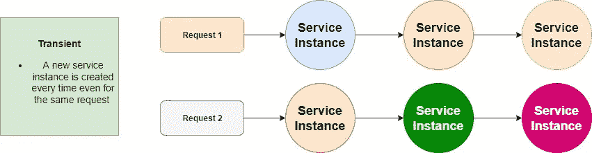
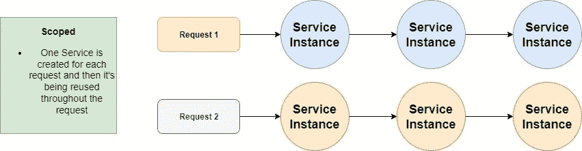
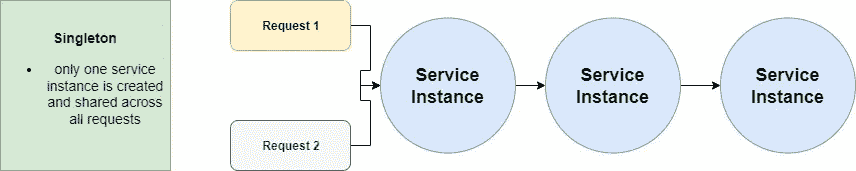

# 中的依赖项注入生存期。网

> 原文：<https://levelup.gitconnected.com/cdependency-injection-lifetimes-in-net-566830a633ca>

## 单例、作用域和瞬态之间有什么区别

在 [Unsplash](https://unsplash.com/photos/d_3EKbSg1tg) 上由 [Bernd Dittrich](https://unsplash.com/@hdbernd) 拍摄的照片

## 介绍

在这篇文章中，我们将看看单例服务、作用域服务和瞬态服务之间的区别，以及它们如何影响我们的应用程序。

## 短暂的

瞬态服务将在每次从服务容器请求它们时创建一个新的服务实例，然后在请求结束时被释放。

所以，假设我们想要一个系统状态服务来跟踪 CPU 性能等等。我们希望将它添加为 transient，因为理想情况下，我们希望能够通过这样的请求在每一点检查系统的状态。

Transient 在轻量级、无状态的服务中也能很好地工作，但在其他地方就不那么好了，因为它使用了大量的内存和资源，影响了性能。瞬态服务对于多线程和内存泄漏也有好处，因为每次都会创建一个新的实例。

## 审视

另一方面，作用域服务为每个请求创建一次，并在请求结束时再次被释放。

当您希望维护请求中的状态时，您希望使用 scoped。一个很好的例子是，如果您有一些关于识别发送请求的用户的逻辑，那么您可以跟踪哪个用户更新了什么数据。例如:

在你的类中，你会有一个逻辑，根据你已经设置好的认证返回给你*用户标识*。但是您希望保持服务的作用域，因为在请求的最后，您希望记录那个 *userId* ，这样您就可以回顾更改以及谁做了更改。

## 一个

顾名思义，单元集服务在被请求时被创建一次。从那时起，每个请求都将使用该服务的同一个实例。

单例服务的内存效率很高，因为它们只创建一次，然后就可以重用，但另一方面，内存泄漏可能会随着时间的推移而增加。当您需要一个应用程序范围的状态，比如日志记录、缓存等等时，您可以将服务作为一个单独的服务来添加。

## 结论

依赖注射真的很好知道，一旦你把它们包起来，它们就没那么可怕了。如果你有任何问题，请留下评论，我希望你喜欢这篇短文。

 [## 通过我的推荐链接加入 Medium-Ivan Stoev

### 作为一个媒体会员，你的会员费的一部分会给你阅读的作家，你可以完全接触到每一个故事…

medium.com](https://medium.com/@ivan.zstoev/membership)