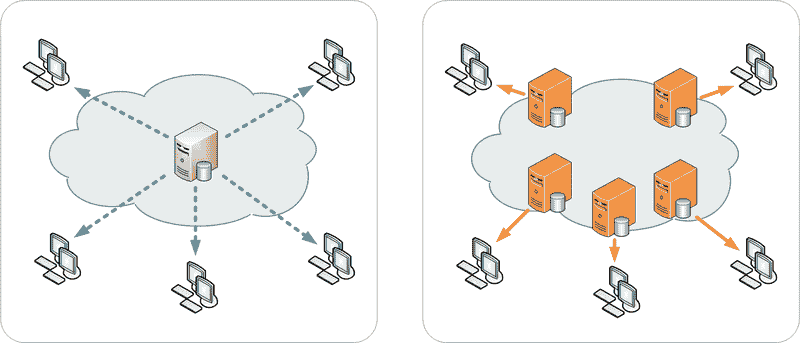
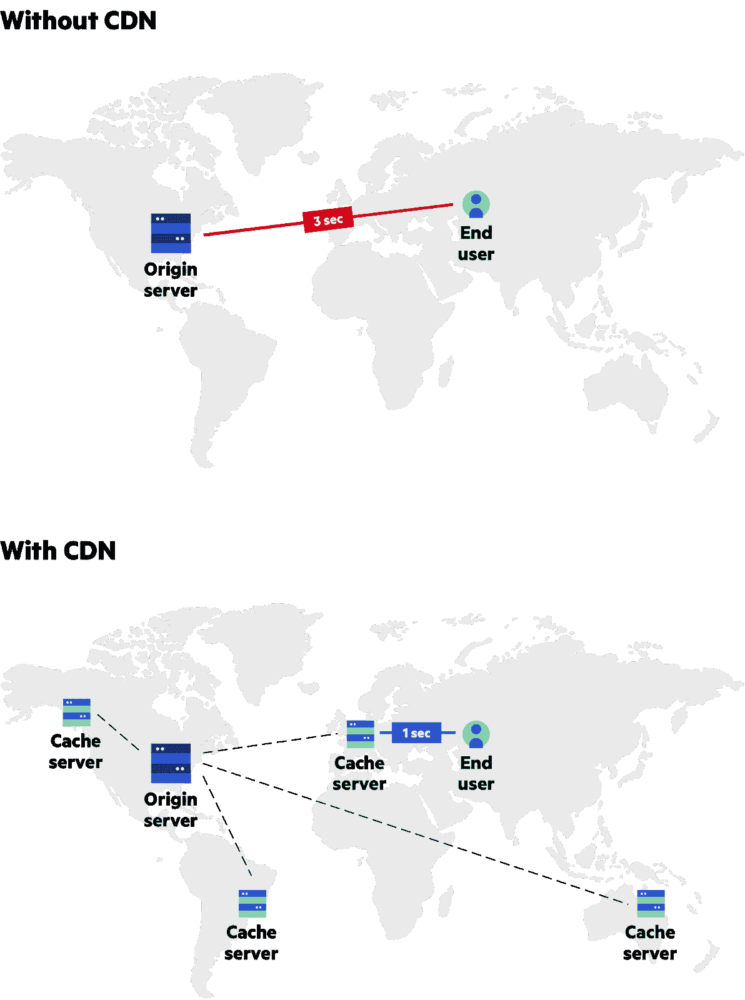

# CDNs——深度探索

> 原文：<https://levelup.gitconnected.com/cdns-a-deep-dive-1f1de5853386>

## 你以前用过它们，但你不完全确定它们是什么，这里有一些答案。

欢迎来到第一期的 **D** eep **D** ives，在这里我们通过简单的解释获得关于一个话题的深入知识。

## [🔛](https://jportella93.medium.com/dd-deep-dives-adb717e0709e) [⏩](/using-svgs-on-the-web-a-deep-dive-d3de6b0cc5d5)

单一服务器与内容交付网络(CDN)的对比

# 什么是 CDN？

一个**内容分发**(或交付)**网络** ( **CDN** )是一组地理上分布的服务器，目的是提供互联网内容的快速交付。

CDN 的服务器充当你的原始服务器的反向代理[,在那里内容被托管。](https://jportella93.medium.com/1-minute-to-become-a-better-developer-17-75fd019f407c)

服务器包含在分布在全球的被称为**存在点** ( **PoP** )的设施中。

# CDN 是如何工作的？

CDN 中的服务器可以帮助提供更好的用户体验，方法是在离用户更近的地方缓存内容，而不是在原始服务器上交付。

这减少了**往返时间(RTT)** ，即浏览器发送请求和从服务器接收响应所需的毫秒数。

[Imperva](https://www.imperva.com/learn/performance/what-is-cdn-how-it-works/) 无 CDN vs 有 CDN

## **不带 CDN**

1.  西班牙巴塞罗纳的用户打开她的浏览器，导航到[http://example.com/](http://example.com/)。浏览器发出 HTTP 请求`GET http://example.com/index.html`
2.  该网站由位于美国波士顿的服务器托管，因此请求必须穿越大西洋，由原始服务器处理。然后，服务器的响应必须返回到巴塞罗那。
3.  这导致**高 RTT** 和**次优 UX** 。

## **带 CDN**

1.  西班牙巴塞罗纳的用户打开她的浏览器，导航到[http://example.com/](http://example.com/)。浏览器发出 HTTP 请求`GET [http://example.com/index.html](http://example.com/index.html)`
2.  当用户请求资产时，DNS 会将请求路由到性能最佳的 PoP 位置，该位置通常是地理上离客户端最近的位置。

此时，有两种可能的结果:

*   **资产可用:**所请求资产的非陈旧副本存在于 PoP 的缓存服务器中，因此资产被直接发送回用户，从而产生了更短的**RTT**，因此有了更好的 UX。
*   **资产不可用**:PoP 的服务器将请求重新路由到原始服务器，原始服务器发回资产的新版本。PoP 的服务器缓存该资产并将其发送回用户。这一次 RTT 更长，但是对该区域中该资产的后续请求将更快，因为该资产现在在 PoP 的缓存服务器中是可用的。

资产一直缓存在 PoP 的缓存服务器上，直到其 HTTP 头指定的**生存时间(TTL)** 到期。

# 使用 CDN 的利弊？

最明显的好处是**更好的 UX** ，这是由于在用户附近使用缓存内容带来的**更快的 RTT** 。

除此之外，使用 CDN 可以增加网站的正常运行时间。想象一下流量过载或硬件故障使您的原始服务器瘫痪。在分布式 CDN 的服务器上缓存内容可以防止终端用户的服务中断。此外，由于内容在 CDN 的服务器中是冗余的，所以一个 PoP 中的故障可以由另一个 PoP 中的内容来保存。

另一个好处是，通过提供缓存的内容，源服务器上的带宽成本降低了。然而，CDN 提供商可能会收取大量的费用，使这种好处变得微不足道，所以对这一点*要有所保留*！

此外，值得注意的是，一些 CDN 提供商通过利用反向代理配置，正在转向其他服务。一些使用 CDNs 分布式配置来提供针对 **分布式拒绝服务** **(DDOS)攻击**的**保护。此外，他们可能会实现负载平衡器，以避免大量流量使源服务器过载。**

# 存在哪些类型的 cdn？

在撰写本文时，CDN 有 6 种主要类型:

*   免费的 cdn，它的任务是服务开源包。例如 jsDelivr。
*   **商业**cdn，以一定的成本向公众提供服务。例如云闪。
*   内部 CDN，由那些商业模式使得商业 CDN 选项得不偿失的公司推出，因此他们推出了自己的私有 CDN。例如网飞。
*   **Telco**cdn，由电信服务提供商(tsp)推出，目的是在不租赁商业 cdn 的情况下提供自己的流媒体内容。它们类似于软管内 cdn。例如威瑞森。
*   **Peer to Peer**(P2P)cdn，用于在应用程序中拥有同等特权的个人或同行之间共享资产。例如 BitTorrent。
*   **多**cdn，借力其他几个 cdn 的力量。例如 MetaCDN。

# 为什么 cdn 在虚拟主机中不会默认出现？

当 cdn 在 90 年代末开始出现时，它们非常昂贵，所以不是所有的组织都买得起。

如今，成本的降低使得 CDN 成为一个更容易获得的选择，许多主机提供商实际上提供 CDN 服务作为复选框附加服务。

# 感谢阅读！

希望你觉得有趣。如果你想了解更多，你可以在下一节找到我用来研究这个主题的资源。Imperva 的真的很好解释。

继续学习，祝你有美好的一天！

乔恩·波特拉

# 资源

[内容交付网络—维基百科](https://en.wikipedia.org/wiki/Content_delivery_network)

[什么是 CDN？| cdn 是如何工作的？—云耀斑](https://www.cloudflare.com/learning/cdn/what-is-a-cdn/)

[什么是内容分发网络(CDN)？—天蓝色](https://docs.microsoft.com/en-us/azure/cdn/cdn-overview)

[什么是 CDN？CDN 是如何工作的？— Imperva](https://www.imperva.com/learn/performance/what-is-cdn-how-it-works/)

[CDN 基础设施架构和拓扑——imper va](https://www.imperva.com/learn/performance/cdn-architecture)

[什么是多 CDN？—key dn](https://www.keycdn.com/support/what-is-a-multi-cdn)

## 如果你喜欢这篇文章，你可能也会喜欢

 [## 代理——一个温和的介绍

### 一分钟内了解正向和反向代理。

jportella93.medium.com](https://jportella93.medium.com/1-minute-to-become-a-better-developer-17-75fd019f407c) 

## [🔛](https://jportella93.medium.com/dd-deep-dives-adb717e0709e) [**⏩**](/using-svgs-on-the-web-a-deep-dive-d3de6b0cc5d5)