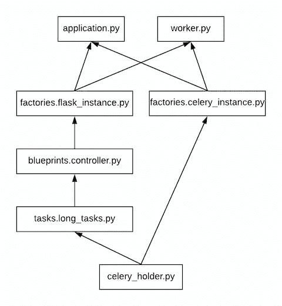

# 芹菜与烧瓶和 SQS 的任务管理

> 原文：<https://levelup.gitconnected.com/celery-for-task-management-with-flask-and-sqs-dbac64040549>


## 假定的背景知识

本文假设读者熟悉 Python、Flask、Celery 和 AWS SQS。

# 介绍

在构建一个利用 Celery 进行异步任务管理的 Flask 应用程序时，需要掌握的基本知识是，除了队列和结果后端，实际上有三个部分需要考虑。它们是(Flask 实例，它是您的 web 或微服务前端，(2)Celery 实例，它向队列提供任务，以及(Celery worker，它从队列中取出任务并完成工作。Flask 和 Celery 实例一起部署，在应用程序的界面上协同工作。Celery worker 是单独部署的，独立于实例有效地工作。

乍一看，设置使用这三个组件的应用程序似乎非常简单。然而，当试图使用 Flask 应用程序工厂模式实现 Flask 实例和 Celery 实例时，情况变得复杂了，因为这种方法会导致循环导入问题。

本文的目的是:

1.  阐明如何初始化 Flask+芹菜服务的这三个部分
2.  解释如何将这些服务打包以部署到生产环境中
3.  指出最佳实践的一些注意事项

# 设置烧瓶+芹菜服务的 3 个组成部分

为了避免循环导入，我们指向“factories.celery_instance”和“tasks.data_tasks”来导入 celery 实例占位符。占位符将在运行时从实例工厂接收其配置。

假设为了实现我们的解决方案，我们建立了一个结构类似于下面的项目:

```
application.py
worker.py
celery_holder.py
factories/
   flask_instance.py
   celery_instance.py
blueprints/
   controller.py
tasks/
   long_tasks.py
```

这里的“application.py”是我们的应用程序，它初始化 Flask 实例和 Celery 实例，以提供我们与之交互的 web/微服务的一部分。芹菜占位符在' celery_holder.py '中提供，芹菜工人通过' worker.py '初始化。应用程序工厂在' factories/'中提供，Flask 蓝图在' blueprints/'中提供，芹菜任务在' tasks/'中提供。现在，导入模式将如下所示:



展示代码示例应该会使过程更加清晰。让我们从导入图的底部开始，展示芹菜占位符的代码。这个占位符为任务文件和芹菜工厂文件提供了芹菜实例，可以分别在 decorators 和芹菜类扩展中导入和引用。

```
from celery import Celery

celery = Celery(__name__, include=['tasks.long_tasks'])
```

这里我们演示一个芹菜任务。

```
import time
from celery_holder import celery

@celery.task
def celery_long_task(duration):
    for i in range(duration):
        print("Working... {}/{}".format(i + 1, duration))
        time.sleep(2)
        if i == duration - 1:
            print('Completed work on {}'.format(duration))
```

该任务在 Flask 蓝图中定义的端点内调用。

```
from flask import Blueprint

from tasks.long_tasks import celery_long_task

sqs = Blueprint('sqs', __name__)

@sqs.route('/celery/<int:duration>', methods=['GET'])
def add_celery_task(duration):
    celery_long_task.delay(duration)
    return 'Task queued'
```

然后我们来到创建 Flask 实例的工厂，指定所有必要的配置。

```
from flask import Flask
import os
import logging

from blueprints.controller import sqs

def create_app() -> Flask:
    app = Flask(__name__)

    # Always use dev config
    app.config.from_object('config_dev')

    # Set logging
    log_file = app.config['LOG_LOC'] + app.config['LOG_FILE']
    logging.basicConfig(
        level=app.config['LOG_LEVEL'],
        format=('%(levelname)s %(asctime)s %(name)s '
                'Lrn %(threadName)s: %(message)s'),
        datefmt='%Y-%m-%d %H:%M:%S',
        filename=log_file
    )

    # Register blueprints
    app.register_blueprint(sqs, url_prefix='/sqs')

    return app
```

然后，扩展 Celery 类的工厂给它 Flask 应用程序上下文。

```
import celery_holder# Imported for type hinting
from flask import Flask
from celery import Celerydef configure_celery(app: Flask) -> Celery:
    """Configure celery instance using config from Flask app"""
    TaskBase = celery_holder.celery.Task class ContextTask(TaskBase):
        abstract = True
        def __call__(self, *args, **kwargs):
            with app.app_context():
                return TaskBase.__call__(self, *args, **kwargs) celery_holder.celery.conf.update(app.config)
    celery_holder.celery.Task = ContextTask

    return celery_holder.celery
```

最后，我们来看两个文件，它们被调用来实际运行我们的应用程序和我们的 worker。

```
from factories.flask_instance import create_app
from factories.celery_instance import configure_celery

# Imported for type hinting
from flask import Flask
from celery import Celery

def create_full_app() -> Flask:
    app: Flask = create_app()
    cel_app: Celery = configure_celery(app)
    return app
```

我们的工人。

```
from factories.flask_instance import create_app
from factories.celery_instance import configure_celery

# Imported for type hinting
from flask import Flask
from celery import Celery

app: Flask = create_app()
celery: Celery = configure_celery(app)
```

要运行 Flask 应用程序，请将 FLASK_APP 全局变量设置为 application:create_full_app()。

要运行 celery worker，在“Celery worker”命令的- app=*参数中指向 worker.celery。

## 配置

Celery 实现 SQS 作为后台任务消息通信队列所需的最低配置。实际上，要让 Celery 将 SQS 识别为队列，您只需指定正确的 BROKER_URL，并将队列的名称传递给 CELERY_DEFAULT_QUEUE。

```
SQS_NAME = 'test'# Celery configuration
BROKER_URL = 'sqs://'BROKER_TRANSPORT_OPTIONS = *{* 'region': 'us-east-1',
     'polling_interval': 5,  # number of sec to sleep between polls
     'wait_time_seconds': 5
*}* CELERY_DEFAULT_QUEUE = SQS_NAME
CELERY_ENABLE_REMOTE_CONTROL = False
CELERY_SEND_EVENTS = False
```

# 容器化我们的应用程序和工作程序

利用 Celery 后台工作程序提供的独立可伸缩性意味着创建两个 Docker 映像——一个应用程序映像和一个工作程序映像。然后，每个映像都可以部署在自己的服务器上。这是通过创建“docker-compose”文件来实现的。

```
version: "3.3"

services:
  web:
    build:
      context: .
      args:
        blduser: notused
    image: application
    # no user here because no need to run as something other than root user
    command: [flask, run, --host=0.0.0.0]
    ports:
      - 8000:5000
    # volumes below allows the developer to pass AWS credentials for local development
    #  before container is moved to a server that sits behind IAM roles
    volumes:
      - ~/.aws/credentials:/home/celeryworker/.aws/credentials:ro

  worker:
    build:
      context: .
      args:
        blduser: celeryworker
    image: worker
    # user below sets the user of the container - removes RuntimeWarning for Celery
    user: celeryworker 
    command: [celery, worker, --app=worker.celery, --concurrency=1, --loglevel=info]
    # volumes below allows the developer to pass AWS credentials for local development
    #  before container is moved to a server that sits behind IAM roles
    volumes:
      - ~/.aws/credentials:/home/celeryworker/.aws/credentials:ro
```

除了使创建多个容器变得容易之外，docker-compose 文件还提供了额外的优势。比如:

*   能够指定使用哪个 Docker 文件。甚至能够为每个服务创建单独的 Docker 文件。
*   能够在`. env '文件中指定 docker-compose 文件自动选取的变量。
*   很容易通过 local ~/。AWS/服务凭证。有助于避免意外地将凭证签入存储库。

请注意，在这个实例中，Docker 文件用于指定运行 Flask 应用程序所需的 Flask 全局变量，即 FLASK_APP & FLASK_ENV。

# 一般注意事项

默认情况下，一旦队列消息被工作人员获得，Celery 就会从队列中删除一个任务。这被称为“提前承认”，通常不是我们想要的行为。假设，相反，我们希望 Celery 只在任务完成或出错时从队列中删除任务，我们必须通过将 Celery 参数‘task _ acts _ late’设置为 true 来更改 worker 以显示“延迟确认”。这需要仔细地将任务设计成幂等的，这样即使任务被多个工作者拾取，任务也只完成一次。

详见[https://blog . daft code . pl/working-with-asynchronous-celery-tasks-learned-32bb 7495586 b](https://blog.daftcode.pl/working-with-asynchronous-celery-tasks-lessons-learned-32bb7495586b)。

根据 https://dzone.com/articles/using-sqs-with-celery[的说法](https://dzone.com/articles/using-sqs-with-celery)当利用 SQS 作为队列后端时，有两个芹菜参数需要注意。它们是 worker_send_task_events 和 worker_enable_remote_control。当保留默认值(true)时，Celery 可能会为 AWS 中的每个节点创建一个新队列，这是不希望的行为。因此，这两个参数都应该设置为 false。

# 代码回购

本文中的代码可以在我的 Github 上找到，网址是[https://Github . com/clashofphish/learn flash/tree/master/lrnflsk](https://github.com/clashofphish/learnFlask/tree/master/lrnflsk)

# **参考文献**

*   带瓶芹菜概述:[https://blog . miguelgrinberg . com/post/using-Celery-with-Flask](https://blog.miguelgrinberg.com/post/using-celery-with-flask)
*   芹菜配 SQS 概述(用姜戈):[https://dzone.com/articles/using-sqs-with-celery](https://dzone.com/articles/using-sqs-with-celery)
*   芹菜文档关于优化芹菜:[https://docs . Celery project . org/en/stable/user guide/optimizing . html](https://docs.celeryproject.org/en/stable/userguide/optimizing.html)
*   几个芹菜“gotchas”(芹菜参数名已经过时):[https://wiredcraft.com/blog/3-gotchas-for-celery/](https://wiredcraft.com/blog/3-gotchas-for-celery/)
*   芹菜与烧瓶的应用工厂模式概述；
*   更完整描述:[https://citizen-Stig . github . io/2016/02/17/using-celery-with-flask-factories . html](https://citizen-stig.github.io/2016/02/17/using-celery-with-flask-factories.html)
*   错过了上面描述的芹菜占位符:[https://blog . miguelgrinberg . com/post/Celery-and-the-flask-application-factory-pattern](https://blog.miguelgrinberg.com/post/celery-and-the-flask-application-factory-pattern)