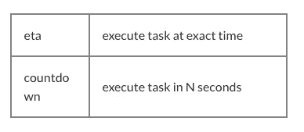

# 芹菜 Python 指南:基础和示例

> 原文：<https://levelup.gitconnected.com/celery-python-guide-basics-and-examples-8795933400ef>

Python 社区中的每个人都至少听说过一次芹菜，甚至可能已经使用过它。基本上，它是一个方便的工具，帮助在一个单独的进程中，甚至在一台单独的计算机或服务器上运行推迟的或专用的代码。这在许多层面上节省了时间和精力。

# 芹菜 Python 指南简介

Celery 通过将部分功能作为推迟的任务在与其他任务相同的服务器或不同的服务器上运行来降低性能负载。最常见的是，开发者用它来发送电子邮件。然而，芹菜还有很多优点。在本文中，我将向您展示一些芹菜的基础知识，以及一些 Python-芹菜的最佳实践。

# 芹菜基础知识

如果你以前用过芹菜，可以跳过这一章。但是如果芹菜对你来说是新的，在这里你将学习如何在你的项目中启用芹菜，并参加一个单独的关于使用芹菜和 Django 的教程。基本上，您需要创建一个 Celery 实例，并使用它将 Python 函数标记为任务。

最好在一个单独的文件中创建实例，因为需要像在 Django 中运行 WSGI 一样运行 Celery。例如，如果您在 Flask 应用程序的一个文件中创建并运行两个实例 Flask 和 Celery，那么您将有两个实例，但只使用一个。跑芹菜也是一样的。

# 主要 Python 芹菜示例

正如我之前提到的，使用芹菜的最佳案例是发送电子邮件。我将用这个例子向你展示使用芹菜的基本知识。这里有一个快速芹菜 Python 教程:

这段代码使用了 Django，因为它是我们 web 应用程序的主要框架。通过使用 Celery，我们减少了对客户的响应时间，因为我们将发送过程与负责返回响应的主代码分开。

执行这个任务最简单的方法是调用由`app.task` decorator 提供的函数的`delay`方法。

不仅如此，芹菜提供了更多的好处。例如，我们可以设置失败后重试。

现在，如果发送失败，任务将在十分钟后重新启动。此外，您还可以设置重试次数。

有些人可能想知道为什么我把模板渲染移到了`send_mail call`之外。是因为我们把`send_mail`的调用包装成了`try/except`，最好`try/except`里的代码越少越好。

# 芹菜适合高级用户

# 芹菜姜戈预定任务

Celery 使得通过像 Linux 中的 crontab 这样的调度器来运行任务成为可能。

首先，如果你想使用周期性任务，你必须用–beat 标志运行 Celery worker，否则 Celery 会忽略调度器。下一步是创建一个配置，说明应该在何时执行什么任务。这里有一个例子:

*如果不用 Django，就用`celery_app.conf.beat_schedule`代替`CELERY_BEAT_SCHEDULE`

在这个配置中，我们只有一个任务，将在每周一早上 7 点执行..根键是名称或 cronjob，而不是任务。

您可以向任务添加参数，并选择在相同的任务在不同的时间以不同的参数运行时应该做什么。`crontab`方法支持系统 crontab 的语法——比如`crontab(minute=’*/15’)`——每 15 分钟运行一次任务。

# 芹菜中延迟的任务执行

您还可以在 Python Celery 队列中设置执行前超时的任务。(例如，当您需要在某个操作后发送通知时。)为此，使用带有`eta`或`countdown`参数的`apply_async method`。

让我们看看它在代码中的样子:

在第一个示例中，电子邮件将在 15 分钟后发送，而在第二个示例中，它将在 5 月 20 日上午 7 点发送。

# 设置 Python 芹菜队列

当您有几个工作人员在不同的服务器上使用一个消息队列进行任务规划时，Celery 可以是分布式的。您可以为您的任务/工作者配置额外的队列。例如，发送电子邮件是您系统的重要组成部分，您不希望任何其他任务影响发送。然后你可以添加一个新的队列，姑且称之为`mail`，用这个队列来发送邮件。

*   如果不用 Django，就用`celery_app.conf.task_routes`代替`CELERY_TASK_ROUTES`

为默认队列和新队列运行两个独立的 celery workers:

第一行将为名为`celery`的默认队列运行 worker，第二行将为`mail`队列运行 worker。您可以使用不带`-Q`参数的第一个 worker，然后这个 worker 将使用所有已配置的队列。

# Python 芹菜长期运行任务

有时候，我不得不处理那些为了浏览数据库记录和执行一些操作而编写的任务。开发人员经常会忘记数据增长，这会导致任务运行时间非常长。以允许使用数据块的方式编写这样的任务总是更好。最简单的方法是向任务添加偏移和限制参数。这将允许您指示块的大小，并用光标获取新的数据块。

这是一个非常简单的例子，说明如何实现这样的任务。在任务结束时，我们检查在数据库中找到了多少用户。如果数量等于限制，那么我们可能有新的用户要处理。所以我们用新的偏移量再次运行这个任务。如果用户计数小于限制，这意味着它是最后一个块，我们不必继续。但是要注意:这个任务实现每次都需要有相同的记录排序。

# 芹菜:获取任务结果

大多数开发人员不会记录他们运行任务后得到的结果。想象一下，你可以取出一部分代码，将其分配给一个任务，并在收到用户请求时独立执行这个任务。当我们需要任务的结果时，我们要么马上得到结果(如果任务完成了)，要么等待它完成。然后，我们将结果包含到一般响应中。使用这种方法，您可以减少响应时间，这对您的用户和网站排名非常有利。

我们使用此功能来运行同步操作。在我们的一个项目中，我们有很多用户数据和很多服务提供商。为了找到最好的服务提供商，我们进行了大量的计算和检查。为了加快速度，我们为每个服务提供商的用户创建任务，运行它们并收集结果以显示给用户。芹菜任务组很容易做到。

首先，为什么我们要同时运行两个任务？我们使用第二个任务来形成计算任务组，启动并返回它们。除此之外，第二个任务是您可以分配项目过滤——比如需要为给定用户计算的服务提供商。这一切都可以在芹菜做其他工作的时候完成。当任务组返回时，第一个任务的结果实际上是我们感兴趣的计算。

下面是如何在代码中使用这种方法的示例:

在这里，我们尽快运行计算，在方法结束时等待结果，然后准备响应并发送给用户。

## **你可能也会喜欢**

 [## 什么是 Docker 以及如何在 Python 中使用它(教程)

### 这是一个介绍 Docker 容器的教程。到本文结束时，你将知道如何在…上使用 Docker

djangostars.com](https://djangostars.com/blog/what-is-docker-and-how-to-use-it-with-python/?utm_source=medium&utm_medium=levelup.gitconnected.com&utm_campaign=celery%20python%20guide&utm_content=you%20may%20also%20like)  [## 6 大 Django 兼容托管服务

### AWS 是 Django 最精致的招待之一。真正与众不同的是它的…

djangostars.com](https://djangostars.com/blog/top-django-compatible-hosting-services/?utm_source=medium&utm_medium=levelup.gitconnected.com&utm_campaign=celery%20python%20guide&utm_content=you%20may%20also%20like%202) 

# 有用的提示

# 微小的数据

我可能已经提到过，我使用数据库记录 id 作为任务参数，而不是完整的对象。这是减小消息队列大小的好方法。但更重要的是，当一个任务被执行时，数据库中的数据是可以改变的。当您只有 id 时，您将获得新的数据，而不是传递对象时获得的过时数据。

# 处理

有时，当执行的任务在数据库中找不到对象时，可能会出现问题。为什么会这样？例如，在 Django 中，您希望在用户注册后运行任务，比如发送问候邮件，并且您的 Django 设置将所有请求打包成一个事务。然而，在 Celery 中，任务执行得很快，甚至在事务完成之前。因此，如果您在 Django 工作时使用 Celery，您可能会看到数据库中还不存在该用户。

要处理这个，可以 Google 一下“任务事务实现”。一般来说，它是 task 中一个被覆盖的`apply_async`方法，一个在`transaction.on_commit`信号中建立一个任务而不是立即执行的类。

# 结论

如你所见，芹菜的用途不仅仅是发送电子邮件。您可以使用主进程同时运行不同的任务，在您工作的同时，Celery 将完成手头的较小任务。您可以设置队列，在长时间运行的任务上使用数据块，并设置任务的执行时间。这将让你更好地计划你的工作进度，更有效地计划开发时间，并在芹菜任务组发挥其魔力时，将你的宝贵时间花在更大的事情上。

> 这篇关于 [**芹菜 Python Guid** e](https://djangostars.com/blog/the-python-celery-cookbook-small-tool-big-possibilities/?utm_source=medium&utm_medium=levelup.gitconnected.com&utm_campaign=celery%20python%20guide&utm_content=originally%20posted) 的文章是由 Django Stars 的解决方案架构师 **Vadym Zakovinko** 撰写的。最初发布于 **Django Stars 博客**。

 [## 学习 Python -最佳 Python 教程(2019) | gitconnected

### Python 是一种动态的通用编程语言，在许多领域都有应用，包括 web 开发、数据科学…

gitconnected.com](https://gitconnected.com/learn/python)