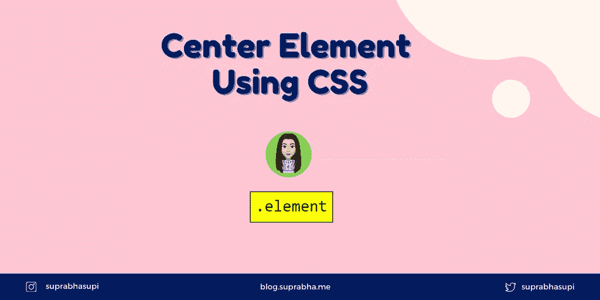

# 使用 CSS 居中元素

> 原文：<https://levelup.gitconnected.com/center-element-using-css-63b622753128>



使用 css 居中元素

将一个元素横向和纵向居中是非常常见的面试问题。假设子元素周围有一个父元素:

```
<div class="parent">
    <div class="child">hello world</div>
</div>
```

# 将元素与页面中心对齐的不同方法:

1.  使用 Flex
2.  使用网格
3.  使用绝对位置
4.  使用表格
5.  使用写入模式
6.  使用表格标签
7.  使用自动边距

# 1️.使用 Flex ⭐️

Flexbox 控制项目的放置方式和空白空间的分布方式，这需要在 CSS 中为特定数量的元素提供幻数。

根据伸缩方向，我们可以根据需要使用对齐内容或对齐项目进行调整。

```
.parent {
    height: 100%;
    display: flex;
    align-items: center;
    justify-content: center;
}
```

# 2️.使用格网⭐️

CSS Grid 包括与 flexbox 几乎相同的对齐选项，因此我们可以在父级上使用它:

```
.parent {
    height: 100vh;
    display: grid;
    place-items: center;
}
```

**或**

```
.parent {
    height: 100vh;
    display: grid;
    align-items: center;
    justify-content: center;
}
```

# 3️.使用绝对位置

使用绝对位置的简单老把戏。

```
.parent {
    position: absolute;
    top: 50%;
    left: 50%;
    transform: translate(-50%, -50%);
}
```

# 4️.使用⎍表

一种非常简单的方法，也是最早的方法之一(在过去，一切都是表格)，是使用表格单元格和垂直对齐的行为将元素放在容器的中心。

```
.parent {
    width: 100vw;
    height: 100vh;
    display: table;
}.child {
    display: table-cell;
    vertical-align: middle;
    text-align: center;
}
```

# 5️.使用书写模式✍

书写模式可以改变文本的显示方向。例如，您可以使用书写模式将文本的显示方向改为垂直方向。

```
.parent {
    writing-mode: vertical-lr;
    text-align: center;
    height: 100vh;
}.child {
    writing-mode: horizontal-tb;
    display: inline-block;
    width: 100%;
}
```

# 6️.使用表格标签🏷

你也可以使用`table`标签。

```
<table>
    <tbody>
        <tr>
            <td class="father">
                <div class="child">hello world</div>
            </td>
        </tr>
   </tbody>
</table>table {
    height: 100vh;
    width: 100%;
}.father {
    text-align: center;
}
```

# 7️.使用自动边距

在父 flex 上应用自动边距。

```
.parent {
    display: flex;
    height: 100vh;
}.child {
    margin: auto;
}
```

我使用的最好的方法是显示 flex(1)和显示 grid(2)。

感谢您阅读这篇文章。

我希望你能从这篇文章中学到一些东西。此外，让我知道是否有任何其他方式将元素放在页面的中心😅。

请随时联系我 [@suprabhasupi](https://twitter.com/suprabhasupi) 😋

🌟[推特](https://twitter.com/suprabhasupi) |👩🏻‍💻Suprabha.me 🌟 [Instagram](https://www.instagram.com/suprabhasupi/)