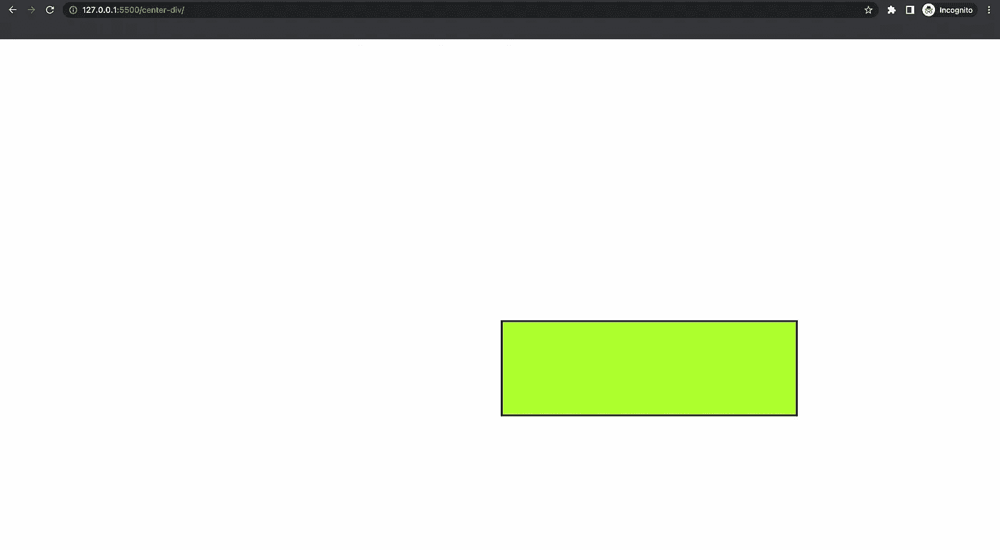
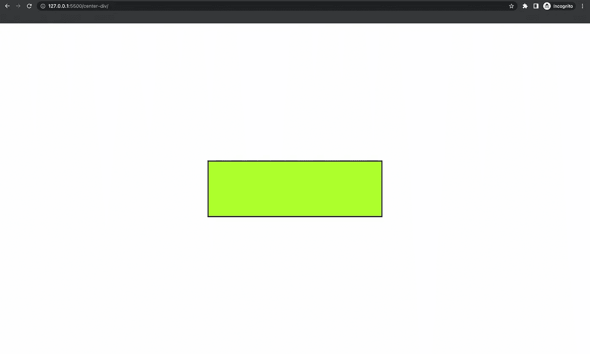

# 使 div 居中再简单不过了！

> 原文：<https://levelup.gitconnected.com/centering-a-div-could-not-be-easier-edeb748cd13f>


[Rodrigo Kugnharski](https://unsplash.com/@kugnharski?utm_source=medium&utm_medium=referral) 在 [Unsplash](https://unsplash.com?utm_source=medium&utm_medium=referral) 上的照片

web 开发中最常见的头痛之一是将一个 *div* 放在页面的中心。在做项目的时候，我不得不把一个 div 放在中间很多次，每次，我都不得不寻找堆栈溢出的解决方案。但现在不是了！

如果你发现自己也在做同样的事情，这篇文章正适合你。

# 超文本标记语言

让我们从定义一个空的 *div* 开始

```
<div class="center-div"></div>
```

# 半铸钢ˌ钢性铸铁(Cast Semi-Steel)

最初，上面的 *div* 不显示任何内容。让我们给它添加一些样式。

```
.center-div { border: solid black; background-color: greenyellow; width: 20%; padding: 5rem;}
```

我们给了它一个边框、颜色、宽度和一些填充来标识元素。用于填充的单位是相对单位，在此阅读相对单位[。](https://www.digitalocean.com/community/tutorials/css-rem-vs-em-units)

现在，下面是将一个 *div* 居中的样式。

```
position: absolute;top: 50%;left: 50%;transform: translate(-50%, -50%);
```

我们一个一个来:

## 绝对位置

当元素具有绝对定位时，它将从文档的正常流程中移除，并相对于其最近的**定位的** 祖先元素进行定位。在我们的例子中，div 没有定位的祖先，所以它是相对于视口(即主文档)定位的。

它的边距由*顶部、左侧、底部和右侧*属性控制。在这种情况下，你只需要指定*顶部的*和*左侧的*属性。

点击阅读更多关于绝对定位[的信息。](https://www.freecodecamp.org/news/how-to-understand-css-position-absolute-once-and-for-all-b71ca10cd3fd/)

## 转换属性

现在，当您将元素的位置定义为从视窗边框的顶部和左侧算起的 *50%* 时，您会认为元素是居中的。然而，事实并非如此。实际上，元素的上边框和左边框偏移了 *50%* ，而不是元素本身。看起来是这样的:



如您所见，元素的左上角居中，但元素本身不居中。

因此，通过使用[变换](https://www.w3schools.com/cssref/css3_pr_transform.asp)属性将 2D 变换应用于元素。有各种变换，如倾斜、缩放、旋转等。但是，我们只需要移动元素。因此使用[平移](https://www.javatpoint.com/css-translate-function)功能，该功能能够在 X 和 Y 方向移动元素。

将 *-50%* 作为 X 和 Y 参数传递给 *translate()* 会在各自的方向上将元素移动其长度和高度的一半，从而使元素居中。



最终输出

# 结论

将一个 *div* 元素置于中心是 web 开发中最常见的情况之一。如果你之前一直在纠结这个问题，我希望这篇文章能帮助你消除所有的困惑。我相信一旦你真正理解了什么，你就永远不会忘记它，我希望这篇文章能够做到这一点。

如果您无法理解内容或对解释不满意，请在下面评论您的想法。新想法总是受欢迎的！如果你喜欢这篇文章，请鼓掌。订阅并关注我的每周内容。另外，不要忘记看看我的其他[帖子](https://medium.com/@kunal.nalawade25)。到那时，再见！